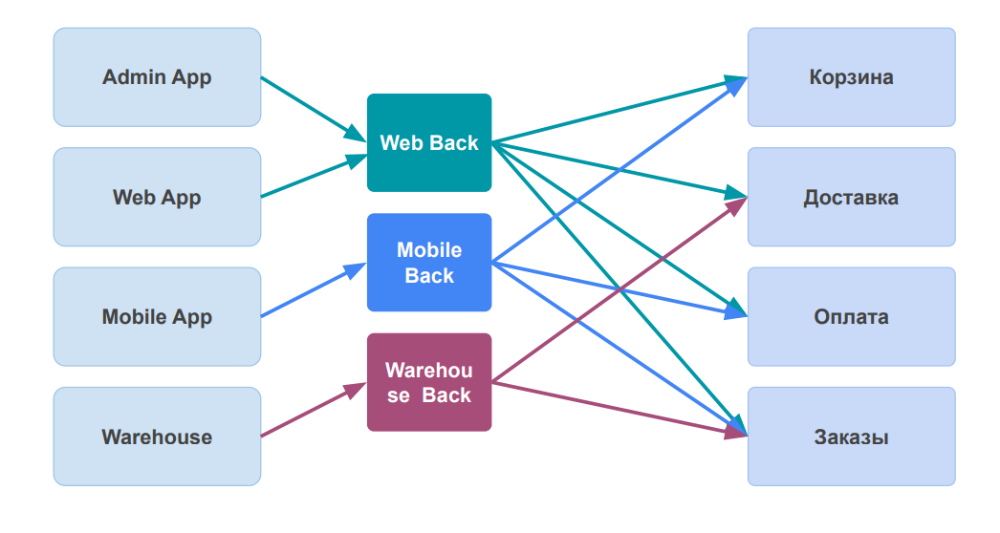

# 10. Администрирование кластера Kubernetes
## 10.2 Микросервисы: принципы
### 10.2.1. Проектирование системы

Практики: необходимый минимум:
- Централизованный мониторинг
- Централизованный сбор логов
- Ограниченный набор допустимых интерфейсов
- Безопасное поведение

### 10.2.2 Разделение на сервисы
**Признаки хорошего сервиса:**

**Loose Coupling** - Минимизировать влияние изменений в одном сервисе на всю систему

**High Cohesion** - Минимизировать необходимость менять несколько сервисов при изменении поведения системы

#### Ограниченный контекст

 

#### Один контекст. Один сервис. Одна команда.
Ограниченный контекст - это:
- Отдельная команда
- Отдельный репозиторий
- Отдельная схема базы данных
- Отдельная процедура тестирования
- Отдельная процедура выкладки

#### Причины уменьшать контекст
- Частота изменений
- Масштабирование
- Независимость
- Сложность

Использование ограниченных контекстов для разбиения системы на сервисы позволит **обеспечить слабую связность и сильное зацепление**, соблюдая баланс размера сервисов.

### 10.2.3 Взаимодействие между сервисами
#### Выбор: 
Какой протокол выбрать?
- XML-RPC
- JSON-RPC
- gRPC
- REST
- GraphQL
- SOAP

Что еще выбрать?
- Синхронно / Асинхронно
- Оркестрация / Хореография
- RPC / Команды и события

Принципы межсервисного взаимодействия:
- **Обратная совместимость** - Избегайте обратно несовместимых изменений
- **Технологическая независимость** - Избегайте интеграционных технологий и подходов, которые привязаны к какой-то конкретной технологической платформе
- **Забота о потребителях** - Стремитесь снизить требования к клиентам и упростить использование интерфейсов (документация, простое и понятное API, готовые клиентские библиотеки)
- **Четкий интерфейс** - Прячьте детали реализации от потребителей интерфейсов. Избегайте интеграционных подходов и технологий, которые раскрывают детали внутренней реализации потребителям.

#### Общая база данных

Нарушает все принципы межсервисного взаимодействия:
- Детали реализации доступны другим сервисам
- Потребители ограничены выбранной технологией БД
- У данных нет единого владельца — логика по манипуляции данными распределена по разным сервисам

#### Синхронное или асинхронное взаимодействие

#### Запрос/Ответ или События
**Запрос / Ответ**:  
Паттерны:
- Проще для понимания
- Синхронное и асинхронное взаимодействие  

Антипаттерны:
- Централизует бизнес логику
- Увеличивает связность 

**Событийная модель**:
Паттерны:
- Уменьшает связность
- Децентрализация логики
- Простота расширения системы

Антипаттерны:
- Общая сложность системы
- Только асинхронный подход

#### Оркестрация или Хореография

#### Remote Procedure Calls
Паттерны:
- Детали реализации недоступны другим сервисам
- При правильном выборе технологии потребители не ограничены одним стеком
- Простота использования

Антипаттерны:
- Расширение моделей возможно только через добавление полей
- Ограниченная поддержка инфраструктурными инструментами

#### REST ( REpresentation State Transfer )
Паттерны:
- Детали реализации недоступны другим сервисам
- Потребители не ограничены одним стеком Простота использования
- Хорошая поддержка инфраструктурными инструментами
- Текстовый формат данных JSON, XML

Антипаттерны:
- Расширение моделей возможно только через добавление полей
- Не всегда возможно описать модель в терминах протокола HTTP

#### GraphQL
Паттерны:
- Детали реализации недоступны другим сервисам
- Потребители не ограничены одним стеком
- Возможность получить несколько ресурсов одним запросом
- Возможность указать необходимые данные

Антипаттерны:
- Расширение моделей возможно только через добавление полей
- Нет поддержки кэширования со стороны инфраструктуры

#### Событийная модель
Паттерны:
- Детали реализации недоступны другим сервисам
- Потребители не ограничены одним стеком
- Возможность получить несколько ресурсов одним запросом
- Низкая общая связность решения
- Высокая гибкость и способность к расширению

Антипаттерны:
- Потребители ограничены выбранной технологией
- Высокая общая сложность системы
- Повышенные требования к инфраструктуре

#### Версионирование: SemVer

#### Версионирование: версии эндпоинтов

#### Версионирование: версии сервисов

#### API Gateway

#### Backend for frontend

#### Выводы
- Не используйте интеграцию через общую базу данных
- Начинайте с REST для request/response интеграций
- Хореография предпочтительнее чем оркестрация
- Избегайте обратно несовместимых изменений и необходимости версионировать эндпоинты

### 10.2.4 Двенадцать факторов
<https://12factor.net/ru/>

1. **Кодовая база** - Одна кодовая база, отслеживаемая в системе контроля версий, – множество развёртываний
2. **Зависимости** - Явно объявляйте и изолируйте зависимости
3. **Конфигурация** - Сохраняйте конфигурацию в среде выполнения
4. **Сторонние службы (Backing Services)** - Считайте сторонние службы (backing services) подключаемыми ресурсами
5. **Сборка, релиз, выполнение** - Строго разделяйте стадии сборки и выполнения
6. **Процессы** - Запускайте приложение как один или несколько процессов не сохраняющих внутреннее состояние (stateless)
7. **Привязка портов (Port binding)** - Экспортируйте сервисы через привязку портов
8. **Параллелизм** - Масштабируйте приложение с помощью процессов
9. **Утилизируемость (Disposability)** - Максимизируйте надёжность с помощью быстрого запуска и корректного завершения работы
10. **Паритет разработки/работы приложения** - Держите окружения разработки, промежуточного развёртывания (staging) и рабочего развёртывания (production) максимально похожими
11. **Журналирование (Logs)** - Рассматривайте журнал как поток событий
12. **Задачи администрирования** - Выполняйте задачи администрирования/управления с помощью разовых процессов

### 10.2.5 Итоги
- Разобрались с вариантами разбиения системы на сервисы
- Узнали какие бывают варианты организации взаимодействия между сервисами
- Познакомились с принципами создания независимых приложений
