# 5. Виртуализация

## 5.1 Введение в виртуализацию. Типы и функции гипервизоров. Обзор рынка вендеров и областей применения.

### 5.1.1 Что такое виртуализация?
**Виртуализация** — это создание изолированных окружений в рамках одного физического устройства (сервера).

Каждое окружение при этом выглядит, как отдельный компьютер со своими характеристиками, такими как:
* процессор (количество выделенных ядер),
* оперативная память,
* диски,
* сеть.

Такое окружение называют набором логических ресурсов или виртуальной машиной.

Наборы ресурсов виртуальных машин:  
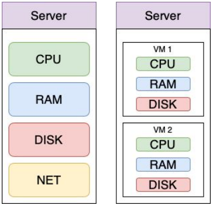

### 5.1.2 Что такое гипервизор?
Гипервизор — это монитор виртуальных машин — программа, обеспечивающая одновременное (параллельное) выполнение 
нескольких операционных систем (виртуальных машин) на одном и том же физическом устройстве (сервере). 

Основные задачи гипервизора:
* эмуляция аппаратных ресурсов,
* безопасное выполнение машинных инструкций,
* предотвращение выполнения команд гостевых операционных систем в режиме супервизора на хост-машине (исключение 
перехвата и анализа команд).

**Функции гипервизора**:
* Гипервизор обеспечивает изоляцию операционных систем друг от друга, защиту runtime и безопасность, а также разделение
ресурсов между различными запущенными ВМ.
* Гипервизор предоставляет работающим под его управлением ВМ средства связи и взаимодействия между собой таким образом,
как если бы эти ОС выполнялись на разных физических компьютерах.
* Гипервизор гарантирует независимое «включение», «перезагрузку» и «выключение» каждой ВМ с той или иной операционной
системой установленной на управляемую ВМ.

### 5.1.3 Типы виртуализации
**Типы виртуализации:**
* **Полная (аппаратная) виртуализация.** Гипервизоры первого типа работают на аппаратном уровне без необходимости установки 
какой-либо ОС на хост. Они сами являются ОС.
* **Паравиртуализация**. Гипервизорам второго типа необходима ОС для доступа монитора виртуальных машин (гипервизора) к 
аппаратным ресурсам хоста.
* **Виртуализация уровня операционной системы.** Виртуализация уровня ОС позволяет запускать изолированные и безопасные ВМ
на одном хосте, но не позволяет запускать ОС с ядрами, отличными от типа ядра хостовой ОС.

**Полная (аппаратная) виртуализация** использует менеджер виртуальных машин (гипервизор), который осуществляет связь
между гостевой операционной системой и аппаратными средствами физического сервера:  
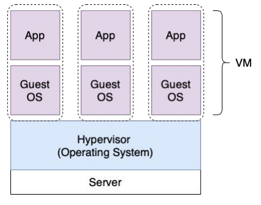

**Примеры решений использующих полную (аппаратную) виртуализацию**:  
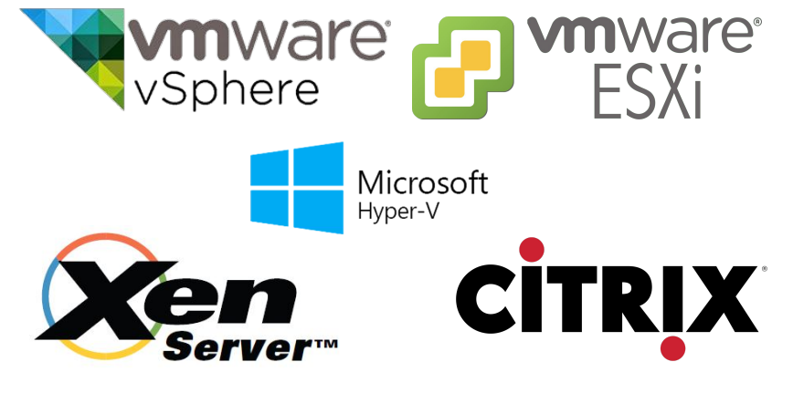

**Паравиртуализация** разделяет процесс с гостевой ОС. Гипервизор модифицирует ядро гостевой ВМ для разделения доступа
к аппаратным средствам физического сервера:  
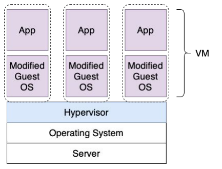

**Примеры решений использующих паравиртуализацию**:  


**Виртуализация уровня ОС** позволяет запускать изолированные и безопасные ВМ на одном хосте, но не позволяет запускать
ОС с ядрами, отличными от типа ядра базовой операционной системы:  
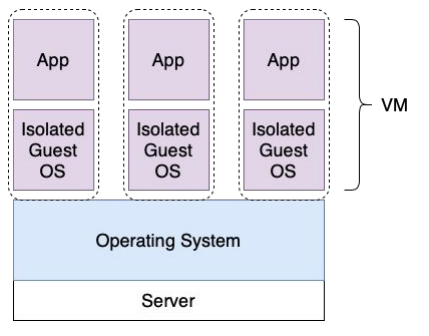

**Примеры решений использующих виртуализацию уровня ОС**:  
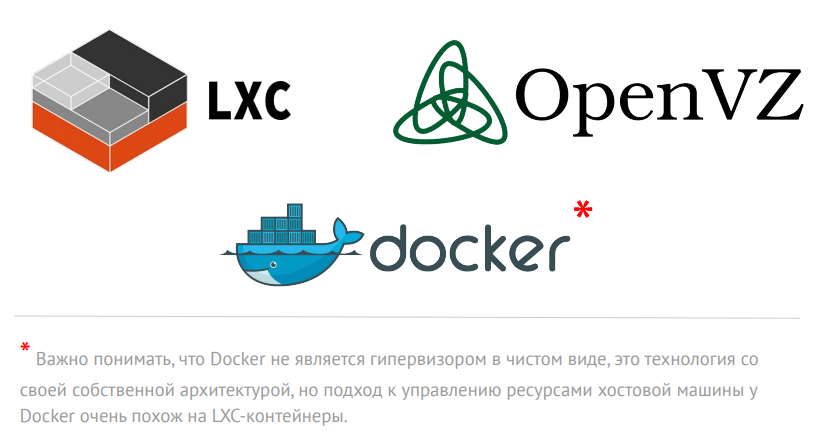

### 5.1.4 Коммерческие продукты
#### VMWare  
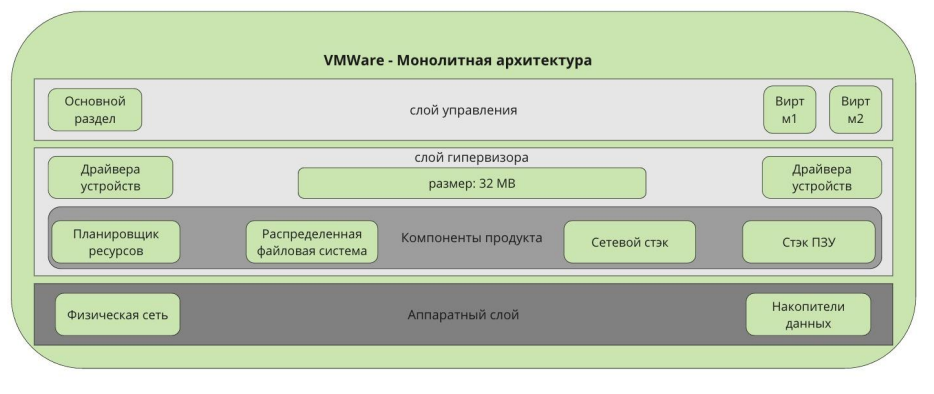

**VMWare** предлагает множество решений для виртуализации, в частности vSphere, который используется, как основа для 
кластеризации и обеспечения отказоустойчивости.

Vmware vSphere использует монолитный дизайн гипервизора, который требует, чтобы драйверы устройств были включены в слой 
Hypervisor.

**В слое гипервизора** находятся следующие компоненты:
* планировщик ресурсов,
* распределенная файловая система,
* сетевой стек,
* стек хранения данных.

**Преимущества:**
* Нет ограничений по выбору операционной системы, необходимой для управления всеми компонентами.
* Нет необходимости в патчах безопасности, для слоя управления.
* Высокий уровень безопасности.
* Хорошая поддержка.

**Недостатки:**
* Не работает с оборудованием, которое не поддерживает VMWare.
* Требует высокого уровня подготовки инженеров

#### Hyper-V
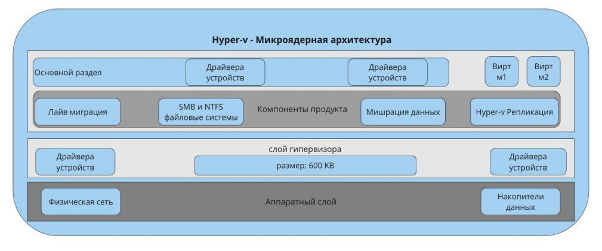

**Hyper-V от Microsoft** встроен непосредственно в Windows Server, хотя он также может быть установлен как 
Hyper-V Server, который является автономным.

**Hyper-V использует микроядерную архитектуру**, поэтому драйверы устройств работают независимо другу от друга в 
управляемом слое.

**В слое управления находятся следующие компоненты продукта:**
* Live-миграция виртуальных машин.
* Hyper-V реплики.
* SMB и NTFS (файловые системы).
* Миграция накопителей данных.
* Сетевой стек и стек хранения данных не являются частью компонентов продукта, а являются частью гипервизора.

**Преимущества:**
* Упрощенное управления драйверами устройств, широкий диапазон поддерживаемых устройств.
* Простота установки новых ролей сервера.
* Нет прерывания сервиса для обслуживания или обновления безопасности.
* Сервисы могут быть масштабированы;
* Более низкий порог вхождения для инженеров.

**Недостатки:**
* Необходимость установки ОС для работы слоя гипервизора.
* Ограниченная поддержка версий ОС.

### 5.1.5 Open Source продукты

#### KVM
**KVM является представителем паравиртуализации**, вы можете запустить практически любую операционную систему в качестве
гостевой — BSD / Windows / Linux и с драйвером virtio вы получите близкую к нативной производительность.

**KVM поддерживает установку из ISO образа, а также шаблоны установки**, он поставляется с хорошим уровнем реализации
безопасности, может иметь проблемы с I/O под тяжелой нагрузкой, которая влияет на гостевые и хостовую операционные
системы.

**Каждая гостевая машина работает, как процесс на хостовой машине**, что хорошо для обнаружения источника проблемы, но
также при проблемах с доступными ресурсами на хостовой машине все гостевые подвержены проблемам с производительностью.

**KVM является нативным для большинства современных ядер Linux.** Это дает преимущество в производительности
по сравнению с другими системами виртуализации. При этом данный продукт относительно новый и находится в активном 
развитии. Большинство людей выбирают KVM из-за более низкого порога входа, хотя эта система не столь стабильна, как Xen.

#### Xen
**Xen поставляется в двух вариациях**, и может работать одновременно на том же физическом хосте в режиме Xen PV 
(паравиртуализация) и HVM (полная аппаратная виртуализация).

**Гостевые машины в режиме Xen PV обычно основаны на шаблонах** для быстрого развертывания и высокой производительности.

**Вы можете запускать свое собственное ядро в Xen PV.** По умолчанию вы можете запустить только Linux в этом режиме.
Запуск BSD возможен с дополнительной конфигурацией.

**Режим Xen HVM работает примерно так же, как KVM.** Он имеет лучшие драйверы для Linux-дистрибутивов, однако в NetBSD и
Windows, Xen HVM показывает себя хуже по сравнению с KVM, в то время как Xen PV и Windows более совместимы.

**Xen** очень зрелый продукт, большинство людей выбирают его для хорошей производительности и исключительной 
стабильности.

**Стабильность Xen обеспечивается**, за счет, предварительно выделяемой RAM и CPU для гипервизора, а так как он имеет
свои собственные выделенные ресурсы, то на него не могут повлиять гостевые ОС, что и дает пресловутую стабильность 
в работе.

#### VMWare vs. Hyper-V vs. KVM vs. Xen
* VMWare vSphere является наиболее сбалансированным и универсальным продуктом для организаций с высокими требованиями 
к их виртуальной инфраструктуре.
* Hyper-V является выбором de-facto для окружений с преобладанием технологий Microsoft.
* Если вы хотите сэкономить деньги, то KVM может стать неплохим вариантом платформы виртуализации.
* Xen с его надежностью и стабильностью подойдет как универсальный гипервизор, для тех кто не боится погрузиться в мир 
Xen 

Необходимо отметить, что оптимальный выбор системы очень зависит от конкретного сценария развертывания.

### 5.1.6 IaaS продукты
#### AWS EC2 (Amazon Elastic Compute Cloud)
**Сервисы облачных провайдеров** — самая современная реализация систем управления виртуализацией. Гипервизоры и прочая
реализация системы скрыта от пользователя, при этом есть гарантированные показатели доступности и отказоустойчивости.  
Пользователь может создавать инфраструктуру продуктивных окружений и использовать уникальные преимущества такие, как 
установка в нескольких локациях, построение цепочки с другими сервисами облака, программное API для автоматизации
создания и изменения ресурсов с помощью Terraform и Packer.

#### OpenStack
**Приватные облака** являются программной надстройкой для организации приватного (частного) облака, и дают часть 
преимуществ: 
* Построение продуктивных цепочек с другими компонентами вашей частной инфраструктуры.
* Программное API для автоматизации создания и изменения ресурсов приватного облака с помощью Terraform и Packer.

Единственный, но очень весомый недостаток:
* Очень высокий порог входа в технологию, вам потребуется выделенная команда инженеров для поддержки продуктовой 
инсталляции приватного облака.

Приватные облака имеют более высокий уровень безопасности, необходимый для некоторых бизнес-проектов и часто 
используются в банках и других финансовых учреждениях.

### 5.1.7 Аппаратная виртуализации vs. Виртуализации уровня ОС
| Аппаратная виртуализация                                                                                                                                                                                                                                | Виртуализация уровня ОС                                                                                                                                                                                                                  |
|---------------------------------------------------------------------------------------------------------------------------------------------------------------------------------------------------------------------------------------------------------|------------------------------------------------------------------------------------------------------------------------------------------------------------------------------------------------------------------------------------------|
| Виртуальные машины содержат собственное виртуальные устройства. Программное обеспечение может запускаться в виртуальных машинах без необходимости модификации. Виртуальные машины полностью изолированы друг от друга и используют собственные ядра ОС. | Контейнеры монтируют устройства хост машины, но выглядят как обычная ВМ. Сторонние приложения могут запускаться в контейнерах без необходимости модификации. Контейнеры полностью изолированы друг от друга, но используют одно ядро ОС. |
| Возможность создания множества виртуальных машин с различными операционными системами. Пользователь может устанавливать собственные патчи на ядро.                                                                                                      | Возможность создавать машины только с Linux или только Windows системами. Контейнеры разделяют ядро системы, работая как отдельный процесс основной ОС.                                                                                  |
| Жесткое распределение системных ресурсов между виртуальными машинами на уровне гипервизора.                                                                                                                                                             | Жесткое распределение системных ресурсов между виртуальными машинами на уровне гипервизора.                                                                                                                                              |

### 5.1.8 Применение виртуализации: плюсы и минусы
**Плюсы:**
* Высокая утилизация вычислительных мощностей.
* Снижение простоев за счет быстрого развёртывания.
* Возможность использовать подход Infrastructure as a Code.

**Минусы:**
* Накладные расходы на обслуживание.
* Увеличение числа абстракций.
* Единая точка отказа, если не используется кластеризация.

## 5.2 Применение принципов IaaC в работе с виртуальными машинами
### 5.2.1. Понятие IaaC (Infrastructure as a Code)
Подход **«Инфраструктура как код (IaaC)»**, иногда называют «программируемой инфраструктурой» — это паттерн, по которому
процесс создания/настройки инфраструктуры аналогичен процессу разработки программного обеспечения.

По сути, этот паттерн положил начало устранению границ между написанием приложений и созданием сред для этих приложений.

Это основа облачных вычислений и неотъемлемая часть DevOps методологии!

#### Основные преимущества IaaC
Ценность IaaC стоит на 3-х китах:
1. **Ускорение производства и вывода продукта на рынок.** Автоматизация IaaC значительно ускоряет процесс предоставления
инфраструктуры для разработки, тестирования и масштабирования по мере необходимости.
2. **Стабильность среды, устранение дрейфа конфигураций.** Дрейф конфигурации происходит, когда произвольные изменения 
и обновления конфигурации приводят к несовпадению сред разработки, тестирования и развёртывания.
3. **Более быстрая и эффективная разработка.** Упрощая предоставление инфраструктуры и повышая её консистентность, IaaC 
ускоряет каждый этап жизненного цикла доставки ПО. Разработчики могут быстро подготовить «песочницы» и среды непрерывной
интеграции, непрерывного развёртывания (CI/CD). Быстрее предоставляются тестовые среды, инфраструктура для проверки
безопасности и юзабилити.

**Главное преимущество применения IaaC**:
**Идемпотентность** (лат. idem — тот же самый + potent — способный) — это свойство объекта или операции, при повторном
выполнении которой мы получаем результат идентичный предыдущему и всем последующим выполнениям. Термин предложил 
американский математик Бенджамин Пирс (англ. Benjamin Peirce) в статьях 1870-х годов.

#### Подходы к применению IaaC
**Существует 3 подхода к применению IaaC:**
* Декларативный. “Что” мы делаем?
* Императивный. “Как” мы это делаем?
* Интеллектуальный. “Почему” мы это делаем?

**Декларативный подход** нацелен на то, чтобы описать, как должна выглядеть целевая конфигурация.  
**Императивный подход** сфокусирован на том, какие внести изменения.  
**Интеллектуальный подход** описывает, почему инфраструктура должна быть сконфигурирована именно так, как правило, это
техническая документация проекта и бизнес требования.

#### Методы IaaC
Существует 3 метода применения IaaC:
* **Push.** В этом режиме конфигурация серверу отправляется управляющим сервером.
* **Pull.** В pull режиме целевой хост сам инициирует получение своей конфигурации. Просит выдать конфигурацию.
* **Гибридный** (сочетает оба метода). Используется при построении сложных многокомпонентных систем и целого набора 
инструментов управления конфигурациями.

Разница в том, кто инициирует изменение в конфигурации целевого хоста.

#### Сравнение популярных IaaC инструментов
Рассмотрим, по какой модели работает каждый из них:  

| Оркестратор   | Вендор    | **Метод** | **Подход**             | Язык   |
|---------------|-----------|-----------|------------------------|--------|
| **Ansible**   | RedHat    | Push      | Declarative,Imperative | Python |
| **Saltstack** | Saltstack | Push/Pull | Declarative,Imperative | Python |
| **Chef**      | Chef      | Pull      | Declarative,Imperative | Ruby   |
| **Puppet**    | Puppet    | Pull      | Declarative            | Ruby   |
| **Terraform** | HashiCorp | Push      | Declarative            | Golang |

### 5.2.2. Паттерны IaaC
#### Паттерны
Паттерн (англ. pattern) — схема, действующая, как эффективный способ решения характерных задач проектирования, в 
частности проектирования компьютерных программ.

#### CI (Continuous Integration)
**Непрерывная интеграция (CI)** — практика разработки ПО, которая заключается в постоянном слиянии рабочих веток в общую
основную ветку разработки, и выполнении частых автоматизированных сборок проекта.

Непрерывная интеграция **позволяет снизить трудозатраты** на выполнение рутинных задач команд разработки и сделать её 
более предсказуемой за счёт наиболее **раннего обнаружения и устранения ошибок и противоречий**.

Основным преимуществом данного паттерна является **сокращение стоимости исправления дефекта**, за счёт его раннего
выявления.

#### CD (Continuous Delivery)
**Непрерывная доставка (CD)** — CI + CD.

Следующий после CI уровень. Теперь новая версия не только создаётся и тестируется при каждом изменении кода, 
регистрируемом в репозитории, но и может быть **оперативно запущена** по одному нажатию кнопки развёртывания.

Позволяет **выпускать изменения небольшими партиями**, которые легко изменить или устранить, путём отката на предыдущую
версию и последующего перезапуска процесса сборки с учётом исправления выявленных дефектов. Однако запуск развёртывания
всё ещё происходит вручную — ту самую кнопку всё же надо кому-то нажать.

#### CD (Continuous Deployment)
**Непрерывное развёртывание (CD)** — CI + CD + СD.

После автоматизации релиза остаётся один ручной этап: одобрение (запуск в production, всё та же кнопка, которую кто-то
должен нажать!).

Практика непрерывного развёртывания **упраздняет ручные действия**, не требуя непосредственного утверждения со стороны 
разработчика или любого другого ответственного лица.

Все **изменения развёртываются автоматически**. Обычно такая практика включена на Dev/Stage окружениях, но в Production 
по прежнему релизы происходят в ручную по причине высокого риска для бизнеса.

#### Резюмируя паттерны: CI + CD + CD
* CD (Continuous Integration) – Непрерывная интеграция
* CD (Continuous Delivery) – Непрерывная доставка
* CD (Continuous Deployment) – Непрерывное развёртывание

**Важно!** Как правило, под термином **CI/CD** подразумеваются только первые два термина: **интеграция и доставка**.

Непрерывная доставка (Continuous Delivery) отличается от непрерывного развертывания (Continuous Deployment) тем, что
процесс развертывания в производственную среду должен быть подтвержден вручную.

### 5.2.3. Инструменты IaaC. Vagrant
**Vagrant** — это инструмент для создания и управления ВМ посредством использования принципов IaaC.

Vagrant сокращает время настройки среды разработки, и делает оправдание разработчиков «на моём компьютере всё работает»
пережитком прошлого.

Преимущества:
* Скорость – быстрый старт виртуального окружения;
* Простота – декларативный метод описания конфигураций;
* Расширяемость — лёгкое подключение кастомных провайдеров.

Vagrant провайдеры из коробки:
* **VirtualBox,**
* **Hyper-V,**
* **Docker.**

Прежде чем вы сможете использовать другого провайдера, вы должны установить его. Установка провайдеров осуществляется
через систему плагинов Vagrant.
```shell
# Установка провайдера VMWare с помощью системы плагинов
$ vagrant plugin install vagrant-vmware-desktop
# Обновление провайдера VMWare с помощью системы плагинов
$ vagrant plugin update vagrant-vmware-desktop
# Проверяем установленную версию
$ vagrant --version
Vagrant 2.2.9
# Задаём провайдер по умолчанию
$ export VAGRANT_DEFAULT_PROVIDER=virtualbox
# Загружаем образ ВМ hashicorp/bionic64 для провайдера virtualbox
$ vagrant box add bento/ubuntu-20.04 --provider=virtualbox --force
==> box: Loading metadata for box 'bento/ubuntu-20.04'
 box: URL: https://vagrantcloud.com/bento/ubuntu-20.04
==> box: Adding box 'bento/ubuntu-20.04' (v202107.28.0) for provider:
virtualbox
 box: Downloading:
https://vagrantcloud.com/bento/boxes/ubuntu-20.04/versions/202107.28.0/
providers/virtualbox.box
Download redirected to host:
vagrantcloud-files-production.s3-accelerate.amazonaws.com
==> box: Successfully added box 'bento/ubuntu-20.04' (v202107.28.0) for
'virtualbox'!
# Проверяем доступные нам образы операционных систем
$ vagrant box list
bento/ubuntu-16.04 (virtualbox, 201802.02.0)
debian/stretch64 (virtualbox, 9.4.0)
bento/ubuntu-20.04
```

**Структура Vagrantfile**:
```
# Блок переменных
ISO = "bento/ubuntu-20.04"
NET = "192.168.192."
DOMAIN = ".netology"
HOST_PREFIX = "server"
INVENTORY_PATH = "../ansible/inventory"

# Блок конфигурации серверов
servers = [
 {
 :hostname => HOST_PREFIX + "1" + DOMAIN,   # Имя виртуальной машины
 :ip => NET + "11",                         # IP адрес
 :ssh_host => "20011",                      # SSH порт хоста
 :ssh_vm => "22",                           # SSH порт виртуальной машины
 :ram => 1024,                              # Оперативная память
 :core => 1                                 # Количество ядер
 }
]

# Блок создания виртуальных машин
Vagrant.configure(2) do |config|
  config.vm.synced_folder ".", "/vagrant", disabled: false
  servers.each do |machine|
    config.vm.define machine[:hostname] do |node|
      node.vm.box = ISO                                                                     # Тип образа
      node.vm.hostname = machine[:hostname]
      node.vm.network "private_network", ip: machine[:ip]
      node.vm.network :forwarded_port, guest: machine[:ssh_vm], host: machine[:ssh_host]
      node.vm.provider "virtualbox" do |vb|
        vb.customize ["modifyvm", :id, "--memory", machine[:ram]]
        vb.customize ["modifyvm", :id, "--cpus", machine[:core]]
        vb.name = machine[:hostname]
      end
    end
  end
end
```

```shell
# Запуск ВМ. В директории, где находится находится Vagrantfile
$ vagrant up
Bringing machine 'server1.netology' up with 'virtualbox' provider...
==> server1.netology: Checking if box 'debian/stretch64' version '9.4.0' is up to date...
==> server1.netology: Clearing any previously set network interfaces...
==> server1.netology: Preparing network interfaces based on configuration...
 server1.netology: Adapter 1: nat
 server1.netology: Adapter 2: hostonly
==> server1.netology: Forwarding ports...
 server1.netology: 22 (guest) => 20011 (host) (adapter 1)
 server1.netology: 22 (guest) => 2222 (host) (adapter 1)
==> server1.netology: Running 'pre-boot' VM customizations...
==> server1.netology: Booting VM...
==> server1.netology: Waiting for machine to boot. This may take a few minutes...
 server1.netology: SSH address: 127.0.0.1:2222
 server1.netology: SSH username: vagrant
 server1.netology: SSH auth method: private key
 server1.netology:
 server1.netology: Vagrant insecure key detected. Vagrant will automatically replace
 server1.netology: this with a newly generated keypair for better security.
 server1.netology:
 server1.netology: Inserting generated public key within guest...
 server1.netology: Removing insecure key from the guest if its present...
 server1.netology: Key inserted! Disconnecting and reconnecting using new SSH key...
==> server1.netology: Machine booted and ready!
==> server1.netology: Checking for guest additions in VM...
 server1.netology: No guest additions were detected on the base box for this VM! Guest
 server1.netology: additions are required for forwarded ports, shared folders, host only
 server1.netology: networking, and more. If SSH fails on this machine, please install
 server1.netology: the guest additions and repackage the box to continue.
 server1.netology:
 server1.netology: This is not an error message; everything may continue to work properly,
 server1.netology: in which case you may ignore this message.
==> server1.netology: Setting hostname...
==> server1.netology: Configuring and enabling network interfaces...
==> server1.netology: Machine 'server1.netology' has a post `vagrant up` message. This is a message
==> server1.netology: from the creator of the Vagrantfile, and not from Vagrant itself:
==> server1.netology:
==> server1.netology: Vanilla Debian box. See https://app.vagrantup.com/debian for help and bug reports

# Заходим в ВМ. В директории, где находится находится Vagrantfile
$ vagrant ssh
vagrant@server1:~$ cat /etc/*release
DISTRIB_ID=Ubuntu
DISTRIB_RELEASE=20.04
DISTRIB_CODENAME=focal
DISTRIB_DESCRIPTION="Ubuntu 20.04.2 LTS"
NAME="Ubuntu"
VERSION="20.04.2 LTS (Focal Fossa)"
ID=ubuntu
ID_LIKE=debian
PRETTY_NAME="Ubuntu 20.04.2 LTS"
VERSION_ID="20.04"
HOME_URL="https://www.ubuntu.com/"
SUPPORT_URL="https://help.ubuntu.com/"
BUG_REPORT_URL="https://bugs.launchpad.net/ubuntu/"
PRIVACY_POLICY_URL="https://www.ubuntu.com/legal/terms-and-policies/privacy-policy"
VERSION_CODENAME=focal
UBUNTU_CODENAME=focal
vagrant@server1:~$ ip a | grep inet | grep 192
 inet 192.168.192.11/24 brd 192.168.192.255 scope global eth1
vagrant@server1:~$ hostname -f
server1.netology
vagrant@server1:~$ free
 total used free shared buff/cache available
Mem: 1020368 31564 832932 2932 155872 852252
vagrant@server1:~$ exit
logout
Connection to 127.0.0.1 closed.

# Выключение ВМ. В директории, где находится находится Vagrantfile
$ vagrant halt
==> server1.netology: Attempting graceful shutdown of VM...
# Проверяем состояние ВМ. В директории, где находится находится Vagrantfile
$ vagrant status
Current machine states:
server1.netology poweroff (virtualbox)
The VM is powered off. To restart the VM, simply run `vagrant up`
# Удаляем ВМ. В директории, где находится находится Vagrantfile
$ vagrant destroy
server1.netology: Are you sure you want to destroy the 'server1.netology' VM?
[y/N] y
==> server1.netology: Destroying VM and associated drives...
# Снова проверяем состояние ВМ. В директории, где находится находится Vagrantfile
$ vagrant status
Current machine states:
server1.netology not created (virtualbox)
```

### 5.2.4. Инструменты IaaC. Ansible
**Ansible** — это инструмент для управления конфигурациями.

Главное его отличие от других подобных систем в том, что Ansible использует существующую SSH инфраструктуру, в то время 
как другие (Saltstack, Chef, Puppet, и пр.) требуют установки специального PKI-окружения.

Преимущества:
* Скорость – быстрый старт на текущей SSH инфраструктуре.
* Простота – декларативный метод описания конфигураций.
* Расширяемость — лёгкое подключение кастомных ролей и модулей.

#### Ansible: жизненный цикл
Ansible может применяться на всех стадиях жизненного цикла инфраструктуры ваших проектов:
* Provision
* Configure
* Deploy
* Operate

Ansible поставляется с огромным количеством готовых к использованию 
[модулей](https://docs.ansible.com/ansible/2.8/modules/list_of_all_modules.html).
```shell
# Вывод версии Ansible
$ ansible --version
ansible 2.9.11
 config file = /Users/olegbukatchuk/git/netology.ru/virt-homeworks/05-virt-02-iaac/src/ansible/ansible.cfg
 configured module search path = ['/Users/olegbukatchuk/.ansible/plugins/modules',
'/usr/share/ansible/plugins/modules']
 ansible python module location = /usr/local/Cellar/ansible/2.9.11/libexec/lib/python3.8/site-packages/ansible
 executable location = /usr/local/bin/ansible
 python version = 3.8.5 (default, Jul 31 2020, 14:19:14) [Clang 11.0.3 (clang-1103.0.32.62)]
# С этого момента команда ниже это ваш лучший друг, не считая google.com :-)
$ ansible -h
```

#### Ansible: playbook (подготовка)
Определим inventory файл для Ansible playbook в котором содержится информация о ВМ:
```yaml
[nodes:children]
manager

[manager]
server1.netology ansible_host=127.0.0.1 ansible_port=20011 ansible_user=vagrant
```
Определим файл ansible.cfg для Ansible, который содержит настройки по умолчанию для Ansible:
```yaml
[defaults]
inventory=./inventory
deprecation_warnings=False
command_warnings=False
ansible_port=22
interpreter_python=/usr/bin/python3
```

#### Ansible: playbook
Напишем небольшой Ansible playbook который будет устанавливать Docker в создаваемую нами ВМ сразу после её создания:
```yaml
---
- hosts: nodes          # Имя хостов
  become: yes           # Становится ли другим пользователем
  become_user: root     # Каким пользователем становиться
  remote_user: vagrant  # Под каким пользователем заходить по SSH

  tasks:
  - name: Create directory for ssh-keys               # название задачи
    file: state=directory mode=0700 dest=/root/.ssh/  # Создать директорию с указанными правами по указанному пути

  - name: Adding rsa-key in /root/.ssh/authorized_keys
    copy: src=~/.ssh/id_rsa.pub dest=/root/.ssh/authorized_keys owner=root mode=0600  # Скопировать файл из хостовой машины в директорию гостевой машины с указанным владельцем и правами
    ignore_errors: yes

  - name: Checking DNS
    command: host -t A google.com
    
  - name: Installing tools
    apt: >
      package={{ item }}
      state=present
      update_cache=yes
    with_items:
      - git
      - curl

  - name: Installing docker
    shell: curl -fsSL get.docker.com -o get-docker.sh && chmod +x get-docker.sh && ./get-docker.sh

  - name: Add the current user to docker group
    user: name=vagrant append=yes groups=docker
```
#### Ansible: provision
Подключаем Ansible playbook к нашей Vagrant конфигурации:
```
INVENTORY_PATH = "../ansible/inventory"

node.vm.provision "ansible" do |setup|
  setup.inventory_path = INVENTORY_PATH
  setup.playbook = "../ansible/provision.yml"
  setup.become = true
  setup.extra_vars = { ansible_user: 'vagrant' }
end
```

## 5.3 Введение. Экосистема. Архитектура. Жизненный цикл Docker контейнера
### 5.3.1. Введение в Docker
**Контейнер** — это способ упаковать приложение и все его зависимости в единый образ. Этот образ запускается 
в изолированной среде, не влияющей на основную операционную систему.

Контейнеры позволяют отделить приложение от инфраструктуры: разработчики просто создают приложение, упаковывают все
зависимости и настройки в единый образ. Затем этот образ можно запускать на других системах, не беспокоясь, что
приложение не запустится.

**Docker** — это платформа для разработки, доставки и запуска контейнерных приложений.

Docker позволяет:
* создавать контейнеры,
* автоматизировать их запуск и развертывание,
* управлять жизненным циклом,
* запускать множество контейнеров на одной хост-машине.

Контейнеризация похожа на виртуализацию, но это не одно и то же. Виртуализация работает как отдельный компьютер 
со своим виртуальным оборудованием и операционной системой. При этом внутри одной ОС можно запустить другую ОС. В случае
контейнеризации, виртуальная среда запускается прямо из ядра основной операционной системы и не виртуализирует 
оборудование. При этом, так как контейнеры не виртуализируют оборудование, они потребляют намного меньше ресурсов.

**Преимущества использования Docker** Контейнеры в целом упрощают работу как программистам, так и инженерам, которые
развертывают эти приложения:
* **Docker решает проблемы зависимостей и рабочего окружения.** Контейнеры позволяют упаковать в единый образ приложение
и все его зависимости: библиотеки, системные утилиты и файлы конфигурации.
* **Docker упрощает перенос приложения на другую инфраструктуру.** Например, разработчики создают приложение в системе, 
там все настроено и приложение работает. Когда приложение готово, его нужно перенести в систему тестирования и затем 
в продуктивную среду. И если в этих системах будет не хватать какой-нибудь зависимости, то приложение не будет работать. 
В этом случае программистам придется отвлечься от разработки и совместно с командой поддержки разбираться в ситуации.
Контейнеры позволяют избежать такой проблемы, потому что они содержат в себе все необходимое для запуска приложения.

**Изоляция и безопасность Docker:** контейнер — это набор процессов, изолированных от основной операционной системы.
Приложения работают только внутри контейнеров, и не имеют доступа к основной операционной системе. Это повышает 
безопасность приложений, потому что они не смогут случайно или умышленно навредить основной системе. **Если приложение 
в контейнере завершится с ошибкой или зависнет, это никак не затронет основную ОС.**

### 5.3.2. Экосистема Docker
#### Компоненты экосистемы Docker
* **Docker Daemon (Docker демон)** — сервер контейнеров, входящий в состав программных средств Docker. Демон управляет 
Docker-объектами (сети, хранилища, образы и контейнеры). Демон также может связываться с другими демонами для управления
сервисами Docker.
* **Docker Client / CLI (Docker клиент)** — интерфейс взаимодействия пользователя с Docker-демоном. Клиент и Демон — 
важнейшие компоненты «движка» Докера (DockerEngine). Клиент Docker может взаимодействовать с несколькими демонами.
* **Docker Image (Docker образ)** — файл, включающий зависимости, сведения, конфигурацию для дальнейшего развертывания 
и инициализации контейнера.
* **Dockerfile (Docker файл)** — описание правил (манифест) сборки образа, в котором первая строка указывает на базовый
образ. Последующие команды выполняют копирование файлов и установку программ для создания определенной среды разработки 
со своим набором переменных окружения и прочих параметров.
* **Docker Container (Docker контейнер)** — это легкий, автономный исполняемый пакет программного обеспечения, который
включает в себя все необходимое для запуска приложения: код, среду выполнения, системные инструменты, системные 
библиотеки и настройки.
* **Volume (Том хранения данных)** — эмуляция файловой системы для осуществления операций чтения и записи. Она создается
автоматически с контейнером, поскольку некоторые приложения осуществляют персистентное хранение данных.
* **Docker Registry (Реестр Docker контейнеров)** — зарезервированный сервер, используемый для хранения docker-образов.
* **Docker Trusted Registry (Доверенный реестр Docker или DTR)** — служба docker-реестра для инсталляции на локальном
компьютере или сети компании.
* **Docker Hub (Docker Хаб)** — общедоступный и бесплатный репозиторий, предназначенный для хранения образов с различным
программным обеспечением. Доступен по <https://hub.docker.com>
* **Docker Host (Docker хост)** — среда, на которой запускается Docker Engine в виде системного демона для запуска
контейнеров с программным обеспечением, указанным в Docker файле.
* **Docker Networks (Docker сети)** — применяются для организации сетевого взаимодействия между приложениями, 
развернутыми в контейнерах. Существует несколько режимов работы Docker сети. Например: _bridge_, _host_, _overlay_, 
_macvlan_ и _none_.

#### Типы режимов работы сети в Docker
* **Bridge (Мост)** — сетевой драйвер по умолчанию. Если вы не укажете драйвер, этот тип сети, инициализируется
автоматически. Мостовые сети обычно используются, когда ваши приложения работают в автономных контейнерах, которым
необходимо обмениваться данными.
* **Host (Хост)** — применяется для автономных контейнеров, этот тип сети удаляет слой изоляции между контейнером и 
Docker хостом и напрямую использует сеть хоста.
* **Overlay (Оверлей)** — оверлейные сети соединяют вместе несколько демонов Docker и позволяют службам Docker Swarm
взаимодействовать друг с другом в режиме кластера. Это _общий случай логической сети_, создаваемой поверх другой сети.
Узлы оверлейной сети могут быть связаны либо физическим соединением, либо логическим, для которого в основной сети
существуют один или несколько соответствующих маршрутов из физических соединений. Эта **стратегия устраняет 
необходимость выполнять маршрутизацию на уровне ОС** между этими контейнерами.
* **Macvlan** — сети _Macvlan_ позволяют назначать _MAC-адрес_ контейнеру, чтобы он отображался как физическое 
устройство в вашей сети. Демон Docker направляет трафик в контейнеры по их MAC-адресам. Использование драйвера macvlan
иногда является лучшим выбором при работе с устаревшими приложениями, которые ожидают прямого подключения к физической
сети, а не маршрутизации через сетевой стек Docker хоста.
* **None** — в этом режиме работы отключаются все сети. Такой режим работы сети обычно используется вместе со сторонними
сетевыми драйверами. _None недоступен для служб Docker Swarm_. Вы можете установить и использовать сторонние сетевые
плагины с Docker. Эти плагины доступны в Docker Hub или у сторонних поставщиков. Пример плагина: 
[weave2](https://www.weave.works/docs/net/latest/install/plugin/plugin-v2/).

**Stateless** — после завершения работы контейнера от него ничего не остается, все созданные им данные уничтожаются.

**Stateful** — после завершения работы контейнера его результат сохраняется во внешних хранилищах (Volumes).

### 5.3.3. Архитектура Docker


[Подробнее](https://docs.docker.com/get-started/overview)

### 5.3.4. Жизненный цикл Docker-контейнера
#### Docker CLI (Command Line Interface)
`docker pull` — Загрузить образ из Docker реестра на Docker хост.
```shell
# Загрузка образа Docker контейнера из публичного репозитория hub.docker.com
$ docker pull hello-world
Using default tag: latest
latest: Pulling from library/hello-world
b8dfde127a29: Pull complete
Digest: sha256:61bd3cb6014296e214ff4c6407a5a7e7092dfa8eefdbbec539e133e97f63e09f
Status: Downloaded newer image for hello-world:latest
docker.io/library/hello-world:latest
$ docker image ls
REPOSITORY  TAG     IMAGE ID      CREATED       SIZE
hello-world latest  d1165f221234  6 months ago  13.3kB
```

`docker run` — Запуск Docker контейнера из локально реестра на Docker хосте.
```shell
# Загрузка образа Docker контейнера из публичного репозитория hub.docker.com
$ docker run hello-world

Hello from Docker!
This message shows that your installation appears to be working correctly.

To generate this message, Docker took the following steps:
 1. The Docker client contacted the Docker daemon.
 2. The Docker daemon pulled the "hello-world" image from the Docker Hub.
 (amd64)
 3. The Docker daemon created a new container from that image which runs the
 executable that produces the output you are currently reading.
 4. The Docker daemon streamed that output to the Docker client, which sent it
 to your terminal.

To try something more ambitious, you can run an Ubuntu container with:
 $ docker run -it ubuntu bash

Share images, automate workflows, and more with a free Docker ID:
 https://hub.docker.com/

For more examples and ideas, visit:
 https://docs.docker.com/get-started/
```

`docker run -it <container> <shell>` — Запуск Docker контейнера из локально реестра на Docker хосте и вход в него через
_shell_ (_i_ - интерактивный режим, _t_ - с использованием терминала)
```shell
# Запуск образа ubuntu из публичного репозитория hub.docker.com
$ docker run -it ubuntu bash
Unable to find image 'ubuntu:latest' locally
latest: Pulling from library/ubuntu
35807b77a593: Pull complete
Digest: sha256:9d6a8699fb5c9c39cf08a0871bd6219f0400981c570894cd8cbea30d3424a31f
Status: Downloaded newer image for ubuntu:latest
$ root@b65a0676dd1d:/# cat /etc/*release
DISTRIB_ID=Ubuntu
DISTRIB_RELEASE=20.04
DISTRIB_CODENAME=focal
DISTRIB_DESCRIPTION="Ubuntu 20.04.3 LTS"
NAME="Ubuntu"
VERSION="20.04.3 LTS (Focal Fossa)"
ID=ubuntu
ID_LIKE=debian
PRETTY_NAME="Ubuntu 20.04.3 LTS"
VERSION_ID="20.04"
HOME_URL="https://www.ubuntu.com/"
SUPPORT_URL="https://help.ubuntu.com/"
BUG_REPORT_URL="https://bugs.launchpad.net/ubuntu/"
PRIVACY_POLICY_URL="https://www.ubuntu.com/legal/terms-and-policies/privacy-policy"
VERSION_CODENAME=focal
UBUNTU_CODENAME=focal
root@b65a0676dd1d:/# exit
```

`docker exec <container> <command>` - Запуск команды в запущенном Docker контейнере.
```shell
# Запуск команды в запущенном контейнере, "-d" - запустить в фоновом режиме 
$ docker run -d nginx
ba2a5dfd1b05dc380765c877722ac56932376abad4d8bb85927ae35bf101bf98
$ docker ps
CONTAINER ID IMAGE COMMAND CREATED STATUS PORTS NAMES
ba2a5dfd1b05 nginx "/docker-entrypoint.…" 4 seconds ago Up 3 seconds 80/tcp objective_yalow
$ docker exec -it objective_yalow nginx -v
nginx version: nginx/1.21.3
```

`docker stop <container>` - Остановка запущенного Docker контейнера.
```shell
# Остановка запущенного Docker контейнера.
$ docker stop objective_yalow
objective_yalow

$ docker ps
CONTAINER ID IMAGE COMMAND CREATED STATUS PORTS NAMES

$ docker ps -a
CONTAINER ID  IMAGE       COMMAND                 CREATED         STATUS                    PORTS NAMES
ba2a5dfd1b05  nginx       "/docker-entrypoint.…"  12 minutes ago  Exited (0) 4 minutes ago        objective_yalow
b65a0676dd1d  ubuntu      "bash"                  18 minutes ago  Exited (0) 15 minutes ago       flamboyant_gates
c052919f6d04  hello-world "/hello"                26 minutes ago  Exited (0) 26 minutes ago       practical_mirzakhani
```

`docker rm <container>` - Удаление остановленного Docker контейнера.
```shell
# Удаление остановленного Docker контейнера.
$ docker rm objective_yalow
objective_yalow

$ docker ps
CONTAINER ID IMAGE COMMAND CREATED STATUS PORTS NAMES

$ docker ps -a
CONTAINER ID IMAGE        COMMAND   CREATED        STATUS                     PORTS NAMES
b65a0676dd1d ubuntu       "bash"    18 minutes ago Exited (0) 15 minutes ago        flamboyant_gates
c052919f6d04 hello-world  "/hello"  26 minutes ago Exited (0) 26 minutes ago        practical_mirzakhani
```

`docker rmi <image>` - Удаление образа Docker контейнера.
```shell
# Удаление образа Docker контейнера.
$ docker rmi nginx
Untagged: nginx:latest
Untagged: nginx@sha256:853b221d3341add7aaadf5f81dd088ea943ab9c918766e295321294b035f3f3e
Deleted: sha256:ad4c705f24d392b982b2f0747704b1c5162e45674294d5640cca7076eba2865d
Deleted: sha256:cf45bd1acd3159a35178bfe8a63f910f010990175050ea6c8c333ba3afaf5123
Deleted: sha256:a9e7419d7f7c4fe55c85ce08c4f0a8b45abe9b714aa19880f553859797e0332c
Deleted: sha256:13184aa93ccd585fade03704e048828c29eed86090e7399b208edbe022aaf563
Deleted: sha256:3161f310d154031dbd57f90c07715335a25a31bcf20a4abf3e040ab86bcac633
Deleted: sha256:88f95677408c5f02b15064ad1f41a2c74e40e1800cd3536f8fb45b9e6939704b
Deleted: sha256:d000633a56813933cb0ac5ee3246cf7a4c0205db6290018a169d7cb096581046

$ docker images
REPOSITORY  TAG     IMAGE ID      CREATED       SIZE
ubuntu      latest  fb52e22af1b0  2 weeks ago   72.8MB
hello-world latest  d1165f221234  6 months ago  13.3kB
```

`docker system prune` - Удаление неиспользуемых Docker образов, остановленных контейнеров, неиспользуемых сетей и весь 
неиспользуемый кэш.
```shell
# Удаление неиспользуемых Docker образов.
$ docker system prune
WARNING! This will remove:
 - all stopped containers
 - all networks not used by at least one container
 - all dangling images
 - all dangling build cache
Are you sure you want to continue? [y/N] y
Deleted Containers:
b65a0676dd1d65025c4954d7b20bca108464d3e347225bf3728fcba896e5dbc3
c1fda7c70de824e08c98059ab861e73e8d3138c95632c2c939cfc3006168d281
c0522f9fd4e146844b425246418bf2814072d457aafd151d7f9f3d76d5750412
d824b31993e9f31770a5acbd90061ba435e5eca5b42ce8e216ea5754dbd54e56
c052919f6d049ad559a2d2faac5309f1aa28ac932b8cdfc3258fa532f8bf9fd1
Total reclaimed space: 40B

$ docker image ls
REPOSITORY  TAG     IMAGE ID      CREATED       SIZE
ubuntu      latest  fb52e22af1b0  2 weeks ago   72.8MB
hello-world latest  d1165f221234  6 months ago  13.3kB
```

#### Docker Exec vs Docker Run 
`docker exec <container> <comand>` - предназначен для выполнения бинарного файла, отличного от указанного в ENTRYPOINT 
(если он существует в манифесте образа) в работающем контейнере.

`docker run <container> <comand>` - — предварительно скачивает образ (если образ не обнаружен в локальном реестре) 
и запускает контейнер из образа. Без дополнительных параметров запускается бинарный файл, указанный в качестве точки 
входа для выполнения.

#### Вывод диагностической информации Docker контейнера
`docker logs <container>` — если хотите получить диагностическую информацию из запущенного контейнера.
```shell
# Диагностика Docker контейнера.
$ docker logs --tail 1 stoic_archimedes
2021/09/19 15:04:15 [notice] 1#1: start worker process 32

$ docker logs -f stoic_archimedes
/docker-entrypoint.sh: /docker-entrypoint.d/ is not empty, will attempt to perform configuration
/docker-entrypoint.sh: Looking for shell scripts in /docker-entrypoint.d/
/docker-entrypoint.sh: Launching /docker-entrypoint.d/10-listen-on-ipv6-by-default.sh
10-listen-on-ipv6-by-default.sh: info: Getting the checksum of /etc/nginx/conf.d/default.conf
10-listen-on-ipv6-by-default.sh: info: Enabled listen on IPv6 in /etc/nginx/conf.d/default.conf
/docker-entrypoint.sh: Launching /docker-entrypoint.d/20-envsubst-on-templates.sh
/docker-entrypoint.sh: Launching /docker-entrypoint.d/30-tune-worker-processes.sh
/docker-entrypoint.sh: Configuration complete; ready for start up
2021/09/19 15:04:15 [notice] 1#1: using the "epoll" event method
2021/09/19 15:04:15 [notice] 1#1: nginx/1.21.3
2021/09/19 15:04:15 [notice] 1#1: built by gcc 8.3.0 (Debian 8.3.0-6)
2021/09/19 15:04:15 [notice] 1#1: OS: Linux 5.10.25-linuxkit
2021/09/19 15:04:15 [notice] 1#1: getrlimit(RLIMIT_NOFILE): 1048576:1048576
2021/09/19 15:04:15 [notice] 1#1: start worker processes
2021/09/19 15:04:15 [notice] 1#1: start worker process 31
2021/09/19 15:04:15 [notice] 1#1: start worker process 32
```
`docker attach <container>` - если необходимо перенаправить поток из контейнера в stdout.
```shell
# Перенаправление потока в Docker контейнер.
$ docker run -d nginx
1cff1abd6615d651a5d01a09431ec6a78e040eec6a33b0621a663f7f4fc23584

$ docker ps
CONTAINER ID IMAGE COMMAND CREATED STATUS PORTS NAMES
1cff1abd6615 nginx "/docker-entrypoint.…" 3 seconds ago Up 2 seconds 80/tcp hopeful_meitner

$ docker attach hopeful_meitner
^C2021/09/19 15:09:52 [notice] 1#1: signal 2 (SIGINT) received, exiting
2021/09/19 15:09:52 [notice] 33#33: exiting
2021/09/19 15:09:52 [notice] 32#32: exiting
2021/09/19 15:09:52 [notice] 33#33: exit
2021/09/19 15:09:52 [notice] 32#32: exit
2021/09/19 15:09:52 [notice] 1#1: signal 17 (SIGCHLD) received from 32
2021/09/19 15:09:52 [notice] 1#1: worker process 32 exited with code 0
2021/09/19 15:09:52 [notice] 1#1: signal 17 (SIGCHLD) received from 33
2021/09/19 15:09:52 [notice] 1#1: worker process 33 exited with code 0
2021/09/19 15:09:52 [notice] 1#1: exit

$ docker ps
CONTAINER ID IMAGE COMMAND CREATED STATUS PORTS NAMES
```

#### Сходство с ООП
Сходство с объектно-ориентированным программированием:
* **Образы** концептуально подобны _классам_.
* **Слои** концептуально похожи на _наследование_.
* **Контейнеры** концептуально похожи на _экземпляры классов_.

#### Использование тегов образов
* **Теги Docker образов схожи с Git-тегами**. Они представляют собой указатель на образ с соответствующим 
идентификатором.
* **Добавление тега не переименовывает образ**, а исключительно добавляет тег.

Пример: при использовании собственного реестра: `docker.mycompany.com/jenkins/jenkins-ant:1.10.5` где
`docker.mycompany.com/jenkins/jenkins-ant` - это изначальное имя образа, а `1.10.5` — версия. Чтобы выполнить docker 
pull с указанием тега, нужно указать так:
```shell
# Загрузка Docker образа из частного реестра.
$ docker pull docker.mycompany.com/jenkins/jenkins-ant:1.10.5
```
* Образы могут обладать тегами для определения версий или вариантов образа.
* `docker pull ubuntu` будет ссылаться на _ubuntu:latest_.
* Тег _latest_ часто является самым последним состоянием (зачастую не стабильным).
* _ubuntu_ — это по сути: _library/ubuntu_ или _index.docker.io/library/ubuntu_

**Необходимо использовать теги:**
* при использовании образа в продакшн окружении.
* чтобы гарантировать, что одна и та же версия будет использоваться везде (на всех окружениях).
* чтобы получить идемпотентный результат.

**Не стоит использовать теги:**
* при проведении экспресс-тестирования и прототипирования.
* при проведении экспериментов.
* когда вам нужна последняя версия.

#### Как корректно применять тег "latest"?
* Убедитесь, что вы задали тег в целом и этот тег корректный. _Если тег не задан, то по умолчанию будет использован тег 
"latest"_.
* Проблема с тегом "latest" — никто не знает, на что он указывает:
  * последнее изменение в репозитории?
  * последний коммит в какой-то ветке? и какой именно?
  * последний созданный git тег в данном репозитории?
  * какая-то произвольная версия?
* Если вы каждый раз перезаписываете "latest", то теряете возможность отката на предыдущую версию.
* Теги образов должны иметь осмысленные имена, то есть соответствовать ветвям кода, тегам или хэшам.

#### Контекст сборки в Docker
* **Контекст сборки** — это рабочая директория, содержащая Dockerfile и дополнительные файлы (части сборки). Зачастую,
это текущая директория `.`, передается в команде при сборке docker образа.
* Содержание контекста сборки отправляется (в виде архива) **клиентом Docker демону Docker**.
* Чем больше дискового пространства занимает директория контекста сборки, тем потенциально дольше займет сборка образа.

#### Переименование запущенных контейнеров
`docker rename <old_name> <new_name>` - переименовать контейнер.
Это позволяет "освободить" имя, не удаляя текущий (работающий) Docker контейнер.
```shell
# Переименование запущенного Docker контейнера.
$ docker run -d nginx
f49eb0b8ddac59bc7b34421a86371f788cca733056f08e11bf2a1bac0ad0fe9b
$ docker ps
CONTAINER ID IMAGE COMMAND CREATED STATUS PORTS NAMES
f49eb0b8ddac nginx "/docker-entrypoint.…" 4 seconds ago Up 2 seconds 80/tcp eloquent_cannon
$ docker rename eloquent_cannon nginx_netology
 18:46:16 @ ~ []
$ docker ps
CONTAINER ID IMAGE COMMAND CREATED STATUS PORTS NAMES
f49eb0b8ddac nginx "/docker-entrypoint.…" 31 seconds ago Up 29 seconds 80/tcp nginx_netology
```
#### Подключение локальных директорий к контейнеру (Volumes)
`docker run -v <local_dir>:<container_dir> --name <container_name> -d <image_name>` - примонтировать локальную
директорию (volume) к контейнеру

**С помощью подключение локальной директории из хостовой машины в контейнер можно реализовать:**
* Постоянное хранение данных, полученных в результате запущенного в контейнере приложения.
* Совместное использование данных в двух и более запущенных контейнерах.
```shell
# Подключение локальной директории для использования в Docker контейнере.
$ docker run -v /local-data:/data-in-container --name container_name -d image-name
```
#### Создание и использование сети для запущенных контейнеров
`docker network create <network-name>` - создать сеть

`docker run -d --name=<container-name> --net=<network-name> <image-name>` - создать контейнер с указанной сетю

`docker network connect <network-name> <container-name>` - подключить сеть к указанному контейнеру.

**Для реализации сетевого соединения между контейнерами:**
* Создайте новую виртуальную сеть или используйте существующую.
* Запустите новый контейнер из образа или подключите сеть к уже запущенному контейнеру.

_Возможно подключение контейнера(ов) к одной или нескольким сетям._
```shell
# Переименование запущенного Docker контейнера.
$ docker network create network-name
$ docker run -d --name=container-name --net=network-name image-name
$ docker network connect network-name container-name
```

### 5.3.5. Собираем первый Docker-контейнер
#### Dockerfile
`FROM` - всегда идет первой. Название используемого базового докер образа.

Alpine - сверхлегковесный дистрибутив linux

`RUN` - директива в которой прописываются переменные и команды выполняемые в образе, каждая новая директива запечатывает
слой образа, рекомендуется после выполнения команд очищать кеш перед следующим слоем (`rm -rf /var/cache/apk/* && rm -rf /root/.cache/pip && rm -rf /root/.cargo`)

`WORKDIR` - рабочая директория по-умолчанию

`CMD` - команда выполняемая при старте контейнера.

Манифест Docker образа в котором будет выполняться Ansible.
```dockerfile
FROM alpine:3.14

RUN CARGO_NET_GIT_FETCH_WITH_CLI=1 && \
    apk --no-cache add \
      sudo python3 py3-pip openssl ca-certificates sshpass openssh-client rsync git && \
    apk --no-cache add --virtual build-dependencies python3-dev libffi-dev musl-dev gcc cargo openssl-dev \
      libressl-dev \
      build-base && \
    pip install --upgrade pip wheel && \
    pip install --upgrade cryptography cffi && \
    pip install ansible==2.9.24 && \
    pip install mitogen ansible-lint jmespath && \
    pip install --upgrade pywinrm && \
    apk del build-dependencies && \
    rm -rf /var/cache/apk/* && \
    rm -rf /root/.cache/pip && \
    rm -rf /root/.cargo

RUN mkdir /ansible && \
    mkdir -p /etc/ansible && \
    echo 'localhost' > /etc/ansible/hosts

WORKDIR /ansible

CMD [ "ansible-playbook", "--version" ]
```

#### Сборка Docker образа
`docker build -t <dockerhub_account>/<repo>[:tag] .` - создать образ в репозитории (локальном?)

Собираем Docker образ, в котором будет выполнятся Ansible:
```shell
# Сборка Docker образа.
$ cd /Users/olegbukatchuk/git/netology.ru/virt-homeworks/05-virt-03-docker-usage/src/build/ansible

$ docker build -t olegbukatchuk/ansible:2.9.24 .
... more output strings)))
OK: 98 MiB in 69 packages
Step 3/5 : RUN mkdir /ansible && mkdir -p /etc/ansible && echo 'localhost' >
/etc/ansible/hosts
 ---> Running in 05d83f4f0b02
Removing intermediate container 05d83f4f0b02
 ---> d6bbad65c025
Step 4/5 : WORKDIR /ansible
 ---> Running in 2d744a795644
Removing intermediate container 2d744a795644
 ---> 6788cf704b9c
Step 5/5 : CMD [ "ansible-playbook", "--version" ]
 ---> Running in 81d1f8ad28af
Removing intermediate container 81d1f8ad28af
 ---> b5878eb55f00
Successfully built b5878eb55f00
Successfully tagged olegbukatchuk/ansible:2.9.24
```
```shell
# !!! Lifehack: verbose mode !!!
$ DOCKER_BUILDKIT=0 docker build -t olegbukatchuk/ansible:2.9.24 .
```

#### Загрузка в публичный реестр
Выгружаем Docker образ в публичный [реестр](http://hub.docker.com/)
```shell
# Авторизация в публичном реестре Docker Hub.
$ docker login -u olegbukatchuk
Password:
Login Succeeded
$ docker push olegbukatchuk/ansible:2.9.24
The push refers to repository [docker.io/olegbukatchuk/ansible]
444dd64430d4: Pushed
fb7eb8195ff4: Pushed
e2eb06d8af82: Mounted from library/alpine
2.9.24: digest: sha256:01460d9c51dddfe785859c5968e1b33a467a5d5a6d0176dbc2e5b73f5c98fc8e size:947
```
Теперь этот Docker образ находится в публичный [реестре](http://hub.docker.com/) и доступен для использования всем по 
[адресу](https://hub.docker.com/repository/docker/olegbukatchuk/ansible).
```shell
# Загрузка из публичного реестра Docker Hub.
$ docker pull olegbukatchuk/ansible:2.9.24
```

## 5.4 Оркестрация группой Docker контейнеров на примере Docker Compose.

### 5.4.1. Введение в Docker Compose
**Docker Compose** — это CLI утилита, дополняющая (расширяющая) функциональность Docker Engine.

Docker Compose предназначен для решения задач, связанных с развёртыванием проектов состоящих _из двух и более 
компонентов_ (контейнеров).

Реальные проекты обычно включают в себя целый набор совместно работающих микросервисов.

_Большим преимуществом использования Docker Compose является то, что можно определить стек приложения в одном файле 
и управлять набором микросервисов, как единым набором сущностей!_

#### Разница между Docker и Docker Compose
**Docker** применяется для управления _каждым отдельным контейнером (сервисом)_, из которых состоит приложение.

**Docker Compose** используется для одновременного управления _сразу несколькими контейнерами_, входящими в состав 
приложения.

Этот инструмент предлагает те же возможности, что и Docker, но позволяет работать с более сложными конфигурациями.

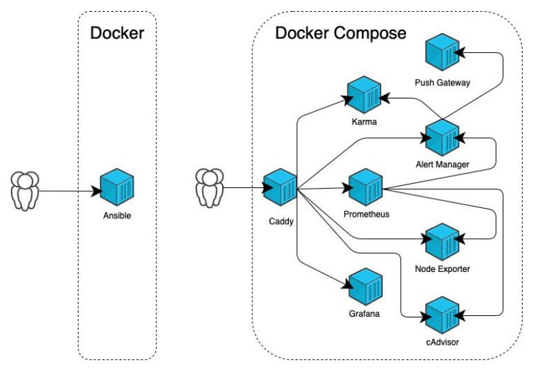

### 5.4.2. Структура Docker Compose
Имя файла `docker-compose.yaml` или `docker-compose.yml`, расширение может быть либо `.yaml`, либо `.yml`
```yaml
# Структура docker-compose файла
version: '2.1'                      # Версия docker-compose 
networks:                           # Директива описания сетей
  monitoring:                       # Имя сети (если не указать будет принята директива в которой находится docker-compose.yaml
    driver: bridge                  # Драйвер сети
volumes:                            # Директива описания внешних хранилищь
    prometheus_data: {}             # Имя волюма {} - означает что волюм находится в дефолтном пути
services:                           # Директива с описанием контейнеров
  prometheus:                       # Название сервиса (stanza service)
    image: prom/prometheus:v2.17.1  # Используемый образ для контейнера
    container_name: prometheus      # Имя контейнера
    volumes:                        # Подключаемые волюмы
      - prometheus_data:/prometheus # Смонтировать ранее созданый волюм в указанную директорию контейнера
    restart: always                 # Перезапустить контейнер в случае остановки
    networks:                       # Используемые сети
      - monitoring                  # Использовать ранее указанную сеть
```
[Актуальная версия docker compose](https://github.com/docker/compose/releases/)
```shell
# Установка docker-compose
curl -L https://github.com/docker/compose/releases/download/1.29.2/docker-compose \
-`uname -s`-`uname -m` -o /usr/bin/docker-compose \
&& chmod +x /usr/bin/docker-compose
```

### 5.4.3. Базовые команды Docker Compose
`docker-compose build` - сборка образа.

_Собранные образы помечаются, как project_service._

Если в Docker Compose файле указано имя образа, Docker образ помечается этим именем. Если после первоначальной сборки 
вы изменяете Dockerfile, службы или содержимое ее каталога сборки (контекста сборки), _запустите docker-compose build 
повторно_, чтобы пересобрать изменённый docker образ.

<https://docs.docker.com/engine/reference/commandline/compose_build/>

`docker-compose pull` - качивает образы из удалённого реестра в локальный Docker Registry.

Извлекает указанный в stanza service: образ из удалённого реестра, определенный в файле docker-compose.yaml, но не
запускает контейнер на основе этого образа, а просто помещает их в локальный реестр Docker.

<https://docs.docker.com/engine/reference/commandline/compose_pull/>

`docker-compose push` - загружает образ из локально реестра в удалённый реестр (Docker Registry).

Загружает указанный в stanza service: образ в удалённый реестр, определенный в файле docker-compose.yaml, шаблон 
загрузки ищет по имени образа `registry/repository/image:tag`

<https://docs.docker.com/compose/reference/push/>

`docker-compose up [-d]` извлекает/собирает/запускает контейнеры на основе указанных в stanza service: образов. 
(-d --detach - запустить в фоне)
Команда запускает контейнеры в фоновом режиме и оставляет их работающими. Если процесс обнаруживает ошибку, код выхода 
для этой команды — 1. Если процесс прерывается с помощью SIGINT (ctrl + C) или SIGTERM, контейнеры останавливаются, 
а код выхода равен — 0.

<https://docs.docker.com/engine/reference/commandline/compose_up/>

`docker-compose logs [-f] [service_name]` выводит в STDOUT логи контейнеров на основе указанных в stanza service: 
запущенных контейнеров (-f --follow следить за выводом). При неуказанном _service_name_ выводит логи всех контейнеров.

<https://docs.docker.com/engine/reference/commandline/compose_logs/>

`docker-compose ps [-a]` выводит список запущенных контейнеров на основе указанных в stanza service: в
docker-compose файле. (-a --all - отобразить список в т.ч. остановленных контейнеров)

<https://docs.docker.com/compose/reference/ps/>

`docker-compose top` - выводит список запущенных процессоввнутри контейнеров на основе указанных в stanza service: в
docker-compose файле.

Удобно использовать при отладке взаимодействия нескольких контейнеров. Позволяет посмотреть от какого пользователя
запущен процесс, его PID, а также потребление CPU каждого контейнера, но лучше использовать утилиту ctop.
```shell
# Установка утилиты ctop
$ curl -L https://github.com/bcicen/ctop/releases/download/0.7.6/ctop-0.7.6-li nux-amd64 -O /usr/bin/ctop && chmod +x /usr/bin/ctop
```
<https://docs.docker.com/compose/reference/ps/>

`docker-compose down` останавливает все запущенные контейнеры на основе указанных в stanza service: в docker-compose 
файле.

Удаляет все контейнеры, сети, тома и образы, созданные с помощью up (-d). По умолчанию удаляются только следующие 
элементы:

* **Контейнеры для сервисов**, определенных в Compose файле.
* **Сети**, определенные в разделе сетей Compose файла.
* **Сеть по умолчанию**, если таковая используется.

**Важно**: Сети и тома, определенные как внешние, никогда не удаляются!

<https://docs.docker.com/engine/reference/commandline/compose_down/>

### 5.4.4. Вводная часть про Облака: Packer, Terraform

#### Packer
[HashiCorp Packer](https://www.packer.io/) — это инструмент для создания одинаковых образов ОС для различных платформ 
из одного описания. Он отлично дружит и со всеми крупными облачными провайдерами, вроде AWS, GCE, Azure и Digital Ocean,
и даже с локальными гипервизорами, вроде VMWare и VirtualBox. Создавать образы можно как для Linux, так и для Windows.

#### Terraform
[HashiCorp Terraform](https://www.terraform.io/) — это инструмент помогающий декларативно управлять инфраструктурой.
Используя Terraform не приходится (в консоли вашего облачного провайдера) вручную создавать диски, инстансы, учётные 
записи, сети и т.д. Так реализуется важнейший IaaC принцип: инфраструктура хранится в системе контроля версий точно 
так же, как исходный код, следовательно её можно рецензировать или откатывать к более раннему состоянию.

### 5.4.5. Развёртывание стека микросервисов

#### Авторизация в Yandex.Cloud
Для работы с Яндекс Облаком вам потребуется установить [утилиту ус](https://cloud.yandex.ru/docs/cli/quickstart).
```shell
# Актуальная версия для macOS (на момент подготовки презентации).
$ yc --version
Yandex.Cloud CLI 0.82.0 darwin/amd64
# Справка по командам утилиты yc
$ yc --help

# Инициализация профиля
$ yc init
Welcome! This command will take you through the configuration process.
Pick desired action:
 [1] Re-initialize this profile 'yc_recovery' with new settings
 [2] Create a new profile
Please enter your numeric choice: 2
Enter profile name. Names start with a lower case letter and contain only lower case letters a-z, digits 0-9, and hyphens '-': netology
Please go to https://oauth.yandex.ru/authorize?response_type=token&client_id=1a6940aa636648e9b2ef845d27bec2ec in order to obtain OAuth token.
Please enter OAuth token: AQTAAAWXO0wAATuкvqUL29UBkxhnH-lGv22qUw
You have one cloud available: 'cloud-bukatchuk' (id = b1gu1gt5nqi6lqgu3t7s). It is going to be used by default.
Please choose folder to use:
 [1] default (id = b1ghcfrf9jjd63ngp64p)
 [2] netology (id = b1gaec42k169jqpo02f7)
 [3] Create a new folder
Please enter your numeric choice: 2
Your current folder has been set to 'netology' (id = b1gaec42k169jqpo02f7).
Do you want to configure a default Compute zone? [Y/n] y
Which zone do you want to use as a profile default?
 [1] ru-central1-a
 [2] ru-central1-b
 [3] ru-central1-c
 [4] Don`t set default zone
Please enter your numeric choice: 1
Your profile default Compute zone has been set to 'ru-central1-a'.

$ yc config list
token: ***********************************
cloud-id: b1gu1gt5nqi6lqgu3t7s
folder-id: b1gaec42k169jqpo02f7
compute-default-zone: ru-central1-a

$ yc compute image list
+----+------+--------+-------------+--------+
| ID | NAME | FAMILY | PRODUCT IDS | STATUS |
+----+------+--------+-------------+--------+
+----+------+--------+-------------+--------+
```

#### Создание сети в Yandex.Cloud
```shell
# Инициализация сети
$ yc vpc network create \
> --name net \
> --labels my-label=netology \
> --description "my first network via yc"

id: enp6o83r23jge62evv45
folder_id: b1gaec42k169jqpo02f7
created_at: "2021-10-02T13:01:01Z"
name: net
description: my first network via yc
labels:
 my-label: netology
```

#### Создание подсети в Yandex.Cloud
```shell
# Инициализация подсети
$ yc vpc subnet create \
> --name my-subnet-a \
> --zone ru-central1-a \
> --range 10.1.2.0/24 \
> --network-name net \
> --description "my first subnet via yc"
id: e9bnppf2hf7326hqag94
folder_id: b1gaec42k169jqpo02f7
created_at: "2021-10-02T13:06:29Z"
name: my-subnet-a
description: my first subnet via yc
network_id: enp6o83r23jge62evv45
zone_id: ru-central1-a
v4_cidr_blocks:
- 10.1.2.0/24
```

#### Создание образа ОС в Yandex.Cloud
```shell
# Проверка версии Packer, корректности конфигурации и запуск сборки
$ packer --version
1.6.1
$ packer validate centos-7-base.json
$ packer build centos-7-base.json
yandex: output will be in this color.
==> yandex: Creating temporary ssh key for instance...
==> yandex: Using as source image: fd85ck0tjp72cp9jiqbi (name:"centos-7-1612278783", family: "centos-7")
==> yandex: Use provided subnet id e9bnppf2hf7326hqag94
==> yandex: Creating instance...
==> yandex: Waiting for instance with id fhmasb12cjnmhhb4ef98 tobecome active...
 yandex: Detected instance IP: 84.252.131.52
==> yandex: Using ssh communicator to connect: 84.252.131.52
==> yandex: Waiting for SSH to become available...
==> yandex: Connected to SSH!
==> yandex: Provisioning with shell script:
==> yandex: Stopping instance...
==> yandex: Deleting instance...
 yandex: Instance has been deleted!
==> yandex: Creating image: centos-7-base
==> yandex: Waiting for image to complete...
==> yandex: Destroying boot disk...
 yandex: Disk has been deleted!
Build 'yandex' finished.
==> Builds finished. The artifacts of successful builds are:
--> yandex: A disk image was created: centos-7-base (id: fd8eam19jsb479spvg7o)
with family name centos

$ yc compute image list
+----------------------+---------------+--------+----------------------+--------+
| ID | NAME | FAMILY | PRODUCT IDS | STATUS |
+----------------------+---------------+--------+----------------------+--------+
| fd8eam19jsb479spvg7o | centos-7-base | centos | f2entd2q3vii79nbabck | READY |
+----------------------+---------------+--------+----------------------+--------+
```
Образ ОС доступен в UI: Yandex.Cloud:

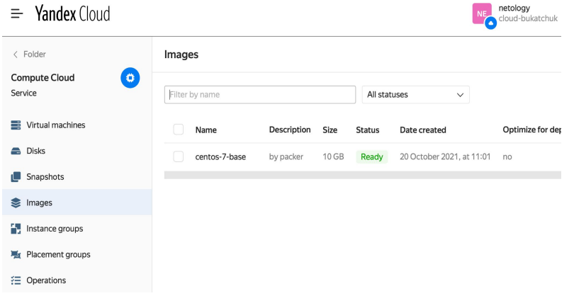

#### Создание ВМ в Yandex.Cloud
```shell
# Проверка версии Terraform и инициализация конфигурации.
$ terraform --version
Terraform v1.0.8
on darwin_amd64
$ terraform init
Initializing the backend...

Initializing provider plugins...
- Finding latest version of yandex-cloud/yandex...
- Installing yandex-cloud/yandex v0.64.1...
- Installed yandex-cloud/yandex v0.64.1 (self-signed, key ID E40F590B50BB8E40)

Partner and community providers are signed by their developers.
If you`d like to know more about provider signing, you can read
about it here:
https://www.terraform.io/docs/cli/plugins/signing.html
Terraform has created a lock file .terraform.lock.hcl to record the provider
selections it made above. Include this file in your version control repository so that Terraform can guarantee to make 
the same selections by default when you run "terraform init" in the future.
Terraform has been successfully initialized!
You may now begin working with Terraform. Try running "terraform plan" to see any changes that are required for your 
infrastructure. All Terraform commands should now work.
If you ever set or change modules or backend configuration for Terraform, rerun this command to reinitialize your 
working directory. If you forget, other commands will detect it and remind you to do so if necessary.

# Запуск проверки плана Terraform
$ terraform plan

Terraform used the selected providers to generate the following
execution plan. Resource actions are indicated with the following
symbols:
 + create
Terraform will perform the following actions:
...
...
Plan: 3 to add, 0 to change, 0 to destroy.
Changes to Outputs:
 + external_ip_address_node01_yandex_cloud = (known after apply)
 + internal_ip_address_node01_yandex_cloud = (known after apply)
 
# Применение Terraform плана
$ terraform apply
Plan: 3 to add, 0 to change, 0 to destroy.

Changes to Outputs:
 + external_ip_address_node01_yandex_cloud = (known after apply)
 + internal_ip_address_node01_yandex_cloud = (known after apply)
yandex_vpc_network.default: Creating...
yandex_vpc_network.default: Creation complete after 1s [id=enpnuvnl45lmmqp2kl27]
yandex_vpc_subnet.default: Creating...
yandex_vpc_subnet.default: Creation complete after 1s [id=e9b2nd8kum9504mul64f]
yandex_compute_instance.node01: Creating...
yandex_compute_instance.node01: Creation complete after 42s [id=fhmg97nus7rhdceh8gjr]
Apply complete! Resources: 3 added, 0 changed, 0 destroyed.
Outputs:
external_ip_address_node01_yandex_cloud = "178.154.205.74"
internal_ip_address_node01_yandex_cloud = "192.168.101.20"
```

#### Деплой ПО и стека микросервисов на виртуальную машину в Yandex.Cloud
```shell
# Подготовка ПО и запуск стека микросервисов
$ ansible-playbook provision.yml
PLAY [nodes] ************************************************************************
TASK [Gathering Facts] **************************************************************
The authenticity of host '178.154.205.74 (178.154.205.74)' can`t be established.
ECDSA key fingerprint is SHA256:j0bCZJ2uBZ0wXsgun7UzENtkd5H1gDJD2Kb8vAZl94A.
Are you sure you want to continue connecting (yes/no/[fingerprint])? yes
ok: [node01.netology.cloud]

TASK [Create directory for ssh-keys] ************************************************
ok: [node01.netology.cloud]

TASK [Adding rsa-key in /root/.ssh/authorized_keys] *********************************
changed: [node01.netology.cloud]

TASK [Checking DNS] *****************************************************************
changed: [node01.netology.cloud]

TASK [Installing tools] *************************************************************
changed: [node01.netology.cloud] => (item=['git', 'curl'])

TASK [Add docker repository] ********************************************************
changed: [node01.netology.cloud]

TASK [Installing docker package] ****************************************************
changed: [node01.netology.cloud] => (item=['docker-ce', 'docker-ce-cli', 'containerd.io'])

TASK [Enable docker daemon] *********************************************************
changed: [node01.netology.cloud]

TASK [Install docker-compose] *******************************************************
changed: [node01.netology.cloud]

TASK [Synchronization] **************************************************************
changed: [node01.netology.cloud]

TASK [Pull all images in compose] ***************************************************
changed: [node01.netology.cloud]

TASK [Up all services in compose] ***************************************************
changed: [node01.netology.cloud]

PLAY RECAP **************************************************************************
node01.netology.cloud : ok=12 changed=10 unreachable=0 failed=0 skipped=0 rescued=0 ignored=0
```
Теперь можно перейти по адресу: `http://внешний_ip_адрес_вашей_вм:3000` и авторизоваться в Grafana c логином/паролем 
(admin/admin)

### 5.4.6. Packer + Terraform + Ansible + Docker
**Packer** - _собирает образ_ на временной ВМ, которую создаёт сам для сборки образа, и затем загружает _собранный образ
ВМ в S3 хранилище_ этого облака.

**Terraform** - _использует этот образ_, как отправную точку с которой начинает строить _план создания_ инстанса 
виртуальной машины в этом облаке на основе манифеста, оформленного в виде исходного кода на языке _HCL_.

**Ansible**  - _по факту доступности виртуальной машины_ начинает подготовку операционной системы созданной ВМ, 
его цель — подготовка окружения (установка всех зависимостей, для того чтобы запустить Docker контейнеры.)

## 5.5 Оркестрация кластером Docker контейнеров на примере Docker Swarm.

### 5.5.1 Введение. Возможности Docker Swarm
**Docker Swarm** — это система кластеризации для Docker, которая превращает набор Docker хостов в полноценный кластер,
называемый Docker Swarm. Каждый хост, в составе такого кластера выступает в качестве, либо управляющей ноды (manager), 
либо рабочей (worker). В кластере должен быть, как минимум, один управляющий хост (manager).

Теоретически, физическое расположение машин не имеет значения, однако, _желательно иметь все Docker-ноды внутри одной 
локальной сети_. В противном случае, управление операциями или поиск консенсуса между несколькими управляющими нодами 
может занять значительное количество времени. Начиная с версии _Docker 1.12, Docker Swarm уже интегрирован в 
Docker Engine_ как Swarm-режим. В более старых версиях необходимо было запускать _swarm-контейнер_ на каждом из хостов 
для обеспечения функционала кластеризации.

**Возможности Docker Swarm:**
* **Балансировка нагрузки** - Docker Swarm отвечает за балансировку нагрузки и назначение _уникальных DNS-имен_, чтобы 
приложение, развернутое в кластере, можно было использовать так же, как, если бы приложение было развернуто на одном 
Docker Engine хосте. Другими словами, Docker Swarm может публиковать порты так же, как контейнер в Docker Engine, 
а затем _управляющая нода распределяет запросы между service-ами в кластере_.
* **Динамическое управление ролями: manager/worker** - Docker-хосты могут быть добавлены Swarm кластеру без 
необходимости перезапуска кластера. Более того, роль узла (управляющий или рабочий) также может динамически меняться 
на лету. Для того чтобы динамически добавить/убрать роль manager нужно выполнить команду:
```shell
# Добавление роли manager
$ docker node promote <node name>
# Удаление роли manager
$ docker node demote <node name>
```
**ВАЖНО!!!** Перед удалением manager нужно убедится что он не является лидером, в противном случае на некоторое время
кластер может стать недоступным.

* **Динамическое масштабирование сервисов** - Каждый _service_, запущенный в Swarm кластере, может динамически 
масштабироваться, как в сторону увеличения, так и в сторону уменьшения _количества реплик_. Управляющая нода (manager) 
заботится о добавлении или удалении контейнеров на рабочих узлах кластера:
```shell
# Добавление реплик сервиса
$ docker service update --replicas=3 my-service
# Откат изменений (отмена последнего изменения конфигурации)
$ docker service rollback my-service
```
* **Восстановление при отказе узлов** - Рабочие ноды постоянно контролируются управляющей нодой и, если какая-либо нода 
сбоит, то _новые задачи запускаются на других рабочих нодах_ с целью обеспечения заявленного (желаемого) количество 
реплик. Docker Swarm также позволяет _создавать несколько управляющих нод для предотвращения поломки кластера_ в
случае выхода из строя единственной управляющей ноды.
* **Обновления с задержкой (rolling updates)** - Обновление сервисов может _применяться постепенно_. Например, если 
у нас есть 10 реплик, и мы хотим внести изменения (обновить версию нашего сервиса), мы можем _определить задержку между 
развертыванием_ для каждой реплики. В таком случае, когда что-то пойдет не так, _процесс обновления автоматически 
прерывается_, тем самым защищая нас от ситуации, когда в кластере не останется рабочих реплик.

### 5.5.2 Архитектура Docker Swarm
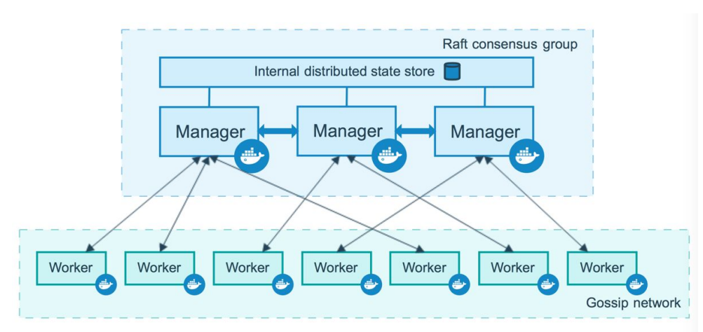

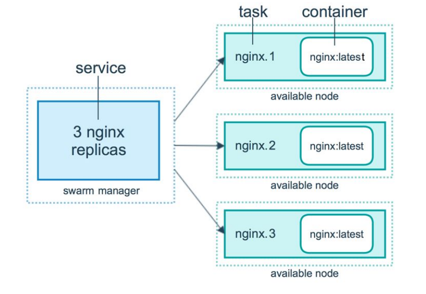

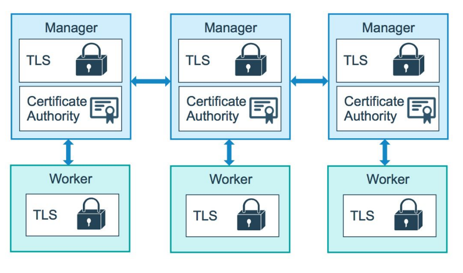

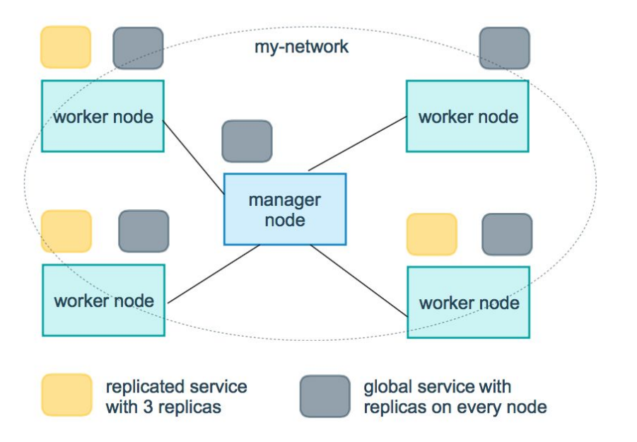

#### Сети в кластере Docker Swarm
При разворачивании Swarm кластера _на VM с публичными IP-адресами хорошей практикой является настройка правил
брандмауэра_ для разрешения трафика Docker Swarm на каждом сервере перед созданием кластера. Для успешного создания 
кластера необходимо, чтобы каждая VM могла связаться друг с другом по следующим протоколам и портам:
* **TCP порт 2377** для обеспечения связи с целью управления кластером;
* **TCP и UDP порт 7946** для связи между нодами;
* **UDP порт 4789** для трафика overlay-сети.

### 5.5.3 Базовые команды Docker Swarm
`docker swarm init [--advertise-addr <ip address>]` — инициализация кластера. Кластер будет инициализирован, как _single-mode instance_. Так же этой 
ноде будет автоматически присвоена роль _manager_ (--advertise-addr позволяет укакзать к какой сети должен себя
ассоциировать кластер). 
[Подробнее](https://docs.docker.com/engine/reference/commandline/swarm_init/)
```shell
# Инициализация кластера Docker Swarm
$ docker swarm init --advertise-addr <ip address>
Swarm initialized: current node (bvz81updecsj6wjz393c09vti) is now a manager.
To add a worker to this swarm, run the following command:
docker swarm join \ 
--token SWMTKN-1-3pu6hszjas19xyp7ghgosyx9k8atbfcr8p2is99znpy26u2lkl-1awxwuwd3z9j1z3puu7rcgdbx \ 
<ip address>:2377
To add a manager to this swarm, run 'docker swarm join-token manager' and follow the instructions.
```
`docker swarm join` — добавление в кластер новых серверов. **ВАЖНО!!!** В зависимости от того, какой _ключ_ указать 
вводимый в кластер сервер получит либо _роль worker_, либо _роль manager_.

`docker swarm join-token -q <worker|manager>` — вывод актуальных ключей для добавления нод в кластер.
[Подробнее](https://docs.docker.com/engine/reference/commandline/swarm_join/)
```shell
# Добавление ноды в кластер Docker Swarm
$ docker swarm join --token SWMTKN-1-3pu6hszjas19xyp7ghgosyx9k8atbfcr8p2is99znpy26u2lkl-1awxwuwd3z9j1z3puu7rcgdbx \
<ip address>:2377
$ docker swarm join-token -q worker 
SWMTKN-1-3pu6hszjas19xyp7ghgosyx9k8atbfcr8p2is99znpy26u2lkl-1awxwuwd3z9j1z3puu7rcgdbx
$ docker swarm join-token -q manager 
SWMTKN-1-3pu6hszjas19xyp7ghgosyx9k8atbfcr8p2is99znpy26u2lkl-7p73s1dx5in4tatdymyhg9hu2
```
`docker swarm ca` — просмотр и обновление сертификатов кластера. Кластер по-умолчанию _при инициализации создает цепочку
сертификатов_ для безопасной коммуникации и передачи данных между нодами. 
[Подробнее](https://docs.docker.com/engine/reference/commandline/swarm_ca/)
```shell
# Просмотр и обновление сертификатов кластера Docker Swarm
$ docker swarm ca
-----BEGIN CERTIFICATE----- .... -----END CERTIFICATE-----
$ docker swarm ca --rotate
desired root digest: sha256:05da740cf2577a25224…
rotated TLS certificates: [=========================> ] 1/3 nodes
rotated CA certificates:  [>                          ] 0/3 nodes
```
`docker swarm leave` — удаление ноды из кластера. **ВАЖНО!!!** Перед удалением ноды из кластера, во избежание простоев 
работающих сервисов, _нужно очистить ноду_ от запущенных на ней сервисов. 
[Подробнее](https://docs.docker.com/engine/reference/commandline/swarm_leave/)
```shell
# Очистка Docker Swarm ноды перед удалением из кластера
$ docker node update --availability drain node01
node01
# Удаление Docker Swarm ноды из кластера
$ docker swarm leave
Node left the default swarm.
```
`docker node` — набор команд для управления свойствами, ролями, атрибутами нод Docker Swarm кластера. _Доступны 
команды:_ ls, promote - повысить ноду до manager, demote - понизит ноду до worker, inspect, ps, rm, update. 
[Подробнее](https://docs.docker.com/engine/reference/commandline/node/)
```shell
# Добавление роли manager для 2-х Docker Swarm нод в работающем кластере
$ docker node promote node02 node03
Node node02 promoted to a manager in the swarm.
Node node03 promoted to a manager in the swarm.
# Удаление роли manager для 2-х Docker Swarm нод в работающем кластере
$ docker node demote node02 node03
Node node02 demoted to a manager in the swarm.
Node node03 demoted to a manager in the swarm.
```
`docker service` — набор команд для управления сервисами и их свойствами, работающими в Docker Swarm кластере.
_Доступны команды:_ create - аналог `docker run` , inspect, logs, ps, ls - вывести список запущенных экземпляров,
rollback - откатить на предыдущую версию до обновления, rm, scale - добавить экземпляры сервиса, update - обновить 
состояние сервисов. 
[Подробнее](https://docs.docker.com/engine/reference/commandline/service/)
```shell
# Добавление сервиса nginx в количестве 3-х реплик и определение критериев для целевых нод
$ docker service create \
--name web \
--replicas 3 \
--replicas-max-per-node 1 \
--constraint node.platform.linux==linux \
nginx:alpine
ID            NAME  MODE        REPLICAS  IMAGE          PORTS
b6lww17hrr4e  web   replicated  3/3       nginx:alpine
```
`docker stack` — набор команд для управления сервисами и их свойствами, в формате идентичном Docker Compose, но для
Docker Swarm кластера. [Подробнее](https://docs.docker.com/engine/reference/commandline/stack/) _Доступны команды:_ 
deploy, ls, ps, rm, services.
```shell
# Деплой сервиса nginx с использованием конфигурационного Compose файла
$ docker stack deploy --compose-file docker-compose.yml nginx     #nginx - имя стека
Creating network nginx_nginx
Creating network nginx_default
Creating service nginx_nginx
$ docker stack rm nginx
Removing service nginx_nginx
Removing network nginx_default
Removing network nginx_nginx
```
### 5.5.4 Теорема CAP
**Теорема CAP** (известная также как **теорема Брюера**) — эвристическое утверждение о том, что в любой реализации
распределенных вычислений возможно обеспечить не более двух из трёх следующих свойств:
* Consistency (согласованность данных);
* Availability (доступность);
* Partition tolerance (устойчивость к разделению).

* **Согласованность данных** (англ. consistency) — во всех вычислительных узлах в один момент времени данные не
противоречат друг другу;
* **Доступность** (англ. availability) — любой запрос к распределенной системе завершается корректным откликом, однако
без гарантии, что ответы всех узлов системы совпадают;
* **Устойчивость к разделению** (англ. partition tolerance) — расщепление распределенной системы на несколько 
изолированных секций не приводит к некорректности отклика от каждой из секций.

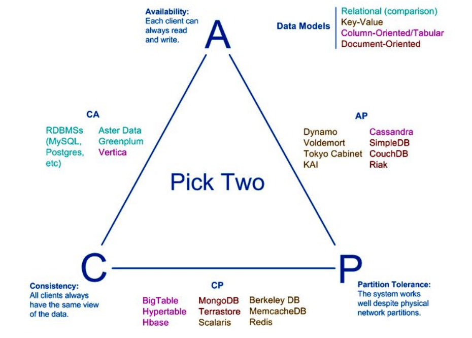

**CA** (Availability + Consistency – Parition tolerance), когда данные во всех узлах кластера согласованы и доступны, 
но не устойчивы к разделению.

Это означает, что реплики одной и той же информации, распределенные по разным серверам по отношению друг к другу, 
не противоречат друг другу и любой запрос к распределенной системе завершается корректным откликом. 

Такие системы возможны при поддержке _ACID_-требований к транзакциям (Атомарность, Согласованность, Изоляция, 
Долговечность) и абсолютной надежности сети. На практике таких решений на основе кластерных систем управления базами 
данных почти не существует. 

**CP** (Consistency + Partition tolerance – Availability) в каждый момент обеспечивает целостность данных и способна 
работать в условиях распада в ущерб доступности, не выдавая отклик на запрос.

Устойчивость к разделению требует дублирования изменений во всех узлах системы, что реализуется с помощью распределенных
пессимистических блокировок для сохранения целостности.

По сути, CP – это _система с несколькими синхронно обновляемыми мастер-базами_. Она всегда корректна, отрабатывая
транзакцию, только в том случае, если изменения удалось распространить по всем серверам.

**AP** (Availability + Partition tolerance – Consistency) не гарантирует целостность данных, обеспечивая их доступность 
и устойчивость к разделению, например, как в распределенных веб-кэшах и DNS.

Считается, что большинство NoSQL-СУБД относятся к этому классу систем, обеспечивая лишь некоторой уровень 
согласованности данных в конечном счете (eventually consistent).

Таким образом, AP-система может быть представлена кластером из нескольких узлов, каждый из которых _может принимать
данные, но не обязуется в тот же момент распространять их_ на другие сервера.

### 5.5.5 Развёртывание стека микросервисов в Docker Swarm кластере
1. Авторизуемся в Yandex.Cloud.
2. Создаём сеть и подсеть, чтобы собрать образ ОС с помощью Packer и запускаем сборку образа.
3. Удаляем подсеть и сеть, которую использовали для сборки образа ОС.
4. Создаём 6 виртуальных машин с помощью Terraform.
5. Создаём Docker Swarm кластер из виртуальных машин, созданных на предыдущем шаге.
6. Запускаем деплой стека приложений.
7. Проводим стресс тест Docker Swarm кластера.
8. Удаляем всё, чтобы не тратить деньги!

### 5.5.6 Полезные материалы
* [In Search of an Understandable Consensus Algorithm (Extended Version)](https://raft.github.io/raft.pdf) - полная
версия описания как работает алгоритм RAFT
* [Raft (визуализация)](http://thesecretlivesofdata.com/raft/)
* [Gossip](https://en.wikipedia.org/wiki/Gossip_protocol) - сетевой слой общения докер хостов через сетевые сокеты 