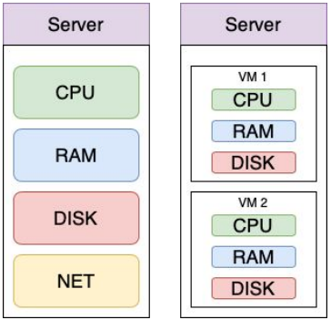
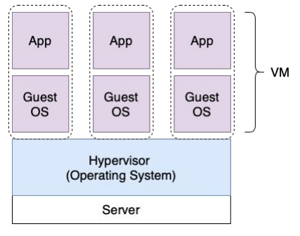
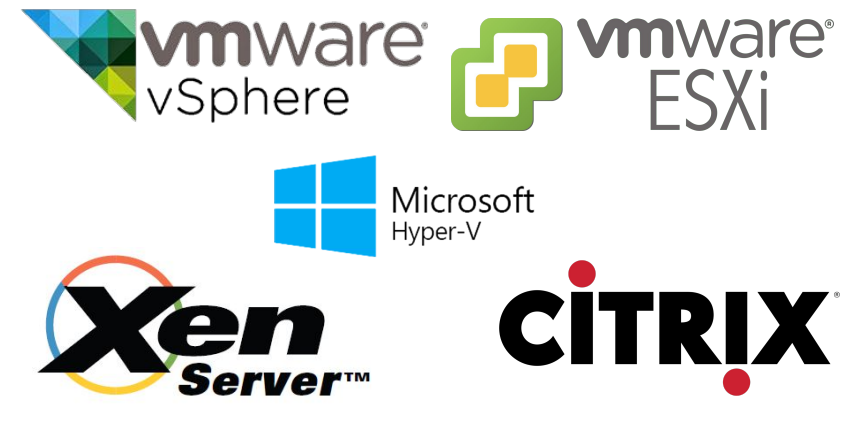
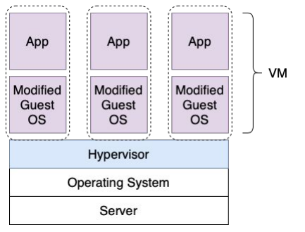
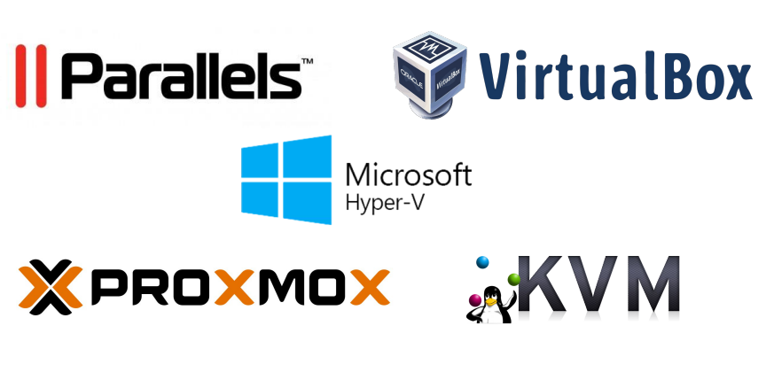
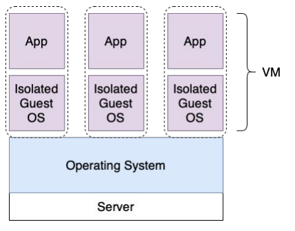
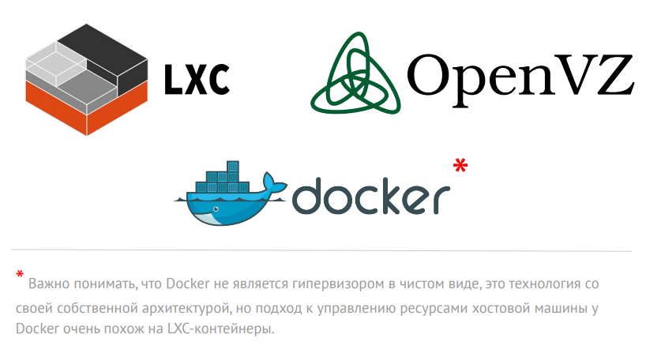
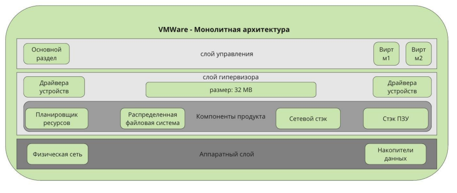
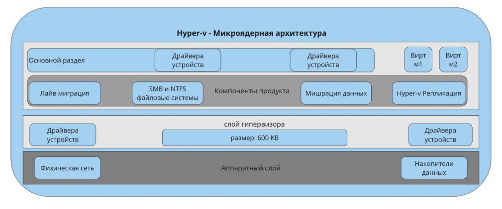

# 5. Виртуализация

## 5.1 Введение в виртуализацию. Типы и функции гипервизоров. Обзор рынка вендеров и областей применения.

### 5.1.1 Что такое виртуализация?
**Виртуализация** — это создание изолированных окружений в рамках одного физического устройства (сервера).

Каждое окружение при этом выглядит, как отдельный компьютер со своими характеристиками, такими как:
* процессор (количество выделенных ядер),
* оперативная память,
* диски,
* сеть.

Такое окружение называют набором логических ресурсов или виртуальной машиной.

Наборы ресурсов виртуальных машин:  

### 5.1.2 Что такое гипервизор?
Гипервизор — это монитор виртуальных машин — программа, обеспечивающая одновременное (параллельное) выполнение 
нескольких операционных систем (виртуальных машин) на одном и том же физическом устройстве (сервере). 

Основные задачи гипервизора:
* эмуляция аппаратных ресурсов,
* безопасное выполнение машинных инструкций,
* предотвращение выполнения команд гостевых операционных систем в режиме супервизора на хост-машине (исключение 
перехвата и анализа команд).

**Функции гипервизора**:
* Гипервизор обеспечивает изоляцию операционных систем друг от друга, защиту runtime и безопасность, а также разделение
ресурсов между различными запущенными ВМ.
* Гипервизор предоставляет работающим под его управлением ВМ средства связи и взаимодействия между собой таким образом,
как если бы эти ОС выполнялись на разных физических компьютерах.
* Гипервизор гарантирует независимое «включение», «перезагрузку» и «выключение» каждой ВМ с той или иной операционной
системой установленной на управляемую ВМ.

### 5.1.3 Типы виртуализации
**Типы виртуализации:**
* **Полная (аппаратная) виртуализация.** Гипервизоры первого типа работают на аппаратном уровне без необходимости установки 
какой-либо ОС на хост. Они сами являются ОС.
* **Паравиртуализация**. Гипервизорам второго типа необходима ОС для доступа монитора виртуальных машин (гипервизора) к 
аппаратным ресурсам хоста.
* **Виртуализация уровня операционной системы.** Виртуализация уровня ОС позволяет запускать изолированные и безопасные ВМ
на одном хосте, но не позволяет запускать ОС с ядрами, отличными от типа ядра хостовой ОС.

**Полная (аппаратная) виртуализация** использует менеджер виртуальных машин (гипервизор), который осуществляет связь
между гостевой операционной системой и аппаратными средствами физического сервера:  

**Примеры решений использующих полную (аппаратную) виртуализацию**:  

**Паравиртуализация** разделяет процесс с гостевой ОС. Гипервизор модифицирует ядро гостевой ВМ для разделения доступа
к аппаратным средствам физического сервера:  

**Примеры решений использующих паравиртуализацию**:  

**Виртуализация уровня ОС** позволяет запускать изолированные и безопасные ВМ на одном хосте, но не позволяет запускать
ОС с ядрами, отличными от типа ядра базовой операционной системы:  

**Примеры решений использующих виртуализацию уровня ОС**:  

### 5.1.4 Коммерческие продукты
#### VMWare  

**VMWare** предлагает множество решений для виртуализации, в частности vSphere, который используется, как основа для 
кластеризации и обеспечения отказоустойчивости.

Vmware vSphere использует монолитный дизайн гипервизора, который требует, чтобы драйверы устройств были включены в слой 
Hypervisor.

**В слое гипервизора** находятся следующие компоненты:
* планировщик ресурсов,
* распределенная файловая система,
* сетевой стек,
* стек хранения данных.

**Преимущества:**
* Нет ограничений по выбору операционной системы, необходимой для управления всеми компонентами.
* Нет необходимости в патчах безопасности, для слоя управления.
* Высокий уровень безопасности.
* Хорошая поддержка.

**Недостатки:**
* Не работает с оборудованием, которое не поддерживает VMWare.
* Требует высокого уровня подготовки инженеров

#### Hyper-V

**Hyper-V от Microsoft** встроен непосредственно в Windows Server, хотя он также может быть установлен как 
Hyper-V Server, который является автономным.

**Hyper-V использует микроядерную архитектуру**, поэтому драйверы устройств работают независимо другу от друга в 
управляемом слое.

**В слое управления находятся следующие компоненты продукта:**
* Live-миграция виртуальных машин.
* Hyper-V реплики.
* SMB и NTFS (файловые системы).
* Миграция накопителей данных.
* Сетевой стек и стек хранения данных не являются частью компонентов продукта, а являются частью гипервизора.

**Преимущества:**
* Упрощенное управления драйверами устройств, широкий диапазон поддерживаемых устройств.
* Простота установки новых ролей сервера.
* Нет прерывания сервиса для обслуживания или обновления безопасности.
* Сервисы могут быть масштабированы;
* Более низкий порог вхождения для инженеров.

**Недостатки:**
* Необходимость установки ОС для работы слоя гипервизора.
* Ограниченная поддержка версий ОС.

### 5.1.5 Open Source продукты

#### KVM
**KVM является представителем паравиртуализации**, вы можете запустить практически любую операционную систему в качестве
гостевой — BSD / Windows / Linux и с драйвером virtio вы получите близкую к нативной производительность.

**KVM поддерживает установку из ISO образа, а также шаблоны установки**, он поставляется с хорошим уровнем реализации
безопасности, может иметь проблемы с I/O под тяжелой нагрузкой, которая влияет на гостевые и хостовую операционные
системы.

**Каждая гостевая машина работает, как процесс на хостовой машине**, что хорошо для обнаружения источника проблемы, но
также при проблемах с доступными ресурсами на хостовой машине все гостевые подвержены проблемам с производительностью.

**KVM является нативным для большинства современных ядер Linux.** Это дает преимущество в производительности
по сравнению с другими системами виртуализации. При этом данный продукт относительно новый и находится в активном 
развитии. Большинство людей выбирают KVM из-за более низкого порога входа, хотя эта система не столь стабильна, как Xen.

#### Xen
**Xen поставляется в двух вариациях**, и может работать одновременно на том же физическом хосте в режиме Xen PV 
(паравиртуализация) и HVM (полная аппаратная виртуализация).

**Гостевые машины в режиме Xen PV обычно основаны на шаблонах** для быстрого развертывания и высокой производительности.

**Вы можете запускать свое собственное ядро в Xen PV.** По умолчанию вы можете запустить только Linux в этом режиме.
Запуск BSD возможен с дополнительной конфигурацией.

**Режим Xen HVM работает примерно так же, как KVM.** Он имеет лучшие драйверы для Linux-дистрибутивов, однако в NetBSD и
Windows, Xen HVM показывает себя хуже по сравнению с KVM, в то время как Xen PV и Windows более совместимы.

**Xen** очень зрелый продукт, большинство людей выбирают его для хорошей производительности и исключительной 
стабильности.

**Стабильность Xen обеспечивается**, за счет, предварительно выделяемой RAM и CPU для гипервизора, а так как он имеет
свои собственные выделенные ресурсы, то на него не могут повлиять гостевые ОС, что и дает пресловутую стабильность 
в работе.

#### VMWare vs. Hyper-V vs. KVM vs. Xen
* VMWare vSphere является наиболее сбалансированным и универсальным продуктом для организаций с высокими требованиями 
к их виртуальной инфраструктуре.
* Hyper-V является выбором de-facto для окружений с преобладанием технологий Microsoft.
* Если вы хотите сэкономить деньги, то KVM может стать неплохим вариантом платформы виртуализации.
* Xen с его надежностью и стабильностью подойдет как универсальный гипервизор, для тех кто не боится погрузиться в мир 
Xen 

Необходимо отметить, что оптимальный выбор системы очень зависит от конкретного сценария развертывания.

### 5.1.6 IaaS продукты
#### AWS EC2 (Amazon Elastic Compute Cloud)
**Сервисы облачных провайдеров** — самая современная реализация систем управления виртуализацией. Гипервизоры и прочая
реализация системы скрыта от пользователя, при этом есть гарантированные показатели доступности и отказоустойчивости.  
Пользователь может создавать инфраструктуру продуктивных окружений и использовать уникальные преимущества такие, как 
установка в нескольких локациях, построение цепочки с другими сервисами облака, программное API для автоматизации
создания и изменения ресурсов с помощью Terraform и Packer.

#### OpenStack
**Приватные облака** являются программной надстройкой для организации приватного (частного) облака, и дают часть 
преимуществ: 
* Построение продуктивных цепочек с другими компонентами вашей частной инфраструктуры.
* Программное API для автоматизации создания и изменения ресурсов приватного облака с помощью Terraform и Packer.

Единственный, но очень весомый недостаток:
* Очень высокий порог входа в технологию, вам потребуется выделенная команда инженеров для поддержки продуктовой 
инсталляции приватного облака.

Приватные облака имеют более высокий уровень безопасности, необходимый для некоторых бизнес-проектов и часто 
используются в банках и других финансовых учреждениях.

### 5.1.7 Аппаратная виртуализации vs. Виртуализации уровня ОС
| Аппаратная виртуализация                                                                                                                                                                                                                                | Виртуализация уровня ОС                                                                                                                                                                                                                  |
|---------------------------------------------------------------------------------------------------------------------------------------------------------------------------------------------------------------------------------------------------------|------------------------------------------------------------------------------------------------------------------------------------------------------------------------------------------------------------------------------------------|
| Виртуальные машины содержат собственное виртуальные устройства. Программное обеспечение может запускаться в виртуальных машинах без необходимости модификации. Виртуальные машины полностью изолированы друг от друга и используют собственные ядра ОС. | Контейнеры монтируют устройства хост машины, но выглядят как обычная ВМ. Сторонние приложения могут запускаться в контейнерах без необходимости модификации. Контейнеры полностью изолированы друг от друга, но используют одно ядро ОС. |
| Возможность создания множества виртуальных машин с различными операционными системами. Пользователь может устанавливать собственные патчи на ядро.                                                                                                      | Возможность создавать машины только с Linux или только Windows системами. Контейнеры разделяют ядро системы, работая как отдельный процесс основной ОС.                                                                                  |
| Жесткое распределение системных ресурсов между виртуальными машинами на уровне гипервизора.                                                                                                                                                             | Жесткое распределение системных ресурсов между виртуальными машинами на уровне гипервизора.                                                                                                                                              |

### 5.1.8 Применение виртуализации: плюсы и минусы
**Плюсы:**
* Высокая утилизация вычислительных мощностей.
* Снижение простоев за счет быстрого развёртывания.
* Возможность использовать подход Infrastructure as a Code.

**Минусы:**
* Накладные расходы на обслуживание.
* Увеличение числа абстракций.
* Единая точка отказа, если не используется кластеризация.
