# 6. Администрирование баз данных

## 6.1 Типы и структура СУБД

### 6.1.1. Базы Данных
Имеется множество определений термина “База данных” (БД). Нет "идеального" описания термина.

**Ключевые моменты в каждом описании термина “БД”:**
* БД хранится и обрабатывается вычислительной системой
* Данные в БД логически структурированы
* БД включает схему или метаданные, описывающие её структуру

Первый момент является строгим, остальные допускают различные трактовки.

### 6.1.2. Системы управления БД
Система управления базой данных (СУБД) - это ПО, предназначенное для:
* определения,
* обработки,
* извлечения,
* управления

данными в базе данных.

СУБД обычно управляет самими данными, форматом данных, именами полей, структурой записи и структурой файлов.

Также определяет правила для проверки и управления этими данными.

СУБД можно разделить на следующие категории:
* **Реляционные**
* Объектно-ориентированные
* **NoSQL**
  * Иерархические
  * Графовые
  * Сетевые
  * Документо-ориентированные
  * Ключ-значение
  * Column-oriented

#### Реляционные
В системах управления реляционными базами данных (СУБД) отношения между данными являются реляционными, и данные хранятся
в виде таблиц.

Каждый столбец таблицы представляет атрибут, а каждая строка в таблице представляет собой запись.

Каждое поле в таблице представляет собой значение данных.

Используют SQL для взаимодействия с данными.

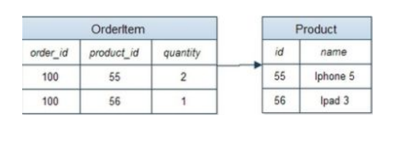

#### Объектно-ориентированные
Предоставляют полнофункциональные возможности программирования баз данных, сохраняя при этом совместимость с ООП языком.

Добавляет функциональность базы данных в ООП ЯП.

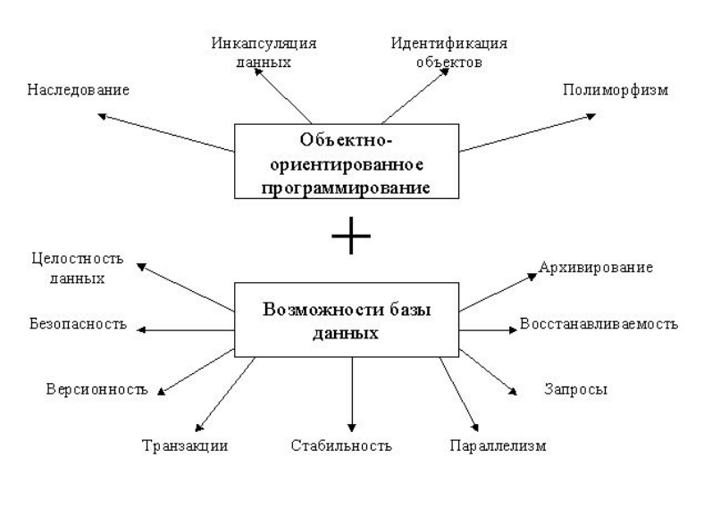

#### NoSQL
Базы данных NoSQL не используют SQL в качестве основного языка доступа к данным.

NoSQL не имеет предопределенных схем, что делает её идеальным кандидатом для быстро меняющихся сред разработки.

NoSQL позволяет разработчикам вносить изменения «на лету», не затрагивая приложения.

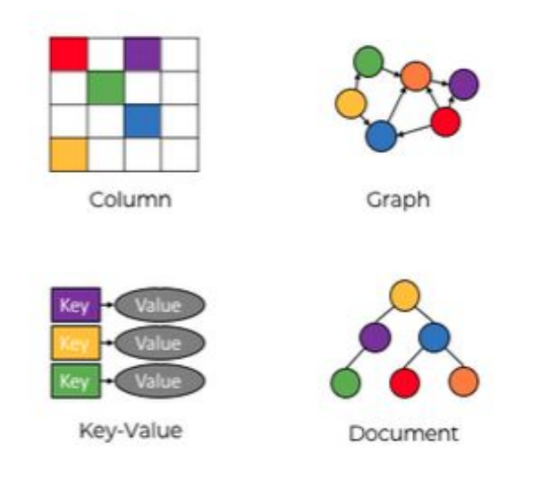

#### Иерархические
В иерархической модели данные организованы в древовидную структуру.

Данные хранятся в виде набора полей, где каждое поле содержит только одно значение.

Записи связаны друг с другом через связи в отношениях родитель-потомок.

В иерархической модели базы данных каждая дочерняя запись имеет только одного родителя.

Родитель может иметь несколько детей.

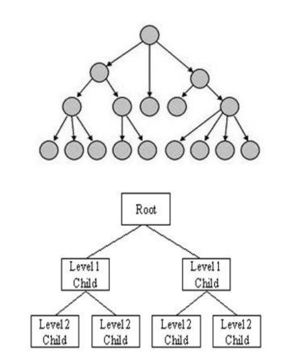

#### Графовые
NoSQL БД, которая используют структуру графов для семантических запросов.

Данные хранятся в виде узлов, ребер и свойств.

Узел представляет собой объект.

Ребро представляет собой отношение, которое соединяет узлы.

Свойства - это дополнительная информация, добавляемая к узлам.

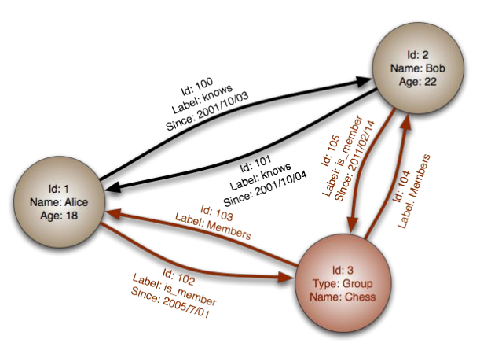

#### Сетевые
Сетевые СУБД используют сетевую структуру для создания отношений между объектами.

Сетевые базы данных - имеют иерархическую структуру, но в отличие от иерархических баз данных, где у одного узла может 
быть только один родительский узел, сетевой узел может иметь отношения с несколькими объектами.

Сетевая база данных больше похожа на "паутину".

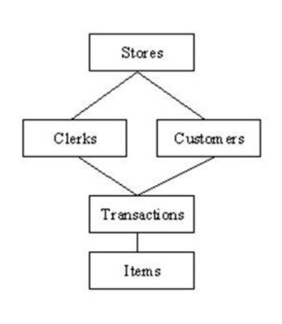

#### Документо-ориентированные
Является NoSQL БД, в которой данные хранятся в виде документов.

Каждый документ представляет данные в виде ключ-значение, связь с другими документами и мета-полями.

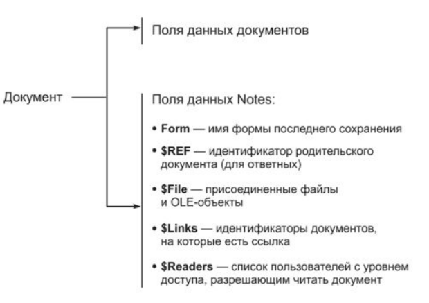

#### Ключ-значение
База данных на основе пар «ключ‑значение» хранит данные как совокупность пар «ключ‑значение», в которых ключ служит
уникальным идентификатором.

Как ключи, так и значения могут представлять собой что угодно: от простых до сложных составных объектов.

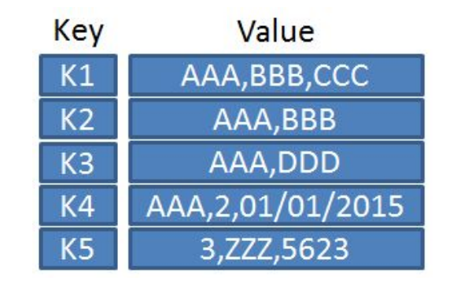

#### Column-oriented
В таких системах данные хранятся в виде матрицы, строки и столбцы которой используются как ключи.

Типичным применением этого типа СУБД является веб-индексирование, а также задачи, связанные с большими данными, 
с пониженными требованиями к согласованности.

Каждая строка имеет свой набор столбцов.

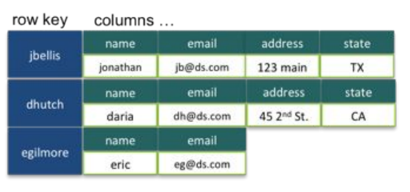

### 6.1.3. CAP-теорема
**CAP-теорема (теорема Брюера)** - утверждение о том, что в любой реализации распределённых вычислений возможно 
обеспечить не более двух из трёх следующих свойств:
* **согласованность данных (англ. consistency)** — во всех вычислительных узлах в один момент времени данные не 
противоречат друг другу;
* **доступность (англ. availability)** — любой запрос к распределённой системе завершается корректным откликом, однако
без гарантии, что ответы всех узлов системы совпадают;
* **устойчивость к разделению (англ. partition tolerance)** — расщепление распределённой системы на несколько 
изолированных секций не приводит к некорректности отклика от каждой из секций.

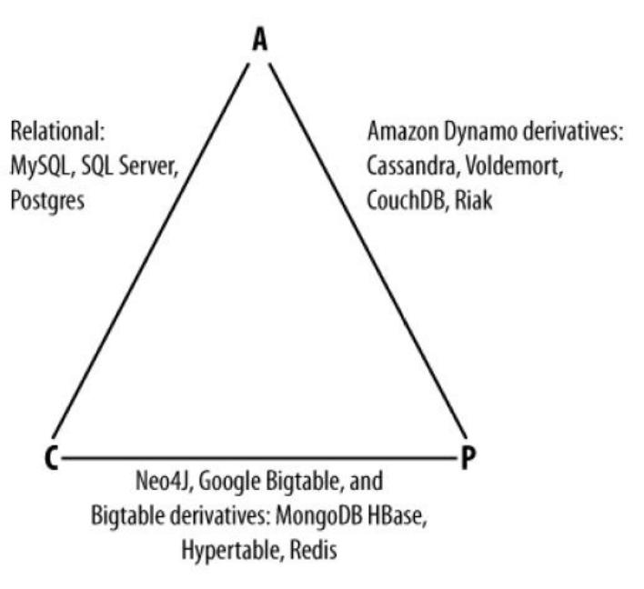

**Недостатки:**
* **Условность понятий CAP**. Например, система может отвечать в течении часа - если ответ корректный, в рамках CAP 
теоремы, это доступная система.
* **В основном, все системы - CP и AP**. Сетевые взаимодействия допускают обрывы связи и потери пакетов - вследствие 
этих накладных расходов нельзя гарантировать CA.
* **Множество систем удовлетворяют только P**. В Master-Slave системе при потере Master - теряется CAP. В асинхронной
Master-Slave системе запрос данных может производится раньше синхронизации всех Slave.
* **Сложность применения к NoSQL**

### 6.1.4. PACELC-теорема
Расширение CAP-теоремы.

Добавляет понятие Latency - время, за которое клиент получит ответ и которое регулируется каким-либо уровнем 
согласованности.

При расчете, сводится к виду:

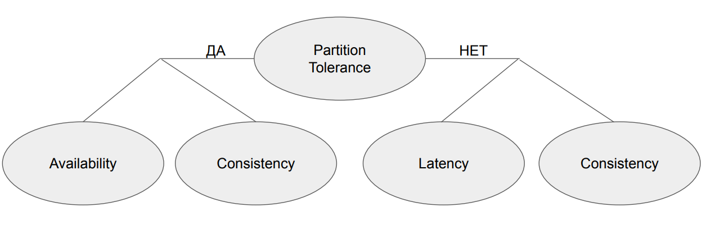

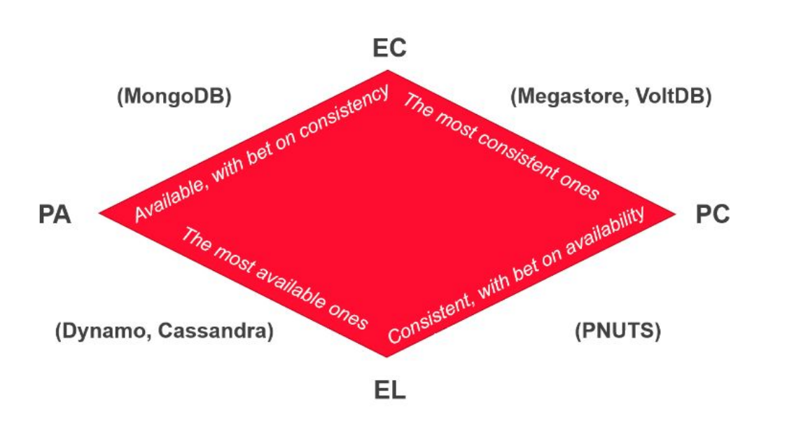
### 6.1.5. Транзакции
**Транзакция** - это набор последовательных операций над БД, представляющих логическую единицу. Транзакция применяется 
полностью или не применяется совсем.

**Пример:**
Необходимо перевести с банковского счёта номер 1 на счёт номер 2 сумму в 10 рублей.

Этого можно достичь, приведённой последовательностью действий (транзакцией):
1. Прочесть баланс на счету номер 1.
2. Уменьшить баланс на 10 рублей.
3. Сохранить новый баланс счёта номер 1.
4. Прочесть баланс на счету номер 2.
5. Увеличить баланс на 10 рублей.
6. Сохранить новый баланс счёта номер 2.

### 6.1.6. ACID
**ACID** - требования к СУБД, в обеспечение надежности и предсказуемости ее работы.
* **A - atomicity (атомарность)** никакая транзакция не будет зафиксирована в БД частично.
* **C - consistency (согласованность)** каждая успешная транзакция фиксирует только допустимые результаты.
* **I - isolation (изоляция)** параллельные транзакции не искажают результат друг друга.
* **D - durability (стойкость)** гарантия применения успешных транзакций, независимо от низкоуровневых проблем.

ACID позволяет проектировать высоконадежные системы.
### 6.1.7. BASE
**BASE** - принцип, противопоставляющий себя ACID.
* **BA - basically availability (базовая доступность)** деградация части узлов ведет к деградации части сессий, исключая
полную деградацию системы. Система отвечает на любой запрос, но в ответе могут быть неверные данные.
* **S - soft state (неустойчивое состояние)** уменьшение времени хранения сессий и фиксация обновлений только критичных 
операций.
* **E - eventually consistent (конечная согласованность)** изменение состояния в конечном итоге применится на все 
системы.

BASE позволяет проектировать высокопроизводительные системы.

### 6.1.8. NoSQL
**NoSQL** - огромное семейство БД, полный список всех систем можно прочитать на сайте: 
<https://hostingdata.co.uk/nosql-database/>

**Общие характеристики NoSQL систем:**
* No SQL - Не используется SQL (в классическом виде).
* Schemaless - Данные не структурированы.
* Aggregates - Данные представлены в виде аггрегатов.
* BASE - Слабые ACID свойства, уклон в сторону BASE для производительности.
* Share nothing - NoSQL распределенные системы, без совместно используемых ресурсов.

### 6.1.9. MongoDB
**MongoDB** - одна из популярных документо-ориентированных СУБД.

Является классическим примером NoSQL.

**MongoDB поддерживает:**
* ad-hoc запросы
* Индексирование
* Горизонтальное масштабирование и шардинг
* MapReduce
* Транзакции, ACID/BASE

По PACELC теореме MongoDB соответствует PA/EC

**MongoDB подходит для следующих применений:**
* хранение и регистрация событий;
* системы управления документами и контентом;
* электронная коммерция;
* игры;
* данные мониторинга, датчиков;
* мобильные приложения;
* хранилище операционных данных веб-страниц (например, хранение комментариев, рейтингов, профилей пользователей, 
сеансы пользователей).

### 6.1.10. Redis
**Redis** - это СУБД вида "ключ-значение".

**Основные характеристики системы:**
* Может использоваться как БД, так и как кэш-система или брокер сообщений.
* Все данные хранятся в оперативной памяти.
* Данным можно присваивать Time-To-Live.
* Имеется встроенная система Pub/Sub.
* Поддерживает Master-Slave репликацию
**Важно!** "Из коробки" не имеет механизма консенсуса. При отказе ведущей реплики - необходимо вручную выбрать новую 
ведущую реплику.

**Redis Sentinel** - система управления узлами Redis, осуществляющая:
* мониторинг работоспособности ведущих и ведомых узлов;
* алертинг о произошедших отклонениях в работе;
* автоматический выбор нового ведущего узла, в случае отказа текущего;
* механизм нотификации клиентов и узлов о перевыборе ведущего узла.

Redis Sentinel входит в состав Redis начиная с версии 2.6. Sentinel рекомендуется использовать в режиме кластера для
обеспечения его отказоустойчивости.

### 6.1.11. Memcached
**Memcached** - это СУБД вида "ключ-значение"
**Основные характеристики системы:**
* используется как распределенный кэш;
* все данные хранятся в оперативной памяти;
* данным можно присваивать Time-To-Live;
* поддерживает Master-Slave репликацию.

Обладает меньшей функциональностью, по сравнению с Redis