# 6. Администрирование баз данных

## 6.1 Типы и структура СУБД

### 6.1.1. Базы Данных
Имеется множество определений термина “База данных” (БД). Нет "идеального" описания термина.

**Ключевые моменты в каждом описании термина “БД”:**
* БД хранится и обрабатывается вычислительной системой
* Данные в БД логически структурированы
* БД включает схему или метаданные, описывающие её структуру

Первый момент является строгим, остальные допускают различные трактовки.

### 6.1.2. Системы управления БД
Система управления базой данных (СУБД) - это ПО, предназначенное для:
* определения,
* обработки,
* извлечения,
* управления

данными в базе данных.

СУБД обычно управляет самими данными, форматом данных, именами полей, структурой записи и структурой файлов.

Также определяет правила для проверки и управления этими данными.

СУБД можно разделить на следующие категории:
* **Реляционные**
* Объектно-ориентированные
* **NoSQL**
  * Иерархические
  * Графовые
  * Сетевые
  * Документо-ориентированные
  * Ключ-значение
  * Column-oriented

#### Реляционные
В системах управления реляционными базами данных (СУБД) отношения между данными являются реляционными, и данные хранятся
в виде таблиц.

Каждый столбец таблицы представляет атрибут, а каждая строка в таблице представляет собой запись.

Каждое поле в таблице представляет собой значение данных.

Используют SQL для взаимодействия с данными.


#### Объектно-ориентированные
Предоставляют полнофункциональные возможности программирования баз данных, сохраняя при этом совместимость с ООП языком.

Добавляет функциональность базы данных в ООП ЯП.


<https://dbdb.io/db/db4o>

#### NoSQL
Базы данных NoSQL не используют SQL в качестве основного языка доступа к данным.

NoSQL не имеет предопределенных схем, что делает её идеальным кандидатом для быстро меняющихся сред разработки.

NoSQL позволяет разработчикам вносить изменения «на лету», не затрагивая приложения.


#### Иерархические
В иерархической модели данные организованы в древовидную структуру.

Данные хранятся в виде набора полей, где каждое поле содержит только одно значение.

Записи связаны друг с другом через связи в отношениях родитель-потомок.

В иерархической модели базы данных каждая дочерняя запись имеет только одного родителя.

Родитель может иметь несколько детей.


#### Графовые
NoSQL БД, которая используют структуру графов для семантических запросов.

Данные хранятся в виде узлов, ребер и свойств.

Узел представляет собой объект.

Ребро представляет собой отношение, которое соединяет узлы.

Свойства - это дополнительная информация, добавляемая к узлам.


#### Сетевые
Сетевые СУБД используют сетевую структуру для создания отношений между объектами.

Сетевые базы данных - имеют иерархическую структуру, но в отличие от иерархических баз данных, где у одного узла может 
быть только один родительский узел, сетевой узел может иметь отношения с несколькими объектами.

Сетевая база данных больше похожа на "паутину".


#### Документо-ориентированные
Является NoSQL БД, в которой данные хранятся в виде документов.

Каждый документ представляет данные в виде ключ-значение, связь с другими документами и мета-полями.


#### Ключ-значение
База данных на основе пар «ключ‑значение» хранит данные как совокупность пар «ключ‑значение», в которых ключ служит
уникальным идентификатором.

Как ключи, так и значения могут представлять собой что угодно: от простых до сложных составных объектов.


#### Column-oriented
В таких системах данные хранятся в виде матрицы, строки и столбцы которой используются как ключи.

Типичным применением этого типа СУБД является веб-индексирование, а также задачи, связанные с большими данными, 
с пониженными требованиями к согласованности.

Каждая строка имеет свой набор столбцов.


### 6.1.3. CAP-теорема
**CAP-теорема (теорема Брюера)** - утверждение о том, что в любой реализации распределённых вычислений возможно 
обеспечить не более двух из трёх следующих свойств:
* **согласованность данных (англ. consistency)** — во всех вычислительных узлах в один момент времени данные не 
противоречат друг другу;
* **доступность (англ. availability)** — любой запрос к распределённой системе завершается корректным откликом, однако
без гарантии, что ответы всех узлов системы совпадают;
* **устойчивость к разделению (англ. partition tolerance)** — расщепление распределённой системы на несколько 
изолированных секций не приводит к некорректности отклика от каждой из секций.


**Недостатки:**
* **Условность понятий CAP**. Например, система может отвечать в течении часа - если ответ корректный, в рамках CAP 
теоремы, это доступная система.
* **В основном, все системы - CP и AP**. Сетевые взаимодействия допускают обрывы связи и потери пакетов - вследствие 
этих накладных расходов нельзя гарантировать CA.
* **Множество систем удовлетворяют только P**. В Master-Slave системе при потере Master - теряется CAP. В асинхронной
Master-Slave системе запрос данных может производится раньше синхронизации всех Slave.
* **Сложность применения к NoSQL**

### 6.1.4. PACELC-теорема
Расширение CAP-теоремы.

Добавляет понятие Latency - время, за которое клиент получит ответ и которое регулируется каким-либо уровнем 
согласованности.

При расчете, сводится к виду:


### 6.1.5. Транзакции
**Транзакция** - это набор последовательных операций над БД, представляющих логическую единицу. Транзакция применяется 
полностью или не применяется совсем.

**Пример:**
Необходимо перевести с банковского счёта номер 1 на счёт номер 2 сумму в 10 рублей.

Этого можно достичь, приведённой последовательностью действий (транзакцией):
1. Прочесть баланс на счету номер 1.
2. Уменьшить баланс на 10 рублей.
3. Сохранить новый баланс счёта номер 1.
4. Прочесть баланс на счету номер 2.
5. Увеличить баланс на 10 рублей.
6. Сохранить новый баланс счёта номер 2.

### 6.1.6. ACID
**ACID** - требования к СУБД, в обеспечение надежности и предсказуемости ее работы.
* **A - atomicity (атомарность)** никакая транзакция не будет зафиксирована в БД частично.
* **C - consistency (согласованность)** каждая успешная транзакция фиксирует только допустимые результаты.
* **I - isolation (изоляция)** параллельные транзакции не искажают результат друг друга.
* **D - durability (стойкость)** гарантия применения успешных транзакций, независимо от низкоуровневых проблем.

ACID позволяет проектировать высоконадежные системы.

### 6.1.7. BASE
**BASE** - принцип, противопоставляющий себя ACID.
* **BA - basically availability (базовая доступность)** деградация части узлов ведет к деградации части сессий, исключая
полную деградацию системы. Система отвечает на любой запрос, но в ответе могут быть неверные данные.
* **S - soft state (неустойчивое состояние)** уменьшение времени хранения сессий и фиксация обновлений только критичных 
операций.
* **E - eventually consistent (конечная согласованность)** изменение состояния в конечном итоге применится на все 
системы.

BASE позволяет проектировать высокопроизводительные системы.

### 6.1.8. NoSQL
**NoSQL** - огромное семейство БД, полный список всех систем можно прочитать на сайте: 
<https://hostingdata.co.uk/nosql-database/>

**Общие характеристики NoSQL систем:**
* No SQL - Не используется SQL (в классическом виде).
* Schemaless - Данные не структурированы.
* Aggregates - Данные представлены в виде аггрегатов.
* BASE - Слабые ACID свойства, уклон в сторону BASE для производительности.
* Share nothing - NoSQL распределенные системы, без совместно используемых ресурсов.

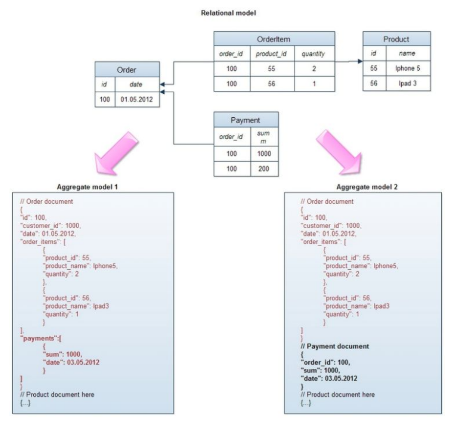

### 6.1.9. MongoDB
**MongoDB** - одна из популярных документо-ориентированных СУБД.

Является классическим примером NoSQL.

**MongoDB поддерживает:**
* ad-hoc запросы
* Индексирование
* Горизонтальное масштабирование и шардинг
* MapReduce
* Транзакции, ACID/BASE

По PACELC теореме MongoDB соответствует PA/EC

**MongoDB подходит для следующих применений:**
* хранение и регистрация событий;
* системы управления документами и контентом;
* электронная коммерция;
* игры;
* данные мониторинга, датчиков;
* мобильные приложения;
* хранилище операционных данных веб-страниц (например, хранение комментариев, рейтингов, профилей пользователей, 
сеансы пользователей).

### 6.1.10. Redis
**Redis** - это СУБД вида "ключ-значение".

**Основные характеристики системы:**
* Может использоваться как БД, так и как кэш-система или брокер сообщений.
* Все данные хранятся в оперативной памяти.
* Данным можно присваивать Time-To-Live.
* Имеется встроенная система Pub/Sub.
* Поддерживает Master-Slave репликацию
**Важно!** "Из коробки" не имеет механизма консенсуса. При отказе ведущей реплики - необходимо вручную выбрать новую 
ведущую реплику.

**Redis Sentinel** - система управления узлами Redis, осуществляющая:
* мониторинг работоспособности ведущих и ведомых узлов;
* алертинг о произошедших отклонениях в работе;
* автоматический выбор нового ведущего узла, в случае отказа текущего;
* механизм нотификации клиентов и узлов о перевыборе ведущего узла.

Redis Sentinel входит в состав Redis начиная с версии 2.6. Sentinel рекомендуется использовать в режиме кластера для
обеспечения его отказоустойчивости.

### 6.1.11. Memcached
**Memcached** - это СУБД вида "ключ-значение"
**Основные характеристики системы:**
* используется как распределенный кэш;
* все данные хранятся в оперативной памяти;
* данным можно присваивать Time-To-Live;
* поддерживает Master-Slave репликацию.

Обладает меньшей функциональностью, по сравнению с Redis

## 6.2 SQL

### 6.2.1. Общие сведения
**SQL (structured query language)** - декларативный язык программирования, применяемый для создания, модификации, 
управления данными в реляционной базе данных.

**Базовые операции SQL:**
* создание в базе данных новой таблицы;
* добавление в таблицу новых записей;
* изменение записей;
* удаление записей;
* выборка записей из одной или нескольких таблиц (в соответствии с заданным условием);
* изменение структур таблиц.

Язык SQL представляет собой совокупность операторов, инструкций, вычисляемых функций.

**Преимущества:**
* **Независимость от конкретной СУБД** - SQL-запросы могут быть достаточно легко перенесены из одной СУБД в другую.
* **Наличие стандартов** - Наличие стандартов и набора тестов для выявления совместимости и соответствия конкретной 
реализации SQL общепринятому стандарту.
* **Декларативность** - В SQL-запросах описываются только операции над данными. Реализация запросов осуществляется 
средствами СУБД

### 6.2.2. Операторы SQL
**Определение данных:**
* `CREATE` - Создание объекта
* `ALTER` - Изменение объекта
* `DROP` - Удаление объекта

**Манипуляция данными:**
* `SELECT` - Выборка данных
* `INSERT` - Вставка данных
* `UPDATE` - Изменение данных
* `DELETE` - Удаление данных

**Доступ к данным:**
* `GRANT` - Предоставление прав
* `REVOKE` - Отзыв прав
* `DENY` - Запрет на действие

**Управление транзакциями:**
* `COMMIT` - Применение транзакции
* `ROLLBACK` - Откат изменений
* `SAVEPOINT` - Деление транзакции

### 6.2.3. Операторы определения данных
#### CREATE
* `CREATE DATABASE zawod;` - Создание БД
* `CREATE TABLE kadry (nomerceh INT, tabnom SERIAL , fio CHAR(20) UNIQUE);` - Создание таблицы (_INT_ - целочисленое 
значение, _SERIAL_ -  автоинкрементирующееся числовое значение, от 1 до 2147483647, _CHAR(20)_ - буквенное длинной 
в 20 символов, _UNIQUE_ - в полях значения не повторяются)
* `CREATE VIEW poor AS SELECT tabnom, fio FROM kadry WHERE tabnom < 120;` - Создание псевдотаблицы (выборки из таблиц,
в данном примере это будет таблица сгенерированная запросом `SELECT tabnom, fio FROM kadry WHERE tabnom < 120`)
* `CREATE SYNONYM t1 FOR zavod.kadry;` - Создание синонима имени таблицы

#### ALTER
* `ALTER DATABASE zawod MODIFY NAME = factory;` - Изменить имя БД
* `ALTER TABLE kadry RENAME TO persons;` - Изменение имени таблицы
* `ALTER TABLE kadry ADD (dolzhnost CHAR(20) BEFORE fio), DROP(tabnom);` - Изменение столбцов в таблице
* `ALTER INDEX indkdtb TO CLUSTER;` - Упорядочивание таблицы по индексу

#### DROP
* `DROP DATABASE zawod;` - Удалить БД
* `DROP TABLE kadry;` - Удалить таблицу
* `DROP INDEX indkdtb;` - Удалить индекс
* `DROP SYNONYM t1;` - Удалить синоним
* `DROP VIEW poor;` - Удалить псевдотаблицу

### 6.2.4. Операторы манипуляции данных

#### SELECT
* `SELECT * FROM persons;` - Вывести все записи таблицы
* `SELECT COUNT(*) FROM persons;` - Вывести количество записей в таблице
* `SELECT fio, tabnom FROM persons;` - Вывести определенные столбцы из таблицы
* `SELECT fio, tabnom FROM persons WHERE tabnom>100;` - Вывести данные по условию
* `SELECT DISTINCT fio, tabnom FROM persons;` - Вывести только уникальные значения
* `SELECT fio, tabnom FROM persons ORDER BY tabnom ASC;` Вывести упорядоченные данные по признаку (ASC - по возрастанию,
DESC - по убыванию)
* `SELECT COUNT(*) FROM persons GROUP BY fio;` - Вывести сгруппированные значения по признаку

#### INSERT
* `INSERT INTO persons VALUES (1, 123, “Пупкин”);` - Вставка данных в таблицу
* `INSERT INTO persons (nomerceh, tabno, fio) VALUES (1, 123, “Пупкин”);` - Вставка данных в таблицу с указанием столбца

#### UPDATE
* `UPDATE persons SET fio = 'Alfred Schmidt' WHERE tabno = 1;` - Изменение поля в конкретной строке
* `UPDATE persons SET fio = 'Alfred Schmidt';` - Изменение поля во всей таблицу

**Важно!**  
Если не указывать конкретную строку (через оператор _WHERE_) - изменения затронут всю таблицу.

#### DELETE
* `DELETE FROM persons;` - Удалить все данные в таблице
* `DELETE FROM persons WHERE tabno=1;` - Удалить конкретную строку (или набор строк)

**Важно!**  
Если не указывать конкретную строку (через оператор _WHERE_) - изменения затронут всю таблицу.

#### ИТОГ
* Синтаксис создания записи:  
`INSERT INTO table_name VALUES (value1, value2, value3, ...);`  
`INSERT INTO table_name (column1, column2, column3, ...) VALUES (value1, value2, value3, ...);`
* Синтаксис получения записи:  
`SELECT * FROM table_name;`  
`SELECT column1, column2, … FROM table_name;`
* Синтаксис обновления записи:  
`UPDATE table_name SET column1 = value1, … WHERE condition;`
* Синтаксис удаления записи:  
`DELETE FROM table_name WHERE condition;`

### 6.2.5. Операторы доступа к данным
#### GRANT
Синтаксис выдачи прав выглядит следующим образом:  
`GRANT privilege_name ON object_name to {user_name | public | role_name};`

Пример:  
`GRANT ALL ON customer TO iwanow, petrow; GRANT UPDATE(fname,lname,company, city),SELECT ON customer TO PUBLIC;`

#### REVOKE
Синтаксис отзыва прав выглядит следующим образом:  
`REVOKE privilege_name ON object_name FROM {user_name | public | role_name};`

Пример:  
`REVOKE ALL ON customer FROM iwanow, petrow; REVOKE UPDATE(fname,lname,company, city),SELECT ON customer FROM PUBLIC;`

#### DENY
Синтаксис запрета выглядит следующим образом:  
`DENY privilege_name ON object_name TO {user_name | public | role_name};`

Пример:
```sql
DENY ALL ON customer TO iwanow, petrow;
DENY UPDATE(fname,lname,company, city),SELECT ON customer TO PUBLIC;
```

### 6.2.6. Операторы управления транзакциями
Пример транзакции для MySQL:
```PostgreSQL
# начало транзакции
BEGIN;
# обновляем данные
UPDATE accounts SET balance = balance - 100.00 WHERE name = 'Alice';
# ставим точку сохранения
SAVEPOINT my_savepoint;
# обновляем данные
UPDATE accounts SET balance = balance + 100.00 WHERE name = 'Bob';
# допустили ошибку, возвращаемся к my_savepoint
ROLLBACK TO my_savepoint;
# теперь правильно обновляем данные
UPDATE accounts SET balance = balance + 100.00 WHERE name = 'Wally';
# завершаем транзакцию
COMMIT;
```
```MySQL
# начало транзакции
START TRANSACTION;
# обновляем данные
UPDATE accounts SET balance = balance - 100.00 WHERE name = 'Alice';
# ставим точку сохранения
SAVEPOINT my_savepoint;
# обновляем данные
UPDATE accounts SET balance = balance + 100.00 WHERE name = 'Bob';
# допустили ошибку, возвращаемся к my_savepoint
ROLLBACK TO my_savepoint;
# теперь правильно обновляем данные
UPDATE accounts SET balance = balance + 100.00 WHERE name = 'Wally';
# завершаем транзакцию
COMMIT;
```

### 6.2.7. Первичные и внешние ключи
**Ключи** - это некие сущности, созданные для установления определенных ограничений, которые поддерживают целостность и
доступность данных в таблицах баз данных.

Ключи в sql созданы для того, чтобы указать дополнительную функциональность столбца. Будь то уникальность или то, что 
столбец ссылается на другую таблицу (внешний ключ).

**Первичный ключ или PRIMARY KEY** означает, что в таблице значение колонки primary key не может повторяться. То есть 
устанавливает уникальность данных.

**Внешний ключ или FOREIGN KEY** устанавливает взаимосвязь между данными в разных таблицах.

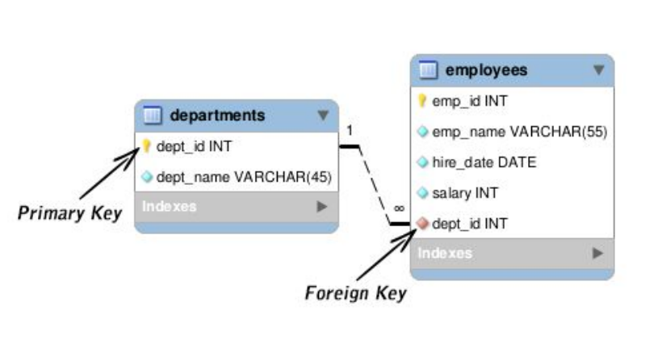

### 6.2.8. Сложные выборки данных
Выборка данных из нескольких таблиц не является тривиальной процедурой.

Типы таких выборок можно разделить на:
* выборка с объединением;
* выборка с использованием вложенного запроса;
* выборка c использованием JOIN.

Выборку с объединением можно осуществить посредством оператора **UNION**.
Например, у нас есть 2 таблицы:

table 1:

| id  | name | country |
|-----|:-----|---------|
| 1   | John | England |
| 2   | Bob  | USA     |

table 2:

| id  | name  | language  |
|-----|-------|-----------|
| 3   | Alice | Assembler |
| 4   | Sindy | C++       |

Тогда запрос на выборку имен может выглядеть следующим образом:  
`SELECT name FROM table_1 UNION SELECT name FROM table_2;`

**Важно!** UNION можно применять, только если объединяющиеся выборки совпадают по столбцам.

Выборка с вложенным запросом производится с использованием оператора **WHERE**.
Например, у нас есть 2 таблицы:  
customer:

| id  | name | order_id |
|-----|------|----------|
| 1   | John | 3        |
| 2   | Bob  | 4        |

orders:

| id  | title | price |
|-----|-------|-------|
| 3   | Tea   | 10    |
| 4   | Phone | 9999  |

Тогда найти имя покупателя, купившего чай можно следующим образом:
`SELECT name FROM customer WHERE order_id IN (SELECT id FROM orders WHERE title=”TEA”);`

Выборки с использованием **JOIN** можно подразделить на следующие типы:
* Внутреннее присоединение (INNER JOIN)
* Внешнее правое присоединение (RIGHT OUTER JOIN)
* Внешнее левое присоединение (LEFT OUTER JOIN)
* Внешнее присоединение (FULL OUTER JOIN)
* Левое множество, исключая правое
* Правое множество, исключая левое
* Множества, исключая пересечение

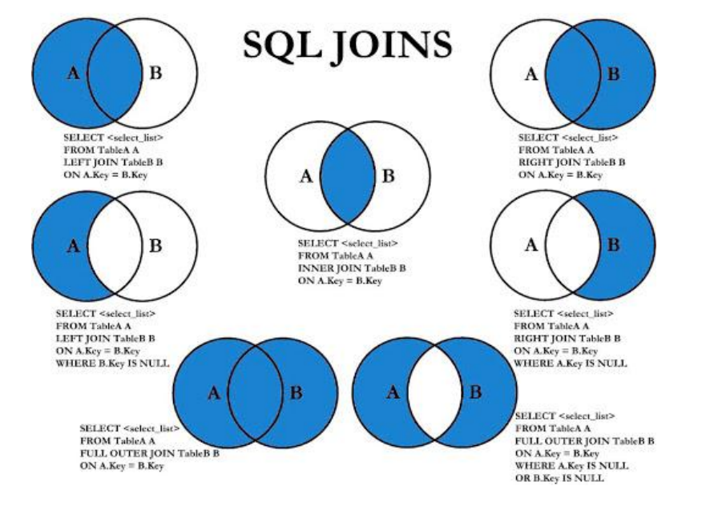

Пусть у нас есть 2 таблицы (persons (p), positions (ps)):

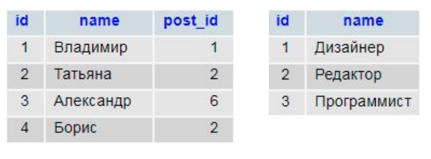

#### INNER JOIN
```sql
SELECT p.id, p.name 'Имя сотрудника', ps.id 'pos.id', ps.name 'Должность'
FROM 'persons' p
INNER JOIN 'positions' ps ON ps.id = p.post_id
```
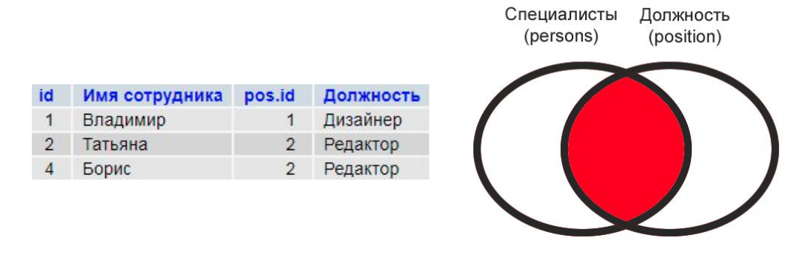

#### LEFT OUTER JOIN
```sql
SELECT p.id, p.name 'Имя сотрудника', ps.id 'pos.id', ps.name 'Должность'
FROM 'persons' p
LEFT OUTER JOIN 'positions' ps ON ps.id = p.post_id
```
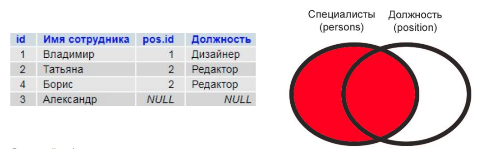

#### RIGHT OUTER JOIN
```sql
SELECT p.id, p.name 'Имя сотрудника', ps.id 'pos.id', ps.name 'Должность'
FROM 'persons' p
RIGHT OUTER JOIN 'positions' ps ON ps.id = p.post_id
```

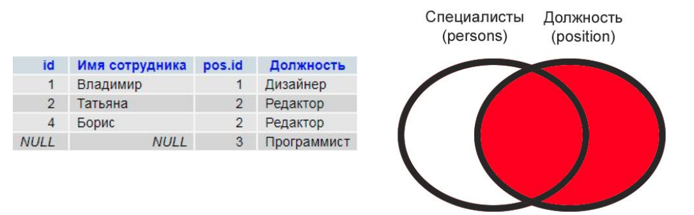

#### FULL OUTER JOIN
`SELECT * FROM ps FULL JOIN p ON ps.pos_id = p.id;`

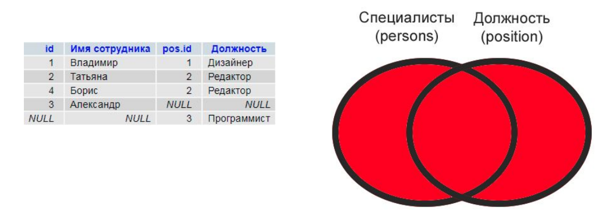

#### Левое множество, исключая правое
```sql
SELECT p.id, p.name 'Имя сотрудника', ps.id 'pos.id', ps.name 'Должность'
FROM 'persons' p
LEFT OUTER JOIN 'positions' ps ON ps.id = p.post_id
WHERE ps.id is NULL
```
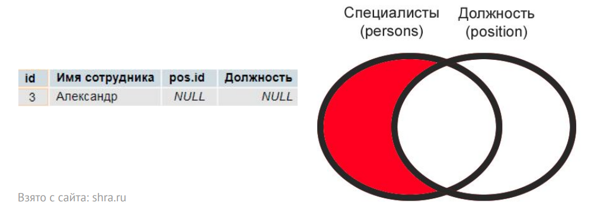

#### Правое множество, исключая левое
```SQL
SELECT p.id, p.name 'Имя сотрудника', ps.id 'pos.id', ps.name 'Должность'
FROM 'persons' p
RIGHT OUTER JOIN 'positions' ps ON ps.id = p.post_id
WHERE p.id is NULL
```
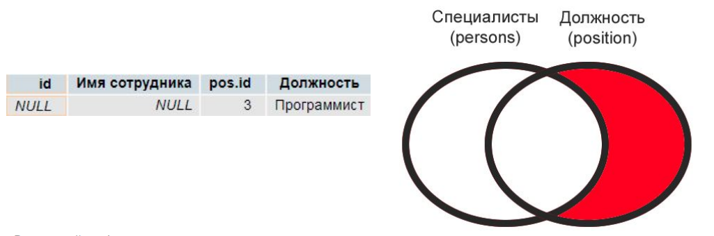

#### Множества, исключая пересечение
```sql
(SELECT p.id, p.name `Имя сотрудника`, ps.id `pos.id`, ps.name `Должность`
FROM `persons` p LEFT OUTER JOIN `positions` ps ON ps.id = p.post_id
WHERE ps.id is NULL) UNION ALL
(SELECT p.id, p.name `Имя сотрудника`, ps.id `pos.id`, ps.name `Должность`
FROM `persons` p RIGHT OUTER JOIN `positions` ps ON ps.id = p.post_id
WHERE p.id is NULL)
```
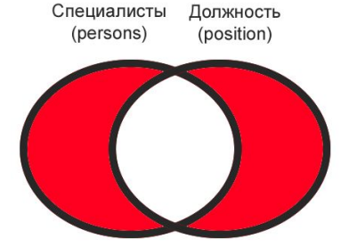

### 6.2.9. Индексы
**Индексы** - это специальные структуры в базах данных, которые позволяют ускорить поиск и сортировку по определенному 
полю или набору полей в таблице, а также используются для обеспечения уникальности данных.

Количество индексов увеличивает скорость выборок в БД.

При переизбытке количества индексов падает производительность операций изменения данных и увеличивается размер БД.

**Общие принципы, связанные с созданием индексов:**
* Индексы необходимо создавать для столбцов, которые используются в JOIN операциях, по которым часто производится поиск 
и операции сортировки.
* Для столбцов, на которые наложено ограничение уникальности индекс создается в автоматическом режиме;
* Индексы лучше создавать для тех полей, в которых - минимальное число повторяющихся значений и данные распределены 
равномерно.
* При внесении изменений в таблицы автоматически изменяются и индексы, наложенные на эту таблицу. В результате индекс 
может быть сильно фрагментирован, что сказывается на производительности.

Индексы можно охарактеризовать следующим образом:
* **Кластерные** - Кластерный индекс представляет из себя древовидную структуру, где такой индекс соответствует набору 
значений или "смешан" с данными.
* **Некластерные** - Некластерный индекс присваивает каждой записи уникальное значение, позволяющее производить быстрый
поиск по таблице.

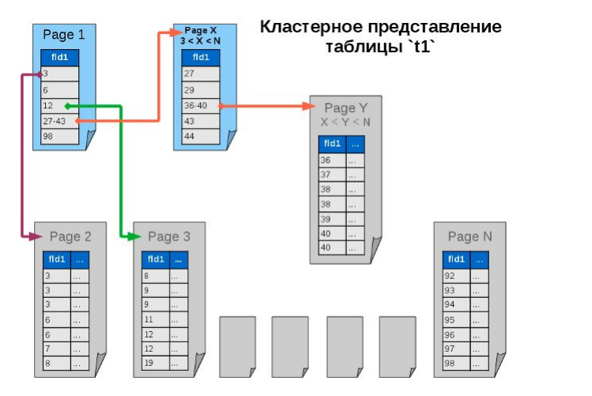

### 6.2.10. Explain
**Explain** - это оператор SQL, предоставляющий полную информацию выполнения запроса.

Синтаксис применения:  
`EXPLAIN {запрос};`

Пример запроса:  
`EXPLAIN SELECT * FROM table_name;`

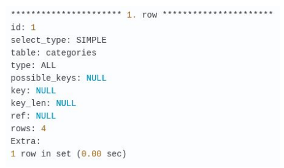

Описание параметров вывода (пример для MySQL):

| Параметр      | Назначение                                                                                 |
|---------------|--------------------------------------------------------------------------------------------|
| id            | порядковый номер для каждого SELECT’а внутри запроса (когда имеется несколько подзапросов) |
| select_type   | тип запроса SELECT                                                                         |
| table         | таблица, к которой относится выводимая строка                                              |
| type          | тип связи используемых таблиц                                                              |
| possible_keys | индексы, которые могут быть использованы для нахождения строк в таблице                    |
| key           | использованный индекс                                                                      |
| key_len       | длина индекса                                                                              |
| ref           | столбцы или константы, которые сравниваются с индексом, указанным в поле key               |
| rows          | число записей, обработанных для получения выходных данных                                  |
| Extra         | содержит дополнительную информацию, относящуюся к плану выполнения запроса                 |

## Дополнительные материалы:
### Типы и структура СУБД

1. [Наиболее полное объяснение что такое pub\sub](https://habr.com/ru/post/278237/)
2. [CAP теорема простым языком](https://habr.com/ru/post/130577/)

### SQL

1. [Про создание пользователей](https://postgrespro.ru/docs/postgresql/9.5/sql-createuser)
2. [Про ограничения, ключи, уникальность и NOT NULL](https://postgrespro.ru/docs/postgresql/9.5/ddl-constraints)
3. [Подробное описание видов индексов](https://habr.com/ru/post/247373/)

### MySQL

1. [Все типы данных](https://dev.mysql.com/doc/refman/8.0/en/data-types.html)
2. [Старая статья с обзором движков таблиц](https://habr.com/ru/post/64851/)
3. [Ещё одно описание видов индексов](https://habr.com/ru/post/102785/)

### PostgreSQL

1. [Резервное копирование и восстановление](https://postgrespro.ru/docs/postgresql/9.6/backup)
2. [Параметры autovacuum](https://postgrespro.ru/docs/postgresql/12/runtime-config-autovacuum)
3. [Что такое DRBD и как настроить](https://habr.com/ru/company/otus/blog/509710/)
4. [Секционирвание(Шардинг) таблиц](https://postgrespro.ru/docs/postgresql/10/ddl-partitioning)
5. [Встроенный функционал горизонтального шардинга](https://postgrespro.ru/docs/enterprise/10/pg-shardman)
6. [Оператор ANALYZE](https://postgrespro.ru/docs/postgresql/9.6/sql-analyze)
7. [Оператор EXPLAIN](https://postgrespro.ru/docs/postgresql/9.6/sql-explain)
8. [Оператор VACUUM](https://postgrespro.ru/docs/postgresql/9.6/sql-vacuum)
