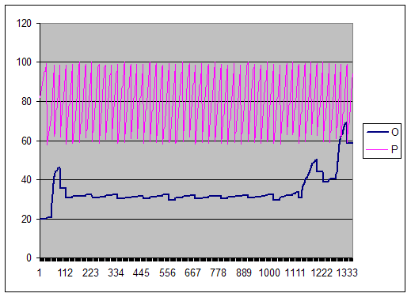

# 6. Администрирование баз данных

## 6.1 Типы и структура СУБД

### 6.1.1. Базы Данных
Имеется множество определений термина "База данных" (БД). Нет "идеального" описания термина.

**Ключевые моменты в каждом описании термина "БД":**
* БД хранится и обрабатывается вычислительной системой
* Данные в БД логически структурированы
* БД включает схему или метаданные, описывающие её структуру

Первый момент является строгим, остальные допускают различные трактовки.

### 6.1.2. Системы управления БД
Система управления базой данных (СУБД) - это ПО, предназначенное для:
* определения,
* обработки,
* извлечения,
* управления

данными в базе данных.

СУБД обычно управляет самими данными, форматом данных, именами полей, структурой записи и структурой файлов.

Также определяет правила для проверки и управления этими данными.

СУБД можно разделить на следующие категории:
* **Реляционные**
* Объектно-ориентированные
* **NoSQL**
  * Иерархические
  * Графовые
  * Сетевые
  * Документо-ориентированные
  * Ключ-значение
  * Column-oriented

#### Реляционные
В системах управления реляционными базами данных (СУБД) отношения между данными являются реляционными, и данные хранятся
в виде таблиц.

Каждый столбец таблицы представляет атрибут, а каждая строка в таблице представляет собой запись.

Каждое поле в таблице представляет собой значение данных.

Используют SQL для взаимодействия с данными.


#### Объектно-ориентированные
Предоставляют полнофункциональные возможности программирования баз данных, сохраняя при этом совместимость с ООП языком.

Добавляет функциональность базы данных в ООП ЯП.


<https://dbdb.io/db/db4o>

#### NoSQL
Базы данных NoSQL не используют SQL в качестве основного языка доступа к данным.

NoSQL не имеет предопределенных схем, что делает её идеальным кандидатом для быстро меняющихся сред разработки.

NoSQL позволяет разработчикам вносить изменения «на лету», не затрагивая приложения.


#### Иерархические
В иерархической модели данные организованы в древовидную структуру.

Данные хранятся в виде набора полей, где каждое поле содержит только одно значение.

Записи связаны друг с другом через связи в отношениях родитель-потомок.

В иерархической модели базы данных каждая дочерняя запись имеет только одного родителя.

Родитель может иметь несколько детей.


#### Графовые
NoSQL БД, которая используют структуру графов для семантических запросов.

Данные хранятся в виде узлов, ребер и свойств.

Узел представляет собой объект.

Ребро представляет собой отношение, которое соединяет узлы.

Свойства - это дополнительная информация, добавляемая к узлам.


#### Сетевые
Сетевые СУБД используют сетевую структуру для создания отношений между объектами.

Сетевые базы данных - имеют иерархическую структуру, но в отличие от иерархических баз данных, где у одного узла может 
быть только один родительский узел, сетевой узел может иметь отношения с несколькими объектами.

Сетевая база данных больше похожа на "паутину".


#### Документо-ориентированные
Является NoSQL БД, в которой данные хранятся в виде документов.

Каждый документ представляет данные в виде ключ-значение, связь с другими документами и мета-полями.


#### Ключ-значение
База данных на основе пар «ключ‑значение» хранит данные как совокупность пар «ключ‑значение», в которых ключ служит
уникальным идентификатором.

Как ключи, так и значения могут представлять собой что угодно: от простых до сложных составных объектов.


#### Column-oriented
В таких системах данные хранятся в виде матрицы, строки и столбцы которой используются как ключи.

Типичным применением этого типа СУБД является веб-индексирование, а также задачи, связанные с большими данными, 
с пониженными требованиями к согласованности.

Каждая строка имеет свой набор столбцов.


### 6.1.3. CAP-теорема
**CAP-теорема (теорема Брюера)** - утверждение о том, что в любой реализации распределённых вычислений возможно 
обеспечить не более двух из трёх следующих свойств:
* **согласованность данных (англ. consistency)** — во всех вычислительных узлах в один момент времени данные не 
противоречат друг другу;
* **доступность (англ. availability)** — любой запрос к распределённой системе завершается корректным откликом, однако
без гарантии, что ответы всех узлов системы совпадают;
* **устойчивость к разделению (англ. partition tolerance)** — расщепление распределённой системы на несколько 
изолированных секций не приводит к некорректности отклика от каждой из секций.


**Недостатки:**
* **Условность понятий CAP**. Например, система может отвечать в течение часа - если ответ корректный, в рамках CAP 
теоремы, это доступная система.
* **В основном, все системы - CP и AP**. Сетевые взаимодействия допускают обрывы связи и потери пакетов - вследствие 
этих накладных расходов нельзя гарантировать CA.
* **Множество систем удовлетворяют только P**. В Master-Slave системе при потере Master - теряется CAP. В асинхронной
Master-Slave системе запрос данных может производиться раньше синхронизации всех Slave.
* **Сложность применения к NoSQL**

### 6.1.4. PACELC-теорема
Расширение CAP-теоремы.

Добавляет понятие Latency - время, за которое клиент получит ответ и которое регулируется каким-либо уровнем 
согласованности.

При расчете, сводится к виду:


### 6.1.5. Транзакции
**Транзакция** - это набор последовательных операций над БД, представляющих логическую единицу. Транзакция применяется 
полностью или не применяется совсем.

**Пример:**
Необходимо перевести с банковского счёта номер 1 на счёт номер 2 сумму в 10 рублей.

Этого можно достичь, приведённой последовательностью действий (транзакцией):
1. Прочесть баланс на счету номер 1.
2. Уменьшить баланс на 10 рублей.
3. Сохранить новый баланс счёта номер 1.
4. Прочесть баланс на счету номер 2.
5. Увеличить баланс на 10 рублей.
6. Сохранить новый баланс счёта номер 2.

### 6.1.6. ACID
**ACID** - требования к СУБД, в обеспечение надежности и предсказуемости ее работы.
* **A - atomicity (атомарность)** никакая транзакция не будет зафиксирована в БД частично.
* **C - consistency (согласованность)** каждая успешная транзакция фиксирует только допустимые результаты.
* **I - isolation (изоляция)** параллельные транзакции не искажают результат друг друга.
* **D - durability (стойкость)** гарантия применения успешных транзакций, независимо от низкоуровневых проблем.

ACID позволяет проектировать высоконадежные системы.

### 6.1.7. BASE
**BASE** - принцип, противопоставляющий себя ACID.
* **BA - basically availability (базовая доступность)** деградация части узлов ведет к деградации части сессий, исключая
полную деградацию системы. Система отвечает на любой запрос, но в ответе могут быть неверные данные.
* **S - soft state (неустойчивое состояние)** уменьшение времени хранения сессий и фиксация обновлений только критичных 
операций.
* **E - eventually consistent (конечная согласованность)** изменение состояния в конечном итоге применится на все 
системы.

BASE позволяет проектировать высокопроизводительные системы.

### 6.1.8. NoSQL
**NoSQL** - огромное семейство БД, полный список всех систем можно прочитать на сайте: 
<https://hostingdata.co.uk/nosql-database/>

**Общие характеристики NoSQL систем:**
* No SQL - Не используется SQL (в классическом виде).
* Schemaless - Данные не структурированы.
* Aggregates - Данные представлены в виде агрегатов.
* BASE - Слабые ACID свойства, уклон в сторону BASE для производительности.
* Share nothing - NoSQL распределенные системы, без совместно используемых ресурсов.


### 6.1.9. MongoDB
**MongoDB** - одна из популярных документо-ориентированных СУБД.

Является классическим примером NoSQL.

**MongoDB поддерживает:**
* ad-hoc запросы
* Индексирование
* Горизонтальное масштабирование и шардинг
* MapReduce
* Транзакции, ACID/BASE

По PACELC теореме MongoDB соответствует PA/EC

**MongoDB подходит для следующих применений:**
* хранение и регистрация событий;
* системы управления документами и контентом;
* электронная коммерция;
* игры;
* данные мониторинга, датчиков;
* мобильные приложения;
* хранилище операционных данных веб-страниц (например, хранение комментариев, рейтингов, профилей пользователей, 
сеансы пользователей).

### 6.1.10. Redis
**Redis** - это СУБД вида "ключ-значение".

**Основные характеристики системы:**
* Может использоваться как БД, так и как кэш-система или брокер сообщений.
* Все данные хранятся в оперативной памяти.
* Данным можно присваивать Time-To-Live.
* Имеется встроенная система Pub/Sub.
* Поддерживает Master-Slave репликацию
**Важно!** "Из коробки" не имеет механизма консенсуса. При отказе ведущей реплики - необходимо вручную выбрать новую 
ведущую реплику.

**Redis Sentinel** - система управления узлами Redis, осуществляющая:
* мониторинг работоспособности ведущих и ведомых узлов;
* алертинг о произошедших отклонениях в работе;
* автоматический выбор нового ведущего узла, в случае отказа текущего;
* механизм нотификации клиентов и узлов о перевыборе ведущего узла.

Redis Sentinel входит в состав Redis начиная с версии 2.6. Sentinel рекомендуется использовать в режиме кластера для
обеспечения его отказоустойчивости.

### 6.1.11. Memcached
**Memcached** - это СУБД вида "ключ-значение"
**Основные характеристики системы:**
* используется как распределенный кэш;
* все данные хранятся в оперативной памяти;
* данным можно присваивать Time-To-Live;
* поддерживает Master-Slave репликацию.

Обладает меньшей функциональностью, по сравнению с Redis

## 6.2 SQL

### 6.2.1. Общие сведения
**SQL (structured query language)** - декларативный язык программирования, применяемый для создания, модификации, 
управления данными в реляционной базе данных.

**Базовые операции SQL:**
* создание в базе данных новой таблицы;
* добавление в таблицу новых записей;
* изменение записей;
* удаление записей;
* выборка записей из одной или нескольких таблиц (в соответствии с заданным условием);
* изменение структур таблиц.

Язык SQL представляет собой совокупность операторов, инструкций, вычисляемых функций.

**Преимущества:**
* **Независимость от конкретной СУБД** - SQL-запросы могут быть достаточно легко перенесены из одной СУБД в другую.
* **Наличие стандартов** - Наличие стандартов и набора тестов для выявления совместимости и соответствия конкретной 
реализации SQL общепринятому стандарту.
* **Декларативность** - В SQL-запросах описываются только операции над данными. Реализация запросов осуществляется 
средствами СУБД

### 6.2.2. Операторы SQL
**Определение данных:**
* `CREATE` - Создание объекта
* `ALTER` - Изменение объекта
* `DROP` - Удаление объекта

**Манипуляция данными:**
* `SELECT` - Выборка данных
* `INSERT` - Вставка данных
* `UPDATE` - Изменение данных
* `DELETE` - Удаление данных

**Доступ к данным:**
* `GRANT` - Предоставление прав
* `REVOKE` - Отзыв прав
* `DENY` - Запрет на действие

**Управление транзакциями:**
* `COMMIT` - Применение транзакции
* `ROLLBACK` - Откат изменений
* `SAVEPOINT` - Деление транзакции

### 6.2.3. Операторы определения данных
#### CREATE
* `CREATE DATABASE zawod;` - Создание БД
* `CREATE TABLE kadry (nomerceh INT, tabnom SERIAL , fio CHAR(20) UNIQUE);` - Создание таблицы (_INT_ - целочисленное 
значение, _SERIAL_ -  автоинкрементирующееся числовое значение, от 1 до 2147483647, _CHAR(20)_ - буквенное длинной 
в 20 символов, _UNIQUE_ - в полях значения не повторяются)
* `CREATE VIEW poor AS SELECT tabnom, fio FROM kadry WHERE tabnom < 120;` - Создание псевдотаблицы (выборки из таблиц,
в данном примере это будет таблица сгенерированная запросом `SELECT tabnom, fio FROM kadry WHERE tabnom < 120`)
* `CREATE SYNONYM t1 FOR zavod.kadry;` - Создание синонима имени таблицы

#### ALTER
* `ALTER DATABASE zawod MODIFY NAME = factory;` - Изменить имя БД
* `ALTER TABLE kadry RENAME TO persons;` - Изменение имени таблицы
* `ALTER TABLE kadry ADD (dolzhnost CHAR(20) BEFORE fio), DROP(tabnom);` - Изменение столбцов в таблице
* `ALTER INDEX indkdtb TO CLUSTER;` - Упорядочивание таблицы по индексу

#### DROP
* `DROP DATABASE zawod;` - Удалить БД
* `DROP TABLE kadry;` - Удалить таблицу
* `DROP INDEX indkdtb;` - Удалить индекс
* `DROP SYNONYM t1;` - Удалить синоним
* `DROP VIEW poor;` - Удалить псевдотаблицу

### 6.2.4. Операторы манипуляции данных

#### SELECT
* `SELECT * FROM persons;` - Вывести все записи таблицы
* `SELECT COUNT(*) FROM persons;` - Вывести количество записей в таблице
* `SELECT fio, tabnom FROM persons;` - Вывести определенные столбцы из таблицы
* `SELECT fio, tabnom FROM persons WHERE tabnom>100;` - Вывести данные по условию
* `SELECT DISTINCT fio, tabnom FROM persons;` - Вывести только уникальные значения
* `SELECT fio, tabnom FROM persons ORDER BY tabnom ASC;` Вывести упорядоченные данные по признаку (ASC - по возрастанию,
DESC - по убыванию)
* `SELECT COUNT(*) FROM persons GROUP BY fio;` - Вывести сгруппированные значения по признаку

#### INSERT
* `INSERT INTO persons VALUES (1, 123, "Пупкин");` - Вставка данных в таблицу
* `INSERT INTO persons (nomerceh, tabno, fio) VALUES (1, 123, "Пупкин");` - Вставка данных в таблицу с указанием столбца

#### UPDATE
* `UPDATE persons SET fio = 'Alfred Schmidt' WHERE tabno = 1;` - Изменение поля в конкретной строке
* `UPDATE persons SET fio = 'Alfred Schmidt';` - Изменение поля во всей таблицу

**Важно!**  
Если не указывать конкретную строку (через оператор _WHERE_) - изменения затронут всю таблицу.

#### DELETE
* `DELETE FROM persons;` - Удалить все данные в таблице
* `DELETE FROM persons WHERE tabno=1;` - Удалить конкретную строку (или набор строк)

**Важно!**  
Если не указывать конкретную строку (через оператор _WHERE_) - изменения затронут всю таблицу.

#### ИТОГ
* Синтаксис создания записи:  
`INSERT INTO table_name VALUES (value1, value2, value3, ...);`  
`INSERT INTO table_name (column1, column2, column3, ...) VALUES (value1, value2, value3, ...);`
* Синтаксис получения записи:  
`SELECT * FROM table_name;`  
`SELECT column1, column2, … FROM table_name;`
* Синтаксис обновления записи:  
`UPDATE table_name SET column1 = value1, … WHERE condition;`
* Синтаксис удаления записи:  
`DELETE FROM table_name WHERE condition;`

### 6.2.5. Операторы доступа к данным
#### GRANT
Синтаксис выдачи прав выглядит следующим образом:  
`GRANT privilege_name ON object_name TO {user_name | public | role_name};`

Пример:  
```sql
GRANT ALL ON customer TO iwanow, petrow; 
GRANT UPDATE(fname,lname,company, city),SELECT ON customer TO PUBLIC;`
```

#### REVOKE
Синтаксис отзыва прав выглядит следующим образом:  
`REVOKE privilege_name ON object_name FROM {user_name | public | role_name};`

Пример:  
`REVOKE ALL ON customer FROM iwanow, petrow; REVOKE UPDATE(fname,lname,company, city),SELECT ON customer FROM PUBLIC;`

#### DENY
Синтаксис запрета выглядит следующим образом:  
`DENY privilege_name ON object_name TO {user_name | public | role_name};`

Пример:
```sql
DENY ALL ON customer TO iwanow, petrow;
DENY UPDATE(fname,lname,company, city),SELECT ON customer TO PUBLIC;
```

### 6.2.6. Операторы управления транзакциями
Пример транзакции для PostgreSQL:
```PostgreSQL
# начало транзакции
BEGIN;
# обновляем данные
UPDATE accounts SET balance = balance - 100.00 WHERE name = 'Alice';
# ставим точку сохранения
SAVEPOINT my_savepoint;
# обновляем данные
UPDATE accounts SET balance = balance + 100.00 WHERE name = 'Bob';
# допустили ошибку, возвращаемся к my_savepoint
ROLLBACK TO my_savepoint;
# теперь правильно обновляем данные
UPDATE accounts SET balance = balance + 100.00 WHERE name = 'Wally';
# завершаем транзакцию
COMMIT;
```
Пример транзакции для MySQL:
```MySQL
# начало транзакции
START TRANSACTION;
# обновляем данные
UPDATE accounts SET balance = balance - 100.00 WHERE name = 'Alice';
# ставим точку сохранения
SAVEPOINT my_savepoint;
# обновляем данные
UPDATE accounts SET balance = balance + 100.00 WHERE name = 'Bob';
# допустили ошибку, возвращаемся к my_savepoint
ROLLBACK TO my_savepoint;
# теперь правильно обновляем данные
UPDATE accounts SET balance = balance + 100.00 WHERE name = 'Wally';
# завершаем транзакцию
COMMIT;
```

### 6.2.7. Первичные и внешние ключи
**Ключи** - это некие сущности, созданные для установления определенных ограничений, которые поддерживают целостность и
доступность данных в таблицах баз данных.

Ключи в sql созданы для того, чтобы указать дополнительную функциональность столбца. Будь то уникальность или то, что 
столбец ссылается на другую таблицу (внешний ключ).

**Первичный ключ или PRIMARY KEY** означает, что в таблице значение колонки primary key не может повторяться. То есть 
устанавливает уникальность данных.

**Внешний ключ или FOREIGN KEY** устанавливает взаимосвязь между данными в разных таблицах.


### 6.2.8. Сложные выборки данных
Выборка данных из нескольких таблиц не является тривиальной процедурой.

Типы таких выборок можно разделить на:
* выборка с объединением;
* выборка с использованием вложенного запроса;
* выборка c использованием JOIN.

Выборку с объединением можно осуществить посредством оператора **UNION**.
Например, у нас есть 2 таблицы:

table 1:

| id  | name | country |
|-----|:-----|---------|
| 1   | John | England |
| 2   | Bob  | USA     |

table 2:

| id  | name  | language  |
|-----|-------|-----------|
| 3   | Alice | Assembler |
| 4   | Sindy | C++       |

Тогда запрос на выборку имен может выглядеть следующим образом:  
`SELECT name FROM table_1 UNION SELECT name FROM table_2;`

**Важно!** UNION можно применять, только если объединяющиеся выборки совпадают по столбцам.

Выборка с вложенным запросом производится с использованием оператора **WHERE**.
Например, у нас есть 2 таблицы:  
customer:

| id  | name | order_id |
|-----|------|----------|
| 1   | John | 3        |
| 2   | Bob  | 4        |

orders:

| id  | title | price |
|-----|-------|-------|
| 3   | Tea   | 10    |
| 4   | Phone | 9999  |

Тогда найти имя покупателя, купившего чай можно следующим образом:
`SELECT name FROM customer WHERE order_id IN (SELECT id FROM orders WHERE title="TEA");`

Выборки с использованием **JOIN** можно подразделить на следующие типы:
* Внутреннее присоединение (INNER JOIN)
* Внешнее правое присоединение (RIGHT OUTER JOIN)
* Внешнее левое присоединение (LEFT OUTER JOIN)
* Внешнее присоединение (FULL OUTER JOIN)
* Левое множество, исключая правое
* Правое множество, исключая левое
* Множества, исключая пересечение


Пусть у нас есть 2 таблицы (persons (p), positions (ps)):


#### INNER JOIN
```sql
SELECT p.id, p.name 'Имя сотрудника', ps.id 'pos.id', ps.name 'Должность'
FROM 'persons' p
INNER JOIN 'positions' ps ON ps.id = p.post_id
```


#### LEFT OUTER JOIN
```sql
SELECT p.id, p.name 'Имя сотрудника', ps.id 'pos.id', ps.name 'Должность'
FROM 'persons' p
LEFT OUTER JOIN 'positions' ps ON ps.id = p.pos_id
```


#### RIGHT OUTER JOIN
```sql
SELECT p.id, p.name 'Имя сотрудника', ps.id 'pos.id', ps.name 'Должность'
FROM 'persons' p
RIGHT OUTER JOIN 'positions' ps ON ps.id = p.post_id
```


#### FULL OUTER JOIN
`SELECT * FROM ps FULL JOIN p ON ps.pos_id = p.id;`


#### Левое множество, исключая правое
```sql
SELECT p.id, p.name 'Имя сотрудника', ps.id 'pos.id', ps.name 'Должность'
FROM 'persons' p
LEFT OUTER JOIN 'positions' ps ON ps.id = p.post_id
WHERE ps.id is NULL
```


#### Правое множество, исключая левое
```SQL
SELECT p.id, p.name 'Имя сотрудника', ps.id 'pos.id', ps.name 'Должность'
FROM 'persons' p
RIGHT OUTER JOIN 'positions' ps ON ps.id = p.post_id
WHERE p.id is NULL
```


#### Множества, исключая пересечение
```sql
(SELECT p.id, p.name `Имя сотрудника`, ps.id `pos.id`, ps.name `Должность`
FROM `persons` p LEFT OUTER JOIN `positions` ps ON ps.id = p.post_id
WHERE ps.id is NULL) UNION ALL
(SELECT p.id, p.name `Имя сотрудника`, ps.id `pos.id`, ps.name `Должность`
FROM `persons` p RIGHT OUTER JOIN `positions` ps ON ps.id = p.post_id
WHERE p.id is NULL)
```


### 6.2.9. Индексы
**Индексы** - это специальные структуры в базах данных, которые позволяют ускорить поиск и сортировку по определенному 
полю или набору полей в таблице, а также используются для обеспечения уникальности данных.

Количество индексов увеличивает скорость выборок в БД.

При переизбытке количества индексов падает производительность операций изменения данных и увеличивается размер БД.

**Общие принципы, связанные с созданием индексов:**
* Индексы необходимо создавать для столбцов, которые используются в JOIN операциях, по которым часто производится поиск 
и операции сортировки.
* Для столбцов, на которые наложено ограничение уникальности индекс создается в автоматическом режиме;
* Индексы лучше создавать для тех полей, в которых - минимальное число повторяющихся значений и данные распределены 
равномерно.
* При внесении изменений в таблицы автоматически изменяются и индексы, наложенные на эту таблицу. В результате индекс 
может быть сильно фрагментирован, что сказывается на производительности.

Индексы можно охарактеризовать следующим образом:
* **Кластерные** - Кластерный индекс представляет собой древовидную структуру, где такой индекс соответствует набору 
значений или "смешан" с данными.
* **Некластерные** - Некластерный индекс присваивает каждой записи уникальное значение, позволяющее производить быстрый
поиск по таблице.


### 6.2.10. Explain
**Explain** - это оператор SQL, предоставляющий полную информацию выполнения запроса.

Синтаксис применения:  
`EXPLAIN {запрос};`

Пример запроса:  
`EXPLAIN SELECT * FROM table_name;`


Описание параметров вывода (пример для MySQL):

| Параметр      | Назначение                                                                                 |
|---------------|--------------------------------------------------------------------------------------------|
| id            | порядковый номер для каждого SELECT’а внутри запроса (когда имеется несколько подзапросов) |
| select_type   | тип запроса SELECT                                                                         |
| table         | таблица, к которой относится выводимая строка                                              |
| type          | тип связи используемых таблиц                                                              |
| possible_keys | индексы, которые могут быть использованы для нахождения строк в таблице                    |
| key           | использованный индекс                                                                      |
| key_len       | длина индекса                                                                              |
| ref           | столбцы или константы, которые сравниваются с индексом, указанным в поле key               |
| rows          | число записей, обработанных для получения выходных данных                                  |
| Extra         | содержит дополнительную информацию, относящуюся к плану выполнения запроса                 |

## 6.3 MySQL

### 6.3.1. Историческая справка
**В 1994 году** выпущена **mSQL** (MiniSQL) - легковесная клиент-серверная реляционная СУБД.

При попытках добавить низкоуровневый драйвер таблиц ISAM к mSQL выяснили, что mSQL является недостаточно 
быстродейственным и гибким инструментом.

**В мае 1995** выпущена первая версия **MySQL**, которая обладала API интерфейсом, аналогичным mSQL, но обладающая 
большей гибкостью и быстродействием.

На данный момент MySQL является ПО из линейки продуктов компании Oracle.

В процессе разработки MySQL как Open-source продукта, появилось **несколько "ответвлений кода"**.
Самые известные из них:
* Drizzle (упор на производительность);
* OurDelta (расширение функциональности MySQL);
* Percona (российская разработка, основанная на собственном "движке" XtraDB);
* MariaDB (использование устойчивого к сбоям и производительного "движка" Maria Engine).

### 6.3.2. CAP-теорема
**БД MySQL является классической RDBMS системой.**

Данные системы являются CA, то есть обеспечивают доступность и согласованность данных. Но в зависимости от конфигурации,
MySQL может являться и CP системой. Например, кластер может полностью отключаться, при отсутствии указанных узлов.

### 6.3.3. Введение в архитектуру
**Архитектуру MySQL можно представить в виде 3-х логических уровней:**
* Службы обеспечения клиентских соединений
* Обработка, анализ запросов и инструменты подсистемы хранения
* Подсистемы хранения данных


Каждое клиентское соединение внутри серверного процесса выполняется в отдельном потоке. Сервер хранит потоки в кеше, 
их не нужно создавать или уничтожать для каждого соединения. При подключении к серверу - происходит аутентификация.

Подсистемы хранения данных являются "движками" MySQL.

Вывести список "движков" можно используя команду: `show engines;`

Пример вызова данной команды:


| "Движок" | Транзакционность | Активная разработка |
|----------|------------------|---------------------|
| Archive  | -                | +                   |
| CSV      | -                | +                   | 
| Falcon   | +                | -                   |
| InnoDB   | +                | +                   |
| MyISAM   | -                | -                   |
| NDB      | +                | +                   |

| Кейс                                | MyISAM | InnoDB   |
|-------------------------------------|--------|----------|
| Полнотекстовый поиск                | +      | \> 5.6.4 |
| Транзакционность                    | -      | +        |
| Частые Select запросы               | +      | -        |
| Частые Insert/Update/Delete запросы | -      | +        |
| Мульти-процессинг на одной таблице  | -      | +        |

### 6.3.4. Транзакции в MySQL
**Транзакция** - это группа запросов SQL, обрабатываемых атомарно, как единое целое. Если БД не может выполнить какой-то
запрос из группы, то ни один из запросов не будет выполнен. При использовании транзакций - на изменяемые данные 
в таблице накладывается блокировка, запрещающая двум транзакциям изменять данные в одной строке. Если транзакция длится
больше 10 секунд, ее желательно блокировать (и исправлять владельцу транзакции), так как это сильно может сказаться
на производительности.

Базовые типы блокировок:
* **shared lock** - позволяет читать, но не позволяет изменять данные и ставить exclusive lock
* **exclusive lock** - запрещает другим транзакциям блокировать строку, а также может блокировать ее на запись и 
на чтение, в зависимости от уровня изоляции

**MySQL соответствует принципу ACID (при выборе соответствующего "движка"):**
* atomicity - атомарность;
* consistency - согласованность;
* isolation - изолированность;
* durability - долговечность.

ACID понижает производительность. В системах, где транзакционность не нужна - можно выбрать "движок", исключающий ее 
и повысить скорость операций БД.

Поддерживаемые **уровни изоляции в MySQL**:
* **Read uncommitted** - чтение незафиксированных данных;
* **Read committed** - чтение зафиксированных данных;
* **Repeatable read** - повторяемое чтение;
* **Serializable** - сериализуемость.

Чтобы узнать текущий уровень изоляции, используется следующая команда:
`SHOW VARIABLES LIKE '%transaction_isolation%';`

Для установки уровня изоляции транзакций используется следующая команда:
`SET [GLOBAL | SESSION] TRANSACTION ISOLATION LEVEL level;`

В зависимости от выбора опциональных параметров `[GLOBAL | SESSION]` изоляции будет применена соответственно:
* GLOBAL - во всех последующих сессиях,
* SESSION - ко всем последующим транзакциям, выполняемых в текущей сессии.

level - это уровень применяемой транзакции.

### 6.3.5. Типы данных
Поддерживаемые типы данных указаны в документации на MySQL: <https://dev.mysql.com/doc/refman/8.0/en/data-types.html>

Стоит отметить, что дополнительно к стандартным типам данных, принятых в SQL поддерживаются:
* **Spatial Data** (например gis-data)
* **Json Data** (в том числе возможно их частичное обновление)

### 6.3.6. Индексация данных
MySQL поддерживает несколько полезных алгоритмов индексации:
* **Индексы в B-деревьях** - такие как INDEX, FULLTEXT, PRIMARY KEY и UNIQUE.
* **Индексы в R-деревьях** - например, индексы для пространственных типов данных.
* **Хэш-индексы и инвертированные списки** при использовании индексов FULLTEXT.

### 6.3.7. Расширяемость
MySQL позволяет расширять свой функционал, путем написания плагинов и процедур.

Для обеспечения расширяемости осуществляется поддержка следующих ЯП: C/C++, Delphi, Erlang, Go, Java, Lisp, Node.js, 
Perl, PHP, R.

Возможные расширения MySQL:
* механизмы хранения;
* полнотекстовые анализаторы;
* различные демоны;
* репликация;
* аудит.

### 6.3.8. Производительность
Производительность MySQL обеспечивается выбором "правильного движка" и тонкой настройкой сервера БД. В общем виде 
настройка сервера заключается в изменении параметров конфигурационного файла _my.cnf_

Список основных параметров конфигурационного файла настройки MySQL (при использовании InnoDB):
* `innodb_buffer_pool_size`
* `innodb_log_file_size`
* `innodb_log_buffer_size`
* `innodb_file_per_table`
* `innodb_flush_method`
* `innodb_flush_log_at_trx_commit`
* `query_cache_size`
* `max_connections`

#### innodb_buffer_pool_size
Размер буфера кеширования данных и индексов. Обычно устанавливается как 70-80% от всей доступной серверу БД памяти.
Например, при серверной ОЗУ 32 Гб - для буфера можно выделить 24 Гб (~ 75%).

#### innodb_log_file_size
Размер файла-лога операций. Данный файл требуется для восстановления работоспособности сервера БД после сбоя.

Файлов логов всегда 2, таким образом - занятое место на диске будет: _total_disk_space = innodb_log_file_size * 2_

Чем больше выделено пространства для данного файла, тем быстрее будут производиться io операции, но тем медленнее будет
восстанавливаться сервер БД.

#### innodb_log_buffer_size
Размер буфера, в который помещаются транзакции в незакоммиченном состоянии.

После коммита транзакции из буфера попадают в log_file.

В большинстве случаев достаточно эту величину выставлять 1 Mb

#### innodb_file_per_table
По умолчанию InnoDB сохраняет все таблицы в один файл.

При включении данной опции - таблицы хранятся по разным файлам. Включение данного параметра требуется в случаях 
необходимости:
* освобождения места на диске при удалении таблиц (общий файл может только увеличиваться)
* компрессии таблиц для экономии места на диске

#### innodb_flush_method
Данный параметр определяет логику сброса данных на диск.
На текущий момент оптимальные, возможные для установки, значения данной настройки:
* O_DIRECT - выполняет непосредственную запись на диск.
* O_DSYNC - сообщает о том что данные записаны на диск, но они находятся в кеше, и будут записаны на диск 
"когда-нибудь"

O_DSYNC работает быстрее, но O_DIRECT обеспечивает большую надежность процесса записи.

#### innodb_flush_log_at_trx_commit
Данный параметр определяет поведение сброса операций в лог файл на диск.
* innodb_flush_log_at_trx_commit = 1 Сохранность данных важнее скорости IO
* innodb_flush_log_at_trx_commit = 2 Скорость IO важнее сохранности данных

#### query_cache_size
Данный параметр определяет объём памяти, выделенный под кеш запросов. Является неэффективным и чаще его выставляют 0. 
Неправильно выставленные параметр может замедлить сервер БД.

#### max_connections
Данный параметр определяет количество одновременных соединений с сервером БД. Изменять его следует только в том случае,
если вы уверены в нехватке текущего значения Например в логах сервера БД видите ошибку "Too many connections".

Рекомендуется устанавливать значение 100, и увеличивать в случае наличия необходимости.

### 6.3.9. Безопасность
Безопасность MySQL основана на использовании ACL (access control list) для всех пользовательских операций.

Также, при необходимости, можно настроить SSL на уровне клиент-серверного соединения.

Управление доступом сервером MySQL осуществляется в два шага:
* Сервер принимает или отклоняет соединение, основываясь на Вашей личности и том, может ли проверить Вашу личность,
поставляя правильный пароль.
* Предположив, что вы можете соединиться, сервер проверяет каждый запрос, который Вы делаете, чтобы определить, есть ли
у Вас достаточные привилегии, чтобы выполнить это.

Систему привилегий MySQL можно разделить на 3 типа:
* **Административные привилегии** - позволяют пользователям управлять работой сервера MySQL
* **Привилегии базы данных** - относятся к базе данных и всем объектам в ее пределах.
* **Привилегии для объектов базы данных** - для конкретных целей в пределах БД, для всех объектов данного типа 
в пределах БД или глобально для всех объектов данного типа во всех БД.

### 6.3.10. Бэкап и восстановление
Файлы бэкапов в MySQL могут быть использованы как:
* В качестве резервной копии для восстановления данных
* Как источник данных для настройки реплик
* В качестве источника данных для экспериментов:
  * Сделать копию базы данных, которую можно использовать без изменения исходных данных.
  * Чтобы проверить возможные несовместимости обновлений

В MySQL для создания бэкапов используется утилита mysqldump.

В общем виде вызов утилиты выглядит следующим образом:
`mysqldump [arguments] > file_name`
* arguments - аргументы вызова утилиты
* file_name - имя файла с данными бэкапа.

Примеры использования утилиты mysqldump:
* для бэкапа всех БД на сервере: `mysqldump --all-databases > dump.sql`
* для бэкапа выбранных БД на сервере: `mysqldump --databases db1 db2 db3 > dump.sql`

Восстановление из файла-бэкапа производится с помощью бинарного файла mysql:
`mysql < backup_sunday_1_PM.sql`

Для восстановления изменений над БД после бэкапа - можно воспользоваться записями из бинарных лог-файлов:
`mysqlbinlog gbichot2-bin.000007 gbichot2-bin.000008 | mysql`

Резервное копирование так же можно осуществлять на уровне файловой системы используя rsync. Полезно использовать
в сочетании с разделением таблиц на разные файлы.

### 6.3.11. Масштабирование
**Масштабирование** - это распределение данных для увеличения производительности и отказоустойчивости.

Масштабирование делится на:
* **шардирование** - разделение таблиц на куски по какому-либо принципу.
* **репликацию** - дублирование данных на разных экземплярах СУБД и формирование правил выполнения io операций.

Каждый из видов масштабирования также имеет деление на подтипы. Эффективная работа с БД достигается путем правильного
комбинирования типов шардирования и репликации.

**Шардирование можно разделить на:**
* **вертикальное** - разделение таблиц на куски по какому-либо условию в рамках одного экземпляра СУБД.
* **горизонтальное** - разделение таблиц на куски по какому-либо условию в рамках нескольких экземпляров СУБД.

В MySQL шардирование может быть настроено через AutoSharding, либо выполнено на стороне клиентского приложения.

Репликацию можно разделить следующим образом:
* master-slave репликация;
* multi-master репликация;
* two masters, many slaves репликация.
Режим репликации (синхронно/асинхронно) может изменяться, в зависимости от версии MySQL. Также возможна репликация на дисках
и лог-файлах.

**Master-slave репликация** обеспечивает передачу данных на запись с ведущего узла (master) на ведомые узлы (slave).

Ведомые узлы работают в режиме "только для чтения". При остановке ведущего узла - все запросы на модификацию данных 
не будут выполняться


**Multi-master репликация** похожа на master-slave репликацию, за исключением наличия нескольких ведущих узлов.

Каждый ведущий узел обрабатывает входящий запрос, затем производит его синхронизацию на других ведущих серверах.

Недостаток данного вида репликации - возможность возникновения конфликтов между ведущими серверами на уровне транзакций.


**Two masters, many slaves репликация** представляет цепочку из 2-х master серверов, которые имеют равные количества 
slave серверов.

Оба master сервера выполняют запросы на модификацию данных.

При выходе из строя одного master сервера, приложение продолжит работу со вторым. 


## 6.4 PostgreSQL

### 6.4.1. Историческая справка
Объектно-реляционная система управления базами данных, именуемая сегодня PostgreSQL, произошла от **пакета POSTGRES**, 
написанного в Беркли, Калифорнийском университете.

После двух десятилетий разработки **PostgreSQL стал самой развитой СУБД** с открытым исходным кодом.

Проект POSTGRES, возглавляемый профессором Майклом Стоунбрейкером, спонсировали агентство DARPA при Минобороны США,
Управление военных исследований (ARO), Национальный Научный Фонд (NSF) и компания ESL, Inc. Реализация POSTGRES 
началась в 1986 г.

**В 1994 г.** Эндри Ю и Джолли Чен добавили в POSTGRES интерпретатор языка SQL.

Уже с новым именем Postgres95 был опубликован в Интернете и начал свой путь как потомок разработанного в Беркли 
POSTGRES, с открытым исходным кодом.

**В 1996 г.** стало понятно, что имя «Postgres95» не выдержит испытание временем. Было выбрано новое имя, PostgreSQL, 
отражающее связь между оригинальным POSTGRES и более поздними версиями с поддержкой SQL.

В то же время, продолжена нумерация версий с 6.0, вернувшись к последовательности, начатой в проекте Беркли POSTGRES.

### 6.4.2. CAP-теорема
**БД Postgresql можно охарактеризовать следующим образом:**
* имеется репликация Master-Slave;
* работа с Master в асинхронном или синхронном режиме;
* используется двухфазный коммит транзакций для обеспечения согласованности;
* в случае разделения - взаимодействие с системой нарушается.

Система не может продолжать работу в случае разделения. Но обеспечивает согласованность и доступность. Это CA система.

### 6.4.3. Введение в архитектуру


**Основные моменты:**
* При подключении к серверу клиент соединяется с процессом postmaster.
* Postmaster порождает серверный процесс и дальше клиент работает уже с ним.
* У всех серверных процессов в рамках одного экземпляра Postgresql имеется общая память.
* Обращение к дисковым устройствам происходит средствами ОС (которая тоже кэширует данные в оперативной памяти).
* Экземпляр PostgreSQL работает с несколькими базами данных. Эти базы данных называются кластером.
* Хранение данных на диске организовано с помощью табличных пространств.
* Табличное пространство указывает расположение данных (каталог на файловой системе).

Имея классическую архитектуру «один процесс на соединение», PostgreSQL не очень хорошо справляется с большим (условно, 
больше 100) количеством соединений. Решить проблему позволяет пулер соединений под названием 
[PgBouncer](https://pgbouncer.github.io/).

### 6.4.4. Транзакции в PostgreSQL
**PostgreSQL соответствует принципу ACID:**
* atomicity - атомарность;
* consistency - согласованность;
* isolation - изолированность;
* durability - долговечность.

Механизмом, обеспечивающих эффективную реализацию ACI, является многоверсионность.

Долговечность (D) обеспечивается журналом предварительной записи.

Поддерживаемые **уровни изоляции в Postgresql:**
* Read uncommited - чтение незафиксированных данных (транзакция читает данные, записанные параллельной незавершённой 
транзакцией);
* Read committed - чтение зафиксированных данных (транзакция не видит данные, записанные параллельной незавершённой 
транзакцией, параллельная транзакция так же не видит изменений до завершения транзакции);
* Repeatable read - повторяемое чтение (транзакция не видит данные, записанные параллельной незавершённой транзакцией,
параллельная транзакция видит изменения до завершения транзакции);
* Serializable - сериализуемость.

Для данных уровней изоляции есть особые неподдерживаемые их выполнение условия:
* «грязное» чтение (транзакция читает данные, записанные параллельной незавершённой транзакцией).
* неповторяемое чтение (при повторном чтении данных в рамках одной транзакции обнаружено, что они были изменены).
* фантомное чтение (при выполнении повторного возврата набора строк в рамках одной транзакции обнаружено, что они были 
изменены).
* аномалия сериализации (результат успешной фиксации группы транзакций оказывается несогласованным при всевозможных
вариантах исполнения этих транзакций по очереди).

| Уровень изоляции | "Грязное чтение" | Неповторяемое чтение | Фантомное чтение | Аномалия сериализации |
|------------------|:----------------:|:--------------------:|:----------------:|:---------------------:|
| Read uncommitted |        +         |          +           |        +         |           +           |
| Read committed   |        -         |          +           |        +         |           +           |
| Repeatable read  |        -         |          -           |        -         |           +           |
| Serializable     |        -         |          -           |        -         |           -           |

### 6.4.5. WAL - журнал упреждающей записи
Журнал упреждающей записи (Write Ahead Log, WAL) содержит информацию, достаточную для **повторного выполнения всех 
действий с БД**.

При восстановлении можно прочитать страницу с диска, посмотреть в ней номер последней записи WAL, и применить к странице
все записи WAL, которые еще не были применены.

Запись в WAL может происходить в синхронном и асинхронном режиме (процесс записи - WAL Writer).

WAL состоит из нескольких файлов (обычно по 16 мб) с циклической перезаписью или архивированием (процесс архивирование -
WAL Archiver).

Для избежания накапливания буфера операций WAL - периодически операции принудительно "сбрасываются на диск" (процесс 
сбрасывания - Checkpointer).

Журнальные файлы можно посмотреть в файловой системе в каталоге $PGDATA/pg_wal/.

Начиная с PostgreSQL 10, их также можно увидеть специальной функцией:
```shell
=> SELECT * FROM pg_ls_waldir() WHERE name = '000000010000000000000033';

           name           |   size   |      modification      
--------------------------+----------+------------------------
 000000010000000000000033 | 16777216 | 2019-07-08 20:24:13+03
(1 row)
```

### 6.4.6. Многоверсионность
**Многоверсионность** - разделение уровней представления данных. На нижнем уровне имеем дело со страницами и физическим 
хранением данных в них.

_Хранятся несколько версий строк. Операции со строками помечаются номер транзакции. Обновление реализуется как удаление 
старой строки и вставка новой. В каждой версии строки хранится информация о начале и конце ее действия._

На верхнем уровне имеем так называемые снимки данных.

_Снимки данных предоставляют согласованную картинку на момент времени за счет информации о начальном и конечном номере
транзакции. Транзакции работаю со снимками данных._

Старые версии строк, не видимые ни одной из активных транзакций - физически удаляются.
* Autovacuum Launcher - процесс, запускающий очистку.
* Autovacuum Worker - процесс, выполняющий очистку.

### 6.4.7. Типы данных
Поддерживаемые типы данных указаны в документации на PostgreSQL: <https://www.postgresql.org/docs/12/datatype.html>
Стоит отметить, что дополнительно к стандартным типам данных, принятых в SQL поддерживаются:
* **Large Objects** (binary data up to 2Gb)
* **Геометрические типы** (point, line, circle,polygon, box)
* **GIS** (geo-data)
* **Network types** (inet ipv4/ipv6, cidr, macaddr)
* **Composite types** (union of other data types)

### 6.4.8. Индексация данных
PostgreSQL поддерживает несколько полезных алгоритмов индексации:
* **Стандартные индексы** - B-tree, hash, R-tree, GiST (обобщенное поисковое дерево)
* **Частичные индексы** (partial indices) - можно создавать индекс по ограниченному подмножеству значений (например 
для значений в столбце > 0).
* **Функциональные индексы** (expressional indices) позволяют создавать индексы используя значения функции от параметра
(например для значений в столбце, длина которых от 1 до 5 символов).

### 6.4.9. Расширяемость
PostgreSQL спроектирован с расчетом на расширяемость. В стандартный состав, помимо SQL и PL/pgSQL, входят три языка 
программирования (PL/Perl, PL/Python, PL/Tcl).

Возможные расширения PostgreSQL:
* типы данных;
* операции над типами данных;
* индексы;
* обертки для данных вне СУБД.

### 6.4.10. Производительность
Производительность PostgreSQL обеспечивают:
* использование индексов;
* планировщик запросов;
* система блокировок;
* система управления буферами памяти и кэширования;
* табличные пространства;
* масштабируемость при конкурентной работе.


### 6.4.11. Безопасность
Безопасность обеспечивается 4-мя уровнями:
* нельзя запустить под привилегированным пользователем;
* SSL/SSH между клиентом и сервером;
* гибкие системы клиентской аутентификации;
* тонко проработанная система ролей и прав ко всем объектам БД

### 6.4.12. Масштабирование
**Масштабирование** - это распределение данных для увеличения производительности и отказоустойчивости.

Масштабирование делится на:
* **шардирование** - разделение таблиц на куски по какому-либо принципу.
* **репликацию** - дублирование данных на разных экземплярах СУБД и формирование правил выполнения io операций.

Каждый из видов масштабирования также имеет деление на подтипы. Эффективная работа с БД достигается путем правильного
комбинирования типов шардирования и репликации.

**Шардирование можно разделить на:**
* **вертикальное** - разделение таблиц на куски по какому-либо условию в рамках одного экземпляра СУБД.
* **горизонтальное** - разделение таблиц на куски по какому-либо условию в рамках нескольких экземпляров СУБД.

**Условие шардирования может быть:**
* **строгое** - значение строго равно чему-то, например x=0
* **список значений** - значение выбирается из списка, например x in [‘a’, ‘b’, ‘c’]
* **диапазонное** - значение из диапазона, например x>0 and x<5

Репликацию можно разделить следующим образом:
* на разделяемых дисках;
* на уровне файловой системы;
* трансляция WAL;
* логическая репликация;
* master-slave репликация;
* multi-master репликация.

**Отказоустойчивость на разделяемых дисках** позволяет избежать избыточности синхронизации путём непрерывного 
копирования БД и использования только 1го рабочего экземпляра БД в единицу времени. Используется единственный дисковый 
массив для хранения данных, который разделяется между несколькими серверами. Если основная копия СУБД откажет, 
запускается резервная копия. Это обеспечивает быстрое переключение без потери данных.

**Репликация на уровне файловой системы** - это зеркальное отражение файловой системы одного сервера на другой.

**Ограничение:**
Синхронизация должна гарантировать целостность копии файловой системы на резервном сервере. Пример метода синхронизации
файловых систем - DRBD.

При **трансляции WAL** - данные из лога WAL асинхронно транслируются с ведущего узла на ведомый, где тут же применяются.
В случае остановки ведущего узла мы имеем его копию.

**Ограничение:**
Во время этого процесса ведомым узлом пользоваться нельзя.

**Логическая репликация** позволяет одному серверу БД передавать поток изменений данных на другой сервер. Поток данных 
является логическими изменениями обработки WAL. Возможна настройка логической репликации для избранных таблиц. 
Направление передачи данных не имеет значения (отсутствует ролевая модель master-slave).

**Master-slave репликация** обеспечивает асинхронную передачу данных на запись с ведущего узла (master) на ведомые узлы
(slave). Ведомые узлы работают в режиме "только для чтения". Репликация ведомых узлов может выполняться как 
в синхронном, так и в асинхронном режиме. При остановке ведущего узла - происходит его замена на один из ведомых.
При отказе ведущего узла - возможна потеря данных, так как запись происходит в асинхронном режиме.

**Multi-master репликация** похожа на master-slave репликацию, за исключением наличия нескольких ведущих узлов. Каждый
ведущий узел обрабатывает входящий запрос, затем производит его синхронизацию на других ведущих серверах. Недостаток 
данного вида репликации - возможность возникновения конфликтов между ведущими серверами на уровне транзакций. 
В PostgreSQL используется асинхронная multi-master репликация.

### 6.4.13 Дополнительные материалы
* [WAL в PostgreSQL](https://habr.com/ru/company/postgrespro/blog/459250/)
* [Переводы и документация](https://postgrespro.ru/docs)
* [Изоляция транзакций](https://postgrespro.ru/docs/postgrespro/9.5/transaction-iso)
* [Расширения PostgreSQL](https://selectel.ru/blog/extensions/)
* [DRBD](https://russianblogs.com/article/60991005138/)
* [CAP-теорема](https://habr.com/ru/post/328792/) (рекомендую также обратить внимание на комментарии)
* [Язык программирования Raku](https://ru.wikipedia.org/wiki/Raku)

## 6.5 Elasticsearch
### 6.5.1. Историческая справка
В **2004 году Шай Бейнон** (Shay Baynon) разработал систему **Compass**, которая представляла простое API для работы 
с Java Search Engine под названием **Lucene**. При разработке третьей версии Compass, было установлено, что для создания масштабируемого решения, нужно переписать 
систему "с нуля". Так в **феврале 2010 года** была выпущена первая версия **Elasticsearch** - масштабируемая поисковая 
система, поддерживающая многопоточность.

**Elasticsearch является свободно-распространяемым** движком для поиска и аналитики, предоставляющим RESTful интерфейс
взаимодействия. Elasticsearch относится к NoSQL базам данных.

**Самые популярные примеры использования Elasticsearch:**
* хранение логов и их анализ;
* сбор и агрегирование различных пользовательских данных;
* полнотекстовый поиск;
* сбор метрик, временных рядов и событий.

### 6.5.2. Текущая версия
Текущая версия **Elasticsearch 7.9.0** была выпущена 2020-08-18.

Подробно ознакомиться можно тут: 
<https://www.elastic.co/guide/en/elasticsearch/reference/current/releasehighlights.html>

### 6.5.3. PACELC-теорема
В системе может быть нарушение согласованности, в пользу доступности данных при сетевом разделении. В случае штатной 
работы - в пользу задержки ответа. Это PA+EL система.

### 6.5.4. Архитектура хранения данных
Данные в Elasticsearch организованы в индексы. Каждый индекс состоит из одного или нескольких сегментов (шардов - 
shard). По мере того, как данные записываются в шард - они периодически публикуются в иммутабельном виде на диске, 
и именно в это время они становятся доступными для запросов. Поскольку сегменты иммутабельны - обновление документа 
требует, чтобы Elasticsearch сначала нашел существующий документ, затем пометил его как удаленный и добавил обновленную 
версию. В Elasticsearch каждый запрос выполняется в одном потоке для каждого шарда. Однако несколько шардов могут 
обрабатываться параллельно.

**Существует два типа шардов:**
* primary;
* replicas/secondary.

Каждый документ в индексе принадлежит одному первичному шарду. Шард-реплика - это копия primary шарда. Реплики являются
копиями ваших данных для защиты от сбоев оборудования и увеличения скорости работы с данными.

**Статусы жизненного цикла шардов принимают значения:**
* INITIALIZING - шард в процессе восстановления и индексации;
* RELOCATING - шард в процессе релокации на другой узел;
* STARTED - шард запущен;
* UNASSIGNED - шард не привязан ни к одной из нод.

### 6.5.5. Конфигурирование
Для тонкой настройки Elasticsearch имеются 3 файла конфигурации:
* elasticsearch.yml - для настройки работы Elasticsearch;
* jvm.options - для настройки Elasticsearch JVM;
* log4j2.properties - для настройки логирования Elasticsearch.

**Настройка через environment-переменные:**
Все настройки можно производить через **env**-переменные, если указать в elasticsearch.yml значение ключа в нотации ${}.
Например: `node.name: ${HOSTNAME}`

#### elasticsearch.yml
Основные разделы настройки elasticsearch.yml:
* Cluster
* Node
* Index
* Paths
* Plugin
* Memory
* Network And HTTP
* Gateway
* Recovery Throttling
* Discovery

##### Cluster
Основная настройка раздела "Cluster" - `cluster.name` Имя кластера идентифицирует ваш кластер для auto-discovery 
(широковещательные запросы в рамках сети). Если вы одновременно запустили несколько кластеров в одной сети, следует
сделать им различные имена.

##### Node
Основные настройки раздела "Node":
* **node.name** - string, имя текущей ноды;
* **node.master** - bool, запуск ноды в режиме "master";
* **node.data** - bool, запуск ноды в режиме "data".

По умолчанию узел запускается в режиме master-data.

| Master | Data  | Спецификация узла                                                             |
|--------|-------|-------------------------------------------------------------------------------|
| True   | True  | Настройка по умолчанию. Узел является координатором кластера и хранит данные. |
| True   | False | Узел является "координатором" кластера и не хранит данные                     |
| False  | False | Узел является "вспомогательным" - выполняет операции над данными              |

##### Index
Основные настройки раздела "Index":
* **index.number_of_shards** - количество "шардов" данных, по умолчанию 5;
* **index.number_of_replicas** - количество реплик данных, по умолчанию 1.

Best practice:
* **index.number_of_shards** = number_of_nodes * 3;
* **index.number_of_replicas** = number_of nodes - 1.

Такая конфигурация позволит вам осуществить быстрый старт кластера с оптимизированными индексами.

##### Paths
Основные настройки раздела "Paths":
* **path.conf** - путь до конфигурационных файлов;
* **path.data** - директория для хранения индексов;
* **path.work** - директория для хранения временных файлов;
* **path.logs** - директория хранения логов работы.

##### Network and HTTP
Основные настройки раздела "Network and HTTP":
* **network.bind_host** - адрес привязки узла;
* **network.publish_host** - адрес, по которому с данным узлом можно связаться;
* **network.host** - одновременная конфигурация bind_host и publish_host;
* **transport.tcp.port** - установка кастомного порта для обмена, 9300 - дефолт;
* **http.port** - установка кастомного порта http траффика, 9200 - дефолт;
* **http.max_content_length** - максимальный размер тела http запроса.

##### Discovery
Discover контролирует нахождение узлов в кластере и наличие ведущего(их) узла(ов). По умолчанию используется 
многоадресное обнаружение (Multicast).

Основные настройки раздела "Discovery":
* **discovery.zen.minimum_master_nodes** - минимальное количество мастер нод, при котором кластер считается 
работоспособным;
* **discovery.zen.ping.timeout** - время ожидания ответа от других нод в кластере;
* **discovery.zen.ping.multicast.enabled** - контроль включения многоадресного обнаружение;
* **discovery.zen.ping.unicast.hosts** - перечисление адресов узлов кластера в точечном обнаружении (Unicast).

Пример конфигурации: `["host1", "host2:port"]`

#### jvm.options
Основные настройки jvm.options:
* **Heapsize**;
* **GC**;
* **GC logging**.

##### Heapsize
**Xms**  
**Xmx**
* выставляются одинаковые размеры;
* минимум - 1гб;
* максимум - не более 50% RAM сервера.

##### Garbage Collector
Выбирается один из:
* **-XX:+UseSerialGC**;
* **-XX:+UseParallelGC**;
* **-XX:+UseConcMarkSweepGC**;
* **-XX:+UseG1GC**.

Выбирается экспериментально под задачу на основе профилирования использования Java Heap.

### 6.5.6. Api мониторинга состояния
Elasticsearch предоставляет удобное API для мониторинга состояния кластера.

Основные методы для наблюдения за состоянием Elasticsearch:
* **_cluster/health** - состояние кластера;
* **_cat/indices** - состояние индексов;
* **_cat/shards** - состояние шардов.

####  _cluster/health
**Основные параметры результата вызова _cluster/health:**
* status;
* number_of_nodes;
* number_of_data_nodes;
* relocating_shards;
* initializing_shards;
* unassigned_shards;
* number_of_pending_tasks;
* task_max_waiting_in_queue_millis;
* active_shards_percent_as_number.

**Пример результата вызова метода _cluster/health**
```yaml
{
  "cluster_name" : "testcluster",
  "status" : "yellow",
  "timed_out" : false,
  "number_of_nodes" : 1,
  "number_of_data_nodes" : 1,
  "active_primary_shards" : 1,
  "active_shards" : 1,
  "relocating_shards" : 0,
  "initializing_shards" : 0,
  "unassigned_shards" : 1,
  "delayed_unassigned_shards": 0,
  "number_of_pending_tasks" : 0,
  "number_of_in_flight_fetch": 0,
  "task_max_waiting_in_queue_millis": 0,
  "active_shards_percent_as_number": 50.0
}
```
##### Status
Состояние работоспособности кластера на основе состояния его шардов.
Принимает значения:
* **red** - один или несколько primary шард unassigned;
* **yellow** - все primary шарды в состоянии assigned. Часть secondary - шард в состоянии unassigned;
* **green** - все шарды в состоянии assigned.

##### Number_of_nodes/Number_of_data_nodes
Количество узлов кластера и количество узлов, выделенных для записи.

Важно мониторить изменение данной величины, для обнаружения сбоев в работе узлов.

##### Relocating_shards
Количество шард в состоянии RELOCATED.

При активном перемещении шард, нужно чтобы тренд данной величины был монотонно убывающим.

##### Initializaing_shards
Количество шард в состоянии INITIALIZED.

Данная величина при нагрузке должна быть константой. В случае ее увеличения - кластер не успевает распределять шарды
по узлам.

##### Unassigned_shards
Количество шард в состоянии Unassigned.

При появлении значения данной величины отличной от 0 может говорить о нарушениях в работе кластера.

##### Number_of_pending_tasks
Количество задач в состоянии ожидания. Например чтение из индекса.

При появлении значения данной величины отличной от 0 говорит о том, что кластер не справляется с нагрузкой.

##### Task_max_waiting_in_queue_millis
Время ожидания задачи в очереди (в миллисекундах).

В идеале должно быть нулевым. Иначе - кластер не справляется с нагрузкой.

##### Active_shards_percent_as_number
Количество всех активных шардов в процентах.

Активные шарды - это те, что находятся не в состоянии unassigned/initializing.
Отклонения данной величины от 100% говорит о деградации кластера.

####  _cat/indices
**Основные параметры результата вызова _cat/indices:**
* **health** - обобщенное состояние индекса red/yellow/green;
* **status** - текущий статус индекса;
* **index** - название индекса;
* **uuid** - уникальный идентификатор индекса;
* **pri** - количество primary шард индекса;
* **rep** - количество реплик шард индекса;
* **docs.count** - количество документов в индекса;
* **docs.deleted** - количество документов в индексе в статусе deleted;
* **store.size** - размер store;
* **pri.store.size** - размер primary store.

**Пример результата вызова метода _cat/indices:**
```shell
health status index            uuid                   pri rep docs.count docs.deleted store.size pri.store.size
yellow open   my-index-000001  u8FNjxh8Rfy_awN11oDKYQ   1   1       1200            0     88.1kb         88.1kb
green  open   my-index-000002  nYFWZEO7TUiOjLQXBaYJpA   1   0          0            0       260b           260b
```

####  _cat/shards
**Основные параметры результата вызова _cat/shards:**
* имя индекса;
* номер реплики;
* обозначение привязки шарда к реплике p(primary)/r(replica);
* состояние шарда;
* опционально (при нарушениях работы): развернутое состояние шарда;
* количество документов в шарде;
* размер шарда (в байтах);
* хост, на котором размещен шард;
* id шарда.

**Пример результата вызова метода _cat/shards**
```shell
my-index-000001 0 p STARTED    3014 31.1mb 192.168.56.10 H5dfFeA
my-index-000001 0 r STARTED    3014 31.1mb 192.168.56.30 bGG90GE
my-index-000001 0 r STARTED    3014 31.1mb 192.168.56.20 I8hydUG
my-index-000001 0 r UNASSIGNED ALLOCATION_FAILED
```

Представленное API можно вызвать также, указывая например:
* параметры сортировки;
* вид выходных данных;
* конкретизируя индекс или шард (доступны wildcard).

Подробнее ознакомиться с доступными методами можно в 
[официальной документации на REST API Elasticsearch](https://www.elastic.co/guide/en/elasticsearch/reference/current/rest-apis.html).

### 6.5.7. Архитектура кластера
Кластер Elasticsearch обеспечивает работоспособность, даже если некоторые из его компонентов вышли из строя.

Кластера разделяются на:
* One-node cluster;
* Two-node cluster;
* Two-node cluster with tiebraker;
* Three-node or more cluster.

#### One-node cluster
Не является устойчивым. Нужно делать постоянные бекапы данных. Количество реплик индексов = 0.

Не рекомендуется в промышленном использовании.

#### Two-node cluster
Обе ноды рекомендуется запускать в режиме data_node. Количество реплик индексов = 1. Одна из нод должна быть 
master=true, другая master=false. Это позволяет избежать проблем кворума. Нужно посылать запросы сразу на оба узла, 
чтобы сохранить согласованность данных.

Не рекомендуется для использования в промышленной среде.

#### Two-node cluster with tiebraker
Аналогично Two-node cluster, но добавляется третий узел в режиме master=true, data=false. Таким образом, мы избежим 
проблем кворума в кластере при падении одной из master-нод. Также нам не нужно производить вертикальное масштабирование,
т.к. третий узел в режиме data=false.

Так как не решается проблема с реплицированием и согласованностью данных - не рекомендуется к промышленному 
использованию.

#### Three-node or more cluster
Все ноды запускаются в режимах master=true, data=true. Количество реплик индексов >= 2. Нужно посылать запросы сразу 
на все узлы, чтобы сохранить согласованность данных. Такой кластер устойчив к выходу из строя как минимум 1 узла.

Рекомендуется использовать в промышленной среде.

#### Критерии выбора архитектуры для промышленного использования:
* Состояние работоспособности кластера - green
* Есть как минимум два узла в режиме data=true
* Есть как минимум 1 реплика данных у каждого индекса
* Кластер имеет не менее трех узлов, не менее двух из них master=true
* Клиенты настроены на отправку своих запросов более чем на один узел.

### 6.5.8. Бэкапы и восстановление данных
Основные термины в Elasticsearch, относящиеся к восстановлению данных:
* **Repository** - место, где хранятся бэкапы. В одном репозитории можно хранить несколько бэкапов. Repository 
содержит snapshot только 1 кластера.
* **Snapshot** - это и есть сам бэкап.

**Жизненный цикл Snapshot выглядит следующим образом:**
* создаем repository для snapshot (либо можно использовать существующий);
* создаем snapshot данных;
* наблюдаем за состоянием snapshot;
* восстанавливаем данные из snapshot;
* наблюдаем прогресс восстановления данных;
* удаляем snapshot.

Вызовы API работы со Snapshot довольно просты и хорошо описаны в
[официальной документации Elasticsearch](https://www.elastic.co/guide/en/elasticsearch/reference/current/snapshot-restore.html#snapshot-restore).

### 6.5.9. X-PACK
**X-Pack - это расширение для Elastcisearch, которое предоставляет:**
* безопасность доступа к данным;
* оповещения;
* мониторинг;
* отчетность;
* машинное обучение.

Доступен в установке Elasticsearch по умолчанию.
## 6.6 Troubleshooting
### 6.6.1. Введение
**Troubleshooting** - это систематический, опосредованный определённой логикой поиск источника проблемы с целью её 
решения. Troubleshooting как поиск и устранение неисправностей необходим для поддержания и развития сложных систем, 
где проблема может иметь множество различных причин.

**Troubleshooting БД подразделяется на:**
* устранение проблем (непосредственный troubleshooting)
* performance tuning

**Поиск и устранение ошибок можно разделить на следующие этапы:**
* чтение логов
* профилирование
* анализ полученных данных
* устранение неисправности
* тестирование правок

**В БД чаще всего ошибки появляются на следующих этапах:**
* установка дистрибутива (invalid installation);
* конфигурация сервера (invalid configuration);
* настройка пользователей (invalid user policy);
* безопасность (invalid security policy);
* сетевые сбои (network failures).

**Ошибки при установке дистрибутива** чаще всего возникают при:
* сбоях пакетного менеджера;
* отсутствии каких-либо прав пользователя на сервере;
* нехватки системных ресурсов;
* "битых" дистрибутивов.

Описание решений данного вида проблем чаще всего приведено в документации на приложение, в разделах Installation или
Administration.

**Ошибки конфигурации** - это довольно большой слой. 

Примеры типичных ошибок конфигурации:
* JVM GC некорректно обрабатывает данные;
* Master-узел не может найти Slave-узлы;
* Данные хранятся не в нужном разделе;
* Сервер БД пытается принимать входящие соединения на занятом порту;
* Превышено количество соединений на сервер БД.

Нужно быть предельно внимательным при настройке сервера БД.

**Ошибки настроек пользователей и security** можно объединить в единый слой. 

К таким ошибкам относятся:
* несанкционированный доступ пользователей до баз данных и таблиц;
* возможность проводить CUD (CREATE, UPDATE, DROP) над данными (например в production слоях);
* разрешение на выполнение запросов, требующих множество вычислительных ресурсов (например в SQL - LIKE запросы).

**Сетевые сбои** чаще всего происходят внезапно. Этот тип сбоев требуется наиболее внимательно отслеживать. Например,
в CA-системах это может привести к разбиению одного кластера на два.


### 6.6.2. MongoDB
MongoDB имеет достаточно подробную [документацию](https://docs.mongodb.com/manual/administration/), в которой описаны:
* требования для развертки сервера;
* профилирование работы;
* best-practice для конфигурирования;
* методы бэкапа и восстановления данных;
* проведение мониторинга.

Основные метрики мониторинга MongoDB:
* время исполнения операций;
* количество операций.

Данные метрики контролируются, посредством средств мониторинга, поставляемых с MongoDB, либо сторонними приложениями
для мониторинга.

**Free monitoring** - поставляемый вместе с экземпляром MongoDB облачный инструмент мониторинга состояния БД.

Для включения Free monitoring необходимо выполнить следующую команду в mongo-shell: `db.enableFreeMonitoring()`

Пример ответа на данный вызов:

```mongoDB
{
   "state" : "enabled",
   "message" : "To see your monitoring data, navigate to the unique URL below.\nAnyone you share the URL with will also be able to view this page.\n\nhttps://cloud.mongodb.com/freemonitoring/mongo/MSBjZTZhNTJmOS0yODg1\n\nYou can disable monitoring at any time by running db.disableFreeMonitoring().",
   "url" : "https://cloud.mongodb.com/freemonitoring/mongo/MSBjZTZhNTJmOS0yODg1",
   "userReminder" : "",
   "ok" : 1
}
```


При установлении факта деградации производительности системы, вычислить проблемные запросы возможно используя следующий 
вызов **mongo-shell**: `db.currentOp({"secs_running": {$gate: 5}})`

Возвращаемый на данный запрос документ будет иметь поля:
* **query** (выполняемый запрос)
* **active** (выполняются ли сейчас операции по запросу)
* **ns** (имя коллекции, к которой относится запрос)
* **secs_running** (время выполнения запроса)

Узнать информацию о исполнении конкретного запроса возможно, используя на запросе метод:  
`.explain("executionStats")`
Пример вызова метода _explain_:

```MongoDB
db.inventory.find(
    { quantity: { $gte:  100, $lte: 200 } }
).explain("executionStats")
```

### 6.6.3. Redis
Основной метрикой контроля работоспособности Redis является latency. Latency можно измерять, используя **redis-cli**: 
`redis-cli --latency -h 'host' -p 'port'`

При деградации данной величины, необходимо произвести контроль настроек окружения.

**Redis является однопоточным приложением.**

Чек лист контроля основных настроек окружения Redis:
* проверка Redis на наличие блокирующих slow команд: `redis- cli SLOWLOG GET N`
* проверка отключения huge_page на уровне ядра: `echo never > /sys/kernel/mm/transparent_hugepage/enabled && \ systemctl
restart redis`
* проверка задержки на уровне VM: `redis-cli --intrinsic-latency 100`

### 6.6.4. MySQL
Типовые проблемы, возникающие при использовании MySQL:
* замедление выполнения пользовательских запросов;
* неверная настройка удаленного доступа к БД;
* нехватка серверных ресурсов;
* повреждение таблиц;
* нарушение сокетного обмена с сервером MySQL.

Причины замедления пользовательских запросов описаны в slow_log. Для включения slow_log в конфигурации mysqld необходимо
описать следующие директивы:
```shell
slow_query_log = 1
slow_query_log_file = /var/log/mysql-slow.log
long_query_time = 2
log_queries_not_using_indexes
```
После чего сделать рестарт процесса mysql:
```shell
$ sudo systemctl restart mysql
```
Также выполнение запроса можно изучить, посредством использования SQL директивы EXPLAIN.

Причины нарушения удаленного доступа чаще всего заключаются:
* в неверно выставленных сетевых настройках сервера БД;
* в некорректных правах доступа до сущностей БД.

Сетевые настройки сервера БД устанавливаются в конфигурационном файле, посредством изменения следующей директивы:
`bind-address = 0.0.0.0`

Из соображений безопасности не рекомендуется выставлять внешний ip адрес или wildcard хоста в данной директиве. Проброс
соединений до сервера БД рекомендуется осуществлять через балансировщик запросов.

Синтаксис запроса просмотра привилегий на сущности БД для пользователя:
```mysql
SHOW GRANTS
    [FOR user_or_role
        [USING role [, role] ...]]

user_or_role: {
    user (see Section 6.2.4, “Specifying Account Names”)
  | role (see Section 6.2.5, “Specifying Role Names”.
}
```
Пример запроса привилегий пользователя:
```mysql
mysql> SHOW GRANTS FOR 'jeffrey'@'localhost';
+------------------------------------------------------------------+
| Grants for jeffrey@localhost                                     |
+------------------------------------------------------------------+
| GRANT USAGE ON *.* TO `jeffrey`@`localhost`                      |
| GRANT SELECT, INSERT, UPDATE ON `db1`.* TO `jeffrey`@`localhost` |
+------------------------------------------------------------------+
```
Очистка "кешей" привилегий производится следующим образом: `FLUSH PRIVILEGES`

Нехватка серверных ресурсов в основном заключается в достижении пределов памяти дисковых устройств, либо переполнению 
inodes. Пример записей в mysql.log при данном виде проблем:
`Out of memory or mmap can't allocate`

Данные характеристики являются компонентами мониторинга хоста. Дополнительно можно произвести тонкую настройку mysql 
сервера, используя конфигурационный файл для оптимальной настройки использования памяти сервером MySQL.

Основные причины повреждения таблиц с данными:
* Непредвиденная остановка сервера MySQL во время операции записи;
* Одновременное изменение внешним ПО записей и сервером БД;
* Непредвиденное отключение сервера БД;
* Выход из строя хост-машины;
* Программная ошибка MySQL.

При возникновении повреждения таблиц с данными необходимо (пример для MyISAM):
* остановить сервер БД `$ sudo systemctl stop mysql`
* скопировать все данные сервера БД на хосте `$ cp -r /var/lib/mysql /var/lib/mysql_bkp`
* зайти в mysql-cli и запустить SQL команду для проверки таблицы `mysql> CHECK TABLE table_name`
* если таблица повреждена, необходимо ее восстановить `mysql> REPAIR TABLE table_name`
* в случае успешного восстановления, будет следующий вывод:
```shell
+--------------------------+--------+--------+-------+
| database_name.table_name | repair | status | OK    |
+--------------------------+--------+--------+-------+
```

В основном проблемы с сокетным взаимодействием возникает в случае:
* искажения конфигурационного файла сервера MySQL;
* нарушения прав доступа до сокет-файла.

Для выставления корректных прав доступа и проверки корректности конфигурации:
* Определите местоположение в файловой системе файла сокета и идентификатора процесса из конфигурационного файла
```shell
pid-file = /var/run/mysqld/mysqld.pid
socket = /var/run/mysqld/mysqld.sock
```
* Изучите права на директорию с этими файлами `$ ls -a /var/run/mysqld/`
* В случае некорректно выставленных прав, установите необходимые
```shell
$ sudo chown mysql:mysql /var/run/mysqld/
$ sudo chmod -R 755 /var/run/mysqld/
```
**Важно!** Перед проведением данных процедур - необходима остановка сервера БД.

### 6.6.5. PostgreSQL
Типовые проблемы, возникающие при использовании PostgreSQL схожи с MySQL:
* замедление выполнения пользовательских запросов;
* неверная настройка удаленного доступа к БД;
* нехватка серверных ресурсов;
* повреждение таблиц.

Причины замедления пользовательских запросов описаны в slow_log, аналогично MySQL. По умолчанию в PostgreSQL slow_log 
отключен. Для включения slow_log необходимо в конфигурационном файле объявить временную величину, дольше которой записи 
будут считаться slow и записываться в log, например 5 секунд:  
`log_min_duration_statement = 5000`

Также можно для каждой БД присвоить индивидуальную величину времени, для записи в slow_log:  
`ALTER DATABASE test SET log_min_duration_statement = 5000`

Пример записи в slow log:  
`LOG: duration: 10010.353 ms statement: SELECT pg_sleep(10);`

Анализ причин замедления запроса можно провести, используя директиву **EXPLAIN**

Проблемы удаленного доступа чаще всего связаны со следующим:
* Доступ на фаерволе _Исправляется настройкой фаервола на хост-машине_
* Некорректная привязка сервера БД к сетевому интерфейсу
```shell
listen_address = '*'                      # Listen on all network interfaces
listen_address = '192.168.1.1'            # Listen on the interface having this address
listen_address = 'localhost, 192.168.1.1' # Listen on specified address and loopback
```
* Некорректно указаны методы аутенфикации (в файле pg_hba.conf)
```shell
host    all   all   127.0.0.1/32    md5
```

Восстановление поврежденных таблиц является довольно сложной и нетривиальной процедурой в рамках postgresql.

"Best-practice" для решения таких проблем - является регулярный backup данных и тестирование этих backup. В случае 
повреждения таблиц, всегда можно восстановиться из такого backup и WAL.

**Важно!** Перед операциями восстановления - произведите создание резервной копии данных на уровне файловой системы.

### 6.6.6. Elasticsearch
Типовые проблемы, возникающие при использовании Elasticsearch:
* утечка памяти на уровне JVM;
* отсутствие привязки индексов и шард.

**Профилирование - способ нахождения утечек памяти JVM. Оптимальные показатели профилировки GC:**
* графики имеют "пилообразный" характер;
* нет резких скачков потребления памяти - "climbing";
* частота "пил" на графике - стремится к константе;
* значения потребления памяти не доходят до граничных, установленных в Xms и Xmx.

**Garbage Collector Logging**

Пример настроек:
```
-XX:+PrintGCDetails;
-XX:+PrintGCDateStamps;
-Xloggc:/opt/app/gc.log.
```
В штатной работе - обычно логирование GC не используется.

**Пример профилировки с утечкой памяти**



**Пример профилировки с штатной работой:**


В случае появления UNASSIGNED шард и индексов (например при потере какой-либо ноды кластера), можно осуществить их 
перепривязку к конкретной кластерной ноде, используя API.

Поиск шард в состоянии UNASSIGNED:  
`curl -XGET localhost:9200/_cat/shards?h=index,shard,prirep,state,unassigned.reason| grep UNASSIGNED`

Ответное сообщение будет содержать:  
`constant-updates 0 p UNASSIGNED NODE_LEFT node_left`

**Вызов API для ручной перепривязки индексов:**  
`POST /_cluster/reroute`
```json
{
  "commands": [
    {
      "move": {
        "index": "test",
        "shard": 0,
        "from_node": "node1",
        "to_node": "node2"
      }
    },
    {
      "allocate_replica": {
        "index": "test",
        "shard": 1,
        "node": "node3"
      }
    }
  ]
}
```

## Дополнительные материалы:
### Типы и структура СУБД

1. [Наиболее полное объяснение, что такое pub\sub](https://habr.com/ru/post/278237/)
2. [CAP теорема простым языком](https://habr.com/ru/post/130577/)

### SQL

1. [Про создание пользователей](https://postgrespro.ru/docs/postgresql/9.5/sql-createuser)
2. [Про ограничения, ключи, уникальность и NOT NULL](https://postgrespro.ru/docs/postgresql/9.5/ddl-constraints)
3. [Подробное описание видов индексов](https://habr.com/ru/post/247373/)
4. [Тестовые задания для SQL](https://sql-ex.ru/)

### MySQL

1. [Все типы данных](https://dev.mysql.com/doc/refman/8.0/en/data-types.html)
2. [Старая статья с обзором движков таблиц](https://habr.com/ru/post/64851/)
3. [Ещё одно описание видов индексов](https://habr.com/ru/post/102785/)

### PostgreSQL

1. [Резервное копирование и восстановление](https://postgrespro.ru/docs/postgresql/9.6/backup)
2. [Параметры autovacuum](https://postgrespro.ru/docs/postgresql/12/runtime-config-autovacuum)
3. [Что такое DRBD и как настроить](https://habr.com/ru/company/otus/blog/509710/)
4. [Секционирвание (Шардинг) таблиц](https://postgrespro.ru/docs/postgresql/10/ddl-partitioning)
5. [Встроенный функционал горизонтального шардинга](https://postgrespro.ru/docs/enterprise/10/pg-shardman)
6. [Оператор ANALYZE](https://postgrespro.ru/docs/postgresql/9.6/sql-analyze)
7. [Оператор EXPLAIN](https://postgrespro.ru/docs/postgresql/9.6/sql-explain)
8. [Оператор VACUUM](https://postgrespro.ru/docs/postgresql/9.6/sql-vacuum)
