# 7.Облачная инфраструктура. Terraform.

## 7.1 Инфраструктура как код.

### 7.1.1. IaC в контексте DevOps
**До эры DevOps:**

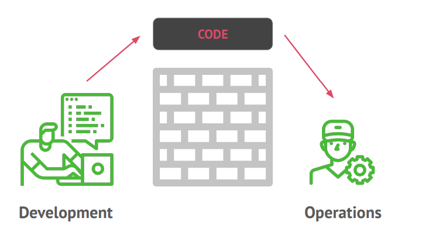

**Появление DevOps:**

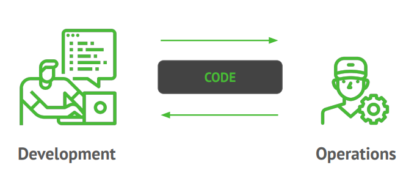

DevOps - не название команды, должности или какой-то определенной технологии. Это набор процессов, идей и методик. 
Каждый понимает под DevOps что-то свое, но для этого раздела:

Цель DevOps: **значительно повысить эффективность доставки ПО.**

### 7.1.2. Инфраструктура как код (IaC)
Идея, стоящая за IaC (infrastructure as code), заключается в том, что для определения, развертывания, обновления 
и удаления инфраструктуры нужно писать и выполнять код.

#### Специализированные скрипты
Самый простой и понятный способ что-либо автоматизировать — написать для этого специальный скрипт.
```shell
#!/bin/bash
# Обновляем кэш apt-get sudo apt-get update
apt-get update
# Устанавливаем PHP и Apache
apt-get install -y php apache2
# Копируем код из репозитория
git clone https://github.com/your_account/php-app.git /var/www/html/app
# Запускаем Apache
service apache2 start
```
#### Средства управления конфигурацией
Chef, Puppet, Ansible и SaltStack являются средствам управления конфигурацией. Это означает, что они предназначены 
для установки и администрирования программного обеспечения на существующих серверах.

Тот же скрипт на Ansible:
```yamlex
- name: Update the apt-get cache
    apt:
        update_cache: yes
- name: Install PHP
    apt:
        name: php
- name: Install Apache
    apt:
        name: apache2
- name: Copy the code from the repository
    git: repo=https://github.com/your_account/php-app.git dest=/var/www/html/app
- name: Start Apache
    service: name=apache2 state=started enabled=yes
```

#### Ansible vs bash скрипт
Преимущества:
* Стандартизированное оформление кода.
* Идемпотентность (свойство объекта или операции при повторном применении операции к объекту давать тот же результат, 
что и при первом).
* Распределенность.

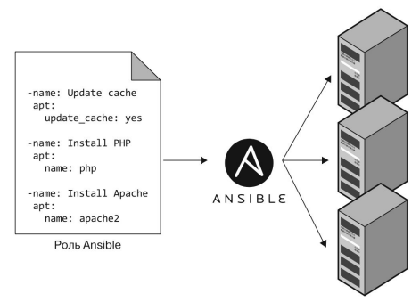

#### Средства шаблонизации серверов
Docker, Packer и Vagrant. Вместо того чтобы вводить кучу серверов и настраивать их, запуская на каждом один и тот же 
код, средства шаблонизации создают образ сервера, содержащий полностью самодостаточный «снимок» операционной системы 
(ОС), программного обеспечения, файлов и любых других важных деталей.

Конфиг packer:
```json
{
  "provisioners": [
    {
      "type": "shell",
      "inline": [
        "apt-get update",
        "apt-get install -y php",
        "apt-get install -y apache2"
      ]
    }
  ]
}
```
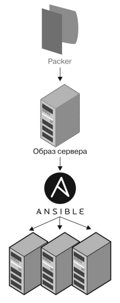

#### Средства для работы с образами
* Виртуальные машины: эмулируют весь компьютер включая аппаратное обеспечение.
  * Для виртуализации оборудования запускается гипервизор.
  * Любой образ ВМ видит только виртуальное оборудование, поэтому он полностью изолирован от физического компьютера 
и других ВМ.
  * Много накладных расходов на виртуализацию.
  * Образы можно описывать при помощи кода, например, используя Packer и Vagrant. 
* **Контейнеры**: эмулируют пользовательское пространства ОС.
  * Для изоляции процессов, памяти, точек монтирования и сети запускается **среда выполнения контейнеров**, такая как
**Docker, CoreOs rkt** или **cri-o**.
  * Каждый контейнер может видеть только собственное пользовательское пространство.
  * Все контейнеры запущенные на одном сервере одновременно пользуются оборудованием основной ОС.
  * Контейнеры запускаются очень быстро.
  * Образы можно описывать при помощи кода, используя **Docker** и **CoreOs rkt**.

#### Неизменяемая инфраструктура
**Шаблонизация серверов** — это ключевой аспект перехода на неизменяемую инфраструктуру. Если сервер уже развернут, 
в него больше не вносятся никакие изменения. Если нужно что-то обновить (например, развернуть новую версию кода), вы 
создаете новый образ из своего шаблона и разворачиваете его на новый сервер.

#### Средства оркестрации
Нужно выбрать какой-то способ выполнения таких действий:
* Развертывать ВМ и контейнеры с целью эффективного использования оборудования.
* Выкатка обновлений.
* Автовосстановление.
* Автомасштабирование.
* Балансировка нагрузки.
* Обнаружение сервисов.

Выполнение этих задач находится в сфере ответственности средств оркестрации, таких как **Kubernetes, Marathon/Mesos, 
Amazon Elastic Container Service (Amazon ECS), Docker Swarm, Nomad** и др.

И это все описывается тоже в виде кода!

#### Средства инициализации ресурсов
Средства инициализации ресурсов, такие как **Terraform**, **CloudFormation** и **OpenStack** **Heat**, отвечают
за создание самих серверов.

Тот же самый сервер при помощи terraform:
```terraform
resource "aws_instance" "app" {
instance_type = "t2.micro"
 availability_zone = "us-east-2a"
ami = "ami-0c55b159cbfafe1f0"
user_data = <<-EOF
#!/bin/bash
sudo service apache2 start
EOF
}
```
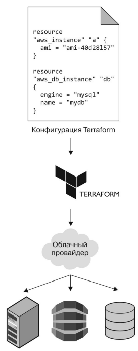

#### Преимущества инфраструктуры в виде кода
* **Самообслуживание:** тайные знания не сосредоточены только в голове админа.
* **Скорость и безопасность:** исключается человеческих фактор при развертывании очередного сервера.
* **Документация:** код IaC сам по себе хорошая документация.
* **Управление версиями:** код хранится в vcs.
* **Проверка:** тесты и код ревью.
* **Повторное использование:** переиспользование готовых модулей.
* **Радость:** больше нет рутинных действий.

### 7.1.3. Выбор инструментов
**Надо выбрать из:**
* Управление конфигурацией или инициализация ресурсов.
* Изменяемая или неизменяемая инфраструктура.
* Процедурный или декларативный язык.
* Наличие или отсутствие центрального сервера.
* Наличие или отсутствие агента.

#### Управление конфигурацией или инициализация ресурсов?
* **Chef**, **Puppet**, **Ansible** и **SaltStack** управляют конфигурацией.
* **CloudFormation**, **Terraform** и **OpenStack Heat** инициализируют ресурсы.

Это не совсем четкое разделение, так как средства управления конфигурацией обычно в какой-то степени поддерживают 
инициализацию ресурсов, а средства инициализации ресурсов занимаются какого-то рода конфигурацией. Поэтому следует
выбирать тот инструмент, который лучше всего подходит для вашего случая.

#### Изменяемая и неизменяемая архитектура?
* **Изменяемая**
  * проблема дрейфа конфигурации,
  * неочевидные расхождения между тестовыми прогонами и продакшеном,
  * например обновление библиотеки OpenSSL приведет к отдельному ее обновлению на каждом отдельном сервере.
* **Неизменяемая**
  * дает уверенность идентичности всех серверов (тоже есть нюансы),
  * обновление OpenSSL – это создание нового образа,
  * но даже минимальное изменение ведет к пересборке образов.

#### Процедурный или декларативный подход?
* **Процедурный**
  * Chef и Ansible
  * код пошагово описывает как достичь желаемого результата
```yamlex
- ec2:
  count: 10
  image: ami-0c55b159cbfafe1f0
  instance_type: t2.micro
```
* **Декларативный**
  * Terraform, CloudFormation, SaltStack, Puppet и Open Stack Heat
  * в коде описывается нужное вам конечное состояние, а средства IaC сами разбираются с тем, как его достичь.
```terraform
resource "aws_instance" "example" {
 count = 10
 ami = "ami-0c55b159cbfafe1f0"
 instance_type = "t2.micro"
}
```
**Основные проблемы процедурного подхода:**
* Процедурный код не полностью охватывает состояние инфраструктуры.
* Процедурный код ограничивает повторное использование.

**Основные особенности декларативного подхода:**
* Отсутствие доступа к полноценному языку программирования.
* Процедурный код ограничивает повторное использование.

#### Наличие или отсутствие центрального сервера
* Chef, Puppet и SaltStack по умолчанию требуют наличия центрального (master) сервера для хранения состояния вашей 
инфраструктуры и распространения обновлений.
* У Ansible, CloudFormation, Heat и Terraform по умолчанию нет центрального сервера. 

(но всегда есть нюансы)

**Преимущества центрального сервера:**
* Это единое централизованное место, где вы можете просматривать и администрировать состояние своей инфраструктуры.
* Некоторые центральные серверы умеют работать непрерывно, в фоновом режиме, обеспечивая соблюдение вашей конфигурации.

**Особенности центрального сервера:**
* **Дополнительная инфраструктура.** Вам нужно развернуть дополнительный сервер или даже кластер дополнительных серверов 
(для высокой доступности и масштабируемости).
* **Обслуживание**. Центральный сервер нуждается в обслуживании, обновлении, резервном копировании, мониторинге 
и масштабировании.
* **Безопасность**. Вам нужно сделать так, чтобы клиент мог общаться с центральным сервером, а последний — со всеми 
остальными серверами Это обычно требует открытия дополнительных портов и настройки дополнительных систем аутентификации,
что увеличивает область потенциальных атак.

#### Наличие или отсутствие агентов
* Chef, Puppet и SaltStack требуют установки своих агентов на каждый сервер, который вы хотите настраивать. Агент обычно
работает в фоне и отвечает за установку последних обновлений конфигурации.
* Ansible, CloudFormation, Heat и Terraform не требуют установки никаких дополнительных агентов.

(но всегда есть нюансы)

**На самом деле не все однозначно**

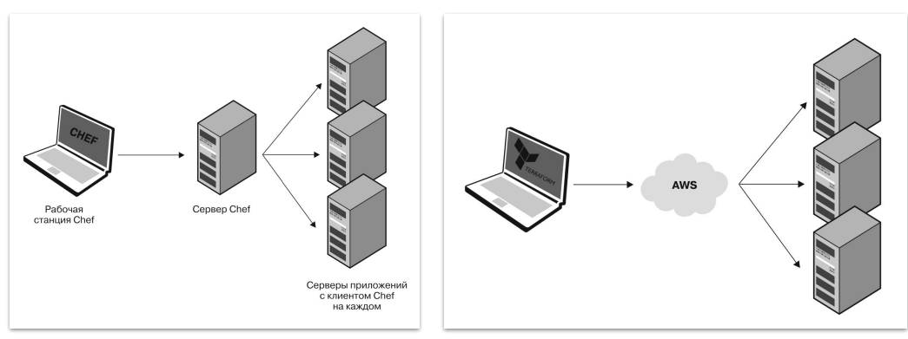

### 7.1.4. Совместное использование инструментов
**Инициация ресурсов + управление конфигурацией**

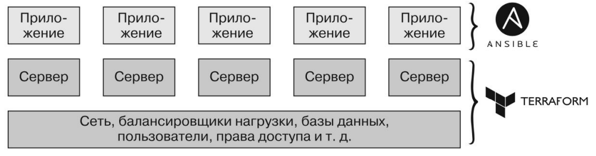

**Инициация ресурсов + шаблонизация серверов**

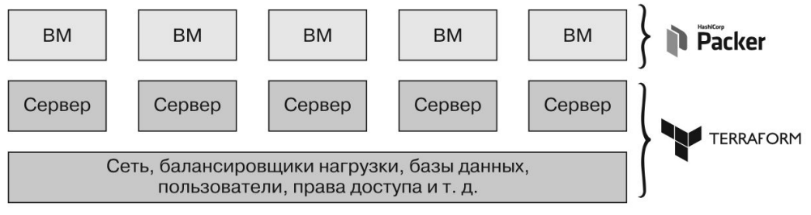

**Инициация ресурсов + шаблонизация + оркестрация**

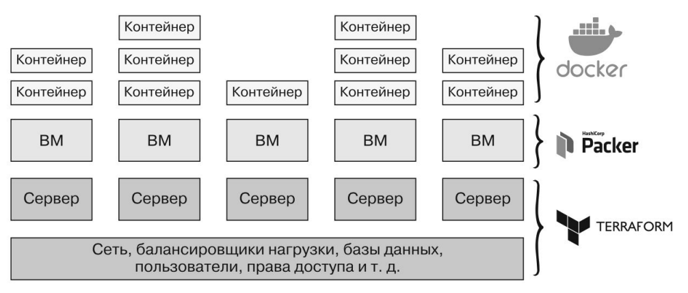

### 7.1.5. Резюме
**При использовании "стандартных" способов применения**

| Инструмент      | Открытый код | Облака | Тип        | Инф-ка   | Язык          | Агент | Вед.сервер | Сообщество |
|-----------------|--------------|--------|------------|----------|---------------|-------|------------|------------|
| Chef            | +            | Все    | Упр.конф.  | Изм-ая   | Процедурный   | +     | +          | Большое    |
| Puppet          | +            | Все    | Упр.конф.  | Изм-ая   | Декларативный | +     | +          | Большое    |
| Ansible         | +            | Все    | Упр.конф.  | Изм-ая   | Процедурный   | -     | -          | Огромное   |
| SaltStack       | +            | Все    | Упр.конф.  | Изм-ая   | Декларативный | +     | +          | Большое    |
| Cloud Formation | -            | AWS    | Иниц. рес. | Неизм-ая | Декларативный | -     | -          | Маленькое  |
| Heat            | +            | Все    | Иниц. рес. | Неизм-ая | Декларативный | -     | -          | Маленькое  |
| Terraform       | +            | Все    | Иниц. рес. | Неизм-ая | Декларативный | -     | -          | Огромное   |

### 7.1.6. Terraform
Терраформ это инструмент с открытым исходным кодом от компании HashiCorp, написанный на языке программирования Go.

Терраформ делает от вашего имени API-вызовы к одному или нескольким провайдерам, таким как AWS, Azure, Google Cloud, 
DigitalOcean, OpenStack и множеству других.

Этот позволяет развернуть инфраструктуру прямо с вашего ноутбука или либо любого другого компьютера, и для всего этого 
не требуется никакой дополнительной инфраструктуры.

#### Установка Terraform
* Скачать с [terraform.io](https://www.terraform.io/)
* Воспользоваться менеджером пакетов (apt, brew, ...)

## 7.2 Облачные провайдеры и синтаксис Терраформ

### 7.2.1. Облачные провайдеры
#### AWS (Amazon Web Service)
* Популярное решение на зарубежном рынке
* Очень большое количество сервисов
* В первый год использования есть бесплатный тариф: <https://aws.amazon.com/free/>

#### Yandex.Cloud
* Популярное решение в русскоязычном сегменте
* Документация на русском языке
* Достаточное количество сервисов

#### Регистрация в AWS
* Кредитная карта нужна только для регистрации
* Пользуемся бесплатным тарифом, который доступен год после регистрации
* Можно зарегистрировать отдельный «учебный» аккаунт на email типа «yourname+netology@gmail.com»

#### Регистрация в Yandex.Cloud
* Есть бесплатный пробный период
* Далее каждому студенту будут выданы промокоды

#### Элементы управления AWS
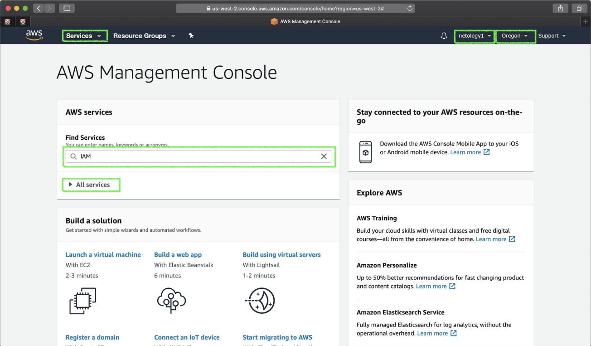

#### Элементы управления Яндекс.Cloud
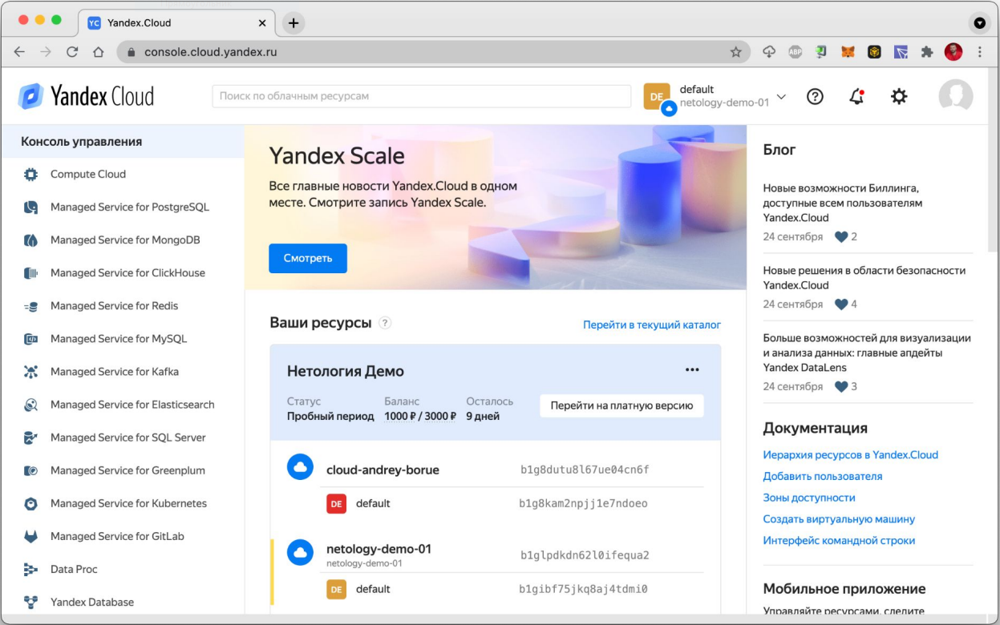

#### Регионы и зоны доступности AWS
AWS охватывает 77 зон доступности в 24 географических регионах по всему миру.

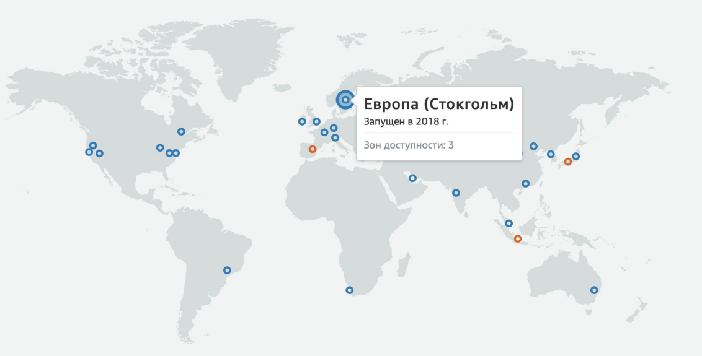

#### Установка cli клиентов
* При помощи менеджера пакетов apt, brew, ...
* AWS: Скачать исходники <https://aws.amazon.com/cli/>
* Yandex: <https://cloud.yandex.ru/docs/cli/quickstart>

#### VPC (Virtual Private Cloud)
Это логически изолированный раздел облака, в котором можно запускать ресурсы в самостоятельно заданной виртуальной сети.
Таким образом можно полностью контролировать среду виртуальной сети, в том числе выбирать собственный диапазон 
IP‑адресов, создавать подсети, а также настраивать таблицы маршрутизации и сетевые шлюзы.

#### Identity and Access Management (IAM)
**IAM** – это место где происходит управление учетными записями пользователей и их правами.
* Создаем отдельного пользователя для дальнейшей работы.
* Нужно получить:
  * Идентификатор ключа доступа: Access Key ID,
  * Секретный ключ доступа: Secret Access Key.

#### Yandex.Cloud IAM для Terraform
Инструкция для получения токена: <https://cloud.yandex.ru/docs/iam/operations/iam-token/create>
[Аутентификация с помощью Google Workspace Yandex.Cloud](https://cloud.yandex.ru/docs/organization/operations/federations/integration-gworkspace)

#### Политика (policy) IAM
**Политика IAM** – это документ в формате JSON, который определяет, что пользователю позволено, а что — нет.

Назначим нашему пользователю:
* AmazonEC2FullAccess
* AmazonS3FullAccess
* AmazonDynamoDBFullAccess
* AmazonRDSFullAccess
* CloudWatchFullAccess
* IAMFullAccess

#### Регистрируем этого пользователя локально. 
Чтобы консольный клиент AWS и Terraform получили доступ к нашему аккаунту создаем переменные окружения:
```shell
$ export AWS_ACCESS_KEY_ID=(your access key id)
$ export AWS_SECRET_ACCESS_KEY=(your secret access key)
```

### 7.2.2. Amazon Elastic Compute Cloud (Amazon EC2)
Это веб‑сервис, предоставляющий безопасные масштабируемые вычислительные ресурсы в облаке.

Позволяет выбрать:
* тип и количество ядер процессора,
* объем оперативной памяти,
* хранилища,
* акселераторы,
* и другое.

#### Создание EC2 через веб интерфейс
<https://us-west-2.console.aws.amazon.com/ec2/v2/home>

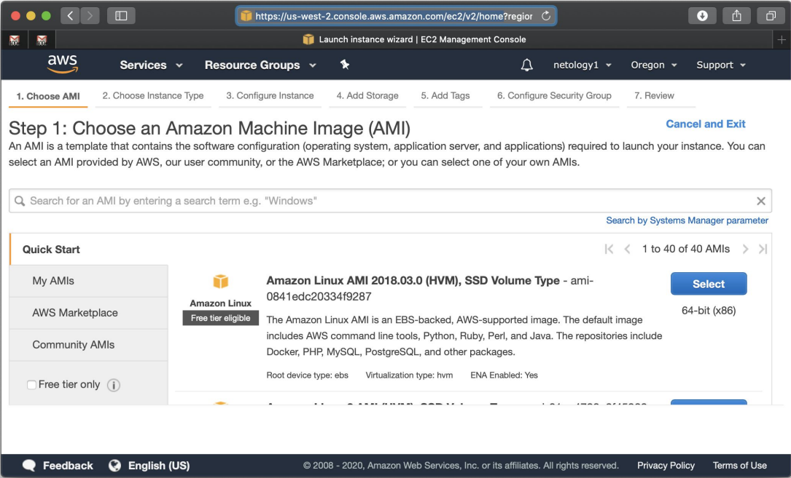

#### Создание EC2 через консоль
<https://awscli.amazonaws.com/v2/documentation/api/latest/reference/opsworks/create-instance.html>

```shell
aws ec2 create-instance
[--source-dest-check | --no-source-dest-check]
[--attribute <value>] [--block-device-mappings <value>]
[--disable-api-termination | --no-disable-api-termination]
[--dry-run | --no-dry-run] [--ebs-optimized | --no-ebs-optimized]
[--ena-support | --no-ena-support] [--groups <value>]
--instance-id <value> [--instance-initiated-shutdown-behavior <value>]
[--instance-type <value>] [--kernel <value>]
[--ramdisk <value>] [--sriov-net-support <value>] [--user-data <value>]
[--value <value>] [--cli-input-json | --cli-input-yaml]
[--generate-cli-skeleton <value>] [--cli-auto-prompt <value>]
```

#### Основные параметры EC2
Что нужно знать для создания инстанса:
* тип (процессор, память),
* идентификатор виртуального приватного облака,
* способ автоскейлинга,
* операционная система,
* идентификатор образа (ami),
* ключ доступа по ssh,
* зона доступности,
* идентификатор подсети,
* тип подключенных хранилищ,
* … и еще десяток параметров.

#### Изменение инстанса:
* Иногда необходимо предварительно остановить инстанс.
* Иногда пересоздать.
* Хорошо бы понять что конкретно будет изменено.
* Часто надо привести инстанс в исходное состояние после ручных правок.

#### Как это сделать?
* Зайти в веб интерфейс и проверять все параметры?
* Через консоль выполнить:
  * describe,
  * сравнить с целевыми (исходными) значениями,
  * modify.
* Хорошо бы понять что конкретно будет изменено (типа git diff).
* Часто надо привести инстанс в исходное состояние после ручных правок.

Другими словами надо воспользоваться командами
* aws ec2 create-key-pair
* aws ec2 create-instance
* aws ec2 create-tags
* aws ec2 create-volume
* aws ec2 describe-key-pair
* aws ec2 describe-instances
* aws ec2 describe-tags
* aws ec2 describe-volume
* ....

### 7.2.3. Синтаксис Terraform
**Терраформ** - это просто API-клиент. Терраформ-провайдер знает все эти команды и умеет приводить состояние ресурсов 
к указанному в своих конфигурационных файлах. Они могут работать с любым клиентом: cli, http, их комбинациями и другими.

#### Терраформ провайдеры
<https://www.terraform.io/docs/providers/index.html>

В официальном репозитории около 150 штук. Плюс много неофициальных и можно достаточно просто создавать собственные.

#### Блоки
Все конфигурации описываются в виде блоков.
```terraform
resource "aws_vpc" "main" {
  cidr_block = var.base_cidr_block
}
тип "идентификатор" "имя" {
  название_параметра = выражение_значение_параметра
}
```

#### Блок провайдеров
<https://registry.terraform.io/providers/hashicorp/aws/latest/docs>
```terraform
provider "aws" {
  region = "us-east-1"
}
```

#### Блок требований к провайдерам
Блок "terraform" для указаний версий провайдеров и бэкэндов. 
```terraform
terraform {
  required_providers {
    aws = {
      source = "hashicorp/aws"
      version = "~> 3.0"
    }
  }
}
```

#### Блок ресурсов
<https://registry.terraform.io/providers/hashicorp/aws/latest/docs/resources/instance>

Ресурс **aws_instance** – это экземпляр ec2 
```terraform
resource "aws_instance" "web" {
  ami = data.aws_ami.ubuntu.id
  instance_type = "t3.micro"
}
```

#### Блок внешних данных
Для того что бы прочитать данные из внешнего API и использовать для создания других ресурсов.

<https://registry.terraform.io/providers/hashicorp/aws/latest/docs/data-sources/caller_identity>
```terraform
data "aws_caller_identity" "current" {}

// data.aws_caller_identity.current.account_id
// data.aws_caller_identity.current.arn
// data.aws_caller_identity.current.user_id
```

#### Блок переменных
Каждый модуль может зависеть от переменных. 
```terraform
variable "image_id" {
  type = string
}
resource "aws_instance" "example" {
  instance_type = "t2.micro"
  ami = var.image_id
}
```
Структура переменной может быть достаточно сложной.
```terraform
variable "availability_zone_names" {
  type = list(string)
  default = ["us-west-1a"]
}
variable "docker_ports" {
  type = list(object({
    internal = number
    external = number
    protocol = string
  }))
  default = [
    {
    internal = 8300
    external = 8300
    protocol = "tcp"
    }
  ]
}
```

#### Типы переменных
Примитивные типы:
* `string` - строка
* `number` - число
* `bool` - логическое

Комбинированные типы:
* `list(<TYPE>)` - список
* `set(<TYPE>)`
* `map(<TYPE>)`
* `object({<ATTR NAME> = <TYPE>, ... })` - объект (набор параметров "ключ - значение")
* `tuple([<TYPE>, ...])`

#### Валидация переменных
Особенно важно для повторно используемых модулей. 
```terraform
variable "image_id" {
  type = string
  description = "The id of the machine image (AMI) to use for the server."
  validation {
    condition = length(var.image_id) > 4 && substr(var.image_id, 0, 4) == "ami-" #Длина переменной должна быть больше 4 и начинатся с "ami-"
    error_message = "The image_id value must be a valid AMI id, starting with \"ami-\"."
  }
}
```

#### Блок output
Для того чтобы разные модули могли использовать результат работы друг друга.
```terraform
output "instance_ip_addr" {
  value = aws_instance.server.private_ip
  description = "The private IP address of the main server instance."
  depends_on = [
  # Security group rule должна быть создана перед тем как можно будет использовать этот ip адрес, иначе сервис будет недоступен
  aws_security_group_rule.local_access,
  ]
}
```

#### Локальные переменные
Могут быть использованы внутри модуля сколько угодно раз. 
```terraform
locals {
  service_name = "forum"
  owner = "Community Team"
}
locals {
  instance_ids = concat(
    aws_instance.blue.*.id, aws_instance.green.*.id
  )
  common_tags = {
    Service = local.service_name
    Owner = local.owner
  }
}
```

#### Комментарии
Терраформ поддерживает несколько видов комментариев:
* `#` начинает однострочные комментарии.
* `//` также однострочные комментарии.
* `/*` и `*/` для обозначения многострочных комментариев.

### 7.2.4. Структура проекта
#### Структура каталогов
* /main.tf - главный файл проекта
* /any_file.tf - любые дополнительные файлы, в последствии выполнения объединяются в один.
* /modules/ - дополнительные модули
* /modules/awesome_module/
* /modules/awesome_module/main.tf
* /modules/awesome_module/any_other_file.tf
* /modules/next_module/
* /modules/next_module/main.tf
* /modules/next_module/any_other_file.tf

Модули которые используются в разных проектах рекомендуется хранить в отдельном репозитории, и подключать с помощью
submodule

#### Структура файлов
* main.tf
* variables.tf
* outputs.tf
* any_other_files.tf

## 7.2a Использование Yandex Cloud
### 7.2a.1. Что такое Yandex.Cloud?
**Yandex.Cloud** - облачная платформа от Яндекса, позволяющая поднять нужное количество ресурсов и настроить их 
по своему усмотрению

Иными словами, **Yandex.Cloud** позволяет:
* Создавать шаблонные ресурсы (для БД, registry, DNS и т.д.)
* Создавать простые VM для последующей гибкой настройки на ваше усмотрение
* Создавать инфраструктуру "на лету"
* Платить только за используемое время

Официальная страница [Yandex.Cloud](https://cloud.yandex.ru/)

### 7.2a.2. Способы создания VM
**VM** можно создавать при помощи:
* [web-интерфейс](https://console.cloud.yandex.ru/)
* [yandex cli](https://cloud.yandex.ru/docs/cli/quickstart)
* [terraform](https://cloud.yandex.ru/docs/solutions/infrastructure-management/terraform-quickstart)
* [ansible](https://github.com/arenadata/ansible-module-yandex-cloud)

Во всех случаях, кроме использования **ansible-plugin**, для управления хостами через **ansible** необходимо описать их
в **inventory**

### 7.2a.3. Статический Inventory
Вид **inventory**, который мы чаще всего видим, по сути - файл (yaml или ini) в котором перечислены hosts, groups 
и дополнительные параметры.
```yamlex
---
prod: # Группа серверов
  children:
    nginx:
      hosts:
        prod-ff-74669-02:
          ansible_host: 255.245.12.32
          ansible_user: prod
  children:
    application:
      hosts:
        174.96.45.23:
test:
  children:
    nginx:
      hosts:
        localhost:
          ansible_connection: local
```

#### Cтруктура директории с Playbook
Основная для общего использования переменных:
```
group_vars/  
group_vars/all/  
group_vars/all/some_variable.yml  
group_vars/<group_name>/  
inventory/  
inventory/prod.yml  
inventory/test.yml  
roles/  
roles/<role_fodlers>/  
site.yml  
requirement.yml  
```
Альтернативная для индивидуальных переменных для каждого хоста:
```
inventory/
inventory/prod/
inventory/prod/group_vars/
inventory/prod/group_vars/all/
inventory/prod/group_vars/all/some_variable.yml
inventory/prod/group_vars/<group_name>/
inventory/prod/hosts.yml
roles/
roles/<role_fodlers>/
site.yml
requirement.yml
```

### 7.2a.4. Динамический Inventory
Так как **ansible**, в момент исполнения содержит все данные в **json** формате, а **inventory** для него это всегда
перечисление **hosts** в **groups** с их возможными параметрами:
* Для построения динамического **inventory** должен существовать некий 
[скрипт](https://github.com/st8f/community.general/blob/yc_compute/plugins/inventory/yc_compute.py), который сможет 
передавать json на выход с описанием **hosts** в облаке
* Если существует модуль для создания **hosts** в облаке - он должен уметь собирать динамическое **inventory** 
в процессе создания **hosts**

### 7.2a.5. Использование Ansible
#### Модули для создания инстансов
**Ansible** имеет набор модулей для создания инстансов:
* **AWS**
* **OpenStack**
* **k8s**
* **docker**
* **podman**
* **Google Cloud**
* **Microsoft Azure**
* **Vultr**

Полный перечень модулей можно посмотреть на 
[официальной странице](https://docs.ansible.com/ansible/2.9/modules/list_of_cloud_modules.html)

### Модули для управления inventory
**Ansible** имеет набор модулей для создания inventory:
* **AWS**
* **OpenStack**
* **k8s**
* **docker**
* **Google Cloud**
* **Microsoft Azure**
* **Vultr**

Полный перечень модулей можно посмотреть 
на [официальной странице](https://docs.ansible.com/ansible/latest/collections/index_inventory.html)

#### Как написать Playbook?
Изначально, нужно ответить на два вопроса:
* Для чего нам нужен **playbook**?
* На какие подзадачи можно разделить цель?

Далее, нужно работать над содержанием **playbook**:
* Приготовить структуру директорий
* Приготовить стартовые файлы
* Организовать **inventory** для тестовых прогонов
* Описать структуру **plays** и **tasks** внутри
* При необходимости - параметризировать все tasks при помощи **vars**

#### Схема будущего решения
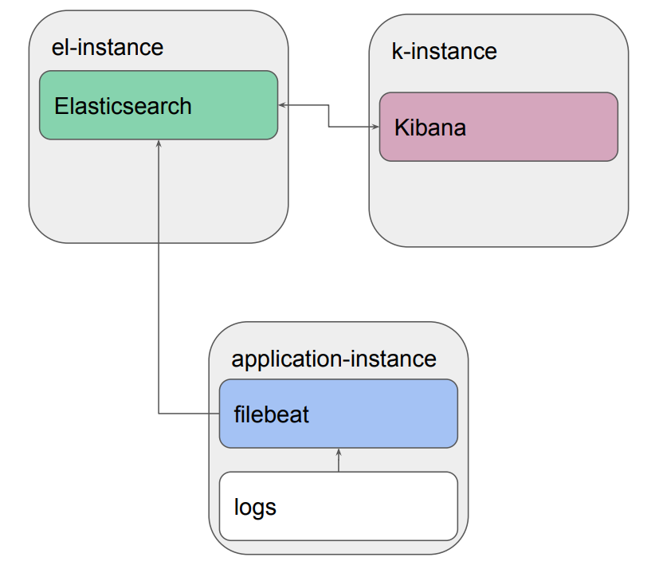

#### Схема целевого решения
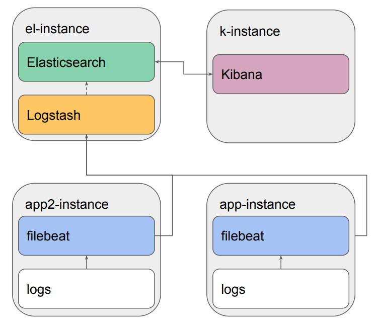

#### Как запустить Playbook?
* Первый запуск стоит осуществлять или на тестовом окружении или с флагом:  
`ansible-playbook -i inventory/<inv_file>.yml <playbook_name>.yml --check`
* Если были найдены ошибки:  
`ansible-playbook -i inventory/<inv_file>.yml <playbook_name>.yml --start-at-task <task_name>`
* Для запуска исполнения в полуинтерактивном виде:  
`ansible-playbook -i inventory/<inv_file>.yml <playbook_name>.yml --step`
* Полноценный запуск **playbook** в целевом виде должен выглядеть:  
`ansible-playbook -i inventory/<inv_file>.yml <playbook_name>.yml`

