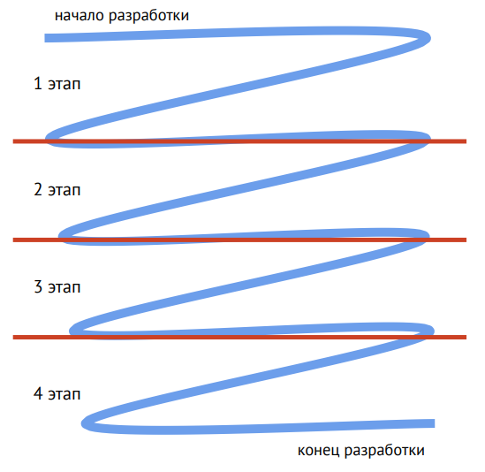
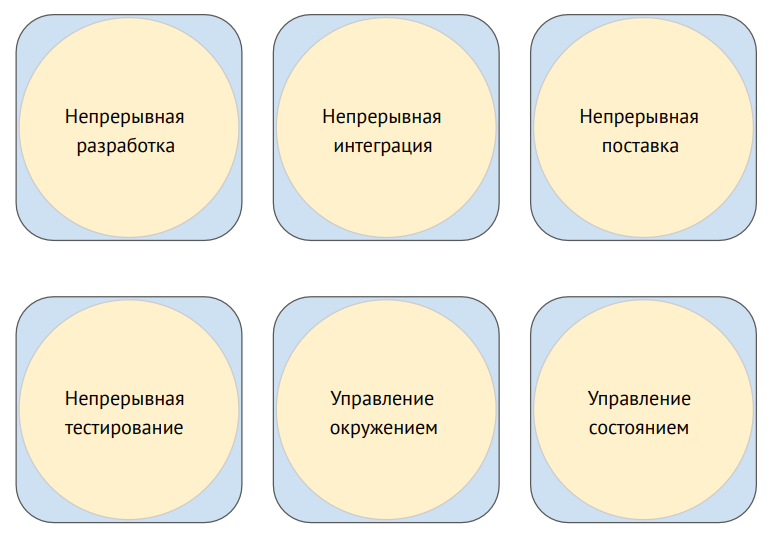
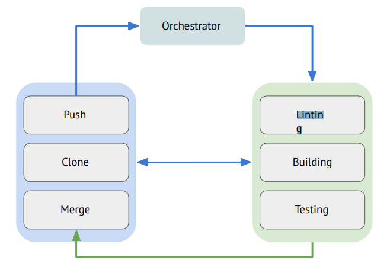
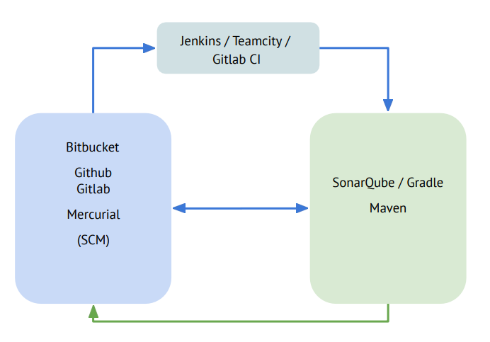
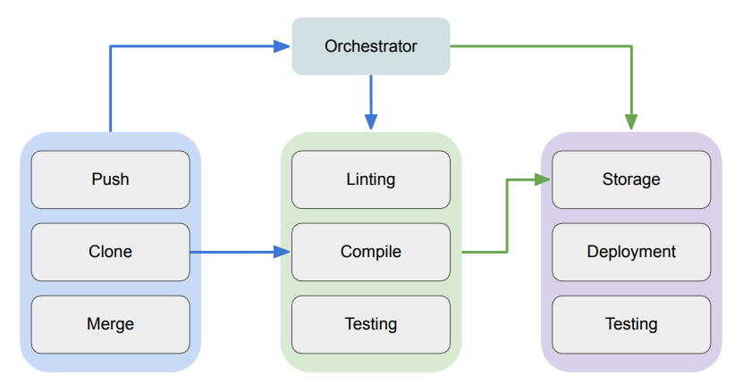
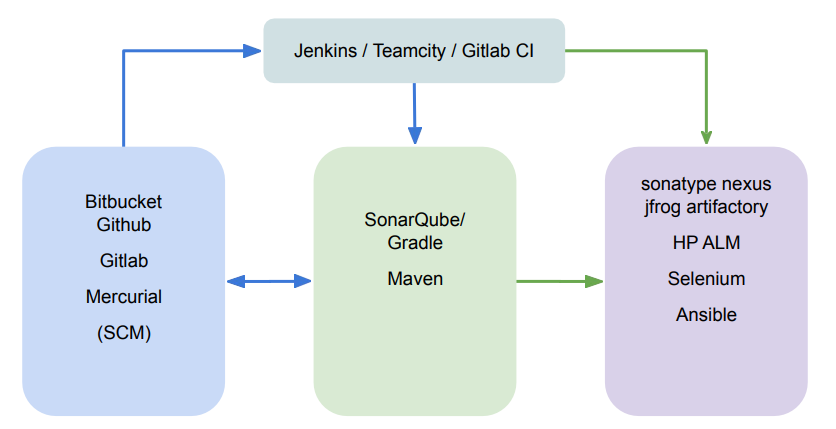
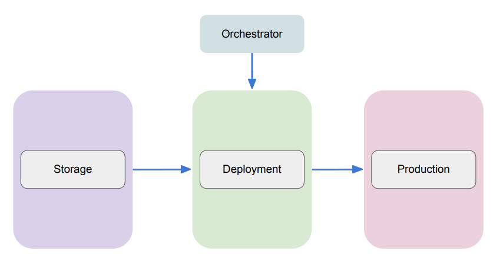
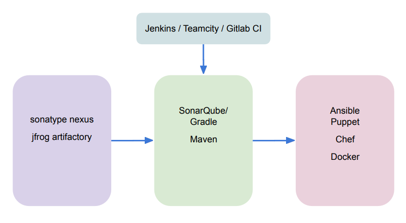
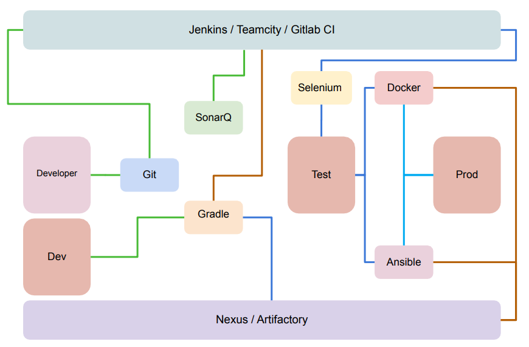

# 9. Непрерывная разработка и интеграция
## 9.1 Жизненный цикл ПО
### 9.1.1. Что такое жизненный цикл ПО?
**Жизненный цикл ПО** - ряд событий (этапов), происходящих с системой от ее создания до дальнейшего использования
и изъятия из эксплуатации.

Для чего нужно знать жизненный цикл ПО?
* Для понимания общей картины развития продукта
* Для определения стратегических и тактических целей команды
* Для лучшего управления продуктом
* Для обеспечения согласования требований заказчика

**Жизненный цикл ПО** состоит из следующих этапов:
* Разработка
* Тестирование
* Внедрение
* Сопровождение

**Разработка** состоит из следующих этапов:
* Составление требований
* Проектирование
* Дизайн
* Разработка

**Тестирование** состоит из следующих этапов:
* Функциональное тестирование
* Интеграционное тестирование - тестирование совместной работы с другими системами
* Нагрузочное тестирование
* Показ

**Внедрение** состоит из следующих этапов:
* Выделение инфраструктуры (по факту должно выделятся еще до тестирования)
* Настройка рабочего окружения (аналогично выделению, должно проходить совместно с разработкой)
* Внедрение продукта
* Тестирование работоспособности

**Сопровождение** состоит из следующих этапов:
* Мониторинг работоспособности приложения
* Работа с инцидентами
* Вывод из эксплуатации

**Жизненный цикл ПО** состоит из следующих этапов:

| Разработка             | Тестирование                | Внедрение                      | Сопровождение                |
|------------------------|-----------------------------|--------------------------------|------------------------------|
| Составление требований | Функциональное тестирование | Выделение инфраструктуры       | Мониторинг работоспособности |
| Проектирование         | Интеграционное тестирование | Настройка рабочего окружения   | Работа с инцидентами         |
| Дизайн                 | Нагрузочное тестирование    | Внедрение продукта             | Вывод из эксплуатации        |
| Разработка             | Показ                       | Тестирование работоспособности |                              | 

### 9.1.2. Waterfall
**Waterfall** - последовательная методология разработки и тестирования ПО. Концепция заключается в последовательном
выполнении всех шагов для получения конечного продукта.

К плюсам можно отнести:
* Стабильность и предсказуемость результата
* Простота отслеживания текущего состояния разработки
* Полноценная документация

Минусы:
* Медленная разработка
* Выявление ошибок разработки на поздних этапах

**Спиральная модель** - последовательная методология разработки и тестирования ПО. Концепция заключается в 
последовательном выполнении шагов, которые разделены на несколько этапов. К плюсам добавляется возможность отслеживать
промежуточный результат разработки в момент завершения очередного витка итерации.

**Инкрементная модель** - последовательная методология разработки и тестирования ПО. Основная концепция waterfall 
дополняется версионированием. Иными словами, у вас появляется возможность создавать релизы (минорные и мажорные) и патчи
на баги.

### 9.1.3. Agile и Lean
#### Agile
**Agile** - набор из 12 принципов гибкой разработки ПО
* Приоритет команды в удовлетворении заказчика
* Приветствуется постоянное изменение требований
* Рабочий продукт следует выпускать как можно чаще
* На протяжении всего проекта команда должна работать вместе
* Над проектом должны работать мотивированные профессионалы
* Непосредственное общение
* Работающий продукт - показатель прогресса
* Вся команда должна иметь возможность поддерживать постоянный рабочий ритм
* Постоянное внимание к совершенству и качеству повышает гибкость
* Простота необходима
* Самые лучшие требования рождаются у самоорганизующихся команд
* Команда должна систематически анализировать возможности улучшения эффективности работы и корректировать свой стиль

На "бумаге" **Agile** выглядит как решение всех проблем:
* Гибкость жизненного цикла ПО
* Лёгкость в принятии изменений
* Уменьшение бюрократического процесса в разработке
* Быстрота доставки новых версий ПО
* Улучшение качества кода без потерь в наращивании функционала

В жизни с **Agile** часто возникают проблемы:
* Документация не успевает за кодовой базой проекта
* Повышается сложность сопровождения продукта
* Количество задач на разработку постоянно растёт
* Большинство разработчиков занимаются просмотром PR
* В маленьких командах на разработчиков ставят задачи тестирования
* Времени на создание окружения автотестирования не хватает
* В рамках agile у продукта гибкость требований влечёт за собой гибкость окружения

#### Lean
Исторически, **бережливое производство** пришло из промышленности. Первая компания - **toyota**.

Постулаты:
* Устранение отходов
* Расширение прав и возможностей работников
* Уменьшение запасов
* Повышение производительности

Фактически, они стремились заключать контракты и собирать ровно столько машин, сколько у них заказали, не создавая 
сверх меры.

**Lean** - принцип разработки, основанный на бережливом производстве, смысл которой в устранении помех производству.

Устранение происходит в два этапа:
* **Анализ**. Проводится анализ всех процессов в алгоритме работы команды, определяются уязвимости, траты ресурсов 
и времени, "бутылочные горлышки".
* **Внесение изменений**. Предлагается альтернатива процессам алгоритма. Альтернатива необязательно должна быть 
инновационной, он должна просто улучшить конечный результат. Все альтернативы считаются возможными и исследуются 
на практике. На основе практического подхода выбирается какая из альтернатив лучшая и используются в постоянном 
алгоритме разработки.

Муда, мура, мури - три концепции управления "отходами" разработки.

**Муда** - отходы, иными словами, последствия ошибок. Примеры:

* Бесполезные данные, которые отправляются из приложения в БД
* Несоответствие ТЗ
* Безразличие к рабочему процессу
* Непрошенная самодеятельность в готовом проекте
* Накопленные запросы без движения

**Мура** - причины появления муда (мусора). Например, неравномерная по времени нагрузка на команду.

**Мури** - необоснованные сложности в работе (нецелесообразность). Примеры:
* Разработчик занимается тестированием
* У команды нет необходимых инструментов для разработки
* Плохо поставленные задачи в ТЗ
* Для выполнения задачи требуется сделать множество звонков и согласований

Основной смысл **Lean** - убрать все три категории, при этом нужно бороться с причиной, а не следствием.

Основные принципы **Lean**:
* Ликвидировать мусор
* Создавать только то, что нужно
* Все задачи должны исходить из желаний потребителя
* Сделать правильно с первого раза
* Расширять возможности команды
* Создать культуру постоянного совершенствования

**Кайдзен** - (**кай** - изменения, **дзен** - хорошо) метод, позволяющий команде непрерывно предлагать и тестировать 
идеи по улучшению своей работы, работы всей команды и программного продукта.

**Пять** характеристик кайдзен:
* Равноправное **взаимодействие** всех участников команд и прямая **коммуникация** между ними
* Индивидуальная **дисциплина**
* Здоровое **моральное состояние** всей команды и каждого участника
* Кружки **качества**
* **Предложения** по улучшению всего в рамках работы

### 9.1.4. Гибкие методологии
#### Глоссарий
* **Product Manager** - тот, кто владеет продуктом
* **Project Manager** - тот, кто управляет кастомизацией продукта для одного клиента
* **Team Lead** - программист, занимающийся управлением командой
* **QA** - тестировщик
* **Front** - разработчик интерфейсов
* **Back** - разработчик "подкапотного" кода продукта
* **Ops** - сопровождение продукта
* **Delivery** - тот, кто отвечает за доставку продукта до клиентов
* **Bug** - найденное отклонение от ожидаемого поведения продукта
* **Task** - задача на изменение продукта
* **Feature** - задача на разработку нового функционала продукта
* **Epic** - верхнеуровневое описание какой-то общей цели
* **Stories** - описание результата, который хочется достичь
* **Workflow** - движение задач разных видов по статусам
* **Backlog** - общий пул задач

### 9.1.5. Kanban
**Kanban** - один из способов управления потоком работы. Концептуально, он разделяет все задачи по столбцам статусов, в
рамках которых команда понимает какие задачи сейчас:
* находятся в разработке
* нужно выполнить в ближайшее время
* уже сделаны
* невозможно выполнить

При использовании **Kanban** могут возникнуть трудности:
* Неявный переход между статусами
* Неуправляемый поток задач
* Централизованное управление
* Неясный план
* Пренебрежение качеством

### 9.1.6. Scrum
**Scrum** - ещё один способ управления рабочим процессом команды. В рамках данной идеологии, все задачи выполняются 
в рамках **sprint**.

**Sprint** - промежуток времени, за который команда гарантирует выполнение определённого набора задач. Обычно, 
**sprint** завершается создание релиза продукта.
* Задачи для **sprint** выбирает команда на планировании
* Задачи выбираются исходя из **сложности**
* Сложность вычисляется **опытным** путём
* Первое завершение **sprint** у новой команды обычно не соответствует ожиданиям

При использовании **scrum** тоже могут возникнуть трудности:
* Происходит накопление задач в **backlog**
* Задачи переносится из одного **sprint** в следующий и не выполняются
* График **выгорания** задач стремится к нулю

### 9.1.7. DevOps
**DevOps** - идеологически был выведен из принципов **agile**. Не имеет точного определения и до сих пор 
интерпретируется индивидуально.
* Часто DevOps считают системным администрированием
* Не реже DevOps называют процессом непрерывной поставки
* Кто-то считает, что DevOps - это поддержка разработки ПО

И каждое из этих мнений является равнозначно истинным. В целом, **DevOps** можно назвать мультиинструментом 
для обеспечения работоспособности конвейера жизненного цикла ПО, включая в себя не только сопровождение сборки, 
тестирования, поставки продукта, но и управление командой в части использования всех этих процессов.

Резюме:
Если **Agile (Scrum, Kanban)**, в большей степени, применяет изменчивость и непрерывность для стадии разработки, 
то **DevOps** - расширяет эти практики на тестирование и сопровождение и добавляет технологический бэкграунд.

### 9.1.8. SRE
**SRE (Site Reliability Engineering)** - производная от концепции DevOps в исполнении Google.

**Концепция:**
Взять на роль администраторов (OPS) разработчиков (DEV) или бывших администраторов с большим опытом в разработке.
**Цель:**
Создать команду OPS, которая будет склонна к автоматизации рутины и нацелена на развитие продукта без ущерба надёжности.
**Задача:**
сократить MTTR, улучшить исполнение SLA и получить свободный error budget

#### SRE глоссарий 
* SLA (Service Level Agreement) - общее соглашение о доступности сервиса, штрафах за ошибки, метрики и прочее
* SLI (Service Level Indicator) - метрика доступности сервиса
* SLO (Serivce Level Objective) - сочетание метрики, её значения и периода
* MTTR (Mean Time To Recovery) - среднее время на восстановление
* MTBF (Mean Time Between Failures) - среднее время между сбоями
* Error budget - статья в бюджете, запланированная на расходы по восстановлению сервиса

* В **SLO** часто запланирована доступность:
  * 90% - 36 дней и 12 часов
  * 99% - 3 дня, 15 часов и 36 минут
  * 99,9% - 8 часов 45 минут и 36 секунд
  * 99,99% - 52 минуты и 33 секунды
  * 99,999% - 5 минут и 15 секунд
  * 99,9999% - 31 секунда
* Задача **SRE** правильно обработать ошибки, приводящие к недоступности (ошибки это нормально)
* Чтобы увеличить **MTBF** - нужно следить за тем, что делает команда в новом релизе и не допускать внедрение кода 
с большим количеством ошибок
* Чтобы увеличить **MTTR** - нужно работать над **SLO**, а значит уменьшить время реакции до исправления недоступности
(внедрение автоматизаций)
* Каждая недоступность должна быть проанализирована, выявлены недостатки системы и предприняты меры по их устранению -
**PostMortem**
* Нужно искать не виновных, а недостатки системы
* Автоматизация рутин может стоить дороже, чем исполнение рутины руками, так как в долгосрочной перспективе 
это компенсируется уменьшением затрат в **Error Budget**
* **Chaos engineering** - использование инструментов, которые подключаются к вашему рабочему процессу и в случайном 
порядке отключает функциональные блоки в промышленной системе
* Использование **chaos engineering** - важная составляющая работы **SRE** (Chaos Monkey, Chaos Gorilla)

Резюме:
**SRE** предписывает смотреть на сопровождение с точки зрения разработчика и **наоборот**. Смысл использования 
в уменьшении трат времени на **рутинную работу** в пользу использования этого времени на проведение экспериментов.

### 9.1.9. Итоги
* **Жизненный цикл ПО** - перечисление этапов проектирования, разработки, тестирования, сопровождения ПО до процесса 
вывода из эксплуатации
* Существует несколько принципов разработки ПО: **Watefall, Agile, Lean**
* На основе принципов **Agile** и **Lean** созданы методы ведения разработки и сопровождения:
  * **Kanban**
  * **Scrum**
  * **DevOps**
  * **SRE**
* Эффективное использование гибких методов достигается путём **комбинирования** всех из них в индивидуальном порядке 
для каждой команды.

## 9.2 CI\CD
### 9.2.1. Continuous Integration
**CI (Continuous Integration, непрерывная интеграция)** - этап непрерывной поставки продукта, который отвечает за 
непрерывную **сборку** кода разработчиков.

Условно, его можно разделить на следующие подэтапы:
* **Build** - сборка
* **Test** - тестирование
* **Merge** - слияние

### 9.2.2. Test
**SonarQube** - отдельный сервис для статического анализа кода (линтер).

Особенностью является возможность анализа **разных** языков программирования.
* Существует CE (с урезанным функционалом)
* Есть возможность купить лицензию с поддержкой

### 9.2.3. Build
**Сборщики** - программы, которые позволяют:
* собрать все зависимости, необходимые для компиляции кода
* произвести сборку кода
* запустить unit-тесты
* сделать тестовый запуск продукта

Примеры сборщиков:
* Gradle
* Maven

### 9.2.4. Merge
**Merge** - процесс объединения текущей ветки разработчика с основной (или релизной) веткой в репозитории.

### 9.2.5. Continuous Delivery
**CD (Continuous Delivery, непрерывная доставка)** - этап непрерывной поставки продукта, который отвечает 
за **компиляцию** дистрибутива продукта, **установку** продукта на тестовые среды и проведение **тестирования**.

Его тоже можно поделить на подэтапы:
* **Compile** - компиляция
* **Release** - релиз
* **Deploy** - установка
* **Test** - тестирование

### 9.2.6. Release
**Nexus** - один из способов хранить артефакты (релизы, зависимости, библиотеки etc) и использовать их в процессах 
**DevOps**.

При его помощи можно:
* Хранить и версионировать артефакты
* Разделять разные виды артефактов по разным типам репозиториев
* Доставлять артефакты по всей инфраструктуре
* Использовать разные механизмы разрешения зависимостей

### 9.2.7. Test
**Selenium** - инструмент для проведения **E2E-тестирования** работоспособности web-продуктов.

При его помощи можно:
* Проводить тестирования интерфейсов
* Указывать ожидаемый результат обработки нажатий и сравнивать с полученным результатом
* Записывать ролики прохождения тестирования

### 9.2.8. Continuous Deploy
**CD (Continuous Deployment, непрерывная установка)** - этап непрерывной поставки продукта, который отвечает 
за **установку** дистрибутива продукта на продакшн окружение.

Иногда он **не** является этапом CI\CD, поэтому его появление опционально, но для полноценного конвейера и выполнения
условий непрерывного цикла - он необходим.

### 9.2.9. Deploy to Prod
Установкой может считаться:
* Прогон плейбуков **Ansible**
* Запуск **Docker-контейнера** с образом

Важно понимать, что администратор промышленной части может и будет проводить ручную проверку установленной версии 
продукта.

### 9.2.10. Feedback
**Feedback** - сбор обратной связи от клиентов (в том числе и внутренних) о продукте в виде багов и новых story.

Важно помнить:
* ошибки являются нормой
* даже на проде
* ошибки являются ценностью
* их необходимо правильно обработать
* их необходимо правильно проанализировать
* они требуют исправлений не меньше, чем внедрение новых фич

### 9.2.11. Итоги

* **CI\CD-процессы** отвечают за непрерывность конвейера производства программного продукта
* На каждом из этапов в разных командах могут использовать **разный** набор инструментов
* Набор наших задач, как специалистов может быть **разнообразный**:
  * Поддержка инструментов **DevOps**
  * Поддержка взаимодействия (**автоматизация** конвейера)
  * Поддержка отдельных этапов (**CI, CDL, CDP**)
  * Внедрение и поддержка процессов **DevOps**
  * **Все** вышеперечисленные **задачи** сразу

 