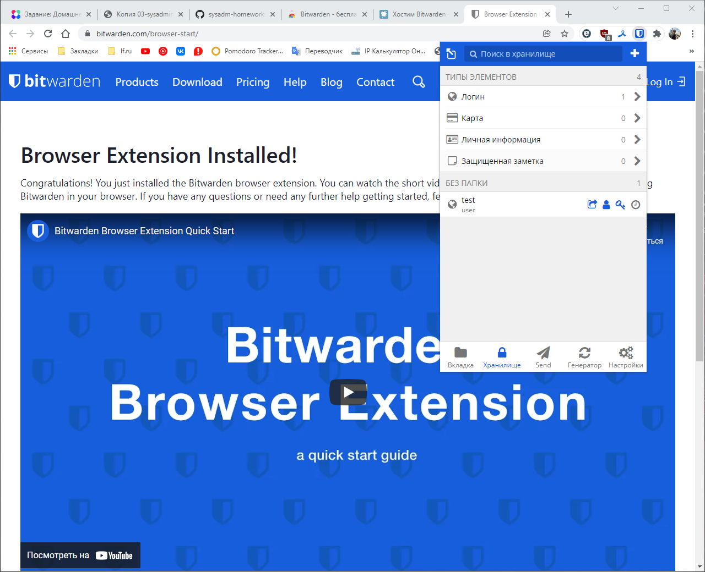
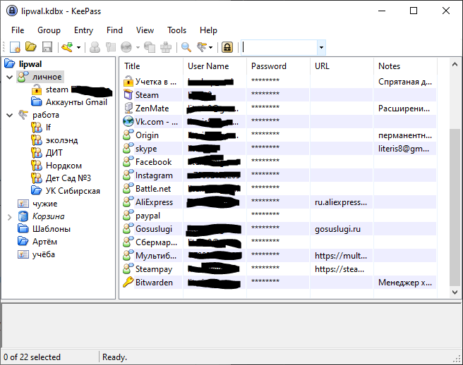
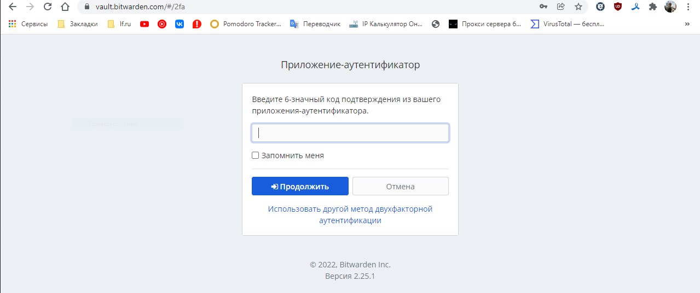
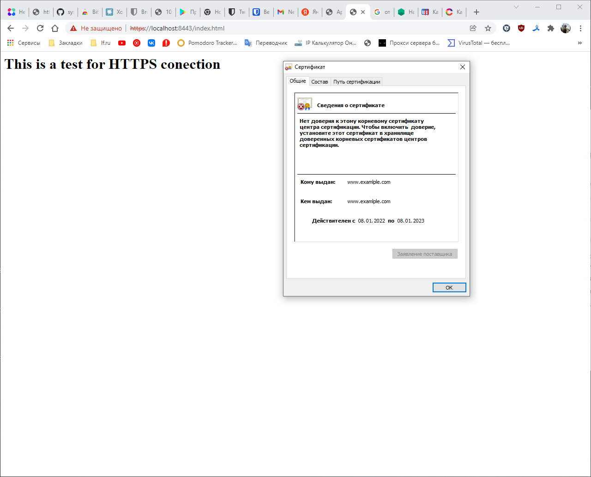
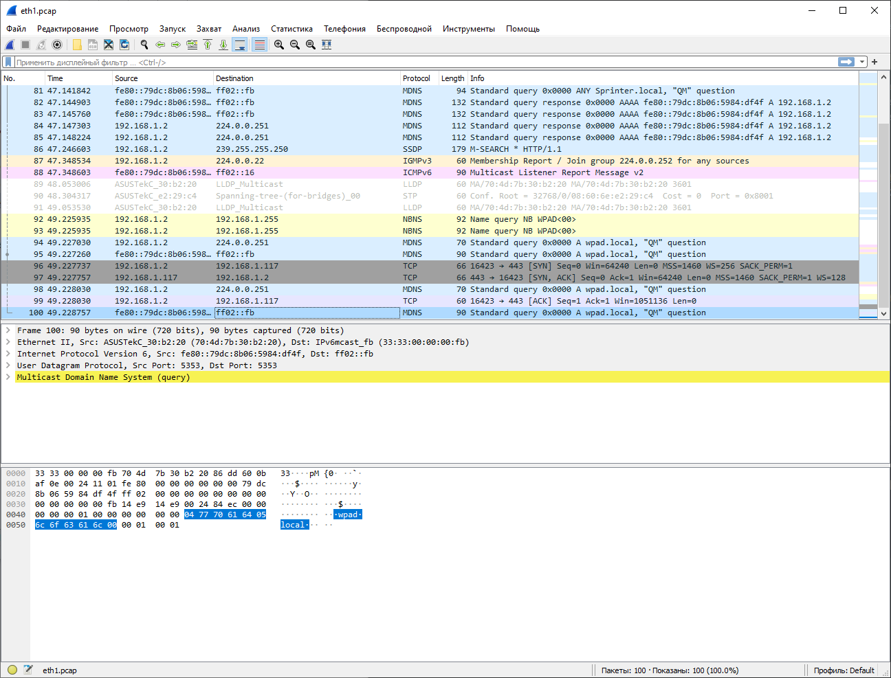

# Домашнее задание к занятию "3.9. Элементы безопасности информационных систем"
## 1. Установите Bitwarden плагин для браузера. Зарегистрируйтесь и сохраните несколько паролей.
### Решение:


Но для себя я уже давно использую KeePass:  

## 2. Установите Google authenticator на мобильный телефон. Настройте вход в Bitwarden аккаунт через Google authenticator OTP.
### Решение:
Настроено:  

## 3. Установите apache2, сгенерируйте самоподписанный сертификат, настройте тестовый сайт для работы по HTTPS.
### Решение:
```shell
vagrant@vagrant:~$ sudo a2enmod ssl
Considering dependency setenvif for ssl:
Module setenvif already enabled
Considering dependency mime for ssl:
Module mime already enabled
Considering dependency socache_shmcb for ssl:
Enabling module socache_shmcb.
Enabling module ssl.
See /usr/share/doc/apache2/README.Debian.gz on how to configure SSL and create self-signed certificates.
To activate the new configuration, you need to run:
  systemctl restart apache2

vagrant@vagrant:~$ sudo systemctl restart apache2

vagrant@vagrant:~$ sudo openssl req -x509 -nodes -days 365 -newkey rsa:2048 \
> -keyout /etc/ssl/private/apache-selfsigned.key \
> -out /etc/ssl/certs/apache-selfsigned.crt \
> -subj "/C=RU/ST=Kuzbass/L=Novokuznetsk/O=None/OU=None/CN=www.examlple.com"
Generating a RSA private key
...........+++++
.........................................................................................................................................+++++
writing new private key to '/etc/ssl/private/apache-selfsigned.key'
-----

vagrant@vagrant:~$ sudo vim /etc/apache2/sites-available/netology_homework.conf
<VirtualHost *:443>
  ServerName netology_homework
  DocumentRoot /var/www/netology_homework

  SSLEngine on
  SSLCertificateFile /etc/ssl/certs/apache-selfsigned.crt
  SSLCertificateKeyFile /etc/ssl/private/apache-selfsigned.key
</VirtualHost>

sudo vim /var/www/netology_homework/index.html
<H1>This is a test for HTTPS conection</H1>

vagrant@vagrant:~$ sudo a2ensite netology_homework.conf
Enabling site netology_homework.
To activate the new configuration, you need to run:
  systemctl reload apache2

vagrant@vagrant:~$ sudo apache2ctl configtest
Syntax OK

sudo systemctl reload apache2

```


"example" - не правильно написал ☺
## 4. Проверьте на TLS уязвимости произвольный сайт в интернете (кроме сайтов МВД, ФСБ, МинОбр, НацБанк, РосКосмос, РосАтом, РосНАНО и любых госкомпаний, объектов КИИ, ВПК ... и тому подобное).
###Решение:
```shell
vagrant@vagrant:~/testssl.sh$ ./testssl.sh -U --sneaky https://soroezhka.ru/

###########################################################
    testssl.sh       3.1dev from https://testssl.sh/dev/
    (4a358e0 2022-01-06 21:17:40 -- )

      This program is free software. Distribution and
             modification under GPLv2 permitted.
      USAGE w/o ANY WARRANTY. USE IT AT YOUR OWN RISK!

       Please file bugs @ https://testssl.sh/bugs/

###########################################################

 Using "OpenSSL 1.0.2-chacha (1.0.2k-dev)" [~183 ciphers]
 on vagrant:./bin/openssl.Linux.x86_64
 (built: "Jan 18 17:12:17 2019", platform: "linux-x86_64")


 Start 2022-01-08 08:18:24        -->> 109.111.166.4:443 (soroezhka.ru) <<--

 rDNS (109.111.166.4):   4.166.111.109.sta.211.ru.
 Service detected:       HTTP


 Testing vulnerabilities 

 Heartbleed (CVE-2014-0160)                not vulnerable (OK), no heartbeat extension
 CCS (CVE-2014-0224)                       not vulnerable (OK)
 Ticketbleed (CVE-2016-9244), experiment.  not vulnerable (OK), no session ticket extension
 ROBOT                                     Server does not support any cipher suites that use RSA key transport
 Secure Renegotiation (RFC 5746)           supported (OK)
 Secure Client-Initiated Renegotiation     not vulnerable (OK)
 CRIME, TLS (CVE-2012-4929)                not vulnerable (OK)
 BREACH (CVE-2013-3587)                    potentially NOT ok, "gzip" HTTP compression detected. - only supplied "/" tested
                                           Can be ignored for static pages or if no secrets in the page
 POODLE, SSL (CVE-2014-3566)               not vulnerable (OK)
 TLS_FALLBACK_SCSV (RFC 7507)              No fallback possible (OK), no protocol below TLS 1.2 offered
 SWEET32 (CVE-2016-2183, CVE-2016-6329)    not vulnerable (OK)
 FREAK (CVE-2015-0204)                     not vulnerable (OK)
 DROWN (CVE-2016-0800, CVE-2016-0703)      not vulnerable on this host and port (OK)
                                           make sure you don't use this certificate elsewhere with SSLv2 enabled services
                                           https://censys.io/ipv4?q=488D0F19488F55E7674560EBBADCCDB838ADA8975D16EC8A486E785667A10DDD could help you to find
 out
 LOGJAM (CVE-2015-4000), experimental      common prime with 2048 bits detected: RFC7919/ffdhe2048 (2048 bits),
                                           but no DH EXPORT ciphers
 BEAST (CVE-2011-3389)                     not vulnerable (OK), no SSL3 or TLS1
 LUCKY13 (CVE-2013-0169), experimental     not vulnerable (OK)
 Winshock (CVE-2014-6321), experimental    not vulnerable (OK) - ARIA, CHACHA or CCM ciphers found
 RC4 (CVE-2013-2566, CVE-2015-2808)        no RC4 ciphers detected (OK)


 Done 2022-01-08 08:18:42 [  20s] -->> 109.111.166.4:443 (soroezhka.ru) <<--
 
```
## 5. Установите на Ubuntu ssh сервер, сгенерируйте новый приватный ключ. Скопируйте свой публичный ключ на другой сервер. Подключитесь к серверу по SSH-ключу.
### Решение:
Для задания была создана дополнительная виртуальная машина, и обе машины настроены на `public_network`:  
192.168.1.117 - в качестве ssh клиента  
192.168.1.74 - в качестве ssh сервера
```shell
### действия на ssh клиенте
vagrant@vagrant:~$ ssh-keygen
Generating public/private rsa key pair.
Enter file in which to save the key (/home/vagrant/.ssh/id_rsa):
Enter passphrase (empty for no passphrase):
Enter same passphrase again:
Your identification has been saved in /home/vagrant/.ssh/id_rsa
Your public key has been saved in /home/vagrant/.ssh/id_rsa.pub
The key fingerprint is:
SHA256:AOyV70Bb42FGGPnWZ0TwkyGa2JuQi2QNCZIjx7eDUIc vagrant@vagrant
The key's randomart image is:
+---[RSA 3072]----+
|.+o++..*. ooo    |
|=.E.++*+*o o.o   |
|.+ +o+*O++ .+    |
|  .o+.o+=o. o.   |
|    ...+S  o     |
|        .        |
|                 |
|                 |
|                 |
+----[SHA256]-----+
vagrant@vagrant:~$ ssh-copy-id vagrant@192.168.1.74
/usr/bin/ssh-copy-id: INFO: Source of key(s) to be installed: "/home/vagrant/.ssh/id_rsa.pub"
The authenticity of host '192.168.1.74 (192.168.1.74)' can't be established.
ECDSA key fingerprint is SHA256:wSHl+h4vAtTT7mbkj2lbGyxWXWTUf6VUliwpncjwLPM.
Are you sure you want to continue connecting (yes/no/[fingerprint])? yes
/usr/bin/ssh-copy-id: INFO: attempting to log in with the new key(s), to filter out any that are already installed
/usr/bin/ssh-copy-id: INFO: 1 key(s) remain to be installed -- if you are prompted now it is to install the new keys
vagrant@192.168.1.74's password:

Number of key(s) added: 1

Now try logging into the machine, with:   "ssh 'vagrant@192.168.1.74'"
and check to make sure that only the key(s) you wanted were added.

vagrant@vagrant:~$ ssh vagrant@192.168.1.74
Welcome to Ubuntu 20.04.2 LTS (GNU/Linux 5.4.0-80-generic x86_64)

 * Documentation:  https://help.ubuntu.com
 * Management:     https://landscape.canonical.com
 * Support:        https://ubuntu.com/advantage

  System information as of Sat 08 Jan 2022 08:57:43 AM UTC

  System load:  0.01              Processes:             114
  Usage of /:   2.3% of 61.31GB   Users logged in:       1
  Memory usage: 16%               IPv4 address for eth0: 10.0.2.15
  Swap usage:   0%                IPv4 address for eth1: 192.168.1.74


This system is built by the Bento project by Chef Software
More information can be found at https://github.com/chef/bento
Last login: Sat Jan  8 08:53:28 2022 from 10.0.2.2
vagrant@vagrant:~$

```
## 6. Переименуйте файлы ключей из задания 5. Настройте файл конфигурации SSH клиента, так чтобы вход на удаленный сервер осуществлялся по имени сервера.
### Решение:
```shell
vagrant@vagrant:~$ mv id_rsa id_rsa.old
vagrant@vagrant:~$ mv id_rsa.pub id_rsa.pub.old
vagrant@vagrant:~$ touch ./.ssh/config
vagrant@vagrant:~$ vim ./.ssh/config

Host vagrant_sshd
HostName 192.168.1.74
Port 22
IdentityFile ~vagrant/.ssh/id_rsa.old

vagrant@vagrant:~$ ssh vagrant_sshd
Welcome to Ubuntu 20.04.2 LTS (GNU/Linux 5.4.0-80-generic x86_64)

 * Documentation:  https://help.ubuntu.com
 * Management:     https://landscape.canonical.com
 * Support:        https://ubuntu.com/advantage

  System information as of Sat 08 Jan 2022 09:14:05 AM UTC

  System load:  0.01              Processes:             111
  Usage of /:   2.4% of 61.31GB   Users logged in:       1
  Memory usage: 16%               IPv4 address for eth0: 10.0.2.15
  Swap usage:   0%                IPv4 address for eth1: 192.168.1.74


This system is built by the Bento project by Chef Software
More information can be found at https://github.com/chef/bento
Last login: Sat Jan  8 08:57:44 2022 from 192.168.1.117
vagrant@vagrant:~$

```
## 7. Соберите дамп трафика утилитой tcpdump в формате pcap, 100 пакетов. Откройте файл pcap в Wireshark.
### Решение:
```shell
vagrant@vagrant:~$ sudo tcpdump -c 100 -i eth1 -w eth1.pcap
tcpdump: listening on eth1, link-type EN10MB (Ethernet), capture size 262144 bytes
100 packets captured
166 packets received by filter
0 packets dropped by kernel

```
Далее через scp был выгружен файл на хост машину:  

