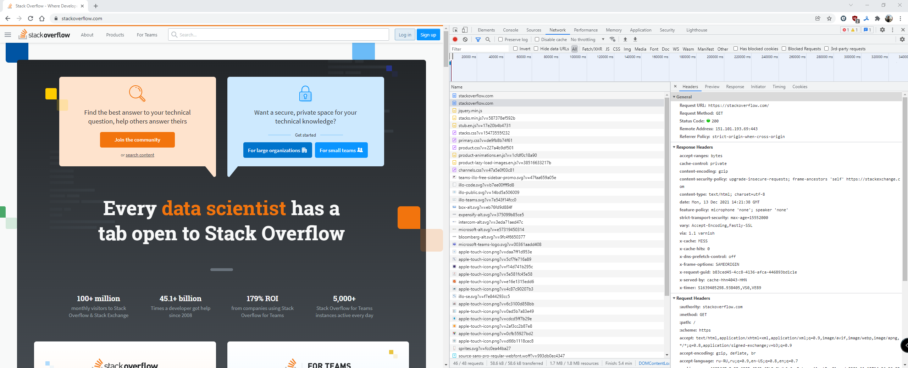
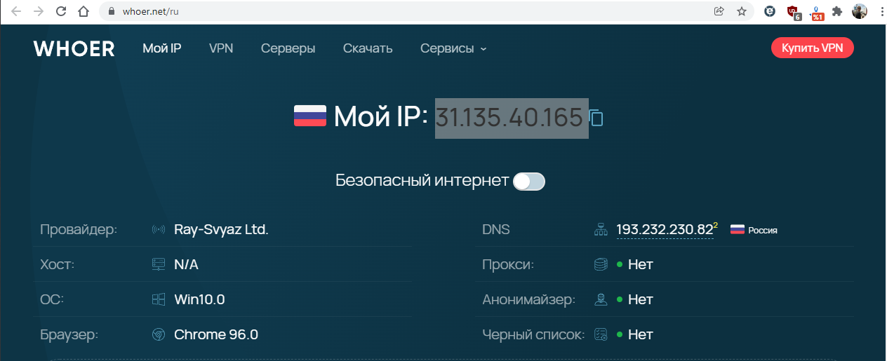

# Домашнее задание к занятию "3.5. Файловые системы"
## 1. Работа c HTTP через телнет.
* Подключитесь утилитой телнет к сайту stackoverflow.com telnet stackoverflow.com 80
* отправьте HTTP запрос
```shell
GET /questions HTTP/1.0
HOST: stackoverflow.com
[press enter]
[press enter]
```
* В ответе укажите полученный HTTP код, что он означает?
### Ответ:
```shell
vagrant@vagrant:~$ telnet stackoverflow.com 80
Trying 151.101.65.69...
Connected to stackoverflow.com.
Escape character is '^]'.
GET /questions HTTP/1.0
HOST: stackoverflow.com

HTTP/1.1 301 Moved Permanently
cache-control: no-cache, no-store, must-revalidate
location: https://stackoverflow.com/questions
x-request-guid: 17ff7301-4e20-42cd-9261-9fd910d880b3
feature-policy: microphone 'none'; speaker 'none'
content-security-policy: upgrade-insecure-requests; frame-ancestors 'self' https://stackexchange.com
Accept-Ranges: bytes
Date: Mon, 13 Dec 2021 14:12:58 GMT
Via: 1.1 varnish
Connection: close
X-Served-By: cache-hhn4023-HHN
X-Cache: MISS
X-Cache-Hits: 0
X-Timer: S1639404778.866265,VS0,VE169
Vary: Fastly-SSL
X-DNS-Prefetch-Control: off
Set-Cookie: prov=d60404f2-3c6e-0c82-7013-aeae44ff11b4; domain=.stackoverflow.com; expires=Fri, 01-Jan-2055 00:00:00 GMT; path=/; HttpOnly

Connection closed by foreign host.
```
Получен код `301 Moved Permanently`. Данный ответ означает что страница http://stackoverflow.com/questions была перемещена на 
https://stackoverflow.com/questions. Предполагаю, что связанно это с тем что сейчас все постепенно отходят от нешифрованного HTTP 
и переходят на HTTPS.

## 2. Повторите задание 1 в браузере, используя консоль разработчика F12
* откройте вкладку Network
* отправьте запрос http://stackoverflow.com
* найдите первый ответ HTTP сервера, откройте вкладку Headers
* укажите в ответе полученный HTTP код.
* проверьте время загрузки страницы, какой запрос обрабатывался дольше всего?
* приложите скриншот консоли браузера в ответ.

### Ответ:
* Код ответа: `307 Internal Redirect`
* Время загрузки: 1,3 секунды
* дольше всего обрабатывался запрос `GET https://stackoverflow.com/`, 421 мс
### Решение:


## 3. Какой IP адрес у вас в интернете?
### Ответ:
31.135.40.165 


## 4. Какому провайдеру принадлежит ваш IP адрес? Какой автономной системе AS? Воспользуйтесь утилитой whois
### Ответ:
Провайдер: `Ray-Svyaz Ltd.`  
AS: 48327
### Решение:
```shell
vagrant@vagrant:~$ whois 31.135.40.165
% This is the RIPE Database query service.
% The objects are in RPSL format.
%
% The RIPE Database is subject to Terms and Conditions.
% See http://www.ripe.net/db/support/db-terms-conditions.pdf

% Note: this output has been filtered.
%       To receive output for a database update, use the "-B" flag.

% Information related to '31.135.32.0 - 31.135.63.255'

% Abuse contact for '31.135.32.0 - 31.135.63.255' is 'admc@mycentra.ru'

inetnum:        31.135.32.0 - 31.135.63.255
netname:        RAYNETWORK
country:        RU
org:            ORG-RL63-RIPE
admin-c:        BAN58-RIPE
tech-c:         BAN58-RIPE
status:         ASSIGNED PI
mnt-by:         RIPE-NCC-END-MNT
mnt-by:         MNT-REY-SVYAZ
mnt-routes:     MNT-REY-SVYAZ
mnt-domains:    MNT-REY-SVYAZ
created:        2011-06-22T12:05:28Z
last-modified:  2019-04-12T15:10:47Z
source:         RIPE # Filtered
sponsoring-org: ORG-CS216-RIPE

organisation:   ORG-RL63-RIPE
org-name:       Ray-Svyaz Ltd.
org-type:       OTHER
address:        654027, KEMEROVSK REGION, NOVOKUZNETSK CITY, KURAKO AVENUE (CENTRAL DISTRICT), HOUSE 51, OFFICE 309
abuse-c:        ACRO231-RIPE
mnt-ref:        MNT-REY-SVYAZ
mnt-by:         MNT-REY-SVYAZ
created:        2008-10-29T10:08:04Z
last-modified:  2019-04-10T09:51:08Z
source:         RIPE # Filtered

person:         Askarov Talesh Sejpullovich
address:        Russia, Kemerovskaya obl., Novokuznetsk, Sibiryakov-Gvardejcev str., 2, off. 50
phone:          +7 3843 756000
nic-hdl:        BAN58-RIPE
mnt-by:         MNT-REY-SVYAZ
created:        2014-06-06T02:06:05Z
last-modified:  2018-02-02T09:43:19Z
source:         RIPE

% Information related to '31.135.40.0/21AS48327'

route:          31.135.40.0/21
descr:          Ray-Svyaz Ltd.
origin:         AS48327
mnt-by:         MNT-REY-SVYAZ
created:        2011-08-08T03:08:12Z
last-modified:  2011-08-08T03:08:12Z
source:         RIPE

% This query was served by the RIPE Database Query Service version 1.102.1 (ANGUS)
```

## 5. Через какие сети проходит пакет, отправленный с вашего компьютера на адрес 8.8.8.8? Через какие AS? Воспользуйтесь утилитой `traceroute`
### Ответ:
Через 13094 и AS15169
### Решение:
По скольку с Vagrant у меня трассировка не хотела работать, запустил ее с другой машины:
```shell
traceroute to 8.8.8.8 (8.8.8.8), 30 hops max, 60 byte packets
 1  _gateway (192.168.0.1) [*]  3.610 ms  3.560 ms  3.545 ms
 2  10.161.0.1 (10.161.0.1) [*]  3.587 ms  3.573 ms  3.559 ms
 3  10.144.4.1 (10.144.4.1) [*]  3.526 ms  3.512 ms  3.499 ms
 4  host_91_221_180_4.milecom.ru (91.221.180.4) [AS13094]  54.224 ms  54.210 ms  54.196 ms
 5  * * 108.170.250.130 (108.170.250.130) [AS15169]  53.499 ms
 6  * * *
 7  209.85.254.20 (209.85.254.20) [AS15169]  67.942 ms 172.253.66.108 (172.253.66.108) [AS15169]  83.484 ms 216.239.57.222 (216.239.57.222) [AS15169]  69.459 ms
 8  172.253.64.55 (172.253.64.55) [AS15169]  69.419 ms 209.85.251.63 (209.85.251.63) [AS15169]  67.902 ms *
 9  * * *
10  * * *
11  * * *
12  * * *
13  * * *
14  * * *
15  * * *
16  * * *
17  * * *
18  dns.google (8.8.8.8) [AS15169]  127.096 ms * *
```

## 6. Повторите задание 5 в утилите mtr. На каком участке наибольшая задержка - delay?
### Ответ:
Наибольшая одноразовая задержка 82.8 была на хосте 108.170.250.34, а наибольшая средняя 72.3 на хосте 216.239.49.3
### Решение:
А вот `mtr` работает нормально, но не отображает AS хоста `host_91_221_180_4.milecom.ru`
```shell
                                                                  My traceroute  [v0.93]
vagrant (10.0.2.15)                                                                                                               2021-12-13T15:33:39+0000
Keys:  Help   Display mode   Restart statistics   Order of fields   quit
                                                                                                                  Packets               Pings
 Host                                                                                                           Loss%   Snt   Last   Avg  Best  Wrst StDev
 1. AS???    _gateway                                                                                            0.0%     7    0.3   0.4   0.1   0.6   0.2
 2. AS???    www.asusnetwork.net                                                                                 0.0%     7    1.5   1.7   1.4   2.8   0.5
 3. AS???    10.146.0.1                                                                                          0.0%     7    1.6  10.5   1.4  61.0  22.3
 4. AS???    10.144.3.1                                                                                          0.0%     7    2.1   2.5   1.6   4.0   0.8
 5. AS???    host_91_221_180_4.milecom.ru                                                                        0.0%     7   51.5  54.4  48.8  64.3   5.8
 6. AS15169  108.170.250.34                                                                                      0.0%     7   51.3  62.2  51.3  82.8  13.8
 7. (waiting for reply)
 8. AS15169  72.14.235.69                                                                                        0.0%     7   70.7  71.1  70.5  71.7   0.4
 9. AS15169  216.239.49.3                                                                                        0.0%     7   72.1  72.3  71.6  73.0   0.5
10. (waiting for reply)
11. (waiting for reply)
12. (waiting for reply)
13. (waiting for reply)
14. (waiting for reply)
15. (waiting for reply)
16. (waiting for reply)
17. (waiting for reply)
18. (waiting for reply)
19. AS15169  dns.google                                                                                         40.0%     6   70.6  69.1  66.6  70.6   2.2

```

## 7. Какие DNS сервера отвечают за доменное имя dns.google? Какие A записи? Воспользуйтесь утилитой dig
### Ответ:
**Сервера отвечающие за dns.google:** `ns1.zdns.google.`; `ns3.zdns.google.`; `ns4.zdns.google.`; `ns2.zdns.google.`  
**A записи:** 8.8.4.4 и 8.8.8.8 
### Решение:
```
vagrant@vagrant:~$ dig +trace dns.google

; <<>> DiG 9.16.1-Ubuntu <<>> +trace dns.google
;; global options: +cmd
.                       6990    IN      NS      m.root-servers.net.
.                       6990    IN      NS      l.root-servers.net.
.                       6990    IN      NS      k.root-servers.net.
.                       6990    IN      NS      j.root-servers.net.
.                       6990    IN      NS      i.root-servers.net.
.                       6990    IN      NS      h.root-servers.net.
.                       6990    IN      NS      g.root-servers.net.
.                       6990    IN      NS      f.root-servers.net.
.                       6990    IN      NS      e.root-servers.net.
.                       6990    IN      NS      d.root-servers.net.
.                       6990    IN      NS      c.root-servers.net.
.                       6990    IN      NS      b.root-servers.net.
.                       6990    IN      NS      a.root-servers.net.
;; Received 262 bytes from 127.0.0.53#53(127.0.0.53) in 0 ms

google.                 172800  IN      NS      ns-tld5.charlestonroadregistry.com.
google.                 172800  IN      NS      ns-tld2.charlestonroadregistry.com.
google.                 172800  IN      NS      ns-tld4.charlestonroadregistry.com.
google.                 172800  IN      NS      ns-tld3.charlestonroadregistry.com.
google.                 172800  IN      NS      ns-tld1.charlestonroadregistry.com.
google.                 86400   IN      DS      6125 8 2 80F8B78D23107153578BAD3800E9543500474E5C30C29698B40A3DB2 3ED9DA9F
google.                 86400   IN      RRSIG   DS 8 1 86400 20211226050000 20211213040000 14748 . aEWwBGjgruiJwcQb/7b3Me2kuVqhUrwmGHkNSC7ds97aJ3SLFE1Nj0kk
 lU+LhgrXYjglwEfyDDDWr/H2P3qMeND5oj/UcGBz+kImzL/X5bf9Gxzw 1s5AstKInIHP2Qr+Dp3vvXCegk9a6yT4eZuf1vEmHL2/VH/YQDeR/G9C Z1N3YmLDvzywqzs3yPNxxMulVYwv0OhHDAEqZxWn
lN1tkFA6z4AggBC2 eiM/j6ggbHGggIqVK7QXyHGvzfwWg4h2xnK0WSxOr5C32dK89PHKBdTr 0hmS7sefZeVx/sedK95Wivd456/xJs+xmThnPlQVXByJcH0itWazOfhM EeI+FA==
;; Received 758 bytes from 192.112.36.4#53(g.root-servers.net) in 152 ms

dns.google.             10800   IN      NS      ns1.zdns.google.
dns.google.             10800   IN      NS      ns3.zdns.google.
dns.google.             10800   IN      NS      ns4.zdns.google.
dns.google.             10800   IN      NS      ns2.zdns.google.
dns.google.             3600    IN      DS      56044 8 2 1B0A7E90AA6B1AC65AA5B573EFC44ABF6CB2559444251B997103D2E4 0C351B08
dns.google.             3600    IN      RRSIG   DS 8 2 3600 20220101205606 20211210205606 44925 google. mmONLBYtz5ta3hS2pA7I/qHVlBWIyTbjIKSfxHOvRi/IR62cmNe
I9MME TCTsNhHg/LZ3hLqlpjfAgGVk5aP5O3pUHrCJriQpUOIZ8ij+HbNGMKV8 WOxutm0MincuJEa6aQnSmx2yw+4sKjEsKcwAmMAUh1O5MyGR6goOlhid SmM=
;; Received 506 bytes from 216.239.32.105#53(ns-tld1.charlestonroadregistry.com) in 100 ms

dns.google.             900     IN      A       8.8.4.4
dns.google.             900     IN      A       8.8.8.8
dns.google.             900     IN      RRSIG   A 8 2 900 20220112081031 20211213081031 1773 dns.google. b44v4+d2G9E2lTmRMv3cFWY4/9iGsMxUZBWmNq872cYTTBX+zc
XLCMvC IWLF5dSmmyAa5Y7EekwbYK4fOCVlwIbYR52+CtcLccrVbIIJHbkBLTJM TUnVBRG+lawPfnBV9FVDa8OAfM/DOmIQQ7zflHnh1tgI2yEHLXDbxicp UzE=
;; Received 241 bytes from 216.239.36.114#53(ns3.zdns.google) in 80 ms

```

## 8. Проверьте PTR записи для IP адресов из задания 7. Какое доменное имя привязано к IP? Воспользуйтесь утилитой dig
### Ответ:
Соответственно на оба адреса PTR запись `dns.google.`
### Решение:
```
vagrant@vagrant:~$ dig -x 8.8.8.8

; <<>> DiG 9.16.1-Ubuntu <<>> -x 8.8.8.8
;; global options: +cmd
;; Got answer:
;; ->>HEADER<<- opcode: QUERY, status: NOERROR, id: 662
;; flags: qr rd ra; QUERY: 1, ANSWER: 1, AUTHORITY: 0, ADDITIONAL: 1

;; OPT PSEUDOSECTION:
; EDNS: version: 0, flags:; udp: 65494
;; QUESTION SECTION:
;8.8.8.8.in-addr.arpa.          IN      PTR

;; ANSWER SECTION:
8.8.8.8.in-addr.arpa.   6086    IN      PTR     dns.google.

;; Query time: 0 msec
;; SERVER: 127.0.0.53#53(127.0.0.53)
;; WHEN: Mon Dec 13 15:51:30 UTC 2021
;; MSG SIZE  rcvd: 73

vagrant@vagrant:~$ dig -x 8.8.4.4

; <<>> DiG 9.16.1-Ubuntu <<>> -x 8.8.4.4
;; global options: +cmd
;; Got answer:
;; ->>HEADER<<- opcode: QUERY, status: NOERROR, id: 20488
;; flags: qr rd ra; QUERY: 1, ANSWER: 1, AUTHORITY: 0, ADDITIONAL: 1

;; OPT PSEUDOSECTION:
; EDNS: version: 0, flags:; udp: 65494
;; QUESTION SECTION:
;4.4.8.8.in-addr.arpa.          IN      PTR

;; ANSWER SECTION:
4.4.8.8.in-addr.arpa.   82027   IN      PTR     dns.google.

;; Query time: 20 msec
;; SERVER: 127.0.0.53#53(127.0.0.53)
;; WHEN: Mon Dec 13 15:51:38 UTC 2021
;; MSG SIZE  rcvd: 73
```