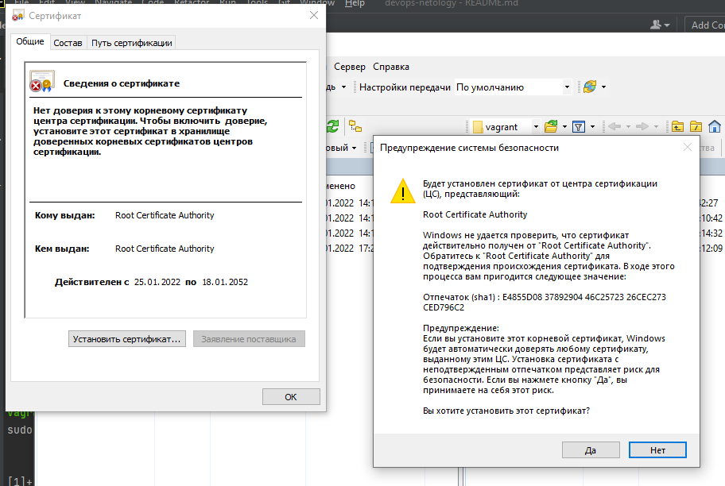
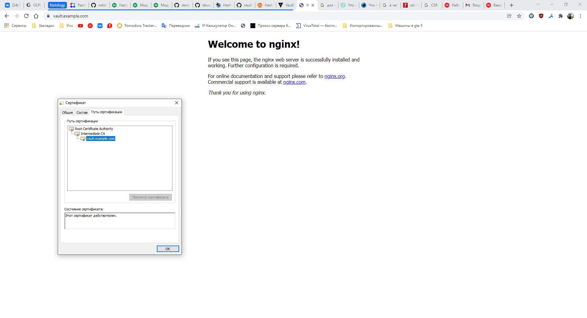
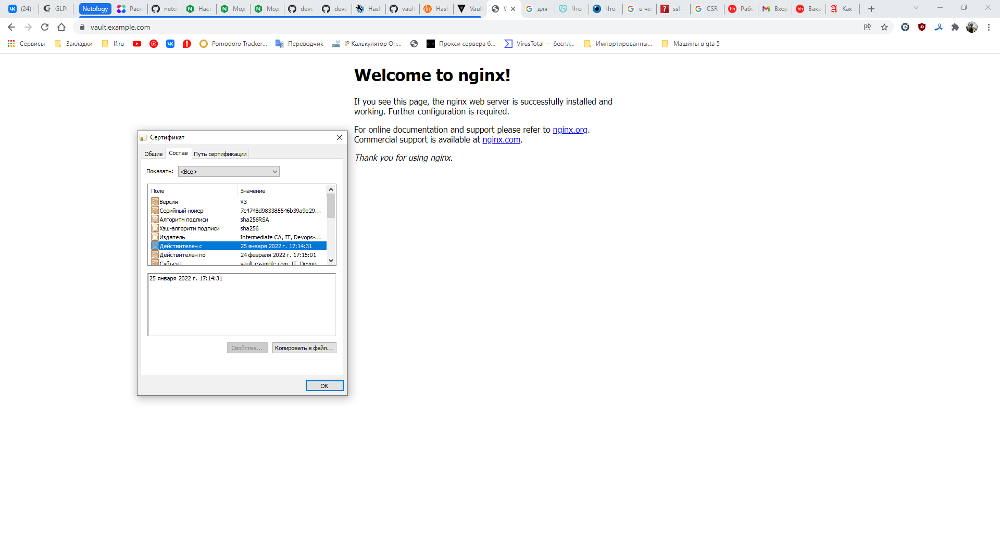
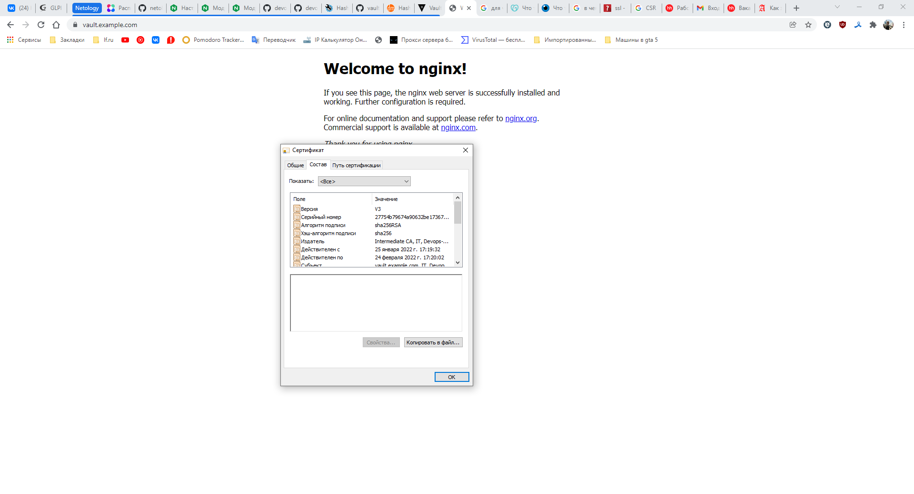
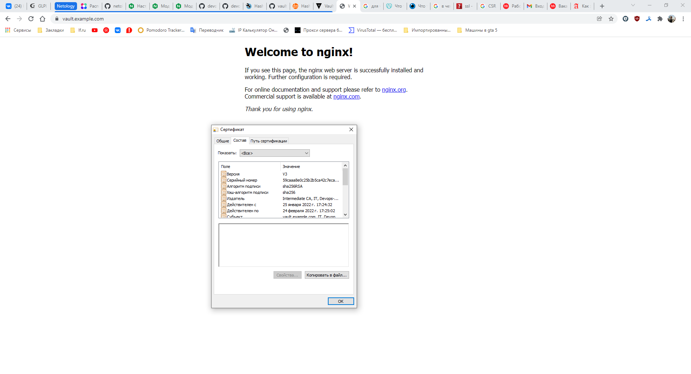

# Курсовая работа по итогам модуля "DevOps и системное администрирование"
## 1. Создайте виртуальную машину Linux.
### Решение:
Создана виртуальная машина через Vagrant на дистрибутиве bento/ubuntu-20.04, с публичным сетевым интерфейсом
## 2. Установите ufw и разрешите к этой машине сессии на порты 22 и 443, при этом трафик на интерфейсе localhost (lo) должен ходить свободно на все порты.
### Решение:
```shell
vagrant@vagrant:~$ sudo ufw allow 443/tcp
Rules updated
Rules updated (v6)

vagrant@vagrant:~$ sudo ufw allow 22/tcp
Rules updated
Rules updated (v6)

vagrant@vagrant:~$ sudo ufw enable
Command may disrupt existing ssh connections. Proceed with operation (y|n)? y
Firewall is active and enabled on system startup
vagrant@vagrant:~$ sudo ufw status verbose
Status: active
Logging: on (low)
Default: deny (incoming), allow (outgoing), disabled (routed)
New profiles: skip

To                         Action      From
--                         ------      ----
443/tcp                    ALLOW IN    Anywhere
22/tcp                     ALLOW IN    Anywhere
443/tcp (v6)               ALLOW IN    Anywhere (v6)
22/tcp (v6)                ALLOW IN    Anywhere (v6)

```
## 3. Установите hashicorp vault ([инструкция по ссылке](https://learn.hashicorp.com/tutorials/vault/getting-started-install?in=vault/getting-started#install-vault)).
### Решение:
```shell
vagrant@vagrant:~$ curl -fsSL https://apt.releases.hashicorp.com/gpg | sudo apt-key add -
OK
vagrant@vagrant:~$ sudo apt-add-repository "deb [arch=amd64] https://apt.releases.hashicorp.com $(lsb_release -cs) main"
Hit:1 http://archive.ubuntu.com/ubuntu focal InRelease
Get:2 http://archive.ubuntu.com/ubuntu focal-updates InRelease [114 kB]
Get:3 http://archive.ubuntu.com/ubuntu focal-backports InRelease [108 kB]
Get:4 http://security.ubuntu.com/ubuntu focal-security InRelease [114 kB]
Get:5 http://archive.ubuntu.com/ubuntu focal-updates/main i386 Packages [581 kB]
Get:6 http://security.ubuntu.com/ubuntu focal-security/main i386 Packages [351 kB]
Get:7 http://security.ubuntu.com/ubuntu focal-security/main amd64 Packages [1,109 kB]
Get:8 http://archive.ubuntu.com/ubuntu focal-updates/main amd64 Packages [1,445 kB]
Get:9 https://apt.releases.hashicorp.com focal InRelease [9,495 B]
Get:10 https://apt.releases.hashicorp.com focal/main amd64 Packages [41.2 kB]
Get:11 http://archive.ubuntu.com/ubuntu focal-updates/main Translation-en [289 kB]
Get:12 http://archive.ubuntu.com/ubuntu focal-updates/restricted i386 Packages [21.8 kB]
Get:13 http://security.ubuntu.com/ubuntu focal-security/main Translation-en [202 kB]
Get:14 http://security.ubuntu.com/ubuntu focal-security/restricted i386 Packages [20.5 kB]
Get:15 http://archive.ubuntu.com/ubuntu focal-updates/restricted amd64 Packages [663 kB]
Get:16 http://archive.ubuntu.com/ubuntu focal-updates/restricted Translation-en [94.6 kB]
Get:17 http://security.ubuntu.com/ubuntu focal-security/restricted amd64 Packages [609 kB]
Get:18 http://archive.ubuntu.com/ubuntu focal-updates/universe i386 Packages [662 kB]
Get:19 http://security.ubuntu.com/ubuntu focal-security/restricted Translation-en [86.8 kB]
Get:20 http://security.ubuntu.com/ubuntu focal-security/universe amd64 Packages [675 kB]
Get:21 http://archive.ubuntu.com/ubuntu focal-updates/universe amd64 Packages [892 kB]
Get:22 http://archive.ubuntu.com/ubuntu focal-updates/universe Translation-en [195 kB]
Get:23 http://archive.ubuntu.com/ubuntu focal-updates/multiverse i386 Packages [8,432 B]
Get:24 http://archive.ubuntu.com/ubuntu focal-updates/multiverse amd64 Packages [24.8 kB]
Get:25 http://archive.ubuntu.com/ubuntu focal-updates/multiverse Translation-en [6,928 B]
Get:26 http://archive.ubuntu.com/ubuntu focal-backports/main i386 Packages [34.5 kB]
Get:27 http://archive.ubuntu.com/ubuntu focal-backports/main amd64 Packages [42.0 kB]
Get:28 http://archive.ubuntu.com/ubuntu focal-backports/main Translation-en [10.0 kB]
Get:29 http://archive.ubuntu.com/ubuntu focal-backports/universe i386 Packages [10.9 kB]
Get:30 http://archive.ubuntu.com/ubuntu focal-backports/universe amd64 Packages [19.2 kB]
Get:31 http://archive.ubuntu.com/ubuntu focal-backports/universe Translation-en [13.3 kB]
Get:32 http://security.ubuntu.com/ubuntu focal-security/universe i386 Packages [532 kB]
Get:33 http://security.ubuntu.com/ubuntu focal-security/universe Translation-en [114 kB]
Get:34 http://security.ubuntu.com/ubuntu focal-security/multiverse amd64 Packages [21.8 kB]
Get:35 http://security.ubuntu.com/ubuntu focal-security/multiverse i386 Packages [7,176 B]
Get:36 http://security.ubuntu.com/ubuntu focal-security/multiverse Translation-en [4,948 B]
Fetched 9,132 kB in 15s (602 kB/s)
Reading package lists... Done
vagrant@vagrant:~$ sudo apt-get update && sudo apt-get install vault
Hit:1 http://archive.ubuntu.com/ubuntu focal InRelease
Hit:2 http://archive.ubuntu.com/ubuntu focal-updates InRelease
Hit:3 http://archive.ubuntu.com/ubuntu focal-backports InRelease
Get:4 http://security.ubuntu.com/ubuntu focal-security InRelease [114 kB]
Hit:5 https://apt.releases.hashicorp.com focal InRelease
Fetched 114 kB in 1s (120 kB/s)
Reading package lists... Done
Reading package lists... Done
Building dependency tree
Reading state information... Done
The following NEW packages will be installed:
  vault
0 upgraded, 1 newly installed, 0 to remove and 109 not upgraded.
Need to get 69.4 MB of archives.
After this operation, 188 MB of additional disk space will be used.
Get:1 https://apt.releases.hashicorp.com focal/main amd64 vault amd64 1.9.2 [69.4 MB]
Fetched 69.4 MB in 7s (9,517 kB/s)
Selecting previously unselected package vault.
(Reading database ... 41969 files and directories currently installed.)
Preparing to unpack .../archives/vault_1.9.2_amd64.deb ...
Unpacking vault (1.9.2) ...
Setting up vault (1.9.2) ...
Generating Vault TLS key and self-signed certificate...
Generating a RSA private key
.............................++++
.......................................................................................................++++
writing new private key to 'tls.key'
-----
Vault TLS key and self-signed certificate have been generated in '/opt/vault/tls'.
vagrant@vagrant:~$ vault
Usage: vault <command> [args]

Common commands:
    read        Read data and retrieves secrets
    write       Write data, configuration, and secrets
    delete      Delete secrets and configuration
    list        List data or secrets
    login       Authenticate locally
    agent       Start a Vault agent
    server      Start a Vault server
    status      Print seal and HA status
    unwrap      Unwrap a wrapped secret

Other commands:
    audit          Interact with audit devices
    auth           Interact with auth methods
    debug          Runs the debug command
    kv             Interact with Vault's Key-Value storage
    lease          Interact with leases
    monitor        Stream log messages from a Vault server
    namespace      Interact with namespaces
    operator       Perform operator-specific tasks
    path-help      Retrieve API help for paths
    plugin         Interact with Vault plugins and catalog
    policy         Interact with policies
    print          Prints runtime configurations
    secrets        Interact with secrets engines
    ssh            Initiate an SSH session
    token          Interact with tokens

```
## 4. Создайте центр сертификации по инструкции ([ссылка](https://learn.hashicorp.com/tutorials/vault/pki-engine?in=vault/secrets-management)) и выпустите сертификат для использования его в настройке веб-сервера nginx (срок жизни сертификата - месяц).
### Решение:
Подготавливаем службу Vault для работы не в dev режиме
```shell
vagrant@vagrant:~$ sudo systemctl enable vault
vagrant@vagrant:~$ sudo systemctl start vault
vagrant@vagrant:~$ sudo echo "VAULT_ADDR=http://127.0.0.1:8200" >> /etc/environment
vagrant@vagrant:~$ export VAULT_ADDR=http://127.0.0.1:8200
vagrant@vagrant:~$ sudo vim /etc/vault.d/vault.hcl

# HTTP listener
listener "tcp" {
  address = "127.0.0.1:8200"
  tls_disable = 1
}
# HTTPS listener                                                                                                                                                                                                               
#listener "tcp" {                                                                                                                                                                                                              
#  address       = "0.0.0.0:8200"                                                                                                                                                                                              
#  tls_cert_file = "/opt/vault/tls/tls.crt"                                                                                                                                                                                    
#  tls_key_file  = "/opt/vault/tls/tls.key"                                                                                                                                                                                    
#}

vagrant@vagrant:~$ sudo systemctl restart vault
vagrant@vagrant:~$ vault operator init
Unseal Key 1: qLAf169genh9MHmwSSDlUlufCgLVr7MMEvrcV+ZuqiBb
Unseal Key 2: 6YS/4OZjBqWJWXpnU4AC4lxlCc/ewOPowbXUpPgfCPGo
Unseal Key 3: xJUxreyVO39BVszn6ReUzL1eTQWKc08OJj0rnptz/pIj
Unseal Key 4: L4BAeiok2TteO4e1vJZXBDvK6NkE6+TMd0t0FmeISWAd
Unseal Key 5: FDbxb+gv4LV4XQ/XhVcf48qgHrZaRD9MxgdGyNeHXOZR

Initial Root Token: s.o7Ql7yFskt9NI85r9Ltf6tVT

Vault initialized with 5 key shares and a key threshold of 3. Please securely
distribute the key shares printed above. When the Vault is re-sealed,
restarted, or stopped, you must supply at least 3 of these keys to unseal it
before it can start servicing requests.

Vault does not store the generated master key. Without at least 3 keys to
reconstruct the master key, Vault will remain permanently sealed!

It is possible to generate new unseal keys, provided you have a quorum of
existing unseal keys shares. See "vault operator rekey" for more information.

vagrant@vagrant:~$ sudo echo "VAULT_TOKEN=s.o7Ql7yFskt9NI85r9Ltf6tVT" >> /etc/environment
vagrant@vagrant:~$ export VAULT_TOKEN=s.o7Ql7yFskt9NI85r9Ltf6tVT
vagrant@vagrant:~$ vault operator unseal
Unseal Key (will be hidden): 
vagrant@vagrant:~$ vault operator unseal
Unseal Key (will be hidden): 
vagrant@vagrant:~$ vault operator unseal
Unseal Key (will be hidden): 
Key             Value
---             -----
Seal Type       shamir
Initialized     true
Sealed          false
Total Shares    5
Threshold       3
Version         1.9.2
Storage Type    file
Cluster Name    vault-cluster-88ddf751
Cluster ID      8e1b4f97-c494-b434-c850-45a4f79ab6fb
HA Enabled      false

```
Подготавливаем сертификаты:

Активируем PKI тип секрета для корневого центра сертификации
```shell
vagrant@vagrant:~$ vault secrets enable \
> -path=pki_root_ca \
> -description="PKI Root CA" \
> -max-lease-ttl="262800h" \
> pki
Success! Enabled the pki secrets engine at: pki_root_ca/

```
Создаем корневой центра сертификации (CA)
```shell
vagrant@vagrant:~$ vault write -format=json pki_root_ca/root/generate/internal \
> common_name="Root Certificate Authority" \
> country="Russian Federation" \
> locality="Novokuznetsk" \
> postal_code="654000" \
> organization="Devops-Netology" \
> ou="IT" \
> ttl="262800h" > pki-root-ca.json
```
Сохраняем корневой сертификат
```shell
vagrant@vagrant:~$ cat pki-root-ca.json | jq -r .data.certificate > rootCA.crt
```
Публикуем URL’ы для корневого центра сертификации
```shell
vagrant@vagrant:~$ vault write pki_root_ca/config/urls \
> issuing_certificates="$VAULT_ADDR/v1/pki_root_ca/ca" \
> crl_distribution_points="$VAULT_ADDR/v1/pki_root_ca/crl"
Success! Data written to: pki_root_ca/config/urls
```
Активируем PKI тип секрета для промежуточного центра сертификации
```shell
vagrant@vagrant:~$ vault secrets enable \
> -path=pki_int_ca \
> -description="PKI Intermediate CA" \
> -max-lease-ttl="175200h" \
> pki
Success! Enabled the pki secrets engine at: pki_int_ca/
```
Генерируем запрос на выдачу сертификата для промежуточного центра сертификации
```shell
vagrant@vagrant:~$ vault write -format=json pki_int_ca/intermediate/generate/internal \
> common_name="Intermediate CA" \
> country="Russian Federation" \
> locality="Novokuznetsk" \
> postal_code="654000" \
> organization="Devops-Netology" \
> ou="IT" \
> ttl="175200h" | jq -r '.data.csr' > pki_intermediate_ca.csr
```
Отправляем полученный CSR-файл в корневой центр сертификации, получаем сертификат для промежуточного центра сертификации.
```shell
vagrant@vagrant:~$ vault write -format=json pki_root_ca/root/sign-intermediate \
> csr=@pki_intermediate_ca.csr \
> country="Russian Federation" \
> locality="Novokuznetsk" \
> postal_code="654000" \
> organization="Devops-Netology" \
> ou="IT" \
> format=pem_bundle \
> ttl="175200h" | jq -r '.data.certificate' > intermediateCA.cert.pem
```
Публикуем подписанный сертификат промежуточного центра сертификации
```shell
vagrant@vagrant:~$ vault write pki_int_ca/intermediate/set-signed \
> certificate=@intermediateCA.cert.pem
Success! Data written to: pki_int_ca/intermediate/set-signed
```
Публикуем URL’ы для промежуточного центра сертификации
```shell
vagrant@vagrant:~$ vault write pki_int_ca/config/urls \
> issuing_certificates="$VAULT_ADDR/v1/pki_int_ca/ca" \
> crl_distribution_points="$VAULT_ADDR/v1/pki_int_ca/crl"
Success! Data written to: pki_int_ca/config/urls
```
Создаем роль, с помощью которой будем выдавать сертификаты для серверов
```shell
vagrant@vagrant:~$ vault write pki_int_ca/roles/example-dot-com-server \
> country="Russian Federation" \
> locality="Novokuznetsk" \
> postal_code="654000" \
> organization="Devops-Netology" \
> ou="IT" \
> allowed_domains="example.com" \
> allow_subdomains=true \
> max_ttl="720h" \
> key_bits="2048" \
> key_type="rsa" \
> allow_any_name=false \
> allow_bare_domains=false \
> allow_glob_domain=false \
> allow_ip_sans=true \
> allow_localhost=false \
> client_flag=false \
> server_flag=true \
> enforce_hostnames=true \
> key_usage="DigitalSignature,KeyEncipherment" \
> ext_key_usage="ServerAuth" \
> require_cn=true
Success! Data written to: pki_int_ca/roles/example-dot-com-server
```
Создаем сертификат на 1 месяц для домена vault.example.com
```shell
vagrant@vagrant:~$ vault write -format=json pki_int_ca/issue/example-dot-com-server \
> common_name="vault.example.com" \
> alt_names="vault.example.com" \
> ttl="720h" > vault.example.com.crt
```
Сохраняем сертификат в правильном формате
```shell
vagrant@vagrant:~$ cat vault.example.com.crt | jq -r .data.certificate > vault.example.com.crt.pem
vagrant@vagrant:~$ cat vault.example.com.crt | jq -r .data.issuing_ca >> vault.example.com.crt.pem
vagrant@vagrant:~$ cat vault.example.com.crt | jq -r .data.private_key > vault.example.com.crt.key

```
## 5. Установите корневой сертификат созданного центра сертификации в доверенные в хостовой системе.
### Решение:


## 6. Установите nginx.
### Решение:
`vagrant@vagrant:~$ sudo apt install nginx`

## 7. По инструкции ([ссылка](https://nginx.org/en/docs/http/configuring_https_servers.html)) настройте nginx на https, используя ранее подготовленный сертификат:
* можно использовать стандартную стартовую страницу nginx для демонстрации работы сервера;
* можно использовать и другой html файл, сделанный вами;
### Решение:
содержимое файла `/etc/nginx/sites-available/default`:
```shell
server {
        listen 443 ssl default_server;
        server_name vault.example.com;
        ssl_certificate /home/vagrant/vault.example.com.crt.pem;
        ssl_certificate_key /home/vagrant/vault.example.com.crt.key;
 
        root /var/www/html;

        index index.html index.htm index.nginx-debian.html;

        server_name _;

        location / {
                try_files $uri $uri/ =404;
        }

}

```

## 8. Откройте в браузере на хосте https адрес страницы, которую обслуживает сервер nginx.
### Решение:
В связи с тем что сертификат выдан на доменное имя vault.example.com, на хостовой машине в файл 
`C:\Windows\System32\drivers\etc\hosts` была добавлена строчка `10.10.4.141	vault.example.com`

Таким образом внешний вид сайта выглядет так:


## 9. Создайте скрипт, который будет генерировать новый сертификат в vault:
* генерируем новый сертификат так, чтобы не переписывать конфиг nginx;
* перезапускаем nginx для применения нового сертификата.
### Решение:
Создаем файл скрипта 
```shell
touch ssl_gen.sh
chmod +x ssl_gen.sh
```
со следующим содержимым:
```shell
#!/bin/sh
# Распаковываем vault
vault operator unseal qLAf169genh9MHmwSSDlUlufCgLVr7MMEvrcV+ZuqiBb
vault operator unseal 6YS/4OZjBqWJWXpnU4AC4lxlCc/ewOPowbXUpPgfCPGo
vault operator unseal xJUxreyVO39BVszn6ReUzL1eTQWKc08OJj0rnptz/pIj

cd /home/vagrant/
# Генерируем сертификат на 30 дней
vault write -format=json pki_int_ca/issue/example-dot-com-server \
        common_name="vault.example.com" \
        alt_names="vault.example.com" \
        ttl="720h" > vault.example.com.crt
# Сохраняем сертификат в правильном формате
cat vault.example.com.crt | jq -r .data.certificate > vault.example.com.crt.pem
cat vault.example.com.crt | jq -r .data.issuing_ca >> vault.example.com.crt.pem
cat vault.example.com.crt | jq -r .data.private_key > vault.example.com.crt.key

# Перезапускаем nginx
sudo systemctl restart nginx
```
## 10. Поместите скрипт в crontab, чтобы сертификат обновлялся какого-то числа каждого месяца в удобное для вас время.
###Решение:
`# echo "*/5 *   * * *   root    /home/vagrant/ssl_gen.sh" >> /etc/crontab`

Ставим на каждые 5 минут чтобы иметь возможность проверить как отрабатывает и перезагружаем сервер.
```shell
Jan 25 10:20:01 vagrant CRON[1088]: (root) CMD (/home/vagrant/ssl_gen.sh)
Jan 25 10:20:01 vagrant vault[650]: 2022-01-25T10:20:01.924Z [INFO]  core.cluster-listener.tcp: starting listener: listener_address=0.0.0.0:8201
Jan 25 10:20:01 vagrant vault[650]: 2022-01-25T10:20:01.924Z [INFO]  core.cluster-listener: serving cluster requests: cluster_listen_address=[::]:8201
Jan 25 10:20:01 vagrant vault[650]: 2022-01-25T10:20:01.928Z [INFO]  core: post-unseal setup starting
Jan 25 10:20:01 vagrant vault[650]: 2022-01-25T10:20:01.931Z [INFO]  core: loaded wrapping token key
Jan 25 10:20:01 vagrant vault[650]: 2022-01-25T10:20:01.933Z [INFO]  core: successfully setup plugin catalog: plugin-directory="\"\""
Jan 25 10:20:01 vagrant vault[650]: 2022-01-25T10:20:01.935Z [INFO]  core: successfully mounted backend: type=system path=sys/
Jan 25 10:20:01 vagrant vault[650]: 2022-01-25T10:20:01.935Z [INFO]  core: successfully mounted backend: type=identity path=identity/
Jan 25 10:20:01 vagrant vault[650]: 2022-01-25T10:20:01.935Z [INFO]  core: successfully mounted backend: type=pki path=pki_root_ca/
Jan 25 10:20:01 vagrant vault[650]: 2022-01-25T10:20:01.936Z [INFO]  core: successfully mounted backend: type=pki path=pki_int_ca/
Jan 25 10:20:01 vagrant vault[650]: 2022-01-25T10:20:01.936Z [INFO]  core: successfully mounted backend: type=cubbyhole path=cubbyhole/
Jan 25 10:20:01 vagrant vault[650]: 2022-01-25T10:20:01.943Z [INFO]  core: successfully enabled credential backend: type=token path=token/
Jan 25 10:20:01 vagrant vault[650]: 2022-01-25T10:20:01.945Z [INFO]  rollback: starting rollback manager
Jan 25 10:20:01 vagrant vault[650]: 2022-01-25T10:20:01.945Z [INFO]  core: restoring leases
Jan 25 10:20:01 vagrant vault[650]: 2022-01-25T10:20:01.947Z [INFO]  expiration: lease restore complete
Jan 25 10:20:01 vagrant vault[650]: 2022-01-25T10:20:01.950Z [INFO]  identity: entities restored
Jan 25 10:20:01 vagrant vault[650]: 2022-01-25T10:20:01.950Z [INFO]  identity: groups restored
Jan 25 10:20:01 vagrant vault[650]: 2022-01-25T10:20:01.950Z [INFO]  core: post-unseal setup complete
Jan 25 10:20:01 vagrant vault[650]: 2022-01-25T10:20:01.950Z [INFO]  core: vault is unsealed
Jan 25 10:20:01 vagrant vault[650]: 2022-01-25T10:20:01.951Z [INFO]  core: usage gauge collection is disabled
Jan 25 10:20:02 vagrant systemd[1]: Stopping A high performance web server and a reverse proxy server...
Jan 25 10:20:02 vagrant systemd[1]: nginx.service: Succeeded.
Jan 25 10:20:02 vagrant systemd[1]: Stopped A high performance web server and a reverse proxy server.
Jan 25 10:20:02 vagrant systemd[1]: Starting A high performance web server and a reverse proxy server...
Jan 25 10:20:02 vagrant systemd[1]: Started A high performance web server and a reverse proxy server.
Jan 25 10:20:02 vagrant CRON[1082]: (CRON) info (No MTA installed, discarding output)
Jan 25 10:23:52 vagrant dbus-daemon[633]: [system] Activating via systemd: service name='org.freedesktop.timedate1' unit='dbus-org.freedesktop.timedate1.service' requested by ':1.12' (uid=0 pid=645 comm="/usr/lib/snapd/snapd " label="u
nconfined")
Jan 25 10:23:52 vagrant systemd[1]: Starting Time & Date Service...
Jan 25 10:23:52 vagrant dbus-daemon[633]: [system] Successfully activated service 'org.freedesktop.timedate1'
Jan 25 10:23:52 vagrant systemd[1]: Started Time & Date Service.
Jan 25 10:24:22 vagrant systemd[1]: systemd-timedated.service: Succeeded.
Jan 25 10:25:01 vagrant CRON[1182]: (root) CMD (/home/vagrant/ssl_gen.sh)
Jan 25 10:25:02 vagrant systemd[1]: Stopping A high performance web server and a reverse proxy server...
Jan 25 10:25:02 vagrant systemd[1]: nginx.service: Succeeded.
Jan 25 10:25:02 vagrant systemd[1]: Stopped A high performance web server and a reverse proxy server.
Jan 25 10:25:02 vagrant systemd[1]: Starting A high performance web server and a reverse proxy server...
Jan 25 10:25:02 vagrant systemd[1]: Started A high performance web server and a reverse proxy server.
Jan 25 10:25:02 vagrant CRON[1181]: (CRON) info (No MTA installed, discarding output)

```
как видно из логов vault распечатывается, nginx перезапускается.

На скриншотах по строке "действителен с" видно что сертификат обновляется:





