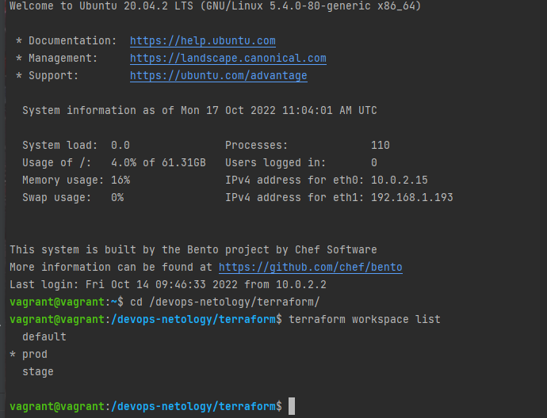
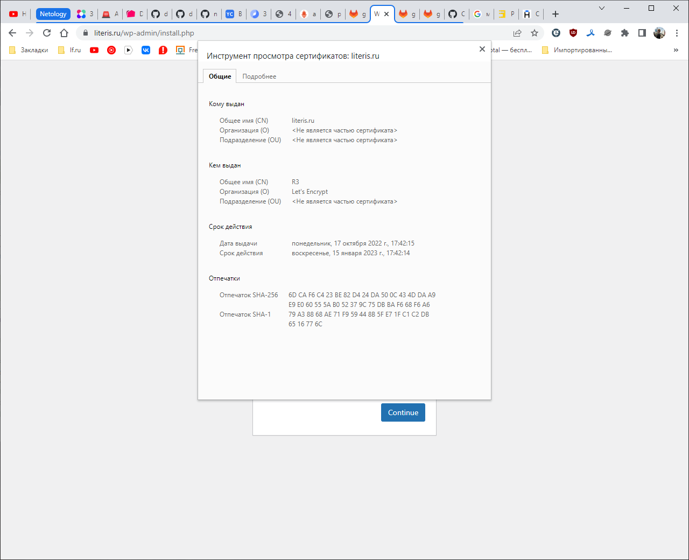
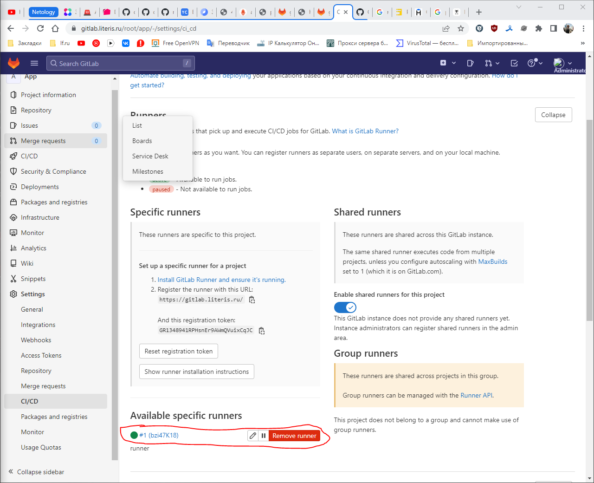
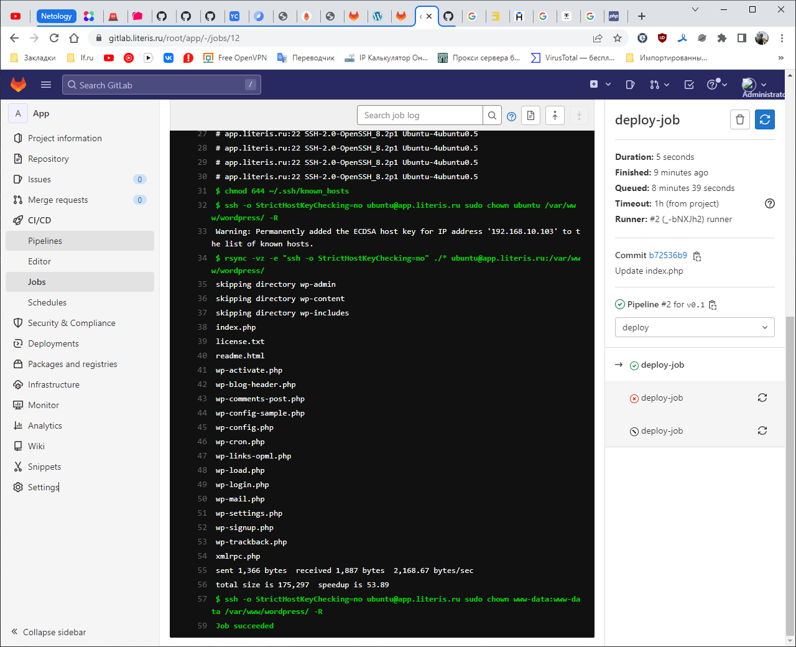
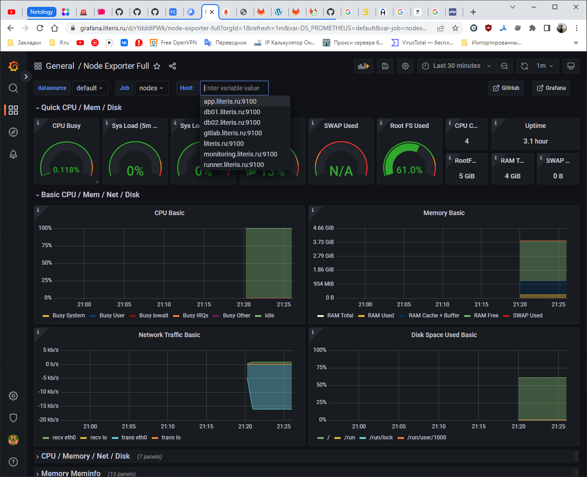
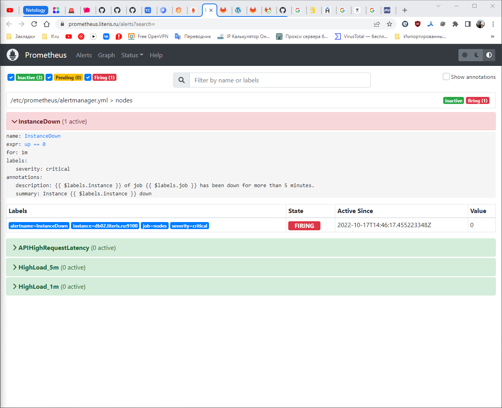
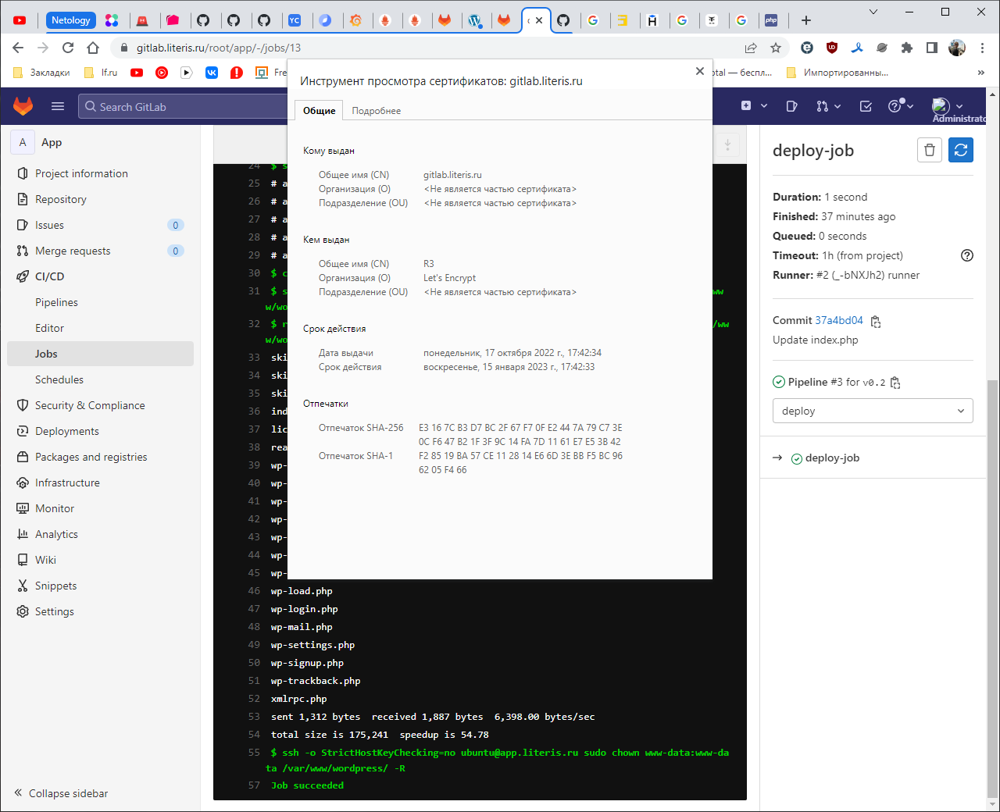
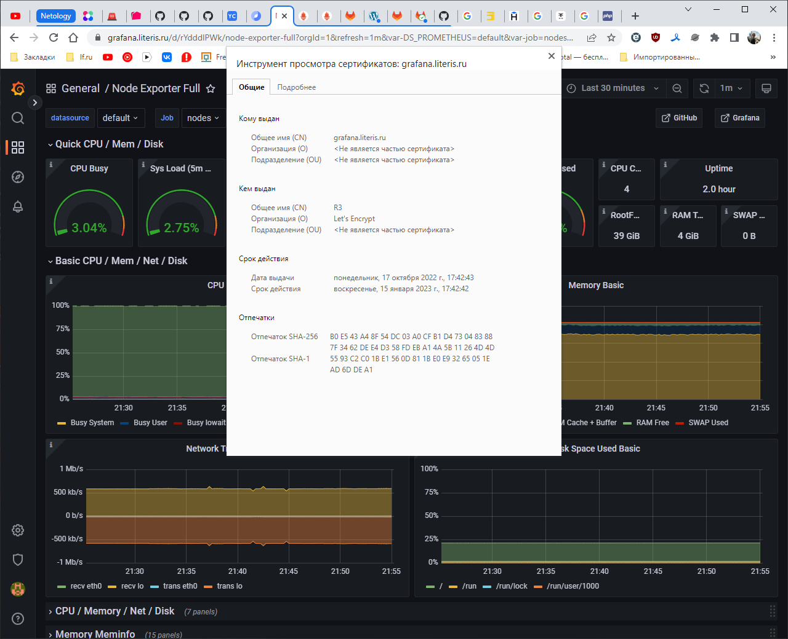
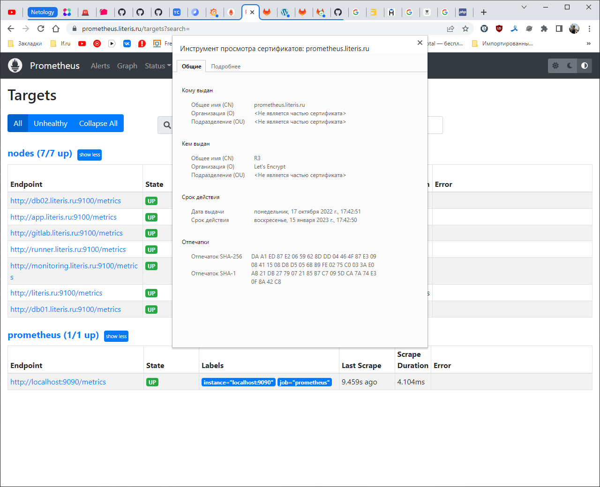
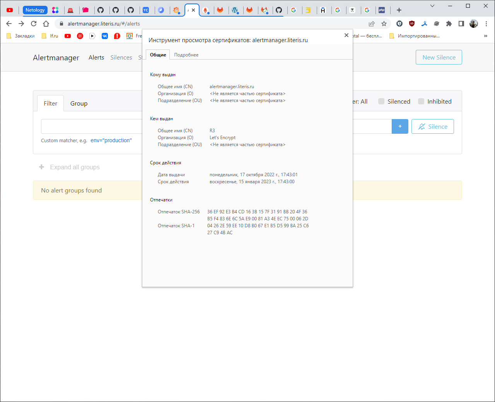

# Дипломный практикум в YandexCloud

## 1. Регистрация доменного имени

Доменное имя зарегистрировано:


## 2. Создание инфраструктуры

Чтобы не занимать большие объемы в описании работы, перед работой я создал [чеклист](diplom_checklist.md) в котором 
описывал всё что делал на определенных этапах.

В данной работе мной был подготовлен средствами терраформа [s3 хранилище в YC](terraform/bucket)

Созданы 2 воркспейса:



Изначально я планировал описать переменные чтобы имена хостов записывались по разному в зависимости от воркспейса, но 
изза нехватки времени я не до конца доделал это, в данный момент у меня прописаны только разные адреса подсетей для
stage и prod. Так же я отдельно в веб интерфейсе яндекса настроил резервирование белых IP адресов чтобы не ждать каждый
раз обновления DNS.

Инфраструктура успешно создается и уничтожается по командам [терраформа](terraform)
<details>
    <summary>terraform apply</summary>
    
```shell
vagrant@vagrant:/devops-netology/terraform$ terraform apply

Terraform used the selected providers to generate the following execution plan. Resource actions are indicated with the following symbols:
  + create

Terraform will perform the following actions:

  # local_file.inventory will be created
  + resource "local_file" "inventory" {
      + content              = <<-EOT
            # Ansible inventory containing variable values from Terraform.
            # Generated by Terraform.

            [nginx]
            literis.ru ansible_host=62.84.116.237 ansible_user=ubuntu

            [mysql]
            db01.literis.ru ansible_host=192.168.10.101 ansible_user=ubuntu
            db02.literis.ru ansible_host=192.168.10.102 ansible_user=ubuntu

            [wordpress]
            app.literis.ru ansible_host=192.168.10.103 ansible_user=ubuntu

            [gitlab]
            gitlab.literis.ru ansible_host=192.168.10.104 ansible_user=ubuntu

            [runner]
            runner.literis.ru ansible_host=192.168.10.105 ansible_user=ubuntu

            [monitoring]
            monitoring.literis.ru ansible_host=192.168.10.106 ansible_user=ubuntu

            [nodes:children]
            mysql
            wordpress
            gitlab
            runner
            monitoring

            [nodes:vars]
            ansible_ssh_common_args= "-o StrictHostKeyChecking=no -o UserKnownHostsFile=/dev/null -J ubuntu@62.84.116.237"
        EOT
      + directory_permission = "0777"
      + file_permission      = "0777"
      + filename             = "../ansible/inventory"
      + id                   = (known after apply)
    }

  # yandex_compute_instance.app will be created
  + resource "yandex_compute_instance" "app" {
      + allow_stopping_for_update = true
      + created_at                = (known after apply)
      + folder_id                 = (known after apply)
      + fqdn                      = (known after apply)
      + hostname                  = "app.literis.ru"
      + id                        = (known after apply)
      + metadata                  = {
          + "serial-port-enable" = "1"
          + "ssh-keys"           = <<-EOT
                ubuntu:ssh-rsa AAAAB3NzaC1yc2EAAAADAQABAAABAQDVMRqJbM4lCfJHbmIimGZ34JtRk7Jo1QxsvR5mtqR31DTVP057oE43iLb6vO+57c77bbpw3hbhMm727UgZbF9xkSoi0Mu9Ayx
nwT6fQsQmw19SA3AI8H6uXfqXvsK5Mq3zOKzDiSjNxsZWpCMFJhWIalmUcOHyOzVnydmXjgxOcBPf9McUOgKBQi0ZVkep0zzrhngON1f42Dy0JlJEUzALQRsnjKebyN+42F7EEt+b1iVoS1BT+KnxdMTa0iOQp
kkxrToG2+9jNu54DFOlC1nghK8+zaxOyAmTet48iCcXZhWmCaMJNhhz4om7mAIIXz4T5L8sVr/71Z6FkvETOryx vagrant@vagrant
            EOT
        }
      + name                      = "app"
      + network_acceleration_type = "standard"
      + platform_id               = "standard-v1"
      + service_account_id        = (known after apply)
      + status                    = (known after apply)
      + zone                      = (known after apply)

      + boot_disk {
          + auto_delete = true
          + device_name = (known after apply)
          + disk_id     = (known after apply)
          + mode        = (known after apply)

          + initialize_params {
              + block_size  = (known after apply)
              + description = (known after apply)
              + image_id    = "fd8f1tik9a7ap9ik2dg1"
              + name        = (known after apply)
              + size        = (known after apply)
              + snapshot_id = (known after apply)
              + type        = "network-hdd"
            }
        }

      + network_interface {
          + index              = (known after apply)
          + ip_address         = "192.168.10.103"
          + ipv4               = true
          + ipv6               = (known after apply)
          + ipv6_address       = (known after apply)
          + mac_address        = (known after apply)
          + nat                = false
          + nat_ip_address     = (known after apply)
          + nat_ip_version     = (known after apply)
          + security_group_ids = (known after apply)
          + subnet_id          = "e9bk73fbfmdaiuimu8bf"
        }

      + placement_policy {
          + host_affinity_rules = (known after apply)
          + placement_group_id  = (known after apply)
        }

      + resources {
          + core_fraction = 100
          + cores         = 4
          + memory        = 4
        }

      + scheduling_policy {
          + preemptible = (known after apply)
        }
    }

  # yandex_compute_instance.db01 will be created
  + resource "yandex_compute_instance" "db01" {
      + allow_stopping_for_update = true
      + created_at                = (known after apply)
      + folder_id                 = (known after apply)
      + fqdn                      = (known after apply)
      + hostname                  = "db01.literis.ru"
      + id                        = (known after apply)
      + metadata                  = {
          + "serial-port-enable" = "1"
          + "ssh-keys"           = <<-EOT
                ubuntu:ssh-rsa AAAAB3NzaC1yc2EAAAADAQABAAABAQDVMRqJbM4lCfJHbmIimGZ34JtRk7Jo1QxsvR5mtqR31DTVP057oE43iLb6vO+57c77bbpw3hbhMm727UgZbF9xkSoi0Mu9Ayx
nwT6fQsQmw19SA3AI8H6uXfqXvsK5Mq3zOKzDiSjNxsZWpCMFJhWIalmUcOHyOzVnydmXjgxOcBPf9McUOgKBQi0ZVkep0zzrhngON1f42Dy0JlJEUzALQRsnjKebyN+42F7EEt+b1iVoS1BT+KnxdMTa0iOQp
kkxrToG2+9jNu54DFOlC1nghK8+zaxOyAmTet48iCcXZhWmCaMJNhhz4om7mAIIXz4T5L8sVr/71Z6FkvETOryx vagrant@vagrant
            EOT
        }
      + name                      = "db01"
      + network_acceleration_type = "standard"
      + platform_id               = "standard-v1"
      + service_account_id        = (known after apply)
      + status                    = (known after apply)
      + zone                      = (known after apply)

      + boot_disk {
          + auto_delete = true
          + device_name = (known after apply)
          + disk_id     = (known after apply)
          + mode        = (known after apply)

          + initialize_params {
              + block_size  = (known after apply)
              + description = (known after apply)
              + image_id    = "fd8f1tik9a7ap9ik2dg1"
              + name        = (known after apply)
              + size        = (known after apply)
              + snapshot_id = (known after apply)
              + type        = "network-hdd"
            }
        }

      + network_interface {
          + index              = (known after apply)
          + ip_address         = "192.168.10.101"
          + ipv4               = true
          + ipv6               = (known after apply)
          + ipv6_address       = (known after apply)
          + mac_address        = (known after apply)
          + nat                = false
          + nat_ip_address     = (known after apply)
          + nat_ip_version     = (known after apply)
          + security_group_ids = (known after apply)
          + subnet_id          = "e9bk73fbfmdaiuimu8bf"
        }

      + placement_policy {
          + host_affinity_rules = (known after apply)
          + placement_group_id  = (known after apply)
        }

      + resources {
          + core_fraction = 100
          + cores         = 4
          + memory        = 4
        }

      + scheduling_policy {
          + preemptible = (known after apply)
        }
    }

  # yandex_compute_instance.db02 will be created
  + resource "yandex_compute_instance" "db02" {
      + allow_stopping_for_update = true
      + created_at                = (known after apply)
      + folder_id                 = (known after apply)
      + fqdn                      = (known after apply)
      + hostname                  = "db02.literis.ru"
      + id                        = (known after apply)
      + metadata                  = {
          + "serial-port-enable" = "1"
          + "ssh-keys"           = <<-EOT
                ubuntu:ssh-rsa AAAAB3NzaC1yc2EAAAADAQABAAABAQDVMRqJbM4lCfJHbmIimGZ34JtRk7Jo1QxsvR5mtqR31DTVP057oE43iLb6vO+57c77bbpw3hbhMm727UgZbF9xkSoi0Mu9Ayx
nwT6fQsQmw19SA3AI8H6uXfqXvsK5Mq3zOKzDiSjNxsZWpCMFJhWIalmUcOHyOzVnydmXjgxOcBPf9McUOgKBQi0ZVkep0zzrhngON1f42Dy0JlJEUzALQRsnjKebyN+42F7EEt+b1iVoS1BT+KnxdMTa0iOQp
kkxrToG2+9jNu54DFOlC1nghK8+zaxOyAmTet48iCcXZhWmCaMJNhhz4om7mAIIXz4T5L8sVr/71Z6FkvETOryx vagrant@vagrant
            EOT
        }
      + name                      = "db02"
      + network_acceleration_type = "standard"
      + platform_id               = "standard-v1"
      + service_account_id        = (known after apply)
      + status                    = (known after apply)
      + zone                      = (known after apply)

      + boot_disk {
          + auto_delete = true
          + device_name = (known after apply)
          + disk_id     = (known after apply)
          + mode        = (known after apply)

          + initialize_params {
              + block_size  = (known after apply)
              + description = (known after apply)
              + image_id    = "fd8f1tik9a7ap9ik2dg1"
              + name        = (known after apply)
              + size        = (known after apply)
              + snapshot_id = (known after apply)
              + type        = "network-hdd"
            }
        }

      + network_interface {
          + index              = (known after apply)
          + ip_address         = "192.168.10.102"
          + ipv4               = true
          + ipv6               = (known after apply)
          + ipv6_address       = (known after apply)
          + mac_address        = (known after apply)
          + nat                = false
          + nat_ip_address     = (known after apply)
          + nat_ip_version     = (known after apply)
          + security_group_ids = (known after apply)
          + subnet_id          = "e9bk73fbfmdaiuimu8bf"
        }

      + placement_policy {
          + host_affinity_rules = (known after apply)
          + placement_group_id  = (known after apply)
        }

      + resources {
          + core_fraction = 100
          + cores         = 4
          + memory        = 4
        }

      + scheduling_policy {
          + preemptible = (known after apply)
        }
    }

  # yandex_compute_instance.gitlab will be created
  + resource "yandex_compute_instance" "gitlab" {
      + allow_stopping_for_update = true
      + created_at                = (known after apply)
      + folder_id                 = (known after apply)
      + fqdn                      = (known after apply)
      + hostname                  = "gitlab.literis.ru"
      + id                        = (known after apply)
      + metadata                  = {
          + "serial-port-enable" = "1"
          + "ssh-keys"           = <<-EOT
                ubuntu:ssh-rsa AAAAB3NzaC1yc2EAAAADAQABAAABAQDVMRqJbM4lCfJHbmIimGZ34JtRk7Jo1QxsvR5mtqR31DTVP057oE43iLb6vO+57c77bbpw3hbhMm727UgZbF9xkSoi0Mu9Ayx
nwT6fQsQmw19SA3AI8H6uXfqXvsK5Mq3zOKzDiSjNxsZWpCMFJhWIalmUcOHyOzVnydmXjgxOcBPf9McUOgKBQi0ZVkep0zzrhngON1f42Dy0JlJEUzALQRsnjKebyN+42F7EEt+b1iVoS1BT+KnxdMTa0iOQp
kkxrToG2+9jNu54DFOlC1nghK8+zaxOyAmTet48iCcXZhWmCaMJNhhz4om7mAIIXz4T5L8sVr/71Z6FkvETOryx vagrant@vagrant
            EOT
        }
      + name                      = "gitlab"
      + network_acceleration_type = "standard"
      + platform_id               = "standard-v1"
      + service_account_id        = (known after apply)
      + status                    = (known after apply)
      + zone                      = (known after apply)

      + boot_disk {
          + auto_delete = true
          + device_name = (known after apply)
          + disk_id     = (known after apply)
          + mode        = (known after apply)

          + initialize_params {
              + block_size  = (known after apply)
              + description = (known after apply)
              + image_id    = "fd8f1tik9a7ap9ik2dg1"
              + name        = (known after apply)
              + size        = 40
              + snapshot_id = (known after apply)
              + type        = "network-hdd"
            }
        }

      + network_interface {
          + index              = (known after apply)
          + ip_address         = "192.168.10.104"
          + ipv4               = true
          + ipv6               = (known after apply)
          + ipv6_address       = (known after apply)
          + mac_address        = (known after apply)
          + nat                = false
          + nat_ip_address     = (known after apply)
          + nat_ip_version     = (known after apply)
          + security_group_ids = (known after apply)
          + subnet_id          = "e9bk73fbfmdaiuimu8bf"
        }

      + placement_policy {
          + host_affinity_rules = (known after apply)
          + placement_group_id  = (known after apply)
        }

      + resources {
          + core_fraction = 100
          + cores         = 4
          + memory        = 4
        }

      + scheduling_policy {
          + preemptible = (known after apply)
        }
    }

  # yandex_compute_instance.monitoring will be created
  + resource "yandex_compute_instance" "monitoring" {
      + allow_stopping_for_update = true
      + created_at                = (known after apply)
      + folder_id                 = (known after apply)
      + fqdn                      = (known after apply)
      + hostname                  = "monitoring.literis.ru"
      + id                        = (known after apply)
      + metadata                  = {
          + "serial-port-enable" = "1"
          + "ssh-keys"           = <<-EOT
                ubuntu:ssh-rsa AAAAB3NzaC1yc2EAAAADAQABAAABAQDVMRqJbM4lCfJHbmIimGZ34JtRk7Jo1QxsvR5mtqR31DTVP057oE43iLb6vO+57c77bbpw3hbhMm727UgZbF9xkSoi0Mu9Ayx
nwT6fQsQmw19SA3AI8H6uXfqXvsK5Mq3zOKzDiSjNxsZWpCMFJhWIalmUcOHyOzVnydmXjgxOcBPf9McUOgKBQi0ZVkep0zzrhngON1f42Dy0JlJEUzALQRsnjKebyN+42F7EEt+b1iVoS1BT+KnxdMTa0iOQp
kkxrToG2+9jNu54DFOlC1nghK8+zaxOyAmTet48iCcXZhWmCaMJNhhz4om7mAIIXz4T5L8sVr/71Z6FkvETOryx vagrant@vagrant
            EOT
        }
      + name                      = "monitoring"
      + network_acceleration_type = "standard"
      + platform_id               = "standard-v1"
      + service_account_id        = (known after apply)
      + status                    = (known after apply)
      + zone                      = (known after apply)

      + boot_disk {
          + auto_delete = true
          + device_name = (known after apply)
          + disk_id     = (known after apply)
          + mode        = (known after apply)

          + initialize_params {
              + block_size  = (known after apply)
              + description = (known after apply)
              + image_id    = "fd8f1tik9a7ap9ik2dg1"
              + name        = (known after apply)
              + size        = (known after apply)
              + snapshot_id = (known after apply)
              + type        = "network-hdd"
            }
        }

      + network_interface {
          + index              = (known after apply)
          + ip_address         = "192.168.10.106"
          + ipv4               = true
          + ipv6               = (known after apply)
          + ipv6_address       = (known after apply)
          + mac_address        = (known after apply)
          + nat                = false
          + nat_ip_address     = (known after apply)
          + nat_ip_version     = (known after apply)
          + security_group_ids = (known after apply)
          + subnet_id          = "e9bk73fbfmdaiuimu8bf"
        }

      + placement_policy {
          + host_affinity_rules = (known after apply)
          + placement_group_id  = (known after apply)
        }

      + resources {
          + core_fraction = 100
          + cores         = 4
          + memory        = 4
        }

      + scheduling_policy {
          + preemptible = (known after apply)
        }
    }

  # yandex_compute_instance.nginx will be created
  + resource "yandex_compute_instance" "nginx" {
      + allow_stopping_for_update = true
      + created_at                = (known after apply)
      + folder_id                 = (known after apply)
      + fqdn                      = (known after apply)
      + hostname                  = "nginx-prod"
      + id                        = (known after apply)
      + metadata                  = {
          + "serial-port-enable" = "1"
          + "ssh-keys"           = <<-EOT
                ubuntu:ssh-rsa AAAAB3NzaC1yc2EAAAADAQABAAABAQDVMRqJbM4lCfJHbmIimGZ34JtRk7Jo1QxsvR5mtqR31DTVP057oE43iLb6vO+57c77bbpw3hbhMm727UgZbF9xkSoi0Mu9Ayx
nwT6fQsQmw19SA3AI8H6uXfqXvsK5Mq3zOKzDiSjNxsZWpCMFJhWIalmUcOHyOzVnydmXjgxOcBPf9McUOgKBQi0ZVkep0zzrhngON1f42Dy0JlJEUzALQRsnjKebyN+42F7EEt+b1iVoS1BT+KnxdMTa0iOQp
kkxrToG2+9jNu54DFOlC1nghK8+zaxOyAmTet48iCcXZhWmCaMJNhhz4om7mAIIXz4T5L8sVr/71Z6FkvETOryx vagrant@vagrant
            EOT
        }
      + name                      = "nginx-prod"
      + network_acceleration_type = "standard"
      + platform_id               = "standard-v1"
      + service_account_id        = (known after apply)
      + status                    = (known after apply)
      + zone                      = (known after apply)

      + boot_disk {
          + auto_delete = true
          + device_name = (known after apply)
          + disk_id     = (known after apply)
          + mode        = (known after apply)

          + initialize_params {
              + block_size  = (known after apply)
              + description = (known after apply)
              + image_id    = "fd80d7fnvf399b1c207j"
              + name        = (known after apply)
              + size        = (known after apply)
              + snapshot_id = (known after apply)
              + type        = "network-hdd"
            }
        }

      + network_interface {
          + index              = (known after apply)
          + ip_address         = "192.168.10.100"
          + ipv4               = true
          + ipv6               = (known after apply)
          + ipv6_address       = (known after apply)
          + mac_address        = (known after apply)
          + nat                = true
          + nat_ip_address     = "62.84.116.237"
          + nat_ip_version     = (known after apply)
          + security_group_ids = (known after apply)
          + subnet_id          = "e9bk73fbfmdaiuimu8bf"
        }

      + placement_policy {
          + host_affinity_rules = (known after apply)
          + placement_group_id  = (known after apply)
        }

      + resources {
          + core_fraction = 100
          + cores         = 2
          + memory        = 2
        }

      + scheduling_policy {
          + preemptible = (known after apply)
        }
    }

  # yandex_compute_instance.runner will be created
  + resource "yandex_compute_instance" "runner" {
      + allow_stopping_for_update = true
      + created_at                = (known after apply)
      + folder_id                 = (known after apply)
      + fqdn                      = (known after apply)
      + hostname                  = "runner.literis.ru"
      + id                        = (known after apply)
      + metadata                  = {
          + "serial-port-enable" = "1"
          + "ssh-keys"           = <<-EOT
                ubuntu:ssh-rsa AAAAB3NzaC1yc2EAAAADAQABAAABAQDVMRqJbM4lCfJHbmIimGZ34JtRk7Jo1QxsvR5mtqR31DTVP057oE43iLb6vO+57c77bbpw3hbhMm727UgZbF9xkSoi0Mu9Ayx
nwT6fQsQmw19SA3AI8H6uXfqXvsK5Mq3zOKzDiSjNxsZWpCMFJhWIalmUcOHyOzVnydmXjgxOcBPf9McUOgKBQi0ZVkep0zzrhngON1f42Dy0JlJEUzALQRsnjKebyN+42F7EEt+b1iVoS1BT+KnxdMTa0iOQp
kkxrToG2+9jNu54DFOlC1nghK8+zaxOyAmTet48iCcXZhWmCaMJNhhz4om7mAIIXz4T5L8sVr/71Z6FkvETOryx vagrant@vagrant
            EOT
        }
      + name                      = "runner"
      + network_acceleration_type = "standard"
      + platform_id               = "standard-v1"
      + service_account_id        = (known after apply)
      + status                    = (known after apply)
      + zone                      = (known after apply)

      + boot_disk {
          + auto_delete = true
          + device_name = (known after apply)
          + disk_id     = (known after apply)
          + mode        = (known after apply)

          + initialize_params {
              + block_size  = (known after apply)
              + description = (known after apply)
              + image_id    = "fd8f1tik9a7ap9ik2dg1"
              + name        = (known after apply)
              + size        = (known after apply)
              + snapshot_id = (known after apply)
              + type        = "network-hdd"
            }
        }

      + network_interface {
          + index              = (known after apply)
          + ip_address         = "192.168.10.105"
          + ipv4               = true
          + ipv6               = (known after apply)
          + ipv6_address       = (known after apply)
          + mac_address        = (known after apply)
          + nat                = false
          + nat_ip_address     = (known after apply)
          + nat_ip_version     = (known after apply)
          + security_group_ids = (known after apply)
          + subnet_id          = "e9bk73fbfmdaiuimu8bf"
        }

      + placement_policy {
          + host_affinity_rules = (known after apply)
          + placement_group_id  = (known after apply)
        }

      + resources {
          + core_fraction = 100
          + cores         = 4
          + memory        = 4
        }

      + scheduling_policy {
          + preemptible = (known after apply)
        }
    }

Plan: 8 to add, 0 to change, 0 to destroy.

Changes to Outputs:
  + external_nginx_ip_address      = [
      + "62.84.116.237",
    ]
  + internal_app_ip_address        = [
      + "192.168.10.103",
    ]
  + internal_db01_ip_address       = [
      + "192.168.10.101",
    ]
  + internal_db02_ip_address       = [
      + "192.168.10.102",
    ]
  + internal_gitlab_ip_address     = [
      + "192.168.10.104",
    ]
  + internal_monitoring_ip_address = [
      + "192.168.10.106",
    ]
  + internal_nginx_ip_address      = [
      + "192.168.10.100",
    ]
  + internal_runner_ip_address     = [
      + "192.168.10.105",
    ]

Do you want to perform these actions in workspace "prod"?
  Terraform will perform the actions described above.
  Only 'yes' will be accepted to approve.

  Enter a value: yes

yandex_compute_instance.monitoring: Creating...
yandex_compute_instance.app: Creating...
yandex_compute_instance.runner: Creating...
yandex_compute_instance.db02: Creating...
yandex_compute_instance.gitlab: Creating...
yandex_compute_instance.db01: Creating...
yandex_compute_instance.nginx: Creating...
yandex_compute_instance.db02: Still creating... [10s elapsed]
yandex_compute_instance.runner: Still creating... [10s elapsed]
yandex_compute_instance.app: Still creating... [10s elapsed]
yandex_compute_instance.monitoring: Still creating... [10s elapsed]
yandex_compute_instance.nginx: Still creating... [10s elapsed]
yandex_compute_instance.db01: Still creating... [10s elapsed]
yandex_compute_instance.gitlab: Still creating... [10s elapsed]
yandex_compute_instance.runner: Still creating... [20s elapsed]
yandex_compute_instance.db02: Still creating... [20s elapsed]
yandex_compute_instance.app: Still creating... [20s elapsed]
yandex_compute_instance.monitoring: Still creating... [20s elapsed]
yandex_compute_instance.db01: Still creating... [20s elapsed]
yandex_compute_instance.nginx: Still creating... [20s elapsed]
yandex_compute_instance.gitlab: Still creating... [20s elapsed]
yandex_compute_instance.db02: Creation complete after 21s [id=fhm5p2n3i86596rofas1]
yandex_compute_instance.nginx: Creation complete after 23s [id=fhmghn35r8oigrt45gcu]
yandex_compute_instance.app: Creation complete after 27s [id=fhmj7srlmq3gghhl19lg]
yandex_compute_instance.monitoring: Creation complete after 27s [id=fhmd3bge8g00p4bkd4mm]
yandex_compute_instance.gitlab: Creation complete after 27s [id=fhmgofrbm3g8s4d5m4tc]
yandex_compute_instance.runner: Still creating... [30s elapsed]
yandex_compute_instance.db01: Still creating... [30s elapsed]
yandex_compute_instance.db01: Creation complete after 32s [id=fhmlsarrdevi8vu82id8]
yandex_compute_instance.runner: Creation complete after 32s [id=fhmmoprir7s43368foh5]
local_file.inventory: Creating...
local_file.inventory: Creation complete after 0s [id=f17307756eee697302cc84836caf804d6297176c]

Apply complete! Resources: 8 added, 0 changed, 0 destroyed.

Outputs:

external_nginx_ip_address = [
  "62.84.116.237",
]
internal_app_ip_address = [
  "192.168.10.103",
]
internal_db01_ip_address = [
  "192.168.10.101",
]
internal_db02_ip_address = [
  "192.168.10.102",
]
internal_gitlab_ip_address = [
  "192.168.10.104",
]
internal_monitoring_ip_address = [
  "192.168.10.106",
]
internal_nginx_ip_address = [
  "192.168.10.100",
]
internal_runner_ip_address = [
  "192.168.10.105",
]

```
</details>

<details>
    <summary>terraform destroy</summary>

```shell
vagrant@vagrant:/devops-netology/terraform$ terraform destroy
yandex_compute_instance.db01: Refreshing state... [id=fhmlsarrdevi8vu82id8]
yandex_compute_instance.gitlab: Refreshing state... [id=fhmgofrbm3g8s4d5m4tc]
yandex_compute_instance.app: Refreshing state... [id=fhmj7srlmq3gghhl19lg]
yandex_compute_instance.monitoring: Refreshing state... [id=fhmd3bge8g00p4bkd4mm]
yandex_compute_instance.db02: Refreshing state... [id=fhm5p2n3i86596rofas1]
yandex_compute_instance.runner: Refreshing state... [id=fhmmoprir7s43368foh5]
yandex_compute_instance.nginx: Refreshing state... [id=fhmghn35r8oigrt45gcu]
local_file.inventory: Refreshing state... [id=f17307756eee697302cc84836caf804d6297176c]

Terraform used the selected providers to generate the following execution plan. Resource actions are indicated with the following symbols:
  - destroy

Terraform will perform the following actions:

  # local_file.inventory will be destroyed
  - resource "local_file" "inventory" {
      - content              = <<-EOT
            # Ansible inventory containing variable values from Terraform.
            # Generated by Terraform.

            [nginx]
            literis.ru ansible_host=62.84.116.237 ansible_user=ubuntu

            [mysql]
            db01.literis.ru ansible_host=192.168.10.101 ansible_user=ubuntu
            db02.literis.ru ansible_host=192.168.10.102 ansible_user=ubuntu

            [wordpress]
            app.literis.ru ansible_host=192.168.10.103 ansible_user=ubuntu

            [gitlab]
            gitlab.literis.ru ansible_host=192.168.10.104 ansible_user=ubuntu

            [runner]
            runner.literis.ru ansible_host=192.168.10.105 ansible_user=ubuntu

            [monitoring]
            monitoring.literis.ru ansible_host=192.168.10.106 ansible_user=ubuntu

            [nodes:children]
            mysql
            wordpress
            gitlab
            runner
            monitoring

            [nodes:vars]
            ansible_ssh_common_args= "-o StrictHostKeyChecking=no -o UserKnownHostsFile=/dev/null -J ubuntu@62.84.116.237"
        EOT -> null
      - directory_permission = "0777" -> null
      - file_permission      = "0777" -> null
      - filename             = "../ansible/inventory" -> null
      - id                   = "f17307756eee697302cc84836caf804d6297176c" -> null
    }

  # yandex_compute_instance.app will be destroyed
  - resource "yandex_compute_instance" "app" {
      - allow_stopping_for_update = true -> null
      - created_at                = "2022-10-17T11:10:28Z" -> null
      - folder_id                 = "b1g3bmr3urqifor39t74" -> null
      - fqdn                      = "app.literis.ru" -> null
      - hostname                  = "app.literis.ru" -> null
      - id                        = "fhmj7srlmq3gghhl19lg" -> null
      - labels                    = {} -> null
      - metadata                  = {
          - "serial-port-enable" = "1"
          - "ssh-keys"           = <<-EOT
                ubuntu:ssh-rsa AAAAB3NzaC1yc2EAAAADAQABAAABAQDVMRqJbM4lCfJHbmIimGZ34JtRk7Jo1QxsvR5mtqR31DTVP057oE43iLb6vO+57c77bbpw3hbhMm727UgZbF9xkSoi0Mu9Ayx
nwT6fQsQmw19SA3AI8H6uXfqXvsK5Mq3zOKzDiSjNxsZWpCMFJhWIalmUcOHyOzVnydmXjgxOcBPf9McUOgKBQi0ZVkep0zzrhngON1f42Dy0JlJEUzALQRsnjKebyN+42F7EEt+b1iVoS1BT+KnxdMTa0iOQp
kkxrToG2+9jNu54DFOlC1nghK8+zaxOyAmTet48iCcXZhWmCaMJNhhz4om7mAIIXz4T5L8sVr/71Z6FkvETOryx vagrant@vagrant
            EOT
        } -> null
      - name                      = "app" -> null
      - network_acceleration_type = "standard" -> null
      - platform_id               = "standard-v1" -> null
      - status                    = "running" -> null
      - zone                      = "ru-central1-a" -> null

      - boot_disk {
          - auto_delete = true -> null
          - device_name = "fhm60n0dvfocmqqpk5vq" -> null
          - disk_id     = "fhm60n0dvfocmqqpk5vq" -> null
          - mode        = "READ_WRITE" -> null

          - initialize_params {
              - block_size = 4096 -> null
              - image_id   = "fd8f1tik9a7ap9ik2dg1" -> null
              - size       = 5 -> null
              - type       = "network-hdd" -> null
            }
        }

      - network_interface {
          - index              = 0 -> null
          - ip_address         = "192.168.10.103" -> null
          - ipv4               = true -> null
          - ipv6               = false -> null
          - mac_address        = "d0:0d:13:3f:37:5b" -> null
          - nat                = false -> null
          - security_group_ids = [] -> null
          - subnet_id          = "e9bk73fbfmdaiuimu8bf" -> null
        }

      - placement_policy {
          - host_affinity_rules = [] -> null
        }

      - resources {
          - core_fraction = 100 -> null
          - cores         = 4 -> null
          - gpus          = 0 -> null
          - memory        = 4 -> null
        }

      - scheduling_policy {
          - preemptible = false -> null
        }
    }

  # yandex_compute_instance.db01 will be destroyed
  - resource "yandex_compute_instance" "db01" {
      - allow_stopping_for_update = true -> null
      - created_at                = "2022-10-17T11:10:29Z" -> null
      - folder_id                 = "b1g3bmr3urqifor39t74" -> null
      - fqdn                      = "db01.literis.ru" -> null
      - hostname                  = "db01.literis.ru" -> null
      - id                        = "fhmlsarrdevi8vu82id8" -> null
      - labels                    = {} -> null
      - metadata                  = {
          - "serial-port-enable" = "1"
          - "ssh-keys"           = <<-EOT
                ubuntu:ssh-rsa AAAAB3NzaC1yc2EAAAADAQABAAABAQDVMRqJbM4lCfJHbmIimGZ34JtRk7Jo1QxsvR5mtqR31DTVP057oE43iLb6vO+57c77bbpw3hbhMm727UgZbF9xkSoi0Mu9Ayx
nwT6fQsQmw19SA3AI8H6uXfqXvsK5Mq3zOKzDiSjNxsZWpCMFJhWIalmUcOHyOzVnydmXjgxOcBPf9McUOgKBQi0ZVkep0zzrhngON1f42Dy0JlJEUzALQRsnjKebyN+42F7EEt+b1iVoS1BT+KnxdMTa0iOQp
kkxrToG2+9jNu54DFOlC1nghK8+zaxOyAmTet48iCcXZhWmCaMJNhhz4om7mAIIXz4T5L8sVr/71Z6FkvETOryx vagrant@vagrant
            EOT
        } -> null
      - name                      = "db01" -> null
      - network_acceleration_type = "standard" -> null
      - platform_id               = "standard-v1" -> null
      - status                    = "running" -> null
      - zone                      = "ru-central1-a" -> null

      - boot_disk {
          - auto_delete = true -> null
          - device_name = "fhmbr4va7oec4gtp5c8n" -> null
          - disk_id     = "fhmbr4va7oec4gtp5c8n" -> null
          - mode        = "READ_WRITE" -> null

          - initialize_params {
              - block_size = 4096 -> null
              - image_id   = "fd8f1tik9a7ap9ik2dg1" -> null
              - size       = 5 -> null
              - type       = "network-hdd" -> null
            }
        }

      - network_interface {
          - index              = 0 -> null
          - ip_address         = "192.168.10.101" -> null
          - ipv4               = true -> null
          - ipv6               = false -> null
          - mac_address        = "d0:0d:15:e2:b7:b6" -> null
          - nat                = false -> null
          - security_group_ids = [] -> null
          - subnet_id          = "e9bk73fbfmdaiuimu8bf" -> null
        }

      - placement_policy {
          - host_affinity_rules = [] -> null
        }

      - resources {
          - core_fraction = 100 -> null
          - cores         = 4 -> null
          - gpus          = 0 -> null
          - memory        = 4 -> null
        }

      - scheduling_policy {
          - preemptible = false -> null
        }
    }

  # yandex_compute_instance.db02 will be destroyed
  - resource "yandex_compute_instance" "db02" {
      - allow_stopping_for_update = true -> null
      - created_at                = "2022-10-17T11:10:28Z" -> null
      - folder_id                 = "b1g3bmr3urqifor39t74" -> null
      - fqdn                      = "db02.literis.ru" -> null
      - hostname                  = "db02.literis.ru" -> null
      - id                        = "fhm5p2n3i86596rofas1" -> null
      - labels                    = {} -> null
      - metadata                  = {
          - "serial-port-enable" = "1"
          - "ssh-keys"           = <<-EOT
                ubuntu:ssh-rsa AAAAB3NzaC1yc2EAAAADAQABAAABAQDVMRqJbM4lCfJHbmIimGZ34JtRk7Jo1QxsvR5mtqR31DTVP057oE43iLb6vO+57c77bbpw3hbhMm727UgZbF9xkSoi0Mu9Ayx
nwT6fQsQmw19SA3AI8H6uXfqXvsK5Mq3zOKzDiSjNxsZWpCMFJhWIalmUcOHyOzVnydmXjgxOcBPf9McUOgKBQi0ZVkep0zzrhngON1f42Dy0JlJEUzALQRsnjKebyN+42F7EEt+b1iVoS1BT+KnxdMTa0iOQp
kkxrToG2+9jNu54DFOlC1nghK8+zaxOyAmTet48iCcXZhWmCaMJNhhz4om7mAIIXz4T5L8sVr/71Z6FkvETOryx vagrant@vagrant
            EOT
        } -> null
      - name                      = "db02" -> null
      - network_acceleration_type = "standard" -> null
      - platform_id               = "standard-v1" -> null
      - status                    = "running" -> null
      - zone                      = "ru-central1-a" -> null

      - boot_disk {
          - auto_delete = true -> null
          - device_name = "fhmr3srrdi3114edplc2" -> null
          - disk_id     = "fhmr3srrdi3114edplc2" -> null
          - mode        = "READ_WRITE" -> null

          - initialize_params {
              - block_size = 4096 -> null
              - image_id   = "fd8f1tik9a7ap9ik2dg1" -> null
              - size       = 5 -> null
              - type       = "network-hdd" -> null
            }
        }

      - network_interface {
          - index              = 0 -> null
          - ip_address         = "192.168.10.102" -> null
          - ipv4               = true -> null
          - ipv6               = false -> null
          - mac_address        = "d0:0d:5c:8a:e3:92" -> null
          - nat                = false -> null
          - security_group_ids = [] -> null
          - subnet_id          = "e9bk73fbfmdaiuimu8bf" -> null
        }

      - placement_policy {
          - host_affinity_rules = [] -> null
        }

      - resources {
          - core_fraction = 100 -> null
          - cores         = 4 -> null
          - gpus          = 0 -> null
          - memory        = 4 -> null
        }

      - scheduling_policy {
          - preemptible = false -> null
        }
    }

  # yandex_compute_instance.gitlab will be destroyed
  - resource "yandex_compute_instance" "gitlab" {
      - allow_stopping_for_update = true -> null
      - created_at                = "2022-10-17T11:10:28Z" -> null
      - folder_id                 = "b1g3bmr3urqifor39t74" -> null
      - fqdn                      = "gitlab.literis.ru" -> null
      - hostname                  = "gitlab.literis.ru" -> null
      - id                        = "fhmgofrbm3g8s4d5m4tc" -> null
      - labels                    = {} -> null
      - metadata                  = {
          - "serial-port-enable" = "1"
          - "ssh-keys"           = <<-EOT
                ubuntu:ssh-rsa AAAAB3NzaC1yc2EAAAADAQABAAABAQDVMRqJbM4lCfJHbmIimGZ34JtRk7Jo1QxsvR5mtqR31DTVP057oE43iLb6vO+57c77bbpw3hbhMm727UgZbF9xkSoi0Mu9Ayx
nwT6fQsQmw19SA3AI8H6uXfqXvsK5Mq3zOKzDiSjNxsZWpCMFJhWIalmUcOHyOzVnydmXjgxOcBPf9McUOgKBQi0ZVkep0zzrhngON1f42Dy0JlJEUzALQRsnjKebyN+42F7EEt+b1iVoS1BT+KnxdMTa0iOQp
kkxrToG2+9jNu54DFOlC1nghK8+zaxOyAmTet48iCcXZhWmCaMJNhhz4om7mAIIXz4T5L8sVr/71Z6FkvETOryx vagrant@vagrant
            EOT
        } -> null
      - name                      = "gitlab" -> null
      - network_acceleration_type = "standard" -> null
      - platform_id               = "standard-v1" -> null
      - status                    = "running" -> null
      - zone                      = "ru-central1-a" -> null

      - boot_disk {
          - auto_delete = true -> null
          - device_name = "fhmsnpj34i489bn9jf6e" -> null
          - disk_id     = "fhmsnpj34i489bn9jf6e" -> null
          - mode        = "READ_WRITE" -> null

          - initialize_params {
              - block_size = 4096 -> null
              - image_id   = "fd8f1tik9a7ap9ik2dg1" -> null
              - size       = 40 -> null
              - type       = "network-hdd" -> null
            }
        }

      - network_interface {
          - index              = 0 -> null
          - ip_address         = "192.168.10.104" -> null
          - ipv4               = true -> null
          - ipv6               = false -> null
          - mac_address        = "d0:0d:10:c3:f6:bb" -> null
          - nat                = false -> null
          - security_group_ids = [] -> null
          - subnet_id          = "e9bk73fbfmdaiuimu8bf" -> null
        }

      - placement_policy {
          - host_affinity_rules = [] -> null
        }

      - resources {
          - core_fraction = 100 -> null
          - cores         = 4 -> null
          - gpus          = 0 -> null
          - memory        = 4 -> null
        }

      - scheduling_policy {
          - preemptible = false -> null
        }
    }

  # yandex_compute_instance.monitoring will be destroyed
  - resource "yandex_compute_instance" "monitoring" {
      - allow_stopping_for_update = true -> null
      - created_at                = "2022-10-17T11:10:28Z" -> null
      - folder_id                 = "b1g3bmr3urqifor39t74" -> null
      - fqdn                      = "monitoring.literis.ru" -> null
      - hostname                  = "monitoring.literis.ru" -> null
      - id                        = "fhmd3bge8g00p4bkd4mm" -> null
      - labels                    = {} -> null
      - metadata                  = {
          - "serial-port-enable" = "1"
          - "ssh-keys"           = <<-EOT
                ubuntu:ssh-rsa AAAAB3NzaC1yc2EAAAADAQABAAABAQDVMRqJbM4lCfJHbmIimGZ34JtRk7Jo1QxsvR5mtqR31DTVP057oE43iLb6vO+57c77bbpw3hbhMm727UgZbF9xkSoi0Mu9Ayx
nwT6fQsQmw19SA3AI8H6uXfqXvsK5Mq3zOKzDiSjNxsZWpCMFJhWIalmUcOHyOzVnydmXjgxOcBPf9McUOgKBQi0ZVkep0zzrhngON1f42Dy0JlJEUzALQRsnjKebyN+42F7EEt+b1iVoS1BT+KnxdMTa0iOQp
kkxrToG2+9jNu54DFOlC1nghK8+zaxOyAmTet48iCcXZhWmCaMJNhhz4om7mAIIXz4T5L8sVr/71Z6FkvETOryx vagrant@vagrant
            EOT
        } -> null
      - name                      = "monitoring" -> null
      - network_acceleration_type = "standard" -> null
      - platform_id               = "standard-v1" -> null
      - status                    = "running" -> null
      - zone                      = "ru-central1-a" -> null

      - boot_disk {
          - auto_delete = true -> null
          - device_name = "fhmjjk5piloon6mn8j00" -> null
          - disk_id     = "fhmjjk5piloon6mn8j00" -> null
          - mode        = "READ_WRITE" -> null

          - initialize_params {
              - block_size = 4096 -> null
              - image_id   = "fd8f1tik9a7ap9ik2dg1" -> null
              - size       = 5 -> null
              - type       = "network-hdd" -> null
            }
        }

      - network_interface {
          - index              = 0 -> null
          - ip_address         = "192.168.10.106" -> null
          - ipv4               = true -> null
          - ipv6               = false -> null
          - mac_address        = "d0:0d:d1:ae:0e:44" -> null
          - nat                = false -> null
          - security_group_ids = [] -> null
          - subnet_id          = "e9bk73fbfmdaiuimu8bf" -> null
        }

      - placement_policy {
          - host_affinity_rules = [] -> null
        }

      - resources {
          - core_fraction = 100 -> null
          - cores         = 4 -> null
          - gpus          = 0 -> null
          - memory        = 4 -> null
        }

      - scheduling_policy {
          - preemptible = false -> null
        }
    }

  # yandex_compute_instance.nginx will be destroyed
  - resource "yandex_compute_instance" "nginx" {
      - allow_stopping_for_update = true -> null
      - created_at                = "2022-10-17T11:10:28Z" -> null
      - folder_id                 = "b1g3bmr3urqifor39t74" -> null
      - fqdn                      = "nginx-prod.ru-central1.internal" -> null
      - hostname                  = "nginx-prod" -> null
      - id                        = "fhmghn35r8oigrt45gcu" -> null
      - labels                    = {} -> null
      - metadata                  = {
          - "serial-port-enable" = "1"
          - "ssh-keys"           = <<-EOT
                ubuntu:ssh-rsa AAAAB3NzaC1yc2EAAAADAQABAAABAQDVMRqJbM4lCfJHbmIimGZ34JtRk7Jo1QxsvR5mtqR31DTVP057oE43iLb6vO+57c77bbpw3hbhMm727UgZbF9xkSoi0Mu9Ayx
nwT6fQsQmw19SA3AI8H6uXfqXvsK5Mq3zOKzDiSjNxsZWpCMFJhWIalmUcOHyOzVnydmXjgxOcBPf9McUOgKBQi0ZVkep0zzrhngON1f42Dy0JlJEUzALQRsnjKebyN+42F7EEt+b1iVoS1BT+KnxdMTa0iOQp
kkxrToG2+9jNu54DFOlC1nghK8+zaxOyAmTet48iCcXZhWmCaMJNhhz4om7mAIIXz4T5L8sVr/71Z6FkvETOryx vagrant@vagrant
            EOT
        } -> null
      - name                      = "nginx-prod" -> null
      - network_acceleration_type = "standard" -> null
      - platform_id               = "standard-v1" -> null
      - status                    = "running" -> null
      - zone                      = "ru-central1-a" -> null

      - boot_disk {
          - auto_delete = true -> null
          - device_name = "fhmf1ptophjs2kvb0lbr" -> null
          - disk_id     = "fhmf1ptophjs2kvb0lbr" -> null
          - mode        = "READ_WRITE" -> null

          - initialize_params {
              - block_size = 4096 -> null
              - image_id   = "fd80d7fnvf399b1c207j" -> null
              - size       = 30 -> null
              - type       = "network-hdd" -> null
            }
        }

      - network_interface {
          - index              = 0 -> null
          - ip_address         = "192.168.10.100" -> null
          - ipv4               = true -> null
          - ipv6               = false -> null
          - mac_address        = "d0:0d:10:8d:c6:5d" -> null
          - nat                = true -> null
          - nat_ip_address     = "62.84.116.237" -> null
          - nat_ip_version     = "IPV4" -> null
          - security_group_ids = [] -> null
          - subnet_id          = "e9bk73fbfmdaiuimu8bf" -> null
        }

      - placement_policy {
          - host_affinity_rules = [] -> null
        }

      - resources {
          - core_fraction = 100 -> null
          - cores         = 2 -> null
          - gpus          = 0 -> null
          - memory        = 2 -> null
        }

      - scheduling_policy {
          - preemptible = false -> null
        }
    }

  # yandex_compute_instance.runner will be destroyed
  - resource "yandex_compute_instance" "runner" {
      - allow_stopping_for_update = true -> null
      - created_at                = "2022-10-17T11:10:28Z" -> null
      - folder_id                 = "b1g3bmr3urqifor39t74" -> null
      - fqdn                      = "runner.literis.ru" -> null
      - hostname                  = "runner.literis.ru" -> null
      - id                        = "fhmmoprir7s43368foh5" -> null
      - labels                    = {} -> null
      - metadata                  = {
          - "serial-port-enable" = "1"
          - "ssh-keys"           = <<-EOT
                ubuntu:ssh-rsa AAAAB3NzaC1yc2EAAAADAQABAAABAQDVMRqJbM4lCfJHbmIimGZ34JtRk7Jo1QxsvR5mtqR31DTVP057oE43iLb6vO+57c77bbpw3hbhMm727UgZbF9xkSoi0Mu9Ayx
nwT6fQsQmw19SA3AI8H6uXfqXvsK5Mq3zOKzDiSjNxsZWpCMFJhWIalmUcOHyOzVnydmXjgxOcBPf9McUOgKBQi0ZVkep0zzrhngON1f42Dy0JlJEUzALQRsnjKebyN+42F7EEt+b1iVoS1BT+KnxdMTa0iOQp
kkxrToG2+9jNu54DFOlC1nghK8+zaxOyAmTet48iCcXZhWmCaMJNhhz4om7mAIIXz4T5L8sVr/71Z6FkvETOryx vagrant@vagrant
            EOT
        } -> null
      - name                      = "runner" -> null
      - network_acceleration_type = "standard" -> null
      - platform_id               = "standard-v1" -> null
      - status                    = "running" -> null
      - zone                      = "ru-central1-a" -> null

      - boot_disk {
          - auto_delete = true -> null
          - device_name = "fhmqnh67q9rhphj07256" -> null
          - disk_id     = "fhmqnh67q9rhphj07256" -> null
          - mode        = "READ_WRITE" -> null

          - initialize_params {
              - block_size = 4096 -> null
              - image_id   = "fd8f1tik9a7ap9ik2dg1" -> null
              - size       = 5 -> null
              - type       = "network-hdd" -> null
            }
        }

      - network_interface {
          - index              = 0 -> null
          - ip_address         = "192.168.10.105" -> null
          - ipv4               = true -> null
          - ipv6               = false -> null
          - mac_address        = "d0:0d:16:c6:77:2d" -> null
          - nat                = false -> null
          - security_group_ids = [] -> null
          - subnet_id          = "e9bk73fbfmdaiuimu8bf" -> null
        }

      - placement_policy {
          - host_affinity_rules = [] -> null
        }

      - resources {
          - core_fraction = 100 -> null
          - cores         = 4 -> null
          - gpus          = 0 -> null
          - memory        = 4 -> null
        }

      - scheduling_policy {
          - preemptible = false -> null
        }
    }

Plan: 0 to add, 0 to change, 8 to destroy.

Changes to Outputs:
  - external_nginx_ip_address      = [
      - "62.84.116.237",
    ] -> null
  - internal_app_ip_address        = [
      - "192.168.10.103",
    ] -> null
  - internal_db01_ip_address       = [
      - "192.168.10.101",
    ] -> null
  - internal_db02_ip_address       = [
      - "192.168.10.102",
    ] -> null
  - internal_gitlab_ip_address     = [
      - "192.168.10.104",
    ] -> null
  - internal_monitoring_ip_address = [
      - "192.168.10.106",
    ] -> null
  - internal_nginx_ip_address      = [
      - "192.168.10.100",
    ] -> null
  - internal_runner_ip_address     = [
      - "192.168.10.105",
    ] -> null

Do you really want to destroy all resources in workspace "prod"?
  Terraform will destroy all your managed infrastructure, as shown above.
  There is no undo. Only 'yes' will be accepted to confirm.

  Enter a value: yes

local_file.inventory: Destroying... [id=f17307756eee697302cc84836caf804d6297176c]
local_file.inventory: Destruction complete after 0s
yandex_compute_instance.gitlab: Destroying... [id=fhmgofrbm3g8s4d5m4tc]
yandex_compute_instance.monitoring: Destroying... [id=fhmd3bge8g00p4bkd4mm]
yandex_compute_instance.nginx: Destroying... [id=fhmghn35r8oigrt45gcu]
yandex_compute_instance.runner: Destroying... [id=fhmmoprir7s43368foh5]
yandex_compute_instance.db01: Destroying... [id=fhmlsarrdevi8vu82id8]
yandex_compute_instance.db02: Destroying... [id=fhm5p2n3i86596rofas1]
yandex_compute_instance.app: Destroying... [id=fhmj7srlmq3gghhl19lg]
yandex_compute_instance.gitlab: Still destroying... [id=fhmgofrbm3g8s4d5m4tc, 10s elapsed]
yandex_compute_instance.db01: Still destroying... [id=fhmlsarrdevi8vu82id8, 10s elapsed]
yandex_compute_instance.monitoring: Still destroying... [id=fhmd3bge8g00p4bkd4mm, 10s elapsed]
yandex_compute_instance.nginx: Still destroying... [id=fhmghn35r8oigrt45gcu, 10s elapsed]
yandex_compute_instance.runner: Still destroying... [id=fhmmoprir7s43368foh5, 10s elapsed]
yandex_compute_instance.db02: Still destroying... [id=fhm5p2n3i86596rofas1, 10s elapsed]
yandex_compute_instance.app: Still destroying... [id=fhmj7srlmq3gghhl19lg, 10s elapsed]
yandex_compute_instance.db01: Destruction complete after 20s
yandex_compute_instance.gitlab: Still destroying... [id=fhmgofrbm3g8s4d5m4tc, 20s elapsed]
yandex_compute_instance.runner: Still destroying... [id=fhmmoprir7s43368foh5, 20s elapsed]
yandex_compute_instance.monitoring: Still destroying... [id=fhmd3bge8g00p4bkd4mm, 20s elapsed]
yandex_compute_instance.nginx: Still destroying... [id=fhmghn35r8oigrt45gcu, 20s elapsed]
yandex_compute_instance.db02: Still destroying... [id=fhm5p2n3i86596rofas1, 20s elapsed]
yandex_compute_instance.app: Still destroying... [id=fhmj7srlmq3gghhl19lg, 20s elapsed]
yandex_compute_instance.gitlab: Destruction complete after 22s
yandex_compute_instance.runner: Destruction complete after 22s
yandex_compute_instance.app: Destruction complete after 25s
yandex_compute_instance.db02: Destruction complete after 26s
yandex_compute_instance.nginx: Destruction complete after 26s
yandex_compute_instance.monitoring: Destruction complete after 26s

Destroy complete! Resources: 8 destroyed.
```
</details>

## 3. Установка Nginx и LetsEncrypt
Подготовлены 2 ansible роли [nginx](ansible/nginx) и [letsencrypt](ansible/letsencrypt)

Настроены необходимые доменные записи:


В роли nginx описаны [шаблоны конфигураций для сайтов](ansible/nginx/templates)

<details>
    <summary>ansible-playbook main.yml -i inventory -t certbot,nginx</summary>

```shell
vagrant@vagrant:/devops-netology/ansible$ ansible-playbook main.yml -i inventory -t certbot,nginx
[WARNING]: Ansible is being run in a world writable directory (/devops-netology/ansible), ignoring it as an ansible.cfg source. For more information see
https://docs.ansible.com/ansible/devel/reference_appendices/config.html#cfg-in-world-writable-dir

PLAY [nginx] *************************************************************************************************************************************************

TASK [Gathering Facts] ***************************************************************************************************************************************
The authenticity of host '62.84.116.237 (62.84.116.237)' can't be established.
ECDSA key fingerprint is SHA256:krGmixak+Rnme+sxfB72xQYYllCFusUiEPD95YWYQaY.
Are you sure you want to continue connecting (yes/no/[fingerprint])? yes
ok: [literis.ru]

TASK [letsencrypt : letsencrypt | Install Nginx Web Server] **************************************************************************************************
changed: [literis.ru]

TASK [letsencrypt : letsencrypt | Install Let's Encrypt client] **********************************************************************************************
changed: [literis.ru]

TASK [letsencrypt : letsencrypt | create letsencrypt directory] **********************************************************************************************
changed: [literis.ru]

TASK [letsencrypt : letsencrypt | adding http config and https redirect] *************************************************************************************
changed: [literis.ru]

TASK [letsencrypt : nginx | Remove default nginx config] *****************************************************************************************************
changed: [literis.ru]

TASK [letsencrypt : letsencrypt | Reload nginx to activate specified site] ***********************************************************************************
changed: [literis.ru]

TASK [letsencrypt : letsencrypt | Install nginx plugin] ******************************************************************************************************
changed: [literis.ru]

TASK [letsencrypt : letsencrypt | Create or renew sertificate] ***********************************************************************************************
changed: [literis.ru] => (item=literis.ru)
changed: [literis.ru] => (item=www.literis.ru)
changed: [literis.ru] => (item=gitlab.literis.ru)
changed: [literis.ru] => (item=grafana.literis.ru)
changed: [literis.ru] => (item=prometheus.literis.ru)
changed: [literis.ru] => (item=alertmanager.literis.ru)

TASK [letsencrypt : letsencrypt | Generate dhparams] *********************************************************************************************************
changed: [literis.ru]

TASK [letsencrypt : letsencrypt | Reload nginx to activate specified site] ***********************************************************************************
changed: [literis.ru]

TASK [node-exporter : Create User nodeexporter] **************************************************************************************************************
changed: [literis.ru]

TASK [node-exporter : Create directories for node-exporter] **************************************************************************************************
changed: [literis.ru]

TASK [node-exporter : Download And Unzipped node-exporter] ***************************************************************************************************
changed: [literis.ru]

TASK [node-exporter : Copy Bin Files From Unzipped to node-exporter] *****************************************************************************************
changed: [literis.ru]

TASK [node-exporter : Create File for node-exporter Systemd] *************************************************************************************************
changed: [literis.ru]

TASK [node-exporter : Systemctl node-exporter Start] *********************************************************************************************************
changed: [literis.ru]

RUNNING HANDLER [node-exporter : systemd reload] *************************************************************************************************************
ok: [literis.ru]

PLAY [nginx] *************************************************************************************************************************************************

TASK [Gathering Facts] ***************************************************************************************************************************************
ok: [literis.ru]

TASK [nginx : nginx | Update apt cache] **********************************************************************************************************************
changed: [literis.ru]

TASK [nginx : nginx | Install Nginx Web Server] **************************************************************************************************************
ok: [literis.ru]

TASK [nginx : nginx | Replace nginx.conf] ********************************************************************************************************************
changed: [literis.ru]

TASK [nginx : nginx | Remove default nginx config] ***********************************************************************************************************
ok: [literis.ru]

TASK [nginx : nginx | adding http config and https redirect] *************************************************************************************************
ok: [literis.ru]

TASK [nginx : nginx | adding wordpress site] *****************************************************************************************************************
changed: [literis.ru]

TASK [nginx : nginx | adding gitlab site] ********************************************************************************************************************
changed: [literis.ru]

TASK [nginx : nginx | adding prometheus site] ****************************************************************************************************************
changed: [literis.ru]

TASK [nginx : nginx | adding alertmanager site] **************************************************************************************************************
changed: [literis.ru]

TASK [nginx : nginx | adding grafana site] *******************************************************************************************************************
changed: [literis.ru]

TASK [nginx : nginx | Reload nginx to activate specified site] ***********************************************************************************************
changed: [literis.ru]

TASK [node-exporter : Create User nodeexporter] **************************************************************************************************************
ok: [literis.ru]

TASK [node-exporter : Create directories for node-exporter] **************************************************************************************************
ok: [literis.ru]

TASK [node-exporter : Download And Unzipped node-exporter] ***************************************************************************************************
skipping: [literis.ru]

TASK [node-exporter : Copy Bin Files From Unzipped to node-exporter] *****************************************************************************************
ok: [literis.ru]

TASK [node-exporter : Create File for node-exporter Systemd] *************************************************************************************************
ok: [literis.ru]

TASK [node-exporter : Systemctl node-exporter Start] *********************************************************************************************************
ok: [literis.ru]

PLAY [mysql] *************************************************************************************************************************************************

PLAY [wordpress] *********************************************************************************************************************************************

PLAY [gitlab] ************************************************************************************************************************************************

PLAY [monitoring] ********************************************************************************************************************************************

PLAY RECAP ***************************************************************************************************************************************************
literis.ru                 : ok=35   changed=24   unreachable=0    failed=0    skipped=1    rescued=0    ignored=0

```
</details>

## 4. Установка кластера MySQL

Для кластера mysql я использовал роль из ansible-galaxy [geerlingguy.mysql](ansible/geerlingguy.mysql) потребовалось
внести корректировки в роль во имя политкоректности =) заменив переменную IsSlave на IsReplica в настройках репликации
иначе не работало.

<details>
    <summary>ansible-playbook main.yml -i inventory -t mysql</summary>

```shell
vagrant@vagrant:/devops-netology/ansible$ ansible-playbook main.yml -i inventory -t mysql
[WARNING]: Ansible is being run in a world writable directory (/devops-netology/ansible), ignoring it as an ansible.cfg source. For more information see
https://docs.ansible.com/ansible/devel/reference_appendices/config.html#cfg-in-world-writable-dir

PLAY [nginx] *************************************************************************************************************************************************

PLAY [nginx] *************************************************************************************************************************************************

PLAY [mysql] *************************************************************************************************************************************************

TASK [Gathering Facts] ***************************************************************************************************************************************
ok: [db01.literis.ru]
ok: [db02.literis.ru]

TASK [geerlingguy.mysql : include_tasks] *********************************************************************************************************************
included: /devops-netology/ansible/geerlingguy.mysql/tasks/variables.yml for db01.literis.ru, db02.literis.ru

TASK [geerlingguy.mysql : Include OS-specific variables.] ****************************************************************************************************
ok: [db01.literis.ru] => (item=/devops-netology/ansible/geerlingguy.mysql/vars/Debian.yml)
ok: [db02.literis.ru] => (item=/devops-netology/ansible/geerlingguy.mysql/vars/Debian.yml)

TASK [geerlingguy.mysql : Define mysql_packages.] ************************************************************************************************************
ok: [db01.literis.ru]
ok: [db02.literis.ru]

TASK [geerlingguy.mysql : Define mysql_daemon.] **************************************************************************************************************
ok: [db01.literis.ru]
ok: [db02.literis.ru]

TASK [geerlingguy.mysql : Define mysql_slow_query_log_file.] *************************************************************************************************
ok: [db01.literis.ru]
ok: [db02.literis.ru]

TASK [geerlingguy.mysql : Define mysql_log_error.] ***********************************************************************************************************
ok: [db01.literis.ru]
ok: [db02.literis.ru]

TASK [geerlingguy.mysql : Define mysql_syslog_tag.] **********************************************************************************************************
ok: [db01.literis.ru]
ok: [db02.literis.ru]

TASK [geerlingguy.mysql : Define mysql_pid_file.] ************************************************************************************************************
ok: [db01.literis.ru]
ok: [db02.literis.ru]

TASK [geerlingguy.mysql : Define mysql_config_file.] *********************************************************************************************************
ok: [db01.literis.ru]
ok: [db02.literis.ru]

TASK [geerlingguy.mysql : Define mysql_config_include_dir.] **************************************************************************************************
ok: [db01.literis.ru]
ok: [db02.literis.ru]

TASK [geerlingguy.mysql : Define mysql_socket.] **************************************************************************************************************
ok: [db01.literis.ru]
ok: [db02.literis.ru]

TASK [geerlingguy.mysql : Define mysql_supports_innodb_large_prefix.] ****************************************************************************************
ok: [db01.literis.ru]
ok: [db02.literis.ru]

TASK [geerlingguy.mysql : include_tasks] *********************************************************************************************************************
skipping: [db01.literis.ru]
skipping: [db02.literis.ru]

TASK [geerlingguy.mysql : include_tasks] *********************************************************************************************************************
included: /devops-netology/ansible/geerlingguy.mysql/tasks/setup-Debian.yml for db01.literis.ru, db02.literis.ru

TASK [geerlingguy.mysql : update cache] **********************************************************************************************************************
changed: [db01.literis.ru]
changed: [db02.literis.ru]

TASK [geerlingguy.mysql : Check if MySQL is already installed.] **********************************************************************************************
ok: [db01.literis.ru]
ok: [db02.literis.ru]

TASK [geerlingguy.mysql : Update apt cache if MySQL is not yet installed.] ***********************************************************************************
ok: [db02.literis.ru]
ok: [db01.literis.ru]

TASK [geerlingguy.mysql : Ensure MySQL Python libraries are installed.] **************************************************************************************
changed: [db01.literis.ru]
changed: [db02.literis.ru]

TASK [geerlingguy.mysql : Ensure MySQL packages are installed.] **********************************************************************************************
changed: [db01.literis.ru]
changed: [db02.literis.ru]

TASK [geerlingguy.mysql : Ensure MySQL is stopped after initial install.] ************************************************************************************
changed: [db01.literis.ru]
changed: [db02.literis.ru]

TASK [geerlingguy.mysql : Delete innodb log files created by apt package after initial install.] *************************************************************
ok: [db02.literis.ru] => (item=ib_logfile0)
ok: [db01.literis.ru] => (item=ib_logfile0)
ok: [db02.literis.ru] => (item=ib_logfile1)
ok: [db01.literis.ru] => (item=ib_logfile1)

TASK [geerlingguy.mysql : include_tasks] *********************************************************************************************************************
skipping: [db01.literis.ru]
skipping: [db02.literis.ru]

TASK [geerlingguy.mysql : Check if MySQL packages were installed.] *******************************************************************************************
ok: [db01.literis.ru]
ok: [db02.literis.ru]

TASK [geerlingguy.mysql : include_tasks] *********************************************************************************************************************
included: /devops-netology/ansible/geerlingguy.mysql/tasks/configure.yml for db01.literis.ru, db02.literis.ru

TASK [geerlingguy.mysql : Get MySQL version.] ****************************************************************************************************************
ok: [db02.literis.ru]
ok: [db01.literis.ru]

TASK [geerlingguy.mysql : Copy my.cnf global MySQL configuration.] *******************************************************************************************
changed: [db01.literis.ru]
changed: [db02.literis.ru]

TASK [geerlingguy.mysql : Verify mysql include directory exists.] ********************************************************************************************
skipping: [db01.literis.ru]
skipping: [db02.literis.ru]

TASK [geerlingguy.mysql : Copy my.cnf override files into include directory.] ********************************************************************************

TASK [geerlingguy.mysql : Create slow query log file (if configured).] ***************************************************************************************
skipping: [db01.literis.ru]
skipping: [db02.literis.ru]

TASK [geerlingguy.mysql : Create datadir if it does not exist] ***********************************************************************************************
changed: [db01.literis.ru]
changed: [db02.literis.ru]

TASK [geerlingguy.mysql : Set ownership on slow query log file (if configured).] *****************************************************************************
skipping: [db01.literis.ru]
skipping: [db02.literis.ru]

TASK [geerlingguy.mysql : Create error log file (if configured).] ********************************************************************************************
skipping: [db01.literis.ru]
skipping: [db02.literis.ru]

TASK [geerlingguy.mysql : Set ownership on error log file (if configured).] **********************************************************************************
skipping: [db01.literis.ru]
skipping: [db02.literis.ru]

TASK [geerlingguy.mysql : Ensure MySQL is started and enabled on boot.] **************************************************************************************
changed: [db02.literis.ru]
changed: [db01.literis.ru]

TASK [geerlingguy.mysql : include_tasks] *********************************************************************************************************************
included: /devops-netology/ansible/geerlingguy.mysql/tasks/secure-installation.yml for db01.literis.ru, db02.literis.ru

TASK [geerlingguy.mysql : Ensure default user is present.] ***************************************************************************************************
changed: [db02.literis.ru]
changed: [db01.literis.ru]

TASK [geerlingguy.mysql : Copy user-my.cnf file with password credentials.] **********************************************************************************
changed: [db02.literis.ru]
changed: [db01.literis.ru]

TASK [geerlingguy.mysql : Disallow root login remotely] ******************************************************************************************************
ok: [db01.literis.ru] => (item=DELETE FROM mysql.user WHERE User='root' AND Host NOT IN ('localhost', '127.0.0.1', '::1'))
ok: [db02.literis.ru] => (item=DELETE FROM mysql.user WHERE User='root' AND Host NOT IN ('localhost', '127.0.0.1', '::1'))

TASK [geerlingguy.mysql : Get list of hosts for the root user.] **********************************************************************************************
ok: [db01.literis.ru]
ok: [db02.literis.ru]

TASK [geerlingguy.mysql : Update MySQL root password for localhost root account (5.7.x).] ********************************************************************
changed: [db01.literis.ru] => (item=localhost)
changed: [db02.literis.ru] => (item=localhost)

TASK [geerlingguy.mysql : Update MySQL root password for localhost root account (< 5.7.x).] ******************************************************************
skipping: [db01.literis.ru] => (item=localhost) 
skipping: [db02.literis.ru] => (item=localhost) 

TASK [geerlingguy.mysql : Copy .my.cnf file with root password credentials.] *********************************************************************************
changed: [db02.literis.ru]
changed: [db01.literis.ru]

TASK [geerlingguy.mysql : Get list of hosts for the anonymous user.] *****************************************************************************************
ok: [db02.literis.ru]
ok: [db01.literis.ru]

TASK [geerlingguy.mysql : Remove anonymous MySQL users.] *****************************************************************************************************

TASK [geerlingguy.mysql : Remove MySQL test database.] *******************************************************************************************************
ok: [db01.literis.ru]
ok: [db02.literis.ru]

TASK [geerlingguy.mysql : include_tasks] *********************************************************************************************************************
included: /devops-netology/ansible/geerlingguy.mysql/tasks/databases.yml for db01.literis.ru, db02.literis.ru

TASK [geerlingguy.mysql : Ensure MySQL databases are present.] ***********************************************************************************************
changed: [db02.literis.ru] => (item={'name': 'wordpress', 'collation': 'utf8_general_ci', 'encoding': 'utf8', 'replicate': 1})
changed: [db01.literis.ru] => (item={'name': 'wordpress', 'collation': 'utf8_general_ci', 'encoding': 'utf8', 'replicate': 1})

TASK [geerlingguy.mysql : include_tasks] *********************************************************************************************************************
included: /devops-netology/ansible/geerlingguy.mysql/tasks/users.yml for db01.literis.ru, db02.literis.ru

TASK [geerlingguy.mysql : Ensure MySQL users are present.] ***************************************************************************************************
changed: [db02.literis.ru] => (item=None)
changed: [db01.literis.ru] => (item=None)
changed: [db02.literis.ru] => (item=None)
changed: [db02.literis.ru]
changed: [db01.literis.ru] => (item=None)
changed: [db01.literis.ru]

TASK [geerlingguy.mysql : include_tasks] *********************************************************************************************************************
included: /devops-netology/ansible/geerlingguy.mysql/tasks/replication.yml for db01.literis.ru, db02.literis.ru

TASK [geerlingguy.mysql : Ensure replication user exists on master.] *****************************************************************************************
skipping: [db01.literis.ru]
skipping: [db02.literis.ru]

TASK [geerlingguy.mysql : Check slave replication status.] ***************************************************************************************************
skipping: [db01.literis.ru]
ok: [db02.literis.ru]

TASK [geerlingguy.mysql : Check master replication status.] **************************************************************************************************
skipping: [db01.literis.ru]
ok: [db02.literis.ru -> db01.literis.ru(192.168.10.101)]

TASK [geerlingguy.mysql : Configure replication on the slave.] ***********************************************************************************************
skipping: [db01.literis.ru]
changed: [db02.literis.ru]

TASK [geerlingguy.mysql : Start replication.] ****************************************************************************************************************
skipping: [db01.literis.ru]
changed: [db02.literis.ru]

TASK [node-exporter : Create User nodeexporter] **************************************************************************************************************
changed: [db02.literis.ru]
changed: [db01.literis.ru]

TASK [node-exporter : Create directories for node-exporter] **************************************************************************************************
changed: [db02.literis.ru]
changed: [db01.literis.ru]

TASK [node-exporter : Download And Unzipped node-exporter] ***************************************************************************************************
changed: [db01.literis.ru]
changed: [db02.literis.ru]

TASK [node-exporter : Copy Bin Files From Unzipped to node-exporter] *****************************************************************************************
changed: [db02.literis.ru]
changed: [db01.literis.ru]

TASK [node-exporter : Create File for node-exporter Systemd] *************************************************************************************************
changed: [db02.literis.ru]
changed: [db01.literis.ru]

TASK [node-exporter : Systemctl node-exporter Start] *********************************************************************************************************
changed: [db01.literis.ru]
changed: [db02.literis.ru]

RUNNING HANDLER [geerlingguy.mysql : restart mysql] **********************************************************************************************************
[WARNING]: Ignoring "sleep" as it is not used in "systemd"
[WARNING]: Ignoring "sleep" as it is not used in "systemd"
changed: [db01.literis.ru]
changed: [db02.literis.ru]

RUNNING HANDLER [node-exporter : systemd reload] *************************************************************************************************************
ok: [db02.literis.ru]
ok: [db01.literis.ru]

PLAY [wordpress] *********************************************************************************************************************************************

PLAY [gitlab] ************************************************************************************************************************************************

PLAY [monitoring] ********************************************************************************************************************************************

PLAY RECAP ***************************************************************************************************************************************************
db01.literis.ru            : ok=49   changed=20   unreachable=0    failed=0    skipped=15   rescued=0    ignored=0   
db02.literis.ru            : ok=53   changed=22   unreachable=0    failed=0    skipped=11   rescued=0    ignored=0

```
</details>

## 5. Установка WordPress

Для wordpress используется [сответствующая роль](ansible/wordpress) использовал вариант с apache

<details>
    <summary>ansible-playbook main.yml -i inventory -t wordpress</summary>

```shell
vagrant@vagrant:/devops-netology/ansible$ ansible-playbook main.yml -i inventory -t wordpress
[WARNING]: Ansible is being run in a world writable directory (/devops-netology/ansible), ignoring it as an ansible.cfg source. For more information see
https://docs.ansible.com/ansible/devel/reference_appendices/config.html#cfg-in-world-writable-dir

PLAY [nginx] *************************************************************************************************************************************************

PLAY [nginx] *************************************************************************************************************************************************

PLAY [mysql] *************************************************************************************************************************************************

PLAY [wordpress] *********************************************************************************************************************************************

TASK [Gathering Facts] ***************************************************************************************************************************************
ok: [app.literis.ru]

TASK [wordpress : Update apt cache] **************************************************************************************************************************
changed: [app.literis.ru]

TASK [wordpress : Install LAMP Packages] *********************************************************************************************************************
changed: [app.literis.ru] => (item=apache2)
changed: [app.literis.ru] => (item=php)
changed: [app.literis.ru] => (item=php-mysql)
changed: [app.literis.ru] => (item=libapache2-mod-php)

TASK [wordpress : Install PHP Extensions] ********************************************************************************************************************
changed: [app.literis.ru] => (item=php-curl)
changed: [app.literis.ru] => (item=php-gd)
changed: [app.literis.ru] => (item=php-mbstring)
changed: [app.literis.ru] => (item=php-xml)
changed: [app.literis.ru] => (item=php-xmlrpc)
changed: [app.literis.ru] => (item=php-soap)
changed: [app.literis.ru] => (item=php-intl)
changed: [app.literis.ru] => (item=php-zip)

TASK [wordpress : Create dir] ********************************************************************************************************************************
changed: [app.literis.ru]

TASK [wordpress : Download and unpack latest WordPress] ******************************************************************************************************
changed: [app.literis.ru]

TASK [wordpress : Set up Apache VirtualHost] *****************************************************************************************************************
changed: [app.literis.ru]

TASK [wordpress : Enable rewrite module] *********************************************************************************************************************
changed: [app.literis.ru]

TASK [wordpress : Enable new site] ***************************************************************************************************************************
changed: [app.literis.ru]

TASK [wordpress : Disable default Apache site] ***************************************************************************************************************
changed: [app.literis.ru]

TASK [wordpress : Set up wp-config] **************************************************************************************************************************
changed: [app.literis.ru]

TASK [wordpress : Set ownership] *****************************************************************************************************************************
changed: [app.literis.ru]

TASK [node-exporter : Create User nodeexporter] **************************************************************************************************************
changed: [app.literis.ru]

TASK [node-exporter : Create directories for node-exporter] **************************************************************************************************
changed: [app.literis.ru]

TASK [node-exporter : Download And Unzipped node-exporter] ***************************************************************************************************
changed: [app.literis.ru]

TASK [node-exporter : Copy Bin Files From Unzipped to node-exporter] *****************************************************************************************
changed: [app.literis.ru]

TASK [node-exporter : Create File for node-exporter Systemd] *************************************************************************************************
changed: [app.literis.ru]

TASK [node-exporter : Systemctl node-exporter Start] *********************************************************************************************************
changed: [app.literis.ru]

RUNNING HANDLER [wordpress : reload apache] ******************************************************************************************************************
changed: [app.literis.ru]

RUNNING HANDLER [wordpress : restart apache] *****************************************************************************************************************
changed: [app.literis.ru]

RUNNING HANDLER [node-exporter : systemd reload] *************************************************************************************************************
ok: [app.literis.ru]

PLAY [gitlab] ************************************************************************************************************************************************

PLAY [monitoring] ********************************************************************************************************************************************

PLAY RECAP ***************************************************************************************************************************************************
app.literis.ru             : ok=21   changed=19   unreachable=0    failed=0    skipped=0    rescued=0    ignored=0   


```
</details>

Проверяем сайт:


Смотрим сертификат:



И заканчиваем установку чтобы в БД все что нужно сформировалось.


## 6. Установка Gitlab CE и Gitlab Runner

Здесь возникли некоторые сложности, чтобы иметь возможность быстро воспроизвести плэйбук с нуля, я решил после
после добавления WP в гит, сделать резервную копию и отдельным файлом создать [роль](ansible/gitlabrestore) для восстановления из резервной копии
а так же вывел установку раннера в отдельную роль, чтобы устанавливать его отдельно в случае если гитлаб устанавливается
не из резервной копии.

<details>
    <summary>ansible-playbook main.yml -i inventory -t gitlab</summary>

```shell
vagrant@vagrant:/devops-netology/ansible$ ansible-playbook main.yml -i inventory -t gitlab
[WARNING]: Ansible is being run in a world writable directory (/devops-netology/ansible), ignoring it as an ansible.cfg source. For more information see
https://docs.ansible.com/ansible/devel/reference_appendices/config.html#cfg-in-world-writable-dir

PLAY [nginx] *************************************************************************************************************************************************

PLAY [nginx] *************************************************************************************************************************************************

PLAY [mysql] *************************************************************************************************************************************************

PLAY [wordpress] *********************************************************************************************************************************************

PLAY [gitlab] ************************************************************************************************************************************************

TASK [Gathering Facts] ***************************************************************************************************************************************
ok: [gitlab.literis.ru]

TASK [geerlingguy.gitlab : Include OS-specific variables.] ***************************************************************************************************
ok: [gitlab.literis.ru]

TASK [geerlingguy.gitlab : Check if GitLab configuration file already exists.] *******************************************************************************
ok: [gitlab.literis.ru]

TASK [geerlingguy.gitlab : Check if GitLab is already installed.] ********************************************************************************************
ok: [gitlab.literis.ru]

TASK [geerlingguy.gitlab : Update apt cache] *****************************************************************************************************************
changed: [gitlab.literis.ru]

TASK [geerlingguy.gitlab : Install GitLab dependencies.] *****************************************************************************************************
changed: [gitlab.literis.ru]

TASK [geerlingguy.gitlab : Install GitLab dependencies (Debian).] ********************************************************************************************
changed: [gitlab.literis.ru]

TASK [geerlingguy.gitlab : Download GitLab repository installation script.] **********************************************************************************
changed: [gitlab.literis.ru]

TASK [geerlingguy.gitlab : Install GitLab repository.] *******************************************************************************************************
changed: [gitlab.literis.ru]

TASK [geerlingguy.gitlab : Define the Gitlab package name.] **************************************************************************************************
skipping: [gitlab.literis.ru]

TASK [geerlingguy.gitlab : Install GitLab] *******************************************************************************************************************
ASYNC POLL on gitlab.literis.ru: jid=45813398989.3929 started=1 finished=0
ASYNC POLL on gitlab.literis.ru: jid=45813398989.3929 started=1 finished=0
ASYNC POLL on gitlab.literis.ru: jid=45813398989.3929 started=1 finished=0
ASYNC POLL on gitlab.literis.ru: jid=45813398989.3929 started=1 finished=0
ASYNC POLL on gitlab.literis.ru: jid=45813398989.3929 started=1 finished=0
ASYNC POLL on gitlab.literis.ru: jid=45813398989.3929 started=1 finished=0
ASYNC POLL on gitlab.literis.ru: jid=45813398989.3929 started=1 finished=0
ASYNC POLL on gitlab.literis.ru: jid=45813398989.3929 started=1 finished=0
ASYNC POLL on gitlab.literis.ru: jid=45813398989.3929 started=1 finished=0
ASYNC POLL on gitlab.literis.ru: jid=45813398989.3929 started=1 finished=0
ASYNC POLL on gitlab.literis.ru: jid=45813398989.3929 started=1 finished=0
ASYNC POLL on gitlab.literis.ru: jid=45813398989.3929 started=1 finished=0
ASYNC POLL on gitlab.literis.ru: jid=45813398989.3929 started=1 finished=0
ASYNC POLL on gitlab.literis.ru: jid=45813398989.3929 started=1 finished=0
ASYNC POLL on gitlab.literis.ru: jid=45813398989.3929 started=1 finished=0
ASYNC POLL on gitlab.literis.ru: jid=45813398989.3929 started=1 finished=0
ASYNC POLL on gitlab.literis.ru: jid=45813398989.3929 started=1 finished=0
ASYNC POLL on gitlab.literis.ru: jid=45813398989.3929 started=1 finished=0
ASYNC OK on gitlab.literis.ru: jid=45813398989.3929
changed: [gitlab.literis.ru]

TASK [geerlingguy.gitlab : Reconfigure GitLab (first run).] **************************************************************************************************
changed: [gitlab.literis.ru]

TASK [geerlingguy.gitlab : Create GitLab SSL configuration folder.] ******************************************************************************************
skipping: [gitlab.literis.ru]

TASK [geerlingguy.gitlab : Create self-signed certificate.] **************************************************************************************************
skipping: [gitlab.literis.ru]

TASK [geerlingguy.gitlab : Copy GitLab configuration file.] **************************************************************************************************
changed: [gitlab.literis.ru]

TASK [node-exporter : Create User nodeexporter] **************************************************************************************************************
changed: [gitlab.literis.ru]

TASK [node-exporter : Create directories for node-exporter] **************************************************************************************************
changed: [gitlab.literis.ru]

TASK [node-exporter : Download And Unzipped node-exporter] ***************************************************************************************************
changed: [gitlab.literis.ru]

TASK [node-exporter : Copy Bin Files From Unzipped to node-exporter] *****************************************************************************************
changed: [gitlab.literis.ru]

TASK [node-exporter : Create File for node-exporter Systemd] *************************************************************************************************
changed: [gitlab.literis.ru]

TASK [node-exporter : Systemctl node-exporter Start] *********************************************************************************************************
changed: [gitlab.literis.ru]

RUNNING HANDLER [geerlingguy.gitlab : restart gitlab] ********************************************************************************************************
changed: [gitlab.literis.ru]

RUNNING HANDLER [node-exporter : systemd reload] *************************************************************************************************************
ok: [gitlab.literis.ru]

PLAY [monitoring] ********************************************************************************************************************************************

PLAY RECAP ***************************************************************************************************************************************************
gitlab.literis.ru          : ok=20   changed=15   unreachable=0    failed=0    skipped=3    rescued=0    ignored=0


```
</details>

<details>
    <summary>ansible-playbook gitlabrestore.yml -i inventory</summary>

```shell

```
</details>

перед резервной копией я забыл прописать переменную для подключения по ssh, так что ее нужно будет прописать вручную:


Далее устанавливаем раннер я взял роль [riemers.gitlab-runner](ansible/riemers.gitlab-runner) такую же я использовал на работе:

<details>
    <summary>ansible-playbook runner.yml -i inventory</summary>

```shell
vagrant@vagrant:/devops-netology/ansible$ ansible-playbook runner.yml -i inventory
[WARNING]: Ansible is being run in a world writable directory (/devops-netology/ansible), ignoring it as an ansible.cfg source. For more information see
https://docs.ansible.com/ansible/devel/reference_appendices/config.html#cfg-in-world-writable-dir

PLAY [runner] ************************************************************************************************************************************************

TASK [Gathering Facts] ***************************************************************************************************************************************
ok: [runner.literis.ru]

TASK [riemers.gitlab-runner : Load platform-specific variables] **********************************************************************************************
ok: [runner.literis.ru]

TASK [riemers.gitlab-runner : (Container) Pull Image from Registry] ******************************************************************************************
skipping: [runner.literis.ru]

TASK [riemers.gitlab-runner : (Container) Define Container volume Path] **************************************************************************************
skipping: [runner.literis.ru]

TASK [riemers.gitlab-runner : (Container) List configured runners] *******************************************************************************************
skipping: [runner.literis.ru]

TASK [riemers.gitlab-runner : (Container) Check runner is registered] ****************************************************************************************
skipping: [runner.literis.ru]

TASK [riemers.gitlab-runner : configured_runners?] ***********************************************************************************************************
skipping: [runner.literis.ru]

TASK [riemers.gitlab-runner : verified_runners?] *************************************************************************************************************
skipping: [runner.literis.ru]

TASK [riemers.gitlab-runner : (Container) Register GitLab Runner] ********************************************************************************************
skipping: [runner.literis.ru] => (item={'name': 'runner', 'state': 'present', 'executor': 'shell', 'output_limit': 4096, 'concurrent_specific': '0', 'docker_i
mage': '', 'tags': [], 'run_untagged': True, 'protected': False, 'docker_privileged': False, 'locked': 'false', 'docker_network_mode': 'bridge', 'env_vars': [
]})

TASK [riemers.gitlab-runner : Create .gitlab-runner dir] *****************************************************************************************************
skipping: [runner.literis.ru]

TASK [riemers.gitlab-runner : Ensure config.toml exists] *****************************************************************************************************
skipping: [runner.literis.ru]

TASK [riemers.gitlab-runner : Set concurrent option] *********************************************************************************************************
skipping: [runner.literis.ru]

TASK [riemers.gitlab-runner : Add listen_address to config] **************************************************************************************************
skipping: [runner.literis.ru]

TASK [riemers.gitlab-runner : Add log_format to config] ******************************************************************************************************
skipping: [runner.literis.ru]

TASK [riemers.gitlab-runner : Add sentry dsn to config] ******************************************************************************************************
skipping: [runner.literis.ru]

TASK [riemers.gitlab-runner : Add session server listen_address to config] ***********************************************************************************
skipping: [runner.literis.ru]

TASK [riemers.gitlab-runner : Add session server advertise_address to config] ********************************************************************************
skipping: [runner.literis.ru]

TASK [riemers.gitlab-runner : Add session server session_timeout to config] **********************************************************************************
skipping: [runner.literis.ru]

TASK [riemers.gitlab-runner : Get existing config.toml] ******************************************************************************************************
skipping: [runner.literis.ru]

TASK [riemers.gitlab-runner : Get pre-existing runner configs] ***********************************************************************************************
skipping: [runner.literis.ru]

TASK [riemers.gitlab-runner : Create temporary directory] ****************************************************************************************************
skipping: [runner.literis.ru]

TASK [riemers.gitlab-runner : Write config section for each runner] ******************************************************************************************
skipping: [runner.literis.ru]

TASK [riemers.gitlab-runner : Assemble new config.toml] ******************************************************************************************************
skipping: [runner.literis.ru]

TASK [riemers.gitlab-runner : (Container) Start the container] ***********************************************************************************************
skipping: [runner.literis.ru]

TASK [riemers.gitlab-runner : (Debian) Get Gitlab repository installation script] ****************************************************************************
changed: [runner.literis.ru]

TASK [riemers.gitlab-runner : (Debian) Install Gitlab repository] ********************************************************************************************
changed: [runner.literis.ru]

TASK [riemers.gitlab-runner : (Debian) Update gitlab_runner_package_name] ************************************************************************************
skipping: [runner.literis.ru]

TASK [riemers.gitlab-runner : (Debian) Set gitlab_runner_package_name] ***************************************************************************************
ok: [runner.literis.ru]

TASK [riemers.gitlab-runner : (Debian) Install GitLab Runner] ************************************************************************************************
changed: [runner.literis.ru]

TASK [riemers.gitlab-runner : (Debian) Install GitLab Runner] ************************************************************************************************
skipping: [runner.literis.ru]

TASK [riemers.gitlab-runner : (Debian) Remove ~/gitlab-runner/.bash_logout on debian buster and ubuntu focal] ************************************************
ok: [runner.literis.ru]

TASK [riemers.gitlab-runner : Ensure /etc/systemd/system/gitlab-runner.service.d/ exists] ********************************************************************
changed: [runner.literis.ru]

TASK [riemers.gitlab-runner : Add reload command to GitLab Runner system service] ****************************************************************************
changed: [runner.literis.ru]

TASK [riemers.gitlab-runner : Configure graceful stop for GitLab Runner system service] **********************************************************************
changed: [runner.literis.ru]

TASK [riemers.gitlab-runner : Force systemd to reread configs] ***********************************************************************************************
ok: [runner.literis.ru]

TASK [riemers.gitlab-runner : (RedHat) Get Gitlab repository installation script] ****************************************************************************
skipping: [runner.literis.ru]

TASK [riemers.gitlab-runner : (RedHat) Install Gitlab repository] ********************************************************************************************
skipping: [runner.literis.ru]

TASK [riemers.gitlab-runner : (RedHat) Update gitlab_runner_package_name] ************************************************************************************
skipping: [runner.literis.ru]

TASK [riemers.gitlab-runner : (RedHat) Set gitlab_runner_package_name] ***************************************************************************************
skipping: [runner.literis.ru]

TASK [riemers.gitlab-runner : (RedHat) Install GitLab Runner] ************************************************************************************************
skipping: [runner.literis.ru]

TASK [riemers.gitlab-runner : Ensure /etc/systemd/system/gitlab-runner.service.d/ exists] ********************************************************************
skipping: [runner.literis.ru]

TASK [riemers.gitlab-runner : Add reload command to GitLab Runner system service] ****************************************************************************
skipping: [runner.literis.ru]

TASK [riemers.gitlab-runner : Configure graceful stop for GitLab Runner system service] **********************************************************************
skipping: [runner.literis.ru]

TASK [riemers.gitlab-runner : Force systemd to reread configs] ***********************************************************************************************
skipping: [runner.literis.ru]

TASK [riemers.gitlab-runner : (MacOS) Check gitlab-runner executable exists] *********************************************************************************
skipping: [runner.literis.ru]

TASK [riemers.gitlab-runner : (MacOS) Set fact -> gitlab_runner_exists] **************************************************************************************
skipping: [runner.literis.ru]

TASK [riemers.gitlab-runner : (MacOS) Get existing version] **************************************************************************************************
skipping: [runner.literis.ru]

TASK [riemers.gitlab-runner : (MacOS) Set fact -> gitlab_runner_existing_version] ****************************************************************************
skipping: [runner.literis.ru]

TASK [riemers.gitlab-runner : (MacOS) Precreate gitlab-runner log directory] *********************************************************************************
skipping: [runner.literis.ru]

TASK [riemers.gitlab-runner : (MacOS) Download GitLab Runner] ************************************************************************************************
skipping: [runner.literis.ru]

TASK [riemers.gitlab-runner : (MacOS) Setting Permissions for gitlab-runner executable] **********************************************************************
skipping: [runner.literis.ru]

TASK [riemers.gitlab-runner : (MacOS) Install GitLab Runner] *************************************************************************************************
skipping: [runner.literis.ru]

TASK [riemers.gitlab-runner : (MacOS) Start GitLab Runner] ***************************************************************************************************
skipping: [runner.literis.ru]

TASK [riemers.gitlab-runner : (MacOS) Stop GitLab Runner] ****************************************************************************************************
skipping: [runner.literis.ru]

TASK [riemers.gitlab-runner : (MacOS) Download GitLab Runner] ************************************************************************************************
skipping: [runner.literis.ru]

TASK [riemers.gitlab-runner : (MacOS) Setting Permissions for gitlab-runner executable] **********************************************************************
skipping: [runner.literis.ru]

TASK [riemers.gitlab-runner : (MacOS) Start GitLab Runner] ***************************************************************************************************
skipping: [runner.literis.ru]

TASK [riemers.gitlab-runner : (Arch) Set gitlab_runner_package_name] *****************************************************************************************
skipping: [runner.literis.ru]

TASK [riemers.gitlab-runner : (Arch) Install GitLab Runner] **************************************************************************************************
skipping: [runner.literis.ru]

TASK [riemers.gitlab-runner : Ensure /etc/systemd/system/gitlab-runner.service.d/ exists] ********************************************************************
skipping: [runner.literis.ru]

TASK [riemers.gitlab-runner : Add reload command to GitLab Runner system service] ****************************************************************************
skipping: [runner.literis.ru]

TASK [riemers.gitlab-runner : Configure graceful stop for GitLab Runner system service] **********************************************************************
skipping: [runner.literis.ru]

TASK [riemers.gitlab-runner : Force systemd to reread configs] ***********************************************************************************************
skipping: [runner.literis.ru]

TASK [riemers.gitlab-runner : (Unix) List configured runners] ************************************************************************************************
ok: [runner.literis.ru]

TASK [riemers.gitlab-runner : (Unix) Check runner is registered] *********************************************************************************************
ok: [runner.literis.ru]

TASK [riemers.gitlab-runner : (Unix) Register GitLab Runner] *************************************************************************************************
included: /devops-netology/ansible/riemers.gitlab-runner/tasks/register-runner.yml for runner.literis.ru => (item={'name': 'runner', 'state': 'present', 'exec
utor': 'shell', 'output_limit': 4096, 'concurrent_specific': '0', 'docker_image': '', 'tags': [], 'run_untagged': True, 'protected': False, 'docker_privileged
': False, 'locked': 'false', 'docker_network_mode': 'bridge', 'env_vars': []})

TASK [riemers.gitlab-runner : remove config.toml file] *******************************************************************************************************
skipping: [runner.literis.ru]

TASK [riemers.gitlab-runner : Create .gitlab-runner dir] *****************************************************************************************************
skipping: [runner.literis.ru]

TASK [riemers.gitlab-runner : Ensure config.toml exists] *****************************************************************************************************
skipping: [runner.literis.ru]

TASK [riemers.gitlab-runner : Construct the runner command without secrets] **********************************************************************************
ok: [runner.literis.ru]

TASK [riemers.gitlab-runner : Register runner to GitLab] *****************************************************************************************************
changed: [runner.literis.ru]

TASK [riemers.gitlab-runner : Create .gitlab-runner dir] *****************************************************************************************************
ok: [runner.literis.ru]

TASK [riemers.gitlab-runner : Ensure config.toml exists] *****************************************************************************************************
ok: [runner.literis.ru]

TASK [riemers.gitlab-runner : Set concurrent option] *********************************************************************************************************
changed: [runner.literis.ru]

TASK [riemers.gitlab-runner : Add listen_address to config] **************************************************************************************************
skipping: [runner.literis.ru]

TASK [riemers.gitlab-runner : Add log_format to config] ******************************************************************************************************
skipping: [runner.literis.ru]

TASK [riemers.gitlab-runner : Add sentry dsn to config] ******************************************************************************************************
skipping: [runner.literis.ru]

TASK [riemers.gitlab-runner : Add session server listen_address to config] ***********************************************************************************
ok: [runner.literis.ru]

TASK [riemers.gitlab-runner : Add session server advertise_address to config] ********************************************************************************
ok: [runner.literis.ru]

TASK [riemers.gitlab-runner : Add session server session_timeout to config] **********************************************************************************
ok: [runner.literis.ru]

TASK [riemers.gitlab-runner : Get existing config.toml] ******************************************************************************************************
ok: [runner.literis.ru]

TASK [riemers.gitlab-runner : Get pre-existing runner configs] ***********************************************************************************************
ok: [runner.literis.ru]

TASK [riemers.gitlab-runner : Create temporary directory] ****************************************************************************************************
ok: [runner.literis.ru]

TASK [riemers.gitlab-runner : Write config section for each runner] ******************************************************************************************
included: /devops-netology/ansible/riemers.gitlab-runner/tasks/config-runner.yml for runner.literis.ru => (item=concurrent = 4
check_interval = 0

[session_server]
  session_timeout = 1800

)
included: /devops-netology/ansible/riemers.gitlab-runner/tasks/config-runner.yml for runner.literis.ru => (item=  name = "runner"
  output_limit = 4096
  url = "http://gitlab.literis.ru"
  id = 1
  token = "bzi47K18mAjxhVqfdWA1"
  token_obtained_at = 2022-10-17T13:30:20Z
  token_expires_at = 0001-01-01T00:00:00Z
  executor = "shell"
  [runners.custom_build_dir]
  [runners.cache]
    [runners.cache.s3]
    [runners.cache.gcs]
    [runners.cache.azure]
)

TASK [riemers.gitlab-runner : conf[1/2]: Create temporary file] **********************************************************************************************
ok: [runner.literis.ru]

TASK [riemers.gitlab-runner : conf[1/2]: Isolate runner configuration] ***************************************************************************************
ok: [runner.literis.ru]

TASK [riemers.gitlab-runner : include_tasks] *****************************************************************************************************************
skipping: [runner.literis.ru] => (item={'name': 'runner', 'state': 'present', 'executor': 'shell', 'output_limit': 4096, 'concurrent_specific': '0', 'docker_i
mage': '', 'tags': [], 'run_untagged': True, 'protected': False, 'docker_privileged': False, 'locked': 'false', 'docker_network_mode': 'bridge', 'env_vars': [
]})

TASK [riemers.gitlab-runner : conf[1/2]: Remove runner config] ***********************************************************************************************
skipping: [runner.literis.ru] => (item={'name': 'runner', 'state': 'present', 'executor': 'shell', 'output_limit': 4096, 'concurrent_specific': '0', 'docker_i
mage': '', 'tags': [], 'run_untagged': True, 'protected': False, 'docker_privileged': False, 'locked': 'false', 'docker_network_mode': 'bridge', 'env_vars': [
]})

TASK [riemers.gitlab-runner : conf[2/2]: Create temporary file] **********************************************************************************************
ok: [runner.literis.ru]

TASK [riemers.gitlab-runner : conf[2/2]: Isolate runner configuration] ***************************************************************************************
ok: [runner.literis.ru]

TASK [riemers.gitlab-runner : include_tasks] *****************************************************************************************************************
included: /devops-netology/ansible/riemers.gitlab-runner/tasks/update-config-runner.yml for runner.literis.ru => (item={'name': 'runner', 'state': 'present', 
'executor': 'shell', 'output_limit': 4096, 'concurrent_specific': '0', 'docker_image': '', 'tags': [], 'run_untagged': True, 'protected': False, 'docker_privi
leged': False, 'locked': 'false', 'docker_network_mode': 'bridge', 'env_vars': []})

TASK [riemers.gitlab-runner : conf[2/2]: runner[1/1]: Set concurrent limit option] ***************************************************************************
changed: [runner.literis.ru]

TASK [riemers.gitlab-runner : conf[2/2]: runner[1/1]: Set coordinator URL] ***********************************************************************************
ok: [runner.literis.ru]

TASK [riemers.gitlab-runner : conf[2/2]: runner[1/1]: Set clone URL] *****************************************************************************************
skipping: [runner.literis.ru]

TASK [riemers.gitlab-runner : conf[2/2]: runner[1/1]: Set environment option] ********************************************************************************
changed: [runner.literis.ru]

TASK [riemers.gitlab-runner : conf[2/2]: runner[1/1]: Set pre_clone_script] **********************************************************************************
skipping: [runner.literis.ru]

TASK [riemers.gitlab-runner : conf[2/2]: runner[1/1]: Set pre_build_script] **********************************************************************************
skipping: [runner.literis.ru]

TASK [riemers.gitlab-runner : conf[2/2]: runner[1/1]: Set tls_ca_file] ***************************************************************************************
skipping: [runner.literis.ru]

TASK [riemers.gitlab-runner : conf[2/2]: runner[1/1]: Set post_build_script] *********************************************************************************
skipping: [runner.literis.ru]

TASK [riemers.gitlab-runner : conf[2/2]: runner[1/1]: Set runner executor option] ****************************************************************************
ok: [runner.literis.ru]

TASK [riemers.gitlab-runner : conf[2/2]: runner[1/1]: Set runner shell option] *******************************************************************************
ok: [runner.literis.ru]

TASK [riemers.gitlab-runner : conf[2/2]: runner[1/1]: Set runner executor section] ***************************************************************************
ok: [runner.literis.ru]

TASK [riemers.gitlab-runner : conf[2/2]: runner[1/1]: Set output_limit option] *******************************************************************************
ok: [runner.literis.ru]

TASK [riemers.gitlab-runner : conf[2/2]: runner[1/1]: Set runner docker image option] ************************************************************************
changed: [runner.literis.ru]

TASK [riemers.gitlab-runner : conf[2/2]: runner[1/1]: Set docker helper image option] ************************************************************************
ok: [runner.literis.ru]

TASK [riemers.gitlab-runner : conf[2/2]: runner[1/1]: Set docker privileged option] **************************************************************************
changed: [runner.literis.ru]

TASK [riemers.gitlab-runner : conf[2/2]: runner[1/1]: Set docker wait_for_services_timeout option] ***********************************************************
ok: [runner.literis.ru]

TASK [riemers.gitlab-runner : conf[2/2]: runner[1/1]: Set docker tlsverify option] ***************************************************************************
ok: [runner.literis.ru]

TASK [riemers.gitlab-runner : conf[2/2]: runner[1/1]: Set docker shm_size option] ****************************************************************************
ok: [runner.literis.ru]

TASK [riemers.gitlab-runner : conf[2/2]: runner[1/1]: Set docker disable_cache option] ***********************************************************************
ok: [runner.literis.ru]

TASK [riemers.gitlab-runner : conf[2/2]: runner[1/1]: Set docker DNS option] *********************************************************************************
ok: [runner.literis.ru]

TASK [riemers.gitlab-runner : conf[2/2]: runner[1/1]: Set docker DNS search option] **************************************************************************
ok: [runner.literis.ru]

TASK [riemers.gitlab-runner : conf[2/2]: runner[1/1]: Set docker pull_policy option] *************************************************************************
ok: [runner.literis.ru]

TASK [riemers.gitlab-runner : conf[2/2]: runner[1/1]: Set docker volumes option] *****************************************************************************
ok: [runner.literis.ru]

TASK [riemers.gitlab-runner : conf[2/2]: runner[1/1]: Set docker devices option] *****************************************************************************
ok: [runner.literis.ru]

TASK [riemers.gitlab-runner : conf[2/2]: runner[1/1]: Set runner docker network option] **********************************************************************
changed: [runner.literis.ru]

TASK [riemers.gitlab-runner : conf[2/2]: runner[1/1]: Set custom_build_dir section] **************************************************************************
changed: [runner.literis.ru]

TASK [riemers.gitlab-runner : conf[2/2]: runner[1/1]: Set docker custom_build_dir-enabled option] ************************************************************
ok: [runner.literis.ru]

TASK [riemers.gitlab-runner : conf[2/2]: runner[1/1]: Set cache section] *************************************************************************************
ok: [runner.literis.ru]

TASK [riemers.gitlab-runner : conf[2/2]: runner[1/1]: Set cache s3 section] **********************************************************************************
changed: [runner.literis.ru]

TASK [riemers.gitlab-runner : conf[2/2]: runner[1/1]: Set cache gcs section] *********************************************************************************
changed: [runner.literis.ru]

TASK [riemers.gitlab-runner : conf[2/2]: runner[1/1]: Set cache azure section] *******************************************************************************
changed: [runner.literis.ru]

TASK [riemers.gitlab-runner : conf[2/2]: runner[1/1]: Set cache type option] *********************************************************************************
ok: [runner.literis.ru]

TASK [riemers.gitlab-runner : conf[2/2]: runner[1/1]: Set cache path option] *********************************************************************************
ok: [runner.literis.ru]

TASK [riemers.gitlab-runner : conf[2/2]: runner[1/1]: Set cache shared option] *******************************************************************************
ok: [runner.literis.ru]

TASK [riemers.gitlab-runner : conf[2/2]: runner[1/1]: Set cache s3 server addresss] **************************************************************************
ok: [runner.literis.ru]

TASK [riemers.gitlab-runner : conf[2/2]: runner[1/1]: Set cache s3 access key] *******************************************************************************
ok: [runner.literis.ru]

TASK [riemers.gitlab-runner : conf[2/2]: runner[1/1]: Set cache s3 secret key] *******************************************************************************
ok: [runner.literis.ru]

TASK [riemers.gitlab-runner : conf[2/2]: runner[1/1]: Set cache s3 bucket name option] ***********************************************************************
skipping: [runner.literis.ru]

TASK [riemers.gitlab-runner : conf[2/2]: runner[1/1]: Set cache s3 bucket location option] *******************************************************************
ok: [runner.literis.ru]

TASK [riemers.gitlab-runner : conf[2/2]: runner[1/1]: Set cache s3 insecure option] **************************************************************************
ok: [runner.literis.ru]

TASK [riemers.gitlab-runner : conf[2/2]: runner[1/1]: Set cache gcs bucket name] *****************************************************************************
skipping: [runner.literis.ru]

TASK [riemers.gitlab-runner : conf[2/2]: runner[1/1]: Set cache gcs credentials file] ************************************************************************
ok: [runner.literis.ru]

TASK [riemers.gitlab-runner : conf[2/2]: runner[1/1]: Set cache gcs access id] *******************************************************************************
ok: [runner.literis.ru]

TASK [riemers.gitlab-runner : conf[2/2]: runner[1/1]: Set cache gcs private key] *****************************************************************************
ok: [runner.literis.ru]

TASK [riemers.gitlab-runner : conf[2/2]: runner[1/1]: Set cache azure account name] **************************************************************************
ok: [runner.literis.ru]

TASK [riemers.gitlab-runner : conf[2/2]: runner[1/1]: Set cache azure account key] ***************************************************************************
ok: [runner.literis.ru]

TASK [riemers.gitlab-runner : conf[2/2]: runner[1/1]: Set cache azure container name] ************************************************************************
ok: [runner.literis.ru]

TASK [riemers.gitlab-runner : conf[2/2]: runner[1/1]: Set cache azure storage domain] ************************************************************************
ok: [runner.literis.ru]

TASK [riemers.gitlab-runner : conf[2/2]: runner[1/1]: Set ssh user option] ***********************************************************************************
ok: [runner.literis.ru]

TASK [riemers.gitlab-runner : conf[2/2]: runner[1/1]: Set ssh host option] ***********************************************************************************
ok: [runner.literis.ru]

TASK [riemers.gitlab-runner : conf[2/2]: runner[1/1]: Set ssh port option] ***********************************************************************************
ok: [runner.literis.ru]

TASK [riemers.gitlab-runner : conf[2/2]: runner[1/1]: Set ssh password option] *******************************************************************************
ok: [runner.literis.ru]

TASK [riemers.gitlab-runner : conf[2/2]: runner[1/1]: Set ssh identity file option] **************************************************************************
ok: [runner.literis.ru]

TASK [riemers.gitlab-runner : conf[2/2]: runner[1/1]: Set virtualbox base name option] ***********************************************************************
skipping: [runner.literis.ru]

TASK [riemers.gitlab-runner : conf[2/2]: runner[1/1]: Set virtualbox base snapshot option] *******************************************************************
skipping: [runner.literis.ru]

TASK [riemers.gitlab-runner : conf[2/2]: runner[1/1]: Set virtualbox base folder option] *********************************************************************
skipping: [runner.literis.ru]

TASK [riemers.gitlab-runner : conf[2/2]: runner[1/1]: Set virtualbox disable snapshots option] ***************************************************************
skipping: [runner.literis.ru]

TASK [riemers.gitlab-runner : conf[2/2]: runner[1/1]: Set builds dir file option] ****************************************************************************
ok: [runner.literis.ru]

TASK [riemers.gitlab-runner : conf[2/2]: runner[1/1]: Set cache dir file option] *****************************************************************************
ok: [runner.literis.ru]

TASK [riemers.gitlab-runner : conf[2/2]: runner[1/1]: Ensure directory permissions] **************************************************************************
skipping: [runner.literis.ru] => (item=) 
skipping: [runner.literis.ru] => (item=) 

TASK [riemers.gitlab-runner : conf[2/2]: runner[1/1]: Ensure directory access test] **************************************************************************
skipping: [runner.literis.ru] => (item=) 
skipping: [runner.literis.ru] => (item=) 

TASK [riemers.gitlab-runner : conf[2/2]: runner[1/1]: Ensure directory access fail on error] *****************************************************************
skipping: [runner.literis.ru] => (item={'changed': False, 'skipped': True, 'skip_reason': 'Conditional result was False', 'item': '', 'ansible_loop_var': 'ite
m'})
skipping: [runner.literis.ru] => (item={'changed': False, 'skipped': True, 'skip_reason': 'Conditional result was False', 'item': '', 'ansible_loop_var': 'ite
m'})

TASK [riemers.gitlab-runner : include_tasks] *****************************************************************************************************************
skipping: [runner.literis.ru]

TASK [riemers.gitlab-runner : conf[2/2]: Remove runner config] ***********************************************************************************************
skipping: [runner.literis.ru] => (item={'name': 'runner', 'state': 'present', 'executor': 'shell', 'output_limit': 4096, 'concurrent_specific': '0', 'docker_i
mage': '', 'tags': [], 'run_untagged': True, 'protected': False, 'docker_privileged': False, 'locked': 'false', 'docker_network_mode': 'bridge', 'env_vars': [
]})

TASK [riemers.gitlab-runner : Assemble new config.toml] ******************************************************************************************************
changed: [runner.literis.ru]

TASK [riemers.gitlab-runner : (Windows) Check gitlab-runner executable exists] *******************************************************************************
skipping: [runner.literis.ru]

TASK [riemers.gitlab-runner : (Windows) Set fact -> gitlab_runner_exists] ************************************************************************************
skipping: [runner.literis.ru]

TASK [riemers.gitlab-runner : (Windows) Get existing version] ************************************************************************************************
skipping: [runner.literis.ru]

TASK [riemers.gitlab-runner : (Windows) Set fact -> gitlab_runner_existing_version] **************************************************************************
skipping: [runner.literis.ru]

TASK [riemers.gitlab-runner : (Windows) Ensure install directory exists] *************************************************************************************
skipping: [runner.literis.ru]

TASK [riemers.gitlab-runner : (Windows) Download GitLab Runner] **********************************************************************************************
skipping: [runner.literis.ru]

TASK [riemers.gitlab-runner : (Windows) Install GitLab Runner] ***********************************************************************************************
skipping: [runner.literis.ru]

TASK [riemers.gitlab-runner : (Windows) Install GitLab Runner] ***********************************************************************************************
skipping: [runner.literis.ru]

TASK [riemers.gitlab-runner : (Windows) Make sure runner is stopped] *****************************************************************************************
skipping: [runner.literis.ru]

TASK [riemers.gitlab-runner : (Windows) Download GitLab Runner] **********************************************************************************************
skipping: [runner.literis.ru]

TASK [riemers.gitlab-runner : (Windows) List configured runners] *********************************************************************************************
skipping: [runner.literis.ru]

TASK [riemers.gitlab-runner : (Windows) Check runner is registered] ******************************************************************************************
skipping: [runner.literis.ru]

TASK [riemers.gitlab-runner : (Windows) Register GitLab Runner] **********************************************************************************************
skipping: [runner.literis.ru] => (item={'name': 'runner', 'state': 'present', 'executor': 'shell', 'output_limit': 4096, 'concurrent_specific': '0', 'docker_i
mage': '', 'tags': [], 'run_untagged': True, 'protected': False, 'docker_privileged': False, 'locked': 'false', 'docker_network_mode': 'bridge', 'env_vars': [
]})

TASK [riemers.gitlab-runner : (Windows) Create .gitlab-runner dir] *******************************************************************************************
skipping: [runner.literis.ru]

TASK [riemers.gitlab-runner : (Windows) Ensure config.toml exists] *******************************************************************************************
skipping: [runner.literis.ru]

TASK [riemers.gitlab-runner : (Windows) Set concurrent option] ***********************************************************************************************
skipping: [runner.literis.ru]

TASK [riemers.gitlab-runner : (Windows) Add listen_address to config] ****************************************************************************************
skipping: [runner.literis.ru]

TASK [riemers.gitlab-runner : (Windows) Add sentry dsn to config] ********************************************************************************************
skipping: [runner.literis.ru]

TASK [riemers.gitlab-runner : (Windows) Add session server listen_address to config] *************************************************************************
skipping: [runner.literis.ru]

TASK [riemers.gitlab-runner : (Windows) Add session server advertise_address to config] **********************************************************************
skipping: [runner.literis.ru]

TASK [riemers.gitlab-runner : (Windows) Add session server session_timeout to config] ************************************************************************
skipping: [runner.literis.ru]

TASK [riemers.gitlab-runner : (Windows) Get existing config.toml] ********************************************************************************************
skipping: [runner.literis.ru]

TASK [riemers.gitlab-runner : (Windows) Get pre-existing global config] **************************************************************************************
skipping: [runner.literis.ru]

TASK [riemers.gitlab-runner : (Windows) Get pre-existing runner configs] *************************************************************************************
skipping: [runner.literis.ru]

TASK [riemers.gitlab-runner : (Windows) Create temporary directory] ******************************************************************************************
skipping: [runner.literis.ru]

TASK [riemers.gitlab-runner : (Windows) Write config section for each runner] ********************************************************************************
skipping: [runner.literis.ru] => (item=concurrent = 4
check_interval = 0

[session_server]
  session_timeout = 1800

) 
skipping: [runner.literis.ru] => (item=  name = "runner"
  output_limit = 4096
  url = "http://gitlab.literis.ru"
  id = 1
  token = "bzi47K18mAjxhVqfdWA1"
  token_obtained_at = 2022-10-17T13:30:20Z
  token_expires_at = 0001-01-01T00:00:00Z
  executor = "shell"
  [runners.custom_build_dir]
  [runners.cache]
    [runners.cache.s3]
    [runners.cache.gcs]
    [runners.cache.azure]
) 

TASK [riemers.gitlab-runner : (Windows) Create temporary file config.toml] ***********************************************************************************
skipping: [runner.literis.ru]

TASK [riemers.gitlab-runner : (Windows) Write global config to file] *****************************************************************************************
skipping: [runner.literis.ru]

TASK [riemers.gitlab-runner : (Windows) Create temporary file runners-config.toml] ***************************************************************************
skipping: [runner.literis.ru]

TASK [riemers.gitlab-runner : (Windows) Assemble runners files in config dir] ********************************************************************************
skipping: [runner.literis.ru]

TASK [riemers.gitlab-runner : (Windows) Assemble new config.toml] ********************************************************************************************
skipping: [runner.literis.ru]

TASK [riemers.gitlab-runner : (Windows) Verify config] *******************************************************************************************************
skipping: [runner.literis.ru]

TASK [riemers.gitlab-runner : (Windows) Start GitLab Runner] *************************************************************************************************
skipping: [runner.literis.ru]

TASK [node-exporter : Create User nodeexporter] **************************************************************************************************************
changed: [runner.literis.ru]

TASK [node-exporter : Create directories for node-exporter] **************************************************************************************************
changed: [runner.literis.ru]

TASK [node-exporter : Download And Unzipped node-exporter] ***************************************************************************************************
changed: [runner.literis.ru]

TASK [node-exporter : Copy Bin Files From Unzipped to node-exporter] *****************************************************************************************
changed: [runner.literis.ru]

TASK [node-exporter : Create File for node-exporter Systemd] *************************************************************************************************
changed: [runner.literis.ru]

TASK [node-exporter : Systemctl node-exporter Start] *********************************************************************************************************
changed: [runner.literis.ru]

RUNNING HANDLER [riemers.gitlab-runner : restart_gitlab_runner] **********************************************************************************************
changed: [runner.literis.ru]

RUNNING HANDLER [riemers.gitlab-runner : restart_gitlab_runner_macos] ****************************************************************************************
skipping: [runner.literis.ru]

RUNNING HANDLER [node-exporter : systemd reload] *************************************************************************************************************
ok: [runner.literis.ru]

PLAY RECAP ***************************************************************************************************************************************************
runner.literis.ru          : ok=89   changed=25   unreachable=0    failed=0    skipped=110  rescued=0    ignored=0

```
</details>

Проверяем что все в порядке:



.gitlab-ci.yml выглядет следующим образом:
```yaml
before_script:
  - 'which ssh-agent || ( apt-get update -y && apt-get install openssh-client -y )'
  - eval $(ssh-agent -s)
  - echo "$ssh_key" | tr -d '\r' | ssh-add -
  - mkdir -p ~/.ssh
  - chmod 700 ~/.ssh
  - ssh-keyscan app.literis.ru >> ~/.ssh/known_hosts
  - chmod 644 ~/.ssh/known_hosts


stages:
  - deploy

deploy-job:
  stage: deploy
  only:
    - tags
  script:
    - ssh -o StrictHostKeyChecking=no ubuntu@app.literis.ru sudo chown ubuntu /var/www/wordpress/ -R
    - rsync -vz -e "ssh -o StrictHostKeyChecking=no" ./* ubuntu@app.literis.ru:/var/www/wordpress/
    - ssh -o StrictHostKeyChecking=no ubuntu@app.literis.ru sudo chown www-data:www-data /var/www/wordpress/ -R
```

проверяем работу пайплайна за счет изменения файла index.php и присвоения коммиту тега:



после чего смотрим изменения на сайте:


## 7. Установка Prometheus, Alert Manager, Node Exporter и Grafana

Для данной задачи созданы роли [node-exporter](ansible/node-exporter) (на всех машинах), [prometheus](ansible/prometheus),
[alertmanager](ansible/alertmanager), и [grafana](ansible/grafana)

набор правил для alert manager указан в файле [alerts.rules.yml](ansible/alertmanager/templates/alerts.rules.yml)

<details>
    <summary>ansible-playbook main.yml -i inventory -t monitoring</summary>

```shell
vagrant@vagrant:/devops-netology/ansible$ ansible-playbook main.yml -i inventory -t monitoring
[WARNING]: Ansible is being run in a world writable directory (/devops-netology/ansible), ignoring it as an ansible.cfg source. For more information see
https://docs.ansible.com/ansible/devel/reference_appendices/config.html#cfg-in-world-writable-dir

PLAY [nginx] *************************************************************************************************************************************************

PLAY [nginx] *************************************************************************************************************************************************

PLAY [mysql] *************************************************************************************************************************************************

PLAY [wordpress] *********************************************************************************************************************************************

PLAY [gitlab] ************************************************************************************************************************************************

PLAY [monitoring] ********************************************************************************************************************************************

TASK [Gathering Facts] ***************************************************************************************************************************************
ok: [monitoring.literis.ru]

TASK [prometheus : Create User prometheus] *******************************************************************************************************************
changed: [monitoring.literis.ru]

TASK [prometheus : Create directories for prometheus] ********************************************************************************************************
changed: [monitoring.literis.ru] => (item=/tmp/prometheus)
changed: [monitoring.literis.ru] => (item=/etc/prometheus)
changed: [monitoring.literis.ru] => (item=/var/lib/prometheus)

TASK [prometheus : Create hosts-File] ************************************************************************************************************************
changed: [monitoring.literis.ru]

TASK [prometheus : Download And Unzipped Prometheus] *********************************************************************************************************
changed: [monitoring.literis.ru]

TASK [prometheus : Copy Bin Files From Unzipped to Prometheus] ***********************************************************************************************
changed: [monitoring.literis.ru] => (item=prometheus)
changed: [monitoring.literis.ru] => (item=promtool)

TASK [prometheus : Copy Conf Files From Unzipped to Prometheus] **********************************************************************************************
changed: [monitoring.literis.ru] => (item=console_libraries)
changed: [monitoring.literis.ru] => (item=consoles)

TASK [prometheus : Copy Conf File Prometheus] ****************************************************************************************************************
changed: [monitoring.literis.ru]

TASK [prometheus : Create File for Prometheus Systemd] *******************************************************************************************************
changed: [monitoring.literis.ru]

TASK [prometheus : Systemctl Prometheus Start] ***************************************************************************************************************
changed: [monitoring.literis.ru]

TASK [alertmanager : Create User Alertmanager] ***************************************************************************************************************
changed: [monitoring.literis.ru]

TASK [alertmanager : Create Directories For Alertmanager] ****************************************************************************************************
changed: [monitoring.literis.ru] => (item=/tmp/alertmanager)
changed: [monitoring.literis.ru] => (item=/etc/alertmanager)
changed: [monitoring.literis.ru] => (item=/var/lib/prometheus/alertmanager)

TASK [alertmanager : Download And Unzipped Alertmanager] *****************************************************************************************************
changed: [monitoring.literis.ru]

TASK [alertmanager : Copy Bin Files From Unzipped to Alertmanager] *******************************************************************************************
changed: [monitoring.literis.ru] => (item=alertmanager)
changed: [monitoring.literis.ru] => (item=amtool)

TASK [alertmanager : Copy Conf File From Unzipped to Alertmanager] *******************************************************************************************
changed: [monitoring.literis.ru]

TASK [alertmanager : Copy Conf File Alerts] ******************************************************************************************************************
changed: [monitoring.literis.ru]

TASK [alertmanager : Create File for Alertmanager Systemd] ***************************************************************************************************
changed: [monitoring.literis.ru]

TASK [alertmanager : Systemctl Alertmanager Start] ***********************************************************************************************************
changed: [monitoring.literis.ru]

TASK [node-exporter : Create User nodeexporter] **************************************************************************************************************
changed: [monitoring.literis.ru]

TASK [node-exporter : Create directories for node-exporter] **************************************************************************************************
changed: [monitoring.literis.ru]

TASK [node-exporter : Download And Unzipped node-exporter] ***************************************************************************************************
changed: [monitoring.literis.ru]

TASK [node-exporter : Copy Bin Files From Unzipped to node-exporter] *****************************************************************************************
changed: [monitoring.literis.ru]

TASK [node-exporter : Create File for node-exporter Systemd] *************************************************************************************************
changed: [monitoring.literis.ru]

TASK [node-exporter : Systemctl node-exporter Start] *********************************************************************************************************
changed: [monitoring.literis.ru]

TASK [grafana : Create User Grafana] *************************************************************************************************************************
changed: [monitoring.literis.ru]

TASK [grafana : Create directories for Grafana] **************************************************************************************************************
changed: [monitoring.literis.ru]

TASK [grafana : Download Grafana deb] ************************************************************************************************************************
changed: [monitoring.literis.ru]

TASK [grafana : Install Grafana] *****************************************************************************************************************************
changed: [monitoring.literis.ru]

TASK [grafana : Dashboard setup config] **********************************************************************************************************************
changed: [monitoring.literis.ru]

TASK [grafana : Datasources setup config] ********************************************************************************************************************
changed: [monitoring.literis.ru]

TASK [grafana : Add dashboards dir] **************************************************************************************************************************
changed: [monitoring.literis.ru]

TASK [grafana : Reload systemd] ******************************************************************************************************************************
changed: [monitoring.literis.ru]

TASK [grafana : Systemctl Grafana Start] *********************************************************************************************************************
changed: [monitoring.literis.ru]

TASK [grafana : (dashboard sync) Register previously copied dashboards] **************************************************************************************
ok: [monitoring.literis.ru]

TASK [grafana : Import grafana dashboards] *******************************************************************************************************************
changed: [monitoring.literis.ru] => (item=/devops-netology/ansible/grafana/templates/node-exporter-full.json)

TASK [grafana : (dashboard sync) Get dashboard lists] ********************************************************************************************************
ok: [monitoring.literis.ru]

TASK [grafana : (dashboard sync) Remove dashbards not present on target machine] *****************************************************************************

RUNNING HANDLER [grafana : systemd reload] *******************************************************************************************************************
ok: [monitoring.literis.ru]

PLAY RECAP ***************************************************************************************************************************************************
monitoring.literis.ru      : ok=37   changed=33   unreachable=0    failed=0    skipped=1    rescued=0    ignored=0   

```
</details>

Проверяем сервисы, grafana:



дополнительно для проверки prometheus и alert manager остановим db02:



так же ругается и алерт менеджер:


## Итог:

1. конфигурация terraform расположена в данном репозитории в директории [terraform](terraform)
2. Аналогично репозиторий [ansible](ansible)
3. Далее скриншоты всех сервисов с https:








