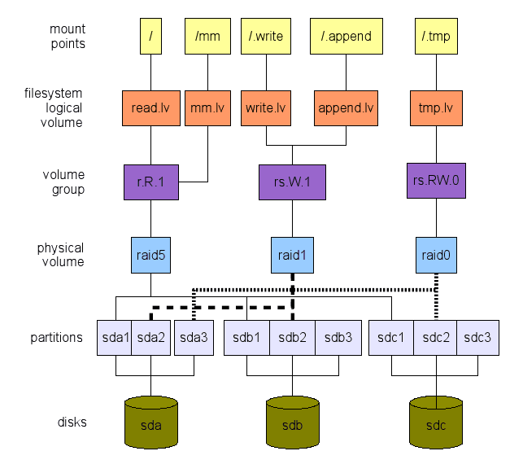
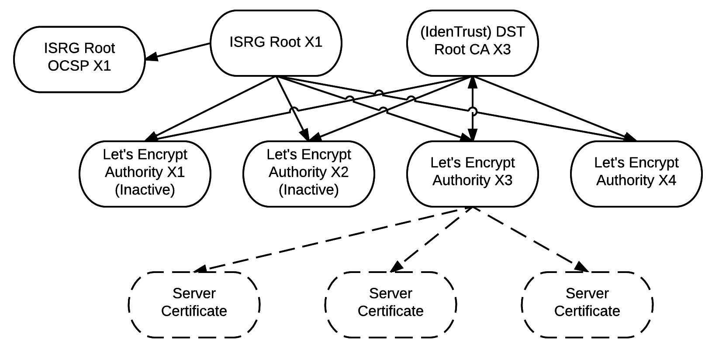

# Основы системного администрирования.
## 1. Работа в терминале (лекция 1).
__FHC__ (filesystem hierarchy standard) - иерархический стандарт директорий Linux

`whoami` - отобразить имя пользователя

`pwd` - отобразить текущую директорию

`alias` - вывести список алиасов

`alias new_alias="comand"` - задать алиас

`~/.bashrc` - файл в который можно задать постоянные алиасы

`which <command>` - вывести расположение исполняемого файла команды

`type <command>` - отобразить исполняемый файл команды

`read [var]` - прочитать введенные данные в переменную _var_

`echo $var` - вывести значение переменной

### Vagrant
**Vagrant** - система оркестрации виртуальных машин (в нашем случае для оркестрации oracle Virtual BOX)

`vagrant init` - инициализация виртуальной машины в выбранной директории

`vagrant up` - запустить виртуальную машину

`vagrant suspend` - приостановить виртуальную машину

`vagrant halt` - выключить виртуальную машину

`vagrant ssh` - подключиться по ssh к виртуальной машине
## 2. Работа в терминале (лекция 2)

**Потоки данных:**
* **stdin** - стандартный ввод, условный номер (дескриптор) 0 (например ввод команды в shell)
* **stdout** - стандартный вывод, условный номер (дескриптор) 1 (например вывод результата команды на экран)
* **stderr** - стандартный вывод ошибок, условный номер (дескриптор) 2 (например вывод ошибки на экран при неправильных 
аргументах команды)

**Процесс** - экземпляр запущенной программы

`lsof` - список открытых файлов (в колонке FD отмечены дескрипторы файлов)

**_Открытие любых файлов приводит к выделению им файловых дескрипторов, все они получают номера_**

`/dev` - псевдо-файловая система представления устройств

`/proc` - псевдо-файловая система представления структур ядра (информация в директории актуальна только на момент
просмотра и постоянно изменяется)

**_С псевдо-файловыми системами доступна работа только в режиме Read-only_**

`evtest /dev/input/event2` - тестирования потока ввода с устройства

**PID, Process Identifier** - числовой идентификатор процесса, однозначно его определяющий. Находясь в shell, 
мы можем узнать собственный PID через зарезервированную переменную `$`: `echo $$`.

`jobs -l` - вывести фоновые задачи (отправленные в фон через ctrl+z), параметр `-l` указывает pid

**_PPID, Parent PID - атрибут процесса, определяющий идентификатор его родительского процесса. 
Все процессы в Linux выстроены в дерево и должны иметь “родителя”. Так, для sleep 1h родителем будет bash, 
из которого sleep вызвали. Для PPID в shell так же есть одноименная переменная: `echo $PPID`_**

`pstree -p [pid]` - отобразить дерево процессов, `-p` отображает PID

Часть информации в `/proc` представлена с группировкой по PID: в `/proc/<PID>` 
находятся относящиеся к конкретному процессу данные.

`lsof -p [pid]` - вывести список открытых файлов связанных с _pid_

`[1,2]>` (по умолчанию `1>`) - перенаправить поток (при перенаправлении в поток добавить `&` например `2>&1`)

`<` - перенаправить поток ввода (например: `read NEW_WAR < text`)

`|` - pipe, перенаправить stdout одного в stdin другого 

`||` - логическое или

`&&` - выполнить команду после успешного завершения предыдущей

`;` - выполнить команду после предыдущей

`<comand> $(<function> [arg])` - передать команде на выполнение результат функции
## 3. Операционные системы (лекция 1)
**POSIX** - (Portable  Operating System Interface for UniX) Совместимая UNIX-подобная ОС Linux

**Системные вызовы** – метод общения приложений и ОС. Напрямую системные вызовы используются редко,
а формат обращения к ним сложен для прикладного программирования. Над системными вызовами написаны библиотеки,
которые удобнее для прямого вызова программистами.

`ldd` — скрипт в UNIX/Linux, помогающий определить список разделяемых библиотек (shared libraries),
от которых зависит программа.

`strace <command>` – программа, использующая подсистему ядра ptrace для отслеживания системных вызовов.
Основной недостаток strace – замедление работы приложений, в десятки или даже сотни раз, 
поэтому в production среде применяйте аккуратно.

Основные системные вызовы:
* установить сетевое соединение (создать сокет и подключить его к удаленному серверу);
* отправить или получить данные сетевого соединения;
* открыть, прочитать или записать файл (который может располагаться на локальной или удаленной файловой системе любого типа);
* создать новый процесс (фактически, запустить приложение);
* выделить/освободить память (malloc/free) и т.д.

`strace -p <pid>` - отследить уже запущенный процесс

`strace -f <pid>` - отследить так же дочерние процессы

Другие опции:
* `-s [length]` - длина строки (по умолчанию 32)
* `-o [filename]` - записать вывод в файл
* `-y` - выводить пути для файловых дескрипторов
* `-e [syscall]` - отфильтровать только нужные системные вызовы или события (например `strace -e open`)

**eBPF** - еще один инструмент (не использует ptrace), позволяющий отследить, что происходит в ОС, 
ознакомиться с полезным набором утилит [iovisor BCC](https://github.com/iovisor/bcc).

**Процесс зомби** - дочерний процесс родитель которого не смог обработать его код возврата

**Процесс сирота** - процесс родитель которого завершился до выполнения дочернего процесса.

**exit code (код возврата)** - число выдаваемое после завершения функции, при успешном выполнении 0, 
отличие от 0 обычно сообщает об ошибке, и в разных процессах коды могут обозначать разные результаты, 
в баше exit code можно узнать через служебную переменную `$?` 

Состояния процессов:
* `D` - uninterruptible sleep (непрерываемый сон, обычно во время IO операций);
* `R` - running и runnable (исполняется или ожидает исполнения);
* `S` - interruptable sleep (обычный спящий процесс, который может быть прерван, ожидает какого-то события);
* `T` - остановлен сигналом управления задачами;
* `Z` - зомби-процесс.

`uptime` - команда, показывающая load average за последние 1, 5 и 15 минут. 

**Load average (LA)** - среднее число процессов в состояниях R и D за рассчитываемый промежуток времени.

`ps` - process state По умолчанию показывает “собственные” процессы пользователя в том терминале, 
из которого ps запущен. Имеет множество ключей, их можно сочетать:
* `a` - убирает ограничение о собственных процессах
* `u` – добавляет расширенный набор часто нужных колонок
* `x` – убирает ограничение о процессах, запущенных из текущего терминала
* `w/ww` – убирает ограничение по длине вывода.
* `-p` - выбрать pid
* `-u` - выбрать пользователя
* `-o [pid,user,comm,etime,%mem,%cpu]` - вывести дополнительные колонки
* `--sort=-%mem` - добавить сортировку

`Ctrl + Z` - послать процессу сигнал `TSTP` (temporary stop) (20)

`Ctrl + C` - послать процессу сигнал `INT` (interrupt) (2)

`kill -[SIGNAL] <pid>` - послать процессу сигнал (по умолчанию TERM (15)), так же сигналы могут быть переданы 
по имени или по номеру

`SIGKILL` (9) и `SIGSTOP` (23) – два сигнала, которые не могут быть перехвачены процессом и обработаны как-то 
по желанию разработчика (на все остальные сигналы можно повесить подобные обработчики).

**Основное различие fork и clone** – в возможности clone создавать треды. 
С точки зрения планирования процессорного времени для ОС процессы и потоки идентичны,
поэтому может оказаться полезно знать, что какой-то единичный процесс может внутри плодить множество тредов 
и сильно нагружать CPU (один PID, разные thread id)

Удаленный файл возможно восстановить в случае если он используется каким-либо процессом 
забрав его из дескриптора процесса:
```
$ python3 -c "import time;f=open('/tmp/do_not_delete_me',
'r');time.sleep(600);" &
[1] 181248
$ lsof -p 181248 | grep do_not_delete_me
python3 181248 vagrant 3r REG 253,0 14 1572876 /tmp/do_not_delete_me
$ cat /tmp/do_not_delete_me
valuable_data
$ rm /tmp/do_not_delete_me
$ cat /tmp/do_not_delete_me
cat: /tmp/do_not_delete_me: No such file or directory
$ lsof -p 181248 | grep do_not_delete_me
python3 181248 vagrant 3r REG 253,0 14 1572876 /tmp/do_not_delete_me (deleted)
$ cat /proc/181248/fd/3 > /tmp/do_not_delete_me
$ cat /tmp/do_not_delete_me
valuable_data
```
**Будьте осторожны**. Если вы удаляете что-то, не зная об использовании файла процессом,
то, несмотря на кажущееся отсутствие на файловой системе, файл продолжит занимать место на ней. 
Нередко такое происходит с логами при некорректно настроенном внешнем процессе ротации, 
сигнал `USR1` может помочь в этом случае (отпустить удаленные файлы) и пересоздать актуальные.
## 4. Операционные системы (лекция 2)
### 4.1 Оценка потребления ресурсов
`free` - утилита отображающая состояние памяти и свопа. Раздел `free` содержит вообще не занятую память, 
раздел `buff/cache` включают в себя в частности страничный кэш блочных устройств, 
который ускоряет доступ к горячим данным, но может быть в любой момент сброшен командой 
`echo 3 >/proc/sys/vm/drop_caches`

`top` – просмотреть список активных процессов в системе с сортировкой по потребляемому 
процессорному времени (по умолчанию), `Shift + F` - для интерактивного меню, 
где `s` – меняет сортировку и `d` – включает/выключает отображение колонки.

`atop` – программа для записи исторического top с заданным интервалом. Возможно, с учетом современных подходов
к сбору метрик и eBPF уже не столь актуальна, но может быть полезна. `t`/`Shift + t` для перехода по интервалам,
`atop -r <log> -b <time>` для старта с нужного времени.

`htop` – более современный вариант top. Top был написан задолго до эпохи многоядерных систем, 
htop представляет нагрузку с учетом визуализации отдельных ядер.

`mpstat` – аналогичная по сути тестовая утилита с более подробной статистикой.

`iotop` – аналогичная top утилита, только для дисковой подсистемы. Далеко не всегда, 
даже на специализированном сервере (баз данных) очевидно, какой процесс вызывает высокую загрузку дисков,
`iotop` поможет в этом разобраться.

`iftop` - показывает сетевое взаимодействие без привязки к процессам.

`nethogs <interface>` - более подробная сетевая статистика

`sar` - аналогичная утилита для просмотра сетевой активности на интерфейсе
### 4.2 Ядро, модули

`uname -r` - посмотреть версию ядра

`lsb_release -a` или `cat /etc/issue` - посмотреть версию дистрибутива

`grep -v ^# /boot/config-$(uname -r) | tail -n2` - посмотреть, с какой конфигурацией ядро собрано

`dpkg -l | grep linux-image-5` - посмотреть установочный пакет ядра

`lsmod` - посмотреть какие модули ядра загружены в данный момент

`modinfo <module>` - посмотреть информацию о модуле

`modprobe <module>` - установить модуль с зависимостями

`/etc/rsyslog.conf` - конфигурационный файл системных логов

`cat /proc/cmdline` - отобразить параметры загрузки ядра

`BOOT_IMAGE=/boot/vmlinuz-5.4.0-80-generic` - путь до образа, из которого ядро загружено

`root=/dev/mapper/vgvagrant-root` - на каком устройстве находится корневая файловая система

`ro` - монтировать корневую файловую систему в RO режиме во время загрузки

`net.ifnames=0 biosdevname=0` - параметры для подсистемы udev об именовании сетевых интерфейсов

`quiet` - “тихая” загрузка без сообщений

`/etc/default/grub` - файл конфигурации загрузчика системы, после изменений параметры нужно применить командой
`update-grub`

`sysctl` - программа для работы с конфигурацией ядра, при внесении изменений они не сохранятся после перезагрузки,
конфигурации хранятся в файлах в директории `/etc/sysctl.d/` и `/etc/sysctl.conf`

`dmesg` – инструмент доступа к записям ядра. В `dmesg` (ключ `-T` – конвертировать время в человеко-читаемое)
присутствует информация о загрузке ОС, об изменении состояния аппаратных ресурсов. Проблемы с дисками, 
отвалившиеся сетевые карты, ошибки при коррекции ошибок ECC – многие обращающие на себя внимание сообщения
найдут свое место здесь.

`syslog` – штатный логер, куда попадают сообщения уже от приложений в пространстве пользователя.
Мест, куда приложения могут писать логи, – множество: от локальных файлов до сервисов вроде `journald`. 
Однако `/var/log/syslog` остается местом, куда стоит заглянуть при оценке состояния системы.
### 4.3 Системы инициализации: systemd
`init` (PID 1) – собирательное название для контроллера инициализации ОС, а не конкретная технология.

Система инициализации отвечает за:
* достижение корректного состояния на разных этапах загрузки;
* запуска служб самой ОС и прикладных программ в нужном порядке;
* монтирование файловых систем;
* обратный процесс при выключении ОС;
* init должен уметь “усыновлять” процессы, ставшие “сиротами”.

`init` – не единственный процесс, который создан ядром. Процессы в ps в квадратных скобках – “ядерные” процессы, 
что видно по 0 размеру RSS памяти в юзер-спейсе.

Систем инициализации было разработано много, но стандарт для большинства популярных дистрибутивов сегодня – `systemd`.

Базовые команды:
* `systemctl list-units --all` - посмотреть все юниты под управлением systemd
* `systemctl status <service>` - посмотреть статус работы сервиса сразу же виден путь расположения юнит-файла, 
который отвечает за сервис
* `systemctl start|stop|restart|reload <service>` - запустить, остановить, перезапустить, перезагрузить конфигурацию
сервиса
* `systemctl enable|disable <service>` - автозапуск сервиса включен/выключен
* `systemctl cat <service>` - отобразить юнит-файл сервиса
* `systemctl edit --full <service>` - отредактировать юнит-файл сервиса
* `systemctl daemon-reload` - перечитать измененные юнит-файлы самого systemd
* `systemctl list-dependencies <service>` - посмотреть зависимости сервиса
* `journalctl -b -u <service>` - посмотреть логи сервиса nginx, которые были записаны с момента загрузки, b от boot

`lsns` - отобразить пространства имен

**Пространство имён** — это функция ядра Linux, позволяющая изолировать и виртуализировать 
глобальные системные ресурсы множества процессов. Примеры ресурсов, которые можно виртуализировать: ID процессов,
имена хостов, ID пользователей, доступ к сетям, межпроцессное взаимодействие и файловые системы. 
Одной из общих целей пространств имён является поддержка реализации контейнеров — инструмента для виртуализации 
на уровне операционной системы (а также других целей), обеспечивающего группу процессов иллюзией того, 
что они являются единственными процессами в системе. Поэтому одной из главных целей пространства имён является 
поддержка контейнеризации в Linux.

`unshare -f --pid --mount-proc /bin/bash` - создать пространство имен и запустить в нем bash

`nsenter --target <PID> --pid --mount` - войти в созданное пространство имен

#### Дополнительные материалы:
Сайт и книги [Brendan Gregg](http://www.brendangregg.com/overview.html), в частности:
* [USE-метод](http://www.brendangregg.com/usemethod.html)
* [Широкий список утилит для мониторинга](http://www.brendangregg.com/linuxperf.html)

Пример быстрого интерактивного анализа хоста на практике:
* [Netflix](https://netflixtechblog.com/linux-performance-analysis-in-60-000-milliseconds-accc10403c55)
## 5. Файловые системы
### 5.1 Объекты файловой системы
Структура файлового объекта:
```
struct stat {
 dev_t st_dev; /* ID устройства, содержащего файл */
 ino_t st_ino; /* номер Inode */
 mode_t st_mode; /* биты доступа + тип файла */
 nlink_t st_nlink; /* число hard links (жестких ссылок) */
 uid_t st_uid; /* User ID – принадлежность пользователю */
 gid_t st_gid; /* Group ID – принадлежность группе */
 dev_t st_rdev;/* Device ID – тип устройства, если файл является файлом специального назначения */
 off_t st_size; /* Размер в байтах */
 struct timespec st_atim; /* Время последнего доступа */
 struct timespec st_mtim; /* Время последнего изменения содержимого */
 struct timespec st_ctim; /* Время последнего изменения метаданных */
```
`stat` - посмотреть свойства файла

**inode** – индексный дескриптор Уникальный в рамках файловой системы контейнер метаданных файла 
(пара inode+device – однозначный идентификатор объекта в системе). Имя таковым не является: 
в рамках одной ФС может быть создано более одного файла с одним и тем же inode и разными именами: 
число таких ссылок и показывает stat в поле Links. У обычного файла будет только одна ссылка.

`ln <file1> <file2>` - создать жесткую ссылку *file2* на inode _file1_ (права и другие атрибуты у файлов всегда будут
идентичными)

Имена файлов и соответствие имен<>inode хранятся в структуре директории, в которой эти файлы находятся.

Число inode определяет число объектов, которое может быть создано на ФС.

Есть ФС, где inode предварительно выделяются при создании (семейство ext); есть те, где inode 
может быть добавлены динамически (xfs). Об этом важно знать, так как может сложиться ситуация, 
при которой на ФС есть свободное пространство для создания файлов, но уже нет inode (слишком много файлов).

Одна из встречающихся техник программирования в Linux – изменения поведения программы в зависимости от того,
под каким именем ее вызвали.

Так как у любой директории помимо своего имени присутствует и короткая ссылка (.), у директорий всегда 
не менее двух hardlink.

Типы файлов, которые встречаются в Linux:
* **regular file**, стандартный файл;
* **directory**, директория;
* **symlink** – родственная жесткой ссылке сущность. Встречаются названия мягкая ссылка и симлинк. 
В отличие от hardlink, – symlink это полноценный объект на файловой системе, который, в частности, 
может переходить ее границы и ссылаться на объекты других ФС. Не увеличивает счетчик ссылок Links и не влияет на
сохранность адреса ссылки (аналогия с ярлыком Windows) при удалении;
* **pipe** – мы с вами уже встречались с пайпами, `|`, это неименованные пайпы.

`ln -s <file1> <file2>` - создать симлинк

socket – бывает сетевым (для соединения удаленных хостов) и локальным (для соединения в рамках одного хоста). 
Локальные (доменные) сокеты – еще один тип межпроцессного взаимодействия (в дополнение к уже известным нам 
именованным и неименованным пайпам, сигналам и разделяемой памяти процессов). Если в сетевых для подключения сокета
используется сетевой адрес+порт, в доменном сокете данным адресом является путь на файловой системе.

Плюсы перед pipe:
* сокеты могут быть двунаправленными, тогда как pipe – однонаправленные,
* производительнее,
* много клиентов может писать в один pipe, однако сторона-приемник не может узнать, кто записал в pipe, 
в socket такой проблемы нет.
### 5.2 Права доступа
Биты разрешений:
* r – read, чтение
* w – write, запись
* x – execution, исполнение

К кому применяются разрешения:
* владелец
* группа владельца
* все пользователи

В десятичной записи:  
* r: 2<sup>2</sup> = 4 
* w: 2<sup>1</sup> = 2
* x: 2<sup>0</sup> = 1

Пример:  
644 / rw- r-- r-- / 4 + 2  4  4  
755 / rwx r-x r-x / 4 + 2 + 1  4 + 1  4 + 1

Для файлов:
* **read** для просмотра содержимого файлов
* **write** для изменения содержимого файлов
* **execute** для запуска файла в качестве программы (процесса)

Для директорий:
* **read** для просмотра содержимого директории (ls)
* **write** для создания или удаления объектов из директории
* **execute** для `chdir` в директорию

`chown [user]:[group]` – change owner, изменить владельца/группу

`chmod 0755 <file>` или `chmod u=[rwx] g=[rwx] o=[rwx]<file>` – change mode, изменить биты разрешений доступа, 
так же можно использовать + или -.

Явный запрет приоритетнее разрешения.

Для директорий штатные права ОС – 0777, для файлов – 0666. Но при создании новых файлов или директорий 
из их прав автоматически вычитается параметр заданный в `umask` (по умолчанию 0002 для обычного пользователя, 
0022 для привилегированного.)

Дополнительные права доступа:
* `setuid`: 2<sup>2</sup> = 4 
* `setgid`: 2<sup>1</sup> = 2
* `sticky`: 2<sup>0</sup> = 1

**sticky бит** используется в основном для каталогов, чтобы защитить в них файлы. 
Из такого каталога пользователь может удалить только те файлы, владельцем которых он является.

**`setuid` / `setgid`** имеют одинаковый механизм работы за исключением применимости к пользователю (U) или группе (G).
Обычно этот бит можно встретить на исполняемых файлах. Пользователь, запускающий такой файл, получает процесс,
работающий с правами владельца исполняемого файла (а не своими собственными).

**`setgid`** на директориях имеет другой эффект (`setuid` обычно не используется). С этим установленным битом вновь 
создаваемые файлы и директории наследуют группу владельца родительского каталога, а не пользователя, инициировавшего
операцию.

`lsattr` - отобразить список дополнительных атрибутов (подробнее `man chattr`) 

`chattr +|-<atr>` - изменить дополнительный атрибут
### 5.3 Организация хранения данных в Linux
Схема уровней данных:  


`lsblk` - посмотреть список блочных устройств
### 5.4 RAID/mdadm
`mdadm` - утилита для работы с программным RAID

`cat /proc/mdstat` - посмотреть статус md
### 5.5 LVM2
Концепции менеджера логических томов:
* физические тома – Physical Volumes, `pvdisplay` `pvcreate` `pvmove` 
* Физические тома объединяются в группы томов – Volume Groups, `vgdisplay` `vgcreate`
* VG служат пулом для логических томов – Logical Volumes, `lvdisplay` `lvcreate` `lvremove`

`pvs` - показать физические тома

`vgs` - показать volume groups

`lvs` - показать логические тома
### 5.6 Таблица разделов
`fdisk` - утилита для работы с таблицами разделов

`sfdisk` - также работает в интерактивном режиме для модификации таблицы разделов. Для копирования таблицы разделов 
на другое устройство лучше воспользоваться `sfdisk`: `sfdisk -d /dev/nvme2n1`
### 5.7 Создание и монтирование файловых систем
`mkfs.<fs_name>` - создать файловую систему

`/etc/fstab` - список монтируемых разделов при загрузке системы
## 6. Компьютерные сети (лекция 1)
### 6.1 Маршрутизация в сети интернет
**Hop count** - количество точек в пути

**Delay** - задержка

**BGP** - протокол обмена маршрутами

`mtr` - трассировка в реальном времени

`bjpq3` - утилита генерирующая конфигурацию для добавления в маршрутизаторы из баз ip и AS
### 6.2 Основы DNS
`dig` - входит в пакет `dnsutils` утилита для работы с днс.

Типы DNS записей:
* `A` – адрес ipv4
* `AAAA` – адрес ipv6
* `NS` – авторизованный DNS сервер.
* `CNAME` – alias, например www.example.com -> example.com.
* `MX` – почтовый сервер
* `PTR` – обратная запись, dig -x 8.8.8.8. (запись соответствия IP адреса к DNS)
### 6.3 Основы HTTP
`curl` — (распространяемая по лицензии MIT) кроссплатформенная служебная программа командной строки, позволяющая 
взаимодействовать с множеством различных серверов по множеству различных протоколов с синтаксисом URL.

`httpie` - аналогична, но с большим функционалом (команда `http`)

`jq` - форматирует в JSON стандартный ввод

`yq` - аналогично для YAML

Коды HTTP сообщений:
* **1XX** - informational
* **2XX** - success
* **3XX** - redirection
* **4XX** - client error
* **5XX** - server error
### 6.4 Полезные ссылки
[Cisco modeling Labs](https://devnetsandbox.cisco.com/RM/Topology)
## 7. Компьютерные сети (лекция 2)
### 7.1 Модель OSI


**Модель передачи данных:**


**Инкапсуляция данных:**

### 7.2 L1: Физика
**Модули SFP:**


**Параметры Ethernet - Speed, Duplex:**
* 10/100 Mbit, 1/10/25/40/100 Gbit;
* Full/Half duplex - полный или полудуплекс (при полудуплексе трафик идет в обе стороны по одному каналу с выделением
отрезков времени на отправку в одну и другую сторону)

**Виды оптических волокон:**
* Single Mode - позволяет передать только один световой сигнал
* Multi Mode - позволяет передать несколько световых сигналов (за счет разной длинны волны) в одном волокне

**Оптические коннекторы:**


`ip -c -br link` - отобразить состояние интерфейсов (`-c` - подкрасить `-br` - сокращенный вывод `link` - 
физические соединения)

`ip link set dev <interface> up|down` - включить/отключить интерфейс

**LLDP** - протокол для обмена информацией между соседними устройствами, позволяет определить к какому порту коммутатора 
подключен сервер либо сетевое устройство.

`lldpd` - демон lldp на линукс

`lldpctl` - вывести информацию о соседях
### 7.3 L2: Коммутация
**Uplink** – порты в сторону ядра сети. Обычно 4-6 портов на коммутаторе.

**Downlink** –порты к серверам. Обычно 24-48 портов на коммутаторе.

**Oversubscription** – переподписка, соотношение Downlink/Uplink (оптимальным считается соотношение 4/1). 

**MAC таблица** - Хранятся записи вида «MAC-порт». Время хранения каждой записи ограничено, таймер – mac aging-time.

**BUM трафик** (Broadcast, Unknown-Unicast, Multicast) – рассылается во все порты кроме входящего.

**VLAN ID** - метка трафика в диапазоне от 1 до 4096

**Trunk порт:**
* 1 порт – много VLAN id;
* пакеты отправляются с меткой(тегом) dot1q, соответствующей VLAN id;
* VLAN без метки – native vlan, по умолчанию VLAN id = 1;
* 802.1q – стандарт Ethernet определяющий метки;
* используется, как правило, на Uplink портах;
* в linux устанавливается пакет vlan.

**Access порт:**
* 1 порт – 1 VLAN id;
* порт принимает только пакеты без метки;
* используется, как правило, на портах пользователей или серверах с одним сетевым адресом.

`vlan` - пакет в линуксе для работы с vlan

`/etc/network/interfaces` - файл конфигурации интерфейсов где можно описать vlan, пример:
```shell
auto vlan1400
iface vlan1400 inet static
 address 192.168.1.1
 netmask 255.255.255.0
 vlan_raw_device eth0
auto eth0.1400
iface eth0.1400 inet static
 address 192.168.1.1
 netmask 255.255.255.0
 vlan_raw_device eth0
```
**LAG – агрегация портов**
* Используется для увеличения полосы в сторону сервера;
* Как правило, на сервере имеется 3-4 сетевых интерфейса;
* Позволяет использовать несколько физических интерфейсов как один логический.

LAG в Linux – **бондинг**, имя интерфейса bond0, bond1.

`ifenslave` - пакет для работы с агрегацией (`modprobe bonding` - добавить модуль агрегации в ядро ОС)

**Типы LAG**
* статический (на Cisco `mode on`);
* динамический – LACP протокол (на Cisco `mode active`).
### 7.4 L3: IP адресация
Классовая адресация - адресация без масок с отделением части адреса под класс, части под сеть, и части под хост,
в современном мире не используется.
```
Class A
 0. 0. 0. 0 = 00000000.00000000.00000000.00000000
127.255.255.255 = 01111111.11111111.11111111.11111111
 0nnnnnnn.HHHHHHHH.HHHHHHHH.HHHHHHHH
Class B
128. 0. 0. 0 = 10000000.00000000.00000000.00000000
191.255.255.255 = 10111111.11111111.11111111.11111111
 10nnnnnn.nnnnnnnn.HHHHHHHH.HHHHHHHH
Class C
192. 0. 0. 0 = 11000000.00000000.00000000.00000000
223.255.255.255 = 11011111.11111111.11111111.11111111
 110nnnnn.nnnnnnnn.nnnnnnnn.HHHHHHHH
Class D
224. 0. 0. 0 = 11100000.00000000.00000000.00000000
239.255.255.255 = 11101111.11111111.11111111.11111111
 1110XXXX.XXXXXXXX.XXXXXXXX.XXXXXXXX
Class E
240. 0. 0. 0 = 11110000.00000000.00000000.00000000
255.255.255.255 = 11111111.11111111.11111111.11111111
 1111XXXX.XXXXXXXX.XXXXXXXX.XXXXXXXX
```
**CIDR** - Бесклассовая адресация с использованием маски сети.

`ipcalc` - программа IP калькулятор

**Частные подсети** - Используются в сетях, не маршрутизируемых в интернете. Недопустимо внутри локальной сети использовать чужие публичные IP адреса,
из-за этого вы потеряете доступ к этим адресам в сети интернет:
* **10.0.0.0 — 10.255.255.255** (маска подсети: 255.0.0.0 или /8)
* **172.16.0.0 — 172.31.255.255** (маска подсети: 255.240.0.0 или /12)
* **192.168.0.0 — 192.168.255.255** (маска подсети: 255.255.0.0 или /16)
* **100.64.0.0 — 100.127.255.255** (маска подсети: 255.192.0.0 или /10) Carrier-Grade NAT.

**Специальные подсети:**
* 127.0.0.0/8 – localhost, для передачи внутри хоста.
* 169.254.0.0/16 – автоназначение, если настроено получение адреса по DHCP, но ни один сервер не отвечает.
* 224.0.0.0/4 – мультикаст - многоадресная рассылка.
* 240.0.0.0/4 – зарезервировано для использования в будущем.
* [Другие зарезервированные подсети](https://ru.wikipedia.org/wiki/IPv4#%D0%9D%D0%B0%D0%B7%D0%BD%D0%B0%D1%87%D0%B5%D0%BD%D0%B8%D1%8F_%D0%BF%D0%BE%D0%B4%D1%81%D0%B5%D1%82%D0%B5%D0%B9)

**ARP таблица** - таблица сопоставления MAC и IP адресов, работает только в одном широковещательном сегменте сети

**Шлюз по умолчанию (Default gateway)**:
* адрес шлюза должен быть в одной сети с хостом;
* шлюз по умолчанию настраивается один раз на хост;
* если у хоста несколько сетевых интерфейсов, шлюз по умолчанию настраивается только на одном из них;
* шлюз по умолчанию и маршрут по умолчанию это разные вещи;
* как правило, для шлюза по умолчанию выбирают первый доступный адрес в сети.

`ip link` - состояние интерфейсов

`ip address` – IP адреса интерфейсов

`ip neighbour` – ARP таблица

`ip route` – таблица маршрутизации
### 7.5 Дополнительные материалы:
* [Цикл статей - сети для самых маленьких](https://linkmeup.gitbook.io/sdsm/)
* [Xgu.ru - wiki по сетевым технологиям](http://xgu.ru/wiki/%D0%9A%D0%B0%D1%82%D0%B5%D0%B3%D0%BE%D1%80%D0%B8%D1%8F:%D0%9A%D0%B0%D0%BD%D0%B0%D0%BB%D1%8C%D0%BD%D1%8B%D0%B9_%D1%83%D1%80%D0%BE%D0%B2%D0%B5%D0%BD%D1%8C)
* [Краткая справка по работе с утилитой ip](https://access.redhat.com/sites/default/files/attachments/rh_ip_command_cheatsheet_1214_jcs_print.pdf)
* [Лабораторная от Cisco](https://devnetsandbox.cisco.com/RM/Topology)
## 8. Компьютерные сети (лекция 3)
### 8.1 Таблица маршрутизации
**Статические маршруты** прописываются вручную на каждом маршрутизаторе, через который проходит пакет. Например, если на
пути пакета 10 маршрутизаторов, чтобы добавить 1 маршрут, нужно прописать этот маршрут 10 раз. Преимущества статических 
маршрутов: не требуются дополнительные протоколы

**Динамические маршруты** распространяются протоколами маршрутизации. Например: RIP, OSPF, BGP. Динамический маршрут
настраивается один раз на маршрутизаторе источнике (origin) и далее анонсируется по сети автоматически. Преимущество 
динамических маршрутов: простота администрирования сети.

**Основные правила выбора маршрута (на примере Cisco):**
1. Маршрут с длинной маской выигрывает. Например: /24 приоритетней чем /18.
2. У каждого протокола есть приоритет (preference). Чем меньше preference, тем приоритетней маршрут. Например, 
preference для eBGP = 20, Static = 1.
3. Внутри одного протокола выигрывает маршрут с лучшей метрикой. Для eBGP, как правило, это атрибут AS-PATH – список
всех AS на пути к сети. Чем меньше кол-во AS, тем выше приоритет у маршрута.

[Маршрутизаторы с открытым доступом](http://www.routeservers.org/)

Команды добавления маршрутов в Linux (после перезагрузки маршруты исчезнут):
* `ip route add 172.16.10.0/24 via 192.168.1.1` - Добавление маршрута через шлюз
* `ip route add 172.16.10.0/24 dev eth0` - Добавление маршрута через интерфейс
* `ip route add 172.16.10.0/24 dev eth0 metric 100` - Маршрут с метрикой
* `ip route show 10.0.0.0/8` - Просмотр маршрутов до определенной сети
* `echo 1 > /proc/sys/net/ipv4/ip_forward` - Разрешить пересылку пакетов
* `ip -br route` - отобразить маршруты (`-br` сокращенная форма отображения)

В Linux можно настроить несколько таблиц маршрутизации:
```shell
cat /etc/iproute2/rt_tables
#
# reserved values
#
255 local
254 main
253 default
0 unspec
#
# local
#
```
По умолчанию, если не указано имя таблицы, используется таблица main.

Постоянные статические маршруты добавляются в файл `/etc/network/interfaces`:
```shell
# The management network interface
auto eth1
allow-hotplug eth1
iface eth1 inet static
 address 172.16.100.10
 netmask 255.255.255.0
 post-up ip route add 172.16.100.0/24 dev eth1 src 172.16.100.10 table mgmt
 post-up ip route add default via 172.16.100.1 dev eth1 table mgmt
 post-up ip rule add from 172.16.100.10/32 table mgmt
 post-up ip rule add to 172.16.100.10/32 table mgmt
```

**Dummy** – виртуальный интерфейс, удобно использовать для анонса маршрутов (аналог loopback на маршрутизаторах).
```
echo "dummy" >> /etc/modules
echo "options dummy numdummies=2" > /etc/modprobe.d/dummy.conf

vim /etc/network/interfaces

auto dummy0
iface dummy0 inet static
 address 10.2.2.2/32
 pre-up ip link add dummy0 type dummy
 post-down ip link del dummy0
```

`bird2` – утилита для динамической маршрутизации в Linux
```shell
apt install bird2
systemctl enable bird
systemctl restart bird

vim /etc/bird/bird.conf

log syslog all;
protocol kernel {
 ipv4 {
 export all; # Default is export none
 };
 persist; # Don't remove routes on BIRD shutdown
}
protocol device {
}
protocol rip {
 ipv4 {
 import all;
 export all;
 };
 interface "ens4";
 interface "ens5";
}
protocol direct {
 ipv4; # Connect to default IPv4 table
 interface "dummy*";
}
```

`birdc` - запустить консоль Bird
### 8.2 Отказоустойчивость сети
Дизайн сети в дата-центре:  


**ECMP** – несколько равнозначных маршрутов

Отказоустойчивость внутри ДЦ:  


**Сходимость сети** – время требуемое на перестроение маршрутов при падении линка.

BFD протокол:
* поднимает сессию между соседями в другом протоколе - RIP, OSPF, BGP;
* BFD заменяет медленный механизм типа keepalive у протоколов маршрутизации;
* обеспечивает сходимость менее 50ms.

**Anycast** – одинаковые IP на серверах (CDN):
* Отказоустойчивость снаружи ДЦ, георезервирование ДЦ;
* Маршрутизация клиента осуществляется к ближайшему серверу;
* Сервера располагаются, как правило, в разных ДЦ;
* При отказе одного ДЦ – трафик уйдет в оставшиеся живые ДЦ.


First-Hop Redundancy Protocols (VRRP, HSRP) - протокол резервирования шлюза, несколько шлюзов работают под одним IP
при потере связи с одним маршрут идет через другой.


`Keepalived` – реализация VRRP на Linux Сервисы, требующие высокой доступности, обычно используют плавающие IP-адреса. 
Плавающий IP-адрес может быть автоматически переброшен между несколькими серверами в ходе переключения на резерв 
из-за выхода из строя основного сервера или для обновления программного обеспечения без простоев.  
[Пример настройки](https://habr.com/ru/post/524688/)
### 8.3 L4: TCP/UDP


TCP 3-Way Handshake: SYN, SYN-ACK, ACK:


**UDP** - работает без установки сессии. UDP используется обычно для протоколов чувствительных к задержке, например,
RTP для передачи аудио. Также используется для протоколов не чувствительных к потерям пакетов, например, Syslog, SNMP.


`ss` – Socket Statistics, утилита пришедшая на замену netstat выдает информацию об открытых портах и установленных 
соединениях

```
# -n не резолвить имена хостов
ss -n
State Recv-Q Send-Q Local Address:Port Peer Address:Port
ESTAB 0 240 172.31.0.14:22 172.30.10.202:51831
# порты в ожидании входящего трафика
ss -l
State Recv-Q Send-Q Local Address:Port Peer Address:Port
LISTEN 0 128
# UDP сокеты
ss -ua
State Recv-Q Send-Q Local Address:Port Peer Address:Port
UNCONN 0 0 172.31.0.255:ntp *:*
# Показать процесс использующий сокет
ss -p
State Recv-Q Send-Q Local Address:Port Peer Address:Port
ESTAB 0 240 172.31.0.14:ssh 172.30.10.202:51831
users:(("sshd",13548,3))
# Фильтр по Source port
ss -au sport = :123
State Recv-Q Send-Q Local Address:Port Peer Address:Port
UNCONN 0 0 172.31.0.255:ntp *:*
# Статистика
ss -s
Total: 43 (kernel 0)
TCP: 2 (estab 1, closed 0, orphaned 0, synrecv 0, timewait 0/0), ports 0
Transport Total IP IPv6
* 0 - -
RAW 0 0 0
UDP 4 4 0
TCP 2 2 0
```
### 8.4 Балансировка нагрузки
`nginx` – возможно использовать как L4 балансировщик

Пример конфигурации Nginx для балансировки нагрузки:
```shell
http {
 upstream backend1 {
 server 192.168.0.1;
 server 192.168.0.2;
 server 192.168.0.3;
 }
 server {
 listen 80;
 location / {
 proxy_pass http://backend1;
 }
 } }
# балансировка UDP - DNS
stream {
 upstream dns_backends {
 server 8.8.8.8:53;
 server 8.8.4.4:53;
 }
 server {
 listen 53 udp;
 proxy_pass dns_backends;
 proxy_responses 1;
 } }
```
[Больше примеров](https://blog.listratenkov.com/kak-nastroit-nginx-v-kachestve-balansirovshhika-nagruzki/)
### 8.5 Документирование сети
**Netbox** - система управления IP адресами и устройствами. Возможно настроить автоматизацию – импорт IP из
конфигураций. API для скриптов.

[Примеры схем сетей](https://linkmeup.gitbook.io/sdsm/0.-planirovanie/1.-shemi-seti)
### 8.6 Дополнительные материалы
[Все о Networking в Linux](http://linux-ip.net/html/index.html)

[Гайд по TCP/IP](http://www.tcpipguide.com/free/index.htm)

## 9. Элементы безопасности информационных систем
### 9.1 ААА: Аутентификация, Авторизация, Аккаунтинг
**Аутентификация** - Задача аутентификации идентифицировать пользователя или объект.
Примеры:
* Логин+пароль;
* Биометрия – отпечатки пальцев, сканирование ладони, голос, face-id;
* Ключ шифрования – SSH, HTTPS.

**Авторизация** - задача определить права пользователя (что разрешено делать?)
Примеры действий: чтение, чтение и запись, исполнение программ.

Примеры объектов: файл, каталог, принтер, URL, проект в Jira, AWS, тег

Групповые политики – разделение на группы и назначение каждой группе отдельного набора прав

Варианты разделения на группы:
* разделение по объектам: группа принтеры, файловый сервер и т.д.
* разделение по пользователям: группа бухгалтерия, администраторы и т.д.

Основной инструмент – корпоративный каталог LDAP, например, Microsoft ActiveDirectory.

**Аккаунтинг** - логирование событий, Учет всех действий пользователей: попытки входа, запросы на чтение и т.д.

**Основные задачи:**
* Выявление попыток несанкционированного доступа;
* Помощь в расследовании инцидента;
* Оценка ущерба;
* Устранение последствий.

Основные инструменты:
* Системы логирования и визуализации: Syslog-NG, ELK, Grafana;
* На сетевом оборудовании – Tacacs сервер;
* [SIEM](https://bakotech.ua/uploads/ckeditor/files/SIEM-for-Beginners-RU.PDF) системы – комплексное решение.
### 9.2 Пароли. OTP. Yubikey
[Bitwarden](https://github.com/bitwarden/server) - корпоративный сервер хранения паролей. [Пример настройки](https://habr.com/ru/company/vdsina/blog/540574/)

**OTP** – 2-х факторная аутентификация
* One time password – сервис одноразовых паролей;
* СМС-коды или мобильное приложение;
* Важно использовать разные устройства – телефон+компьютер;
* Наиболее популярные сервисы: Google Authenticator, Microsoft Authenticator.

**Yubikey** – U2FUSB криптотокен
*Генерирует OTP-код при физическом нажатии;
* Защищенное хранилище SSH-ключей;
* SSH-агент, работает с кроссплатформенной библиотекой [OpenSC](https://wiki.astralinux.ru/pages/viewpage.action?pageId=35028997).

[Протокол FIDO U2F (Universal 2nd Factor)](https://habr.com/ru/post/305508/)  
[YubiKey в Linux](https://wiki.archlinux.org/title/YubiKey)
### 9.3 Шифрование и Сертификаты, HTTPS
**Симметричное шифрование:**
* Один ключ для шифрования-дешифрования;
* Ключи нельзя передавать по открытым каналам;
* Очень высокая скорость работы;
* Пример: DES, AES шифр

**Асимметричное шифрование:**
* 2 пары ключей у каждой стороны;
* Public ключ передается по открытым каналам, Private ключ – секретный;
* Секретность строится на основе Односторонней функции


**Сравнение симметричного и ассиметричного шифрования:**  
* **Симметричное:** один ключ для шифрования-дешифрования, ключ секретный.
* **Асимметричное:** один ключ для дешифрования (секретный), второй для шифрования (открытый). У каждой стороны по паре
ключей.


**HTTPS – SSL/TLS сертификаты и Root CA** - В основе цепочка доверия серверов сертификации. Ответственность 
распределяется иерархически, аналогично иерархии серверов в DNS.

Пример: бесплатный центр сертификации Let’s Encrypt.  


**Self signed certificate** - самоподписанный сертификат применимо для внутрисетевого использования

Пример генерации:
```shell
sudo apt install apache2
sudo a2enmod ssl
sudo systemctl restart apache2

sudo openssl req -x509 -nodes -days 365 -newkey rsa:2048 \
-keyout /etc/ssl/private/apache-selfsigned.key \
-out /etc/ssl/certs/apache-selfsigned.crt \
-subj "/C=RU/ST=Moscow/L=Moscow/O=Company Name/OU=Org/CN=www.example.com"

sudo vim /etc/apache2/sites-available/your_domain_or_ip.conf
<VirtualHost *:443>
 ServerName your_domain_or_ip
 DocumentRoot /var/www/your_domain_or_ip
 SSLEngine on
 SSLCertificateFile /etc/ssl/certs/apache-selfsigned.crt
 SSLCertificateKeyFile /etc/ssl/private/apache-selfsigned.key
</VirtualHost>

sudo mkdir /var/www/your_domain_or_ip
sudo vim /var/www/your_domain_or_ip/index.html
<h1>it worked!</h1>

sudo a2ensite your_domain_or_ip.conf
sudo apache2ctl configtest
sudo systemctl reload apache2

```
[Пример настройки Apache](https://www.digitalocean.com/community/tutorials/how-to-create-a-self-signed-ssl-certificate-for-apache-in-ubuntu-20-04)

[Генератор конфигураций SSL для разных веб-серверов](https://ssl-config.mozilla.org/)


**Проверка TLS настроек web-сервера**  
[Утилита для проверки](https://github.com/drwetter/testssl.sh)

```
git clone --depth 1 https://github.com/drwetter/testssl.sh.git
cd testssl.sh

# быстрый тест
./testssl.sh -e --fast --parallel https://www.google.com/

# проверить сайт на уязвимости
./testssl.sh -U --sneaky https://www.google.com/

 Testing vulnerabilities
 
 Heartbleed (CVE-2014-0160)               not vulnerable (OK), no heartbeat extension
 CCS (CVE-2014-0224)                      not vulnerable (OK)
 Ticketbleed (CVE-2016-9244), experiment. not vulnerable (OK)
 ROBOT                                    not vulnerable (OK)
 Secure Renegotiation (RFC 5746)          supported (OK)
 Secure Client-Initiated Renegotiation    not vulnerable (OK)
 CRIME, TLS (CVE-2012-4929)               not vulnerable (OK)
 
```
[Примеры testssl](https://www.tecmint.com/testssl-sh-test-tls-ssl-encryption-in-linux-commandline/)
### 9.4 SSH
**Управление ключами SSH:**
```shell
# установка sshd сервера
apt install openssh-server
systemctl start sshd.service
systemctl enable sshd.service

# генерим ключи, /home/<username>/.ssh/id_rsa - приватный ключ
# id_rsa.pub - публичный ключ
ssh-keygen

# копируем публичный ключ на удаленный сервер
ssh-copy-id my_user@192.168.1.100

# или копируем вручную в файл authorized_keys
echo public_key_string >> ~/.ssh/authorized_keys

# подключаемся по стандартному ключу
ssh my_user@192.168.1.100

# подключаемся по нестандартному ключу
ssh -i ~/.ssh/some_server.key my_user@192.168.1.100

# проверка SSH шифров
sudo apt install -y ssh-audit
ssh-audit localhost

```
[Пример настройки SSH](https://www.digitalocean.com/community/tutorials/how-to-configure-ssh-key-based-authentication-on-a-linux-server-ru)

**SSH: config файл**
```shell
mkdir -p ~/.ssh && chmod 700 ~/.ssh
touch ~/.ssh/config && chmod 600 ~/.ssh/config
#---------------------------общая структура файла ~/.ssh/config
Host hostname1
 SSH_OPTION value
Host *
 SSH_OPTION value
#---------------------------Пример конфига
Host my_server
 HostName 192.168.1.100
 IdentityFile ~/.ssh/some_server.key
 User my_user
 #Port 2222
 #StrictHostKeyChecking no
Host *
 User default_username
 IdentityFile ~/.ssh/id_rsa
 Protocol 2
# пример ProxyJump
Host myserver
 HostName myserver.example.com
 User virag
 IdentityFile /users/virag/keys/ed25519
 ProxyJump jump
Host jump
 HostName jump.example.com
 User default
```
[ProxyJump безопаснее чем SSH agent forwarding](https://www.infoworld.com/article/3619278/proxyjump-is-safer-than-ssh-agent-forwarding.html)

**SSH: проблема с known_host** - файл, в котором хранятся публичные ключи серверов к которым подключались.
```shell
ssh my_server
@@@@@@@@@@@@@@@@@@@@@@@@@@@@@@@@@@@
@ WARNING: REMOTE HOST IDENTIFICATION HAS CHANGED! @
@@@@@@@@@@@@@@@@@@@@@@@@@@@@@@@@@@@
The fingerprint for the RSA key sent by the remote host is
5c:9b:16:56:a6:cd:11:10:3a:cd:1b:a2:91:cd:e5:1c.
Опция хэширования known_host
HashKnownHosts yes
# список известных публичных ключей
cat ~/.ssh/known_hosts
# проверить хост
ssh-keygen -F my_server
# удаляем старый ключ
ssh-keygen -R my_server
# временно отключить проверку known_hosts
ssh -o StrictHostKeyChecking=no my_server
# сканировать и сохранить публичные ключи
ssh-keyscan server_ip
ssh-keyscan -H <host> >> ~/.ssh/known_hosts # -H for Hashed

```
**[HashiCorp Vault](https://github.com/hashicorp/vault)**


[Managing SSH Access at Scale with HashiCorp Vault](https://www.hashicorp.com/blog/managing-ssh-access-at-scale-with-hashicorp-vault)  
[Управление секретами при помощи Hashicorp Vault в Авито](https://www.youtube.com/watch?v=oDdDPU6moTs)
### 9.5 Firewall. NAT. ACL
**Статический NAT** - Трансляция IP адресов настроена заранее.


**Динамический NAT** - IP адреса выделяются из NAT пула динамически.


**NAT Overload (masquerade)** - Один публичный адрес используется для всей внутренней сети. Трансляция IP адресов привязывается 
к L4 портам.


**Firewall в linux – iptables**
```shell
apt install iptables

# список правил таблицы filter
iptables -t filter -L
iptables -t filter -L -v # просмотр кол-ва пакетов

# Удалить все правила
iptables -F

# заблокировать пакеты от Source IP 1.1.1.1
iptables -A INPUT -s 1.1.1.1 -j DROP

# заблокировать исходящий UDP трафик порт 53
iptables -A OUTPUT -p udp --dport 53 -j DROP

# Удалить правило
iptables -D OUTPUT -p udp --dport 53 -j DROP

# Сохранить правила
apt install iptables-persistent
iptables-save > /etc/iptables/rules.v4
Iptables-save > /etc/iptables/rules.v6

# Сохранить правила в Ubuntu
netfilter-persistent save
netfilter-persistent reload

```
**Firewall в linux – ufw** - упрощенная утилита для управления фаерволом
```shell
apt install ufw

# посмотреть настроенные правила
sudo ufw status verbose

# добавить правило для любых IP
sudo ufw allow allow ssh/tcp

# Добавить правило для определенной сети
sudo ufw allow from 172.30.0.7/24

# Удалить правило
sudo ufw delete allow from 172.30.0.7/24

# Удалить правило по номеру
sudo ufw status numbered
sudo ufw delete 2

# Настроить логирование
sudo ufw logging on
tail -f /var/log/ufw.log

# Включить фаервол
sudo ufw enable

```
### 9.6. Pentest: тестирование на проникновение
**Kali Linux** – pentest дистрибутив

Популярные инструменты:
1. Nmap – сканер портов, сетей;
2. Burp Suite – анализ web уязвимостей;
3. Metasploit Framework – тестирование эксплойтов;
4. Aircrack-ng – работа с Wifi сетями;
5. Autopsy – digital forensics анализ (анализ на изменения после взлома);
6. Wireshark – анализ трафика.

[Полный список инструментов Kali](https://tools.kali.org/tools-listing)

**Nmap**:
```shell
apt install nmap

# живые хосты в сети - ping sweep
nmap -sP 192.168.1.0/24

# информация о хосте
sudo nmap -O scanme.nmap.org

# подробная информация о хосте
sudo nmap -A scanme.nmap.org

# traceroute
nmap -sn -Pn --traceroute 8.8.8.8

# ASN query (запрос AS)
nmap --script asn-query 8.8.8.8

# Path MTU discovery
sudo nmap --script path-mtu 8.8.8.8

```
`scanme.nmap.org` - хост для безопасного сканирования

`tcpdump` – сбор дампа трафика
```shell
apt install tcpdump

# интерфейс
tcpdump -i eth0

# список доступных интерфейсов
tcpdump -D

# кол-во пакетов
tcpdump -c 5 -i eth0

# запись в файл
tcpdump -w 0001.pcap -i eth0

# чтение из файла
tcpdump -r 0001.pcap

# фильтр только TCP port 22
tcpdump -i eth0 port 22

# фильтр Source или Destination IP адрес
tcpdump -i eth0 src 192.168.1.1
tcpdump -i eth0 dst 192.168.1.1

```
### 9.7 Дополнительные материалы
* [Руководство по подготовке к экзамену CISSP](https://dorlov.blogspot.com/2011/05/issp-cissp-all-in-one-exam-guide.html)
* [Awesome SSH проекты](https://project-awesome.org/moul/awesome-ssh)
* [Teleport - альтернатива SSH](https://goteleport.com/docs/getting-started/linux-server/)
* [ngrok - NAT traversal](https://github.com/inconshreveable/ngrok)
* [ssh-audit](https://github.com/arthepsy/ssh-audit)
* [Mozilla SSL Configuration Generator](https://ssl-config.mozilla.org/)
